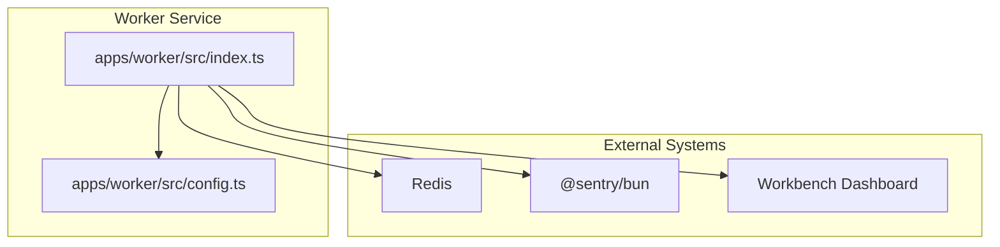
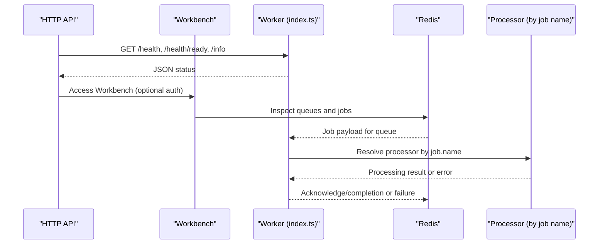
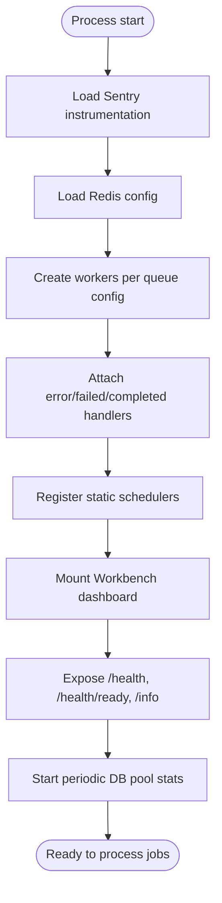
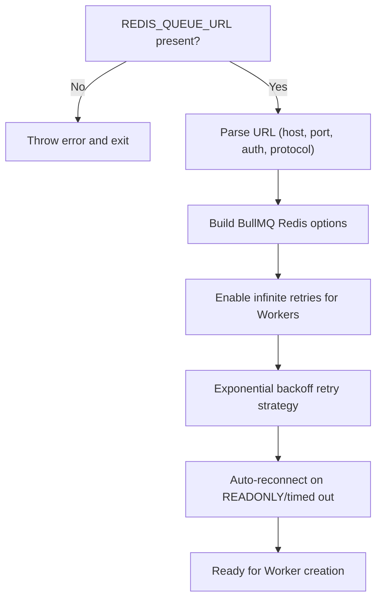
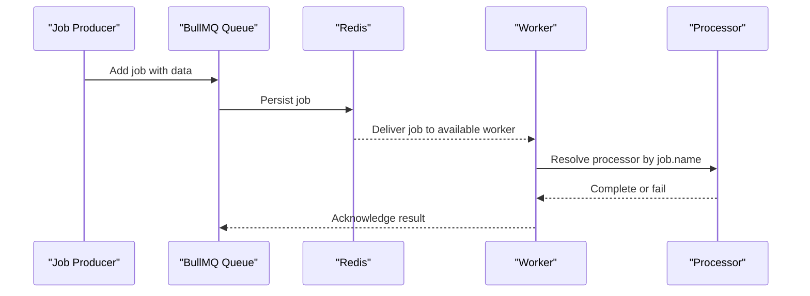
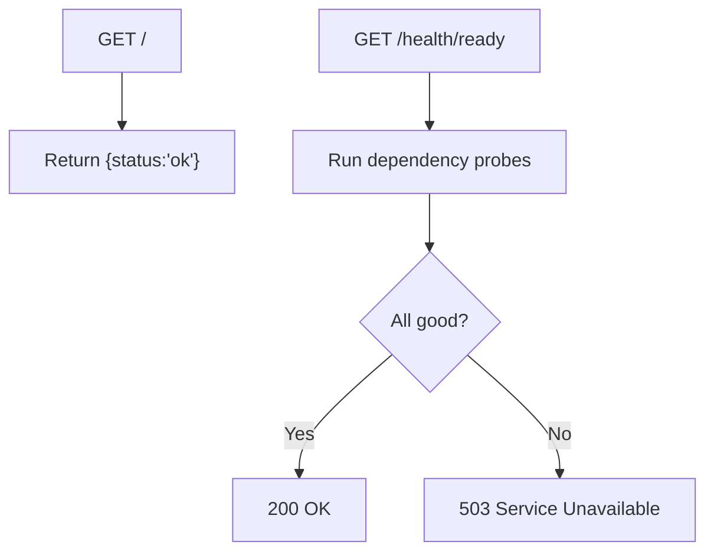
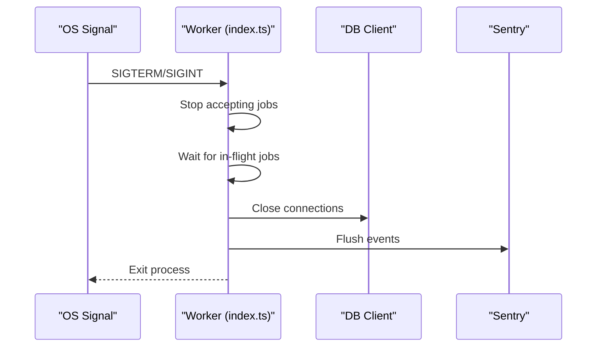
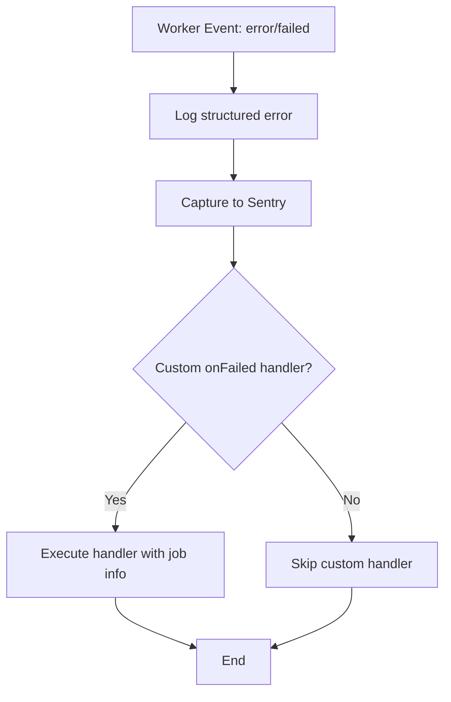
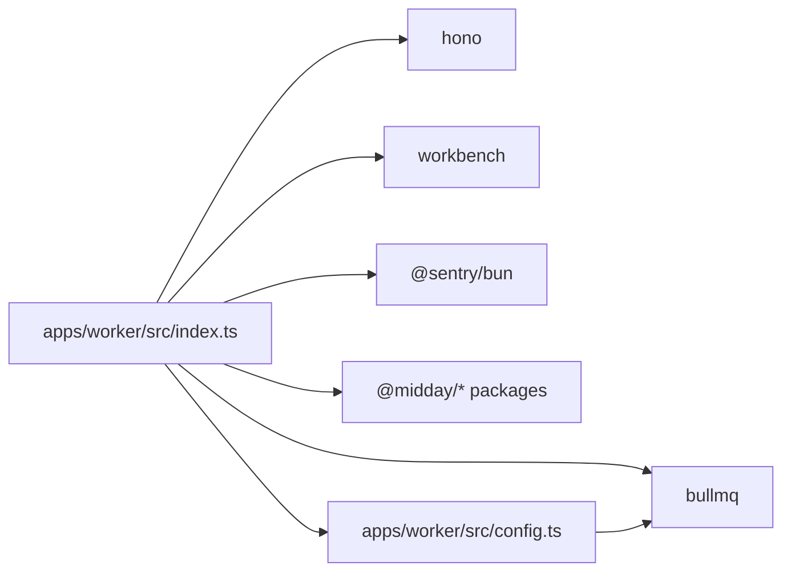

# Worker Coordination

<cite>
**Referenced Files in This Document**
- [index.ts](file://apps/worker/src/index.ts)
- [config.ts](file://apps/worker/src/config.ts)
- [package.json](file://apps/worker/package.json)
- [README.md](file://README.md)
</cite>

## Table of Contents
1. [Introduction](#introduction)
2. [Project Structure](#project-structure)
3. [Core Components](#core-components)
4. [Architecture Overview](#architecture-overview)
5. [Detailed Component Analysis](#detailed-component-analysis)
6. [Dependency Analysis](#dependency-analysis)
7. [Performance Considerations](#performance-considerations)
8. [Troubleshooting Guide](#troubleshooting-guide)
9. [Conclusion](#conclusion)

## Introduction
This document explains how the Worker Application coordinates and manages background jobs. It covers the startup and initialization sequence, service bootstrap, dynamic worker creation per queue, job processing lifecycle, health monitoring, graceful shutdown, error handling and retries, and operational observability. The goal is to help operators and developers understand how jobs are enqueued, distributed, processed, and monitored reliably.

## Project Structure
The Worker Application is implemented as a Bun-based service that:
- Initializes Redis-backed BullMQ queues and workers
- Registers processors by job name
- Exposes health and readiness endpoints
- Provides a Workbench dashboard for queue inspection
- Logs database pool statistics and flushes telemetry on shutdown

**Diagram sources**
- [index.ts](file://apps/worker/src/index.ts#L1-L312)
- [config.ts](file://apps/worker/src/config.ts#L1-L98)

**Section sources**
- [index.ts](file://apps/worker/src/index.ts#L1-L312)
- [config.ts](file://apps/worker/src/config.ts#L1-L98)
- [package.json](file://apps/worker/package.json#L1-L57)

## Core Components
- Dynamic Worker Creation: Workers are created for each configured queue and attached with centralized error and failure handlers.
- Processor Registry: Jobs are dispatched to processors resolved by job name.
- Health and Readiness: Lightweight endpoints report service status and dependency readiness.
- Workbench Dashboard: An admin interface for inspecting queues and jobs.
- Graceful Shutdown: Controlled teardown of workers, database connections, and telemetry.
- Operational Logging: Periodic database pool stats and structured logs.

**Section sources**
- [index.ts](file://apps/worker/src/index.ts#L25-L118)
- [index.ts](file://apps/worker/src/index.ts#L120-L165)
- [index.ts](file://apps/worker/src/index.ts#L167-L191)
- [index.ts](file://apps/worker/src/index.ts#L228-L281)
- [index.ts](file://apps/worker/src/index.ts#L205-L226)

## Architecture Overview
The Worker Application orchestrates job processing via BullMQ workers bound to Redis. Each queue configuration yields a dedicated worker that resolves a processor by job name and executes it. Health endpoints and Workbench provide operational visibility. Sentry captures errors and exceptions centrally.

**Diagram sources**
- [index.ts](file://apps/worker/src/index.ts#L167-L191)
- [index.ts](file://apps/worker/src/index.ts#L25-L118)

## Detailed Component Analysis

### Startup and Initialization Sequence
- Sentry instrumentation is loaded first to capture early errors.
- Redis connection options are derived from environment variables.
- Workers are created dynamically from queue configurations, each with:
  - A processor resolver by job name
  - Centralized error and failed event handlers
  - Optional completion and custom failure callbacks
- Static schedulers are registered at startup.
- Workbench is mounted with optional credentials.
- Health and readiness endpoints are exposed.
- Database pool stats are logged periodically based on environment configuration.
- Graceful shutdown handlers are registered for SIGTERM/SIGINT.

**Diagram sources**
- [index.ts](file://apps/worker/src/index.ts#L1-L312)
- [config.ts](file://apps/worker/src/config.ts#L1-L98)

**Section sources**
- [index.ts](file://apps/worker/src/index.ts#L1-L312)
- [config.ts](file://apps/worker/src/config.ts#L1-L98)

### Service Bootstrap and Dependencies
- Redis connectivity is required for BullMQ; the worker validates presence of the Redis URL and constructs connection options including TLS for secure connections.
- BullMQ-specific connection settings are tuned for production resiliency:
  - Infinite retries for workers
  - Exponential backoff retry strategy
  - Auto-reconnect on specific transient errors
- Separate connections are supported for FlowProducer if needed.

**Diagram sources**
- [config.ts](file://apps/worker/src/config.ts#L13-L88)

**Section sources**
- [config.ts](file://apps/worker/src/config.ts#L13-L88)

### Worker Scaling Strategies and Concurrent Processing Limits
- Horizontal scaling: Deploy multiple instances of the Worker Application behind a load balancer. Each instance runs its own set of workers determined by queue configurations.
- Vertical scaling: Increase concurrency per worker by adjusting BullMQ worker options (e.g., concurrency) in queue configurations.
- Queue isolation: Separate queues for different job types allow independent scaling and prioritization.
- Backpressure: BullMQ’s built-in backpressure and Redis-based persistence ensure reliable processing under load.

Note: Specific concurrency settings are controlled via queue worker options; consult queue configuration files for per-queue tuning.

**Section sources**
- [index.ts](file://apps/worker/src/index.ts#L25-L36)

### Job Enqueueing Mechanism, Distribution, and Assignment
- Enqueueing occurs in other services using the shared job client and queue libraries. The Worker Application consumes jobs from Redis-backed queues.
- Job distribution: BullMQ distributes jobs among available workers for a given queue.
- Assignment strategy: Jobs are assigned to workers based on queue availability and worker readiness; BullMQ handles fairness and resilience.

**Diagram sources**
- [index.ts](file://apps/worker/src/index.ts#L28-L34)

**Section sources**
- [index.ts](file://apps/worker/src/index.ts#L28-L34)

### Worker Health Monitoring, Liveness, and Readiness
- Liveness: Root endpoint returns a simple OK status.
- Readiness: Dependency readiness check validates Redis connectivity and other probes.
- Workbench: Provides live inspection of queues and jobs.

**Diagram sources**
- [index.ts](file://apps/worker/src/index.ts#L167-L182)

**Section sources**
- [index.ts](file://apps/worker/src/index.ts#L167-L182)

### Graceful Shutdown Procedures
- Stops workers from accepting new jobs.
- Waits briefly for in-flight jobs to complete.
- Closes database connections.
- Flushes Sentry events.
- Exits after a bounded timeout if cleanup exceeds limits.

**Diagram sources**
- [index.ts](file://apps/worker/src/index.ts#L232-L281)

**Section sources**
- [index.ts](file://apps/worker/src/index.ts#L232-L281)

### Error Classification, Retry Policies, and Dead Letter Handling
- Centralized error handling: All worker errors and job failures are captured with structured logs and Sentry events.
- Processor-level failures: Processors already capture contextual errors; worker-level handlers act as a safety net for missing processors or unexpected failures.
- Retry policy: BullMQ uses an exponential backoff strategy with a cap; transient errors trigger automatic retries.
- Dead letter handling: Not explicitly configured in the worker; consider adding a failed queue or DLQ policy at the queue level if needed.

**Diagram sources**
- [index.ts](file://apps/worker/src/index.ts#L40-L103)

**Section sources**
- [index.ts](file://apps/worker/src/index.ts#L40-L103)

### Resource Management and Performance Optimization
- Database pool stats logging: Periodic logs of worker DB pool metrics aid capacity planning.
- Redis resilience: Production-grade retry strategy and reconnect-on-error behavior improve stability.
- Concurrency tuning: Adjust worker concurrency per queue to match workload characteristics.
- Memory and CPU: Monitor Bun runtime metrics externally; optimize processor logic and avoid blocking operations.

**Section sources**
- [index.ts](file://apps/worker/src/index.ts#L205-L226)
- [config.ts](file://apps/worker/src/config.ts#L55-L87)

### Operational Monitoring, Logging, and Debugging
- Structured logging: Errors, readiness outcomes, and DB pool stats are logged with context.
- Workbench: Browse queues, jobs, and recent activity for debugging.
- Sentry: Automatic capture of worker errors, job failures, and unhandled exceptions.
- Environment controls:
  - PORT for HTTP binding
  - BOARD_USERNAME and BOARD_PASSWORD for Workbench auth
  - DB_POOL_STATS_INTERVAL_MS for DB pool stats logging cadence

**Section sources**
- [index.ts](file://apps/worker/src/index.ts#L129-L165)
- [index.ts](file://apps/worker/src/index.ts#L167-L191)
- [index.ts](file://apps/worker/src/index.ts#L205-L226)
- [index.ts](file://apps/worker/src/index.ts#L286-L311)

## Dependency Analysis
The Worker Application depends on:
- BullMQ for queueing and workers
- Redis for persistence and coordination
- Sentry for error reporting
- Workbench for dashboard
- Midday packages for domain services and utilities

**Diagram sources**
- [index.ts](file://apps/worker/src/index.ts#L1-L18)
- [config.ts](file://apps/worker/src/config.ts#L1-L98)
- [package.json](file://apps/worker/package.json#L13-L48)

**Section sources**
- [package.json](file://apps/worker/package.json#L13-L48)

## Performance Considerations
- Tune worker concurrency per queue to match workload and CPU capacity.
- Use separate queues for latency-sensitive vs. batch jobs.
- Monitor DB pool stats and adjust pool sizes accordingly.
- Keep processors stateless and idempotent where possible.
- Avoid long-running synchronous operations inside processors.

## Troubleshooting Guide
- No queues found in Workbench: Verify queue registration and that queues are initialized before mounting Workbench.
- Health readiness failing: Confirm Redis connectivity and that the Redis URL is properly configured.
- Frequent retries: Investigate processor logic and transient errors; consider adding explicit retry caps or DLQ handling.
- Sentry not reporting: Ensure Sentry DSN is configured and that flush completes during shutdown.
- Graceful shutdown not completing: Check for long-running jobs or blocking operations; increase shutdown timeout if necessary.

**Section sources**
- [index.ts](file://apps/worker/src/index.ts#L134-L162)
- [index.ts](file://apps/worker/src/index.ts#L177-L182)
- [index.ts](file://apps/worker/src/index.ts#L232-L281)

## Conclusion
The Worker Application provides a robust, production-ready foundation for background job processing. It dynamically creates workers per queue, centralizes error handling, exposes health and observability endpoints, and supports graceful shutdown. Operators should tune concurrency, monitor DB pool stats, and leverage Workbench and Sentry for effective operations.