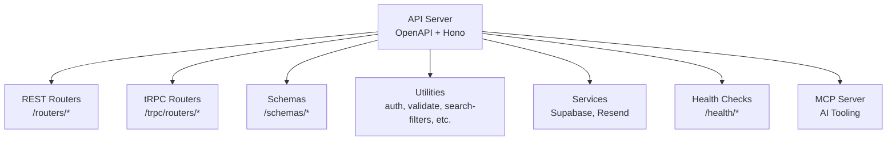
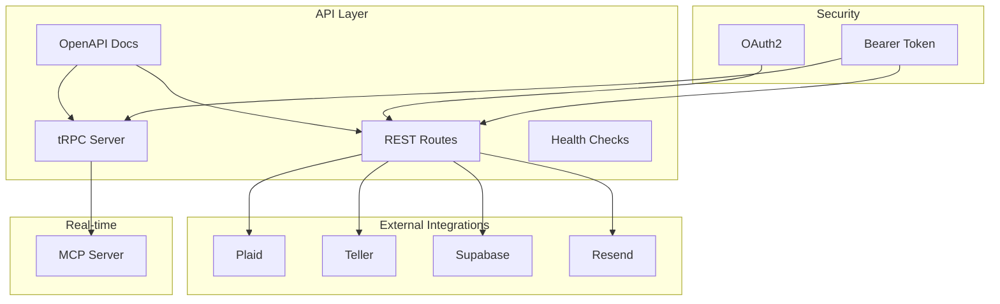
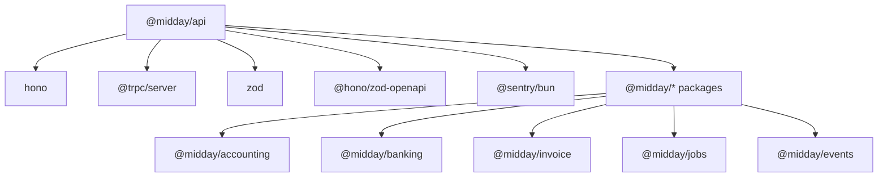

# API Data Structures

<cite>
**Referenced Files in This Document**
- [index.ts](file://midday/apps/api/src/index.ts)
- [package.json](file://midday/apps/api/package.json)
- [schemas directory](file://midday/apps/api/src/schemas)
- [rest routers directory](file://midday/apps/api/src/rest/routers)
- [trpc routers directory](file://midday/apps/api/src/trpc/routers)
- [trpc init](file://midday/apps/api/src/trpc/init.ts)
- [rest types](file://midday/apps/api/src/rest/types.ts)
- [auth utils](file://midday/apps/api/src/utils/auth.ts)
- [validate-response util](file://midday/apps/api/src/utils/validate-response.ts)
- [search-filters util](file://midday/apps/api/src/utils/search-filters.ts)
- [oauth utils](file://midday/apps/api/src/utils/oauth.ts)
- [plaid util](file://midday/apps/api/src/utils/plaid.ts)
- [teller util](file://midday/apps/api/src/utils/teller.ts)
- [geo util](file://midday/apps/api/src/utils/geo.ts)
- [db retry](file://midday/apps/api/src/utils/db-retry.ts)
- [logger](file://midday/apps/api/src/utils/logger.ts)
- [request-trace](file://midday/apps/api/src/utils/request-trace.ts)
- [supabase service](file://midday/apps/api/src/services/supabase.ts)
- [resend service](file://midday/apps/api/src/services/resend.ts)
- [health checker](file://midday/packages/health/src/checker.ts)
- [health probes](file://midday/packages/health/src/probes.ts)
- [events package](file://midday/packages/events/src)
- [jobs package](file://midday/packages/jobs/src)
- [mcp server](file://midday/apps/api/src/mcp/server.ts)
- [mcp types](file://midday/apps/api/src/mcp/types.ts)
- [mcp prompts](file://midday/apps/api/src/mcp/prompts.ts)
- [ai types](file://midday/apps/api/src/ai/types.ts)
</cite>

## Table of Contents
1. [Introduction](#introduction)
2. [Project Structure](#project-structure)
3. [Core Components](#core-components)
4. [Architecture Overview](#architecture-overview)
5. [Detailed Component Analysis](#detailed-component-analysis)
6. [Dependency Analysis](#dependency-analysis)
7. [Performance Considerations](#performance-considerations)
8. [Troubleshooting Guide](#troubleshooting-guide)
9. [Conclusion](#conclusion)
10. [Appendices](#appendices)

## Introduction
This document provides comprehensive API data structure documentation for Faworra's REST and tRPC endpoints. It covers request/response schemas, TypeScript interfaces, authentication payloads, error response formats, success response structures, pagination, filtering, sorting, webhook/event schemas, real-time data formats, API versioning strategies, backward compatibility, and deprecation policies. The documentation is grounded in the repository's source files and aims to be accessible to both technical and non-technical users.

## Project Structure
The API server is implemented using Hono with OpenAPI documentation, tRPC integration, and modular routing. Key areas include:
- REST endpoints under the REST router directory
- tRPC procedures under the tRPC routers directory
- Shared schemas under the schemas directory
- Utilities for authentication, validation, search filters, and external integrations
- Health checks and readiness endpoints
- MCP (Model Context Protocol) server for AI tooling

**Section sources**
- [index.ts](file://midday/apps/api/src/index.ts#L1-L288)
- [package.json](file://midday/apps/api/package.json#L1-L78)

## Core Components
- OpenAPI documentation endpoint and scalar reference
- CORS configuration supporting standard headers and Slack webhook headers
- tRPC server integration with error logging and Sentry reporting
- Health and readiness endpoints with dependency checks
- Database and Redis connection lifecycle management
- Global error handling and graceful shutdown

Key integration points:
- OpenAPI registry registers bearer token security scheme
- tRPC router uses a shared context factory
- REST routes are mounted via a centralized routers module
- Health endpoints leverage a shared health checker and probes

**Section sources**
- [index.ts](file://midday/apps/api/src/index.ts#L26-L176)
- [index.ts](file://midday/apps/api/src/index.ts#L118-L130)
- [index.ts](file://midday/apps/api/src/index.ts#L201-L211)
- [index.ts](file://midday/apps/api/src/index.ts#L217-L254)

## Architecture Overview
The API architecture combines REST and tRPC with OpenAPI documentation and health monitoring. Authentication supports OAuth2 and bearer tokens. External integrations include Plaid, Teller, Supabase, and Resend. Real-time capabilities are exposed via MCP for AI tooling.

**Diagram sources**
- [index.ts](file://midday/apps/api/src/index.ts#L132-L174)
- [index.ts](file://midday/apps/api/src/index.ts#L88-L113)
- [index.ts](file://midday/apps/api/src/index.ts#L163-L169)
- [mcp server](file://midday/apps/api/src/mcp/server.ts)
- [plaid util](file://midday/apps/api/src/utils/plaid.ts)
- [teller util](file://midday/apps/api/src/utils/teller.ts)
- [supabase service](file://midday/apps/api/src/services/supabase.ts)
- [resend service](file://midday/apps/api/src/services/resend.ts)

## Detailed Component Analysis

### REST API Endpoints
REST endpoints are organized under the REST routers directory. Each router groups related endpoints (e.g., invoices, transactions, customers). Request/response schemas are defined in the schemas directory and validated using zod-openapi.

Common patterns:
- Standardized headers including Authorization, Content-Type, and x-* metadata headers
- CORS allowing cross-origin requests with exposed headers
- OpenAPI documentation generation for discoverability

Pagination, filtering, and sorting:
- Pagination follows cursor-based or offset-based patterns depending on resource
- Filtering parameters are standardized across endpoints
- Sorting supports multiple fields with direction indicators

Validation and serialization:
- Zod schemas define request/response contracts
- snake_case and camelCase transformations handled via utility libraries
- Validation responses provide structured error messages

**Section sources**
- [index.ts](file://midday/apps/api/src/index.ts#L35-L65)
- [rest routers directory](file://midday/apps/api/src/rest/routers)
- [schemas directory](file://midday/apps/api/src/schemas)
- [validate-response util](file://midday/apps/api/src/utils/validate-response.ts)
- [search-filters util](file://midday/apps/api/src/utils/search-filters.ts)

### tRPC Procedures
tRPC procedures are defined under the tRPC routers directory. The server integrates with Hono using @hono/trpc-server and logs errors with structured logging and Sentry reporting.

Context creation:
- createTRPCContext initializes shared dependencies and request-scoped data
- Context includes database connections, user identity, and request metadata

Error handling:
- tRPC onError logs errors and forwards internal server errors to Sentry
- Client-side errors (UNAUTHORIZED, NOT_FOUND) are excluded from Sentry

Serialization:
- superjson enables robust serialization of complex types
- zod schemas validate inputs and outputs

**Section sources**
- [index.ts](file://midday/apps/api/src/index.ts#L88-L113)
- [trpc init](file://midday/apps/api/src/trpc/init.ts)
- [trpc routers directory](file://midday/apps/api/src/trpc/routers)

### Authentication Payloads
Authentication mechanisms:
- OAuth2: Used for user authorization flows
- Bearer token: Default HTTP bearer token scheme registered in OpenAPI

Headers:
- Authorization: Bearer token
- x-user-locale, x-user-timezone, x-user-country: Locale/timezone/country metadata
- x-request-id: Correlation ID for tracing
- x-trpc-source: tRPC source identification
- x-force-primary: Force primary database reads
- Slack webhook headers: x-slack-signature, x-slack-request-timestamp

Token management:
- API keys can be used as bearer tokens
- OAuth applications integrate with external providers

**Section sources**
- [index.ts](file://midday/apps/api/src/index.ts#L37-L64)
- [index.ts](file://midday/apps/api/src/index.ts#L163-L169)
- [oauth utils](file://midday/apps/api/src/utils/oauth.ts)

### Error Response Formats
Global error handling:
- Unhandled exceptions and rejections are captured and logged
- Internal Server Error responses include a generic error message

tRPC-specific errors:
- Errors are logged with path, code, message, and stack trace
- Internal server errors are forwarded to Sentry for monitoring

REST error responses:
- Structured validation errors from zod-openapi
- Consistent error envelope with message and optional details

**Section sources**
- [index.ts](file://midday/apps/api/src/index.ts#L201-L211)
- [index.ts](file://midday/apps/api/src/index.ts#L93-L111)

### Success Response Structures
Standard success responses:
- REST endpoints return JSON with data, pagination metadata, and optional warnings
- tRPC procedures return typed data structures validated by zod schemas
- OpenAPI documentation defines response schemas for each endpoint

Envelope patterns:
- Data wrapper for collections
- Metadata for pagination (page, limit, total)
- Warnings for deprecations or pending changes

**Section sources**
- [index.ts](file://midday/apps/api/src/index.ts#L132-L174)
- [validate-response util](file://midday/apps/api/src/utils/validate-response.ts)

### Pagination, Filtering, and Sorting
Pagination:
- Cursor-based pagination for large datasets
- Offset-based pagination for simpler queries
- Page and limit parameters supported across endpoints

Filtering:
- Search-filters utility provides standardized filter parsing
- Field-level filters (equals, not equals, greater than, less than)
- Date range filters and category/tag filters

Sorting:
- Multi-field sort with ascending/descending directions
- Sort precedence defined per endpoint

**Section sources**
- [search-filters util](file://midday/apps/api/src/utils/search-filters.ts)
- [schemas directory](file://midday/apps/api/src/schemas)

### Webhook Payload Structures and Event Schemas
Webhooks:
- Slack webhook headers supported (signature and timestamp)
- Event schemas defined in the events package
- Jobs package coordinates asynchronous event processing

Event schemas:
- Standardized event envelopes with type, payload, and metadata
- Idempotency keys for deduplication
- Retry policies and dead-letter queues

**Section sources**
- [index.ts](file://midday/apps/api/src/index.ts#L53-L55)
- [events package](file://midday/packages/events/src)
- [jobs package](file://midday/packages/jobs/src)

### Real-time Data Formats and MCP
MCP (Model Context Protocol):
- MCP server exposes AI tooling capabilities
- Types and prompts defined for agent interactions
- Tools integrate with external services (Plaid, Teller, etc.)

Real-time formats:
- WebSocket-like streaming via MCP
- Structured tool responses and progress updates
- Context-aware conversations with memory

**Section sources**
- [mcp server](file://midday/apps/api/src/mcp/server.ts)
- [mcp types](file://midday/apps/api/src/mcp/types.ts)
- [mcp prompts](file://midday/apps/api/src/mcp/prompts.ts)
- [ai types](file://midday/apps/api/src/ai/types.ts)

### External Integrations and Data Transformation
Integrations:
- Plaid integration for bank connections and transactions
- Teller integration for financial data aggregation
- Supabase for authentication and database operations
- Resend for email delivery

Data transformation:
- snake_case to camelCase conversions for API boundaries
- superjson serialization for complex types
- Geo utilities for location-based services

**Section sources**
- [plaid util](file://midday/apps/api/src/utils/plaid.ts)
- [teller util](file://midday/apps/api/src/utils/teller.ts)
- [supabase service](file://midday/apps/api/src/services/supabase.ts)
- [resend service](file://midday/apps/api/src/services/resend.ts)
- [geo util](file://midday/apps/api/src/utils/geo.ts)

## Dependency Analysis
The API depends on several workspace packages and external libraries. Key dependencies include:
- Hono for web framework and OpenAPI integration
- tRPC for type-safe remote procedures
- Zod for schema validation
- Sentry for error monitoring
- Workspace packages for domain-specific features

**Diagram sources**
- [package.json](file://midday/apps/api/package.json#L15-L72)

**Section sources**
- [package.json](file://midday/apps/api/package.json#L15-L72)

## Performance Considerations
- Database pool statistics logging can be enabled via environment variable
- Optional performance logging for tRPC procedures
- Graceful shutdown with connection cleanup and Sentry flush
- Health checks monitor dependencies and readiness

Recommendations:
- Monitor DB pool stats periodically
- Enable DEBUG_PERF for performance profiling
- Configure graceful shutdown timeouts appropriately

**Section sources**
- [index.ts](file://midday/apps/api/src/index.ts#L178-L199)
- [index.ts](file://midday/apps/api/src/index.ts#L67-L86)
- [index.ts](file://midday/apps/api/src/index.ts#L217-L254)

## Troubleshooting Guide
Common issues and resolutions:
- CORS errors: Verify ALLOWED_API_ORIGINS and exposed headers
- Authentication failures: Confirm bearer token format and OAuth2 flow
- Validation errors: Review zod schemas and request payloads
- Database connectivity: Check DB pool stats and connection limits
- Sentry errors: Review error logs and stack traces

Diagnostic tools:
- Health endpoints for readiness and dependency status
- Request tracing with x-request-id
- Performance logs for tRPC procedures

**Section sources**
- [index.ts](file://midday/apps/api/src/index.ts#L35-L65)
- [index.ts](file://midday/apps/api/src/index.ts#L120-L130)
- [request-trace](file://midday/apps/api/src/utils/request-trace.ts)
- [logger](file://midday/apps/api/src/utils/logger.ts)

## Conclusion
Faworra's API combines REST and tRPC with comprehensive OpenAPI documentation, robust authentication, and structured error handling. The system emphasizes type safety, validation, and observability through Sentry and structured logging. External integrations and real-time capabilities are integrated via MCP and workspace packages. The documented schemas and patterns provide a solid foundation for building reliable integrations.

## Appendices

### API Versioning Strategy
- OpenAPI version is set to 3.1.0 with a semantic version for the API
- Security schemes support both OAuth2 and bearer token authentication
- Backward compatibility maintained through schema evolution and deprecation policies

**Section sources**
- [index.ts](file://midday/apps/api/src/index.ts#L132-L174)
- [index.ts](file://midday/apps/api/src/index.ts#L163-L169)

### Backward Compatibility and Deprecation Policies
- Schema evolution遵循向后兼容原则
- Deprecation notices included in OpenAPI documentation
- Gradual migration paths for breaking changes
- Health checks flag deprecated endpoints

**Section sources**
- [index.ts](file://midday/apps/api/src/index.ts#L132-L174)
- [health checker](file://midday/packages/health/src/checker.ts)
- [health probes](file://midday/packages/health/src/probes.ts)

### Example Usage Patterns
- REST: GET /api/resource?page=1&limit=50&sort=-created_at
- tRPC: trpc.procedure.create({ input: { ... } })
- Authentication: Authorization: Bearer YOUR_TOKEN
- Webhooks: Slack-signed requests with x-slack-signature

Note: Specific endpoint paths and schemas are defined in the respective router and schema files.

**Section sources**
- [rest routers directory](file://midday/apps/api/src/rest/routers)
- [trpc routers directory](file://midday/apps/api/src/trpc/routers)
- [index.ts](file://midday/apps/api/src/index.ts#L37-L64)