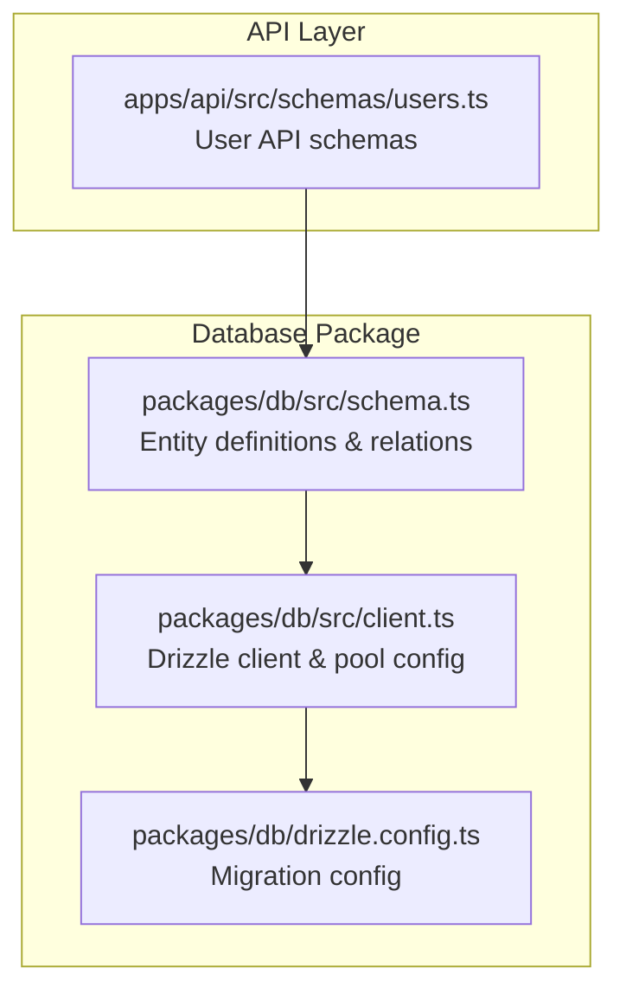
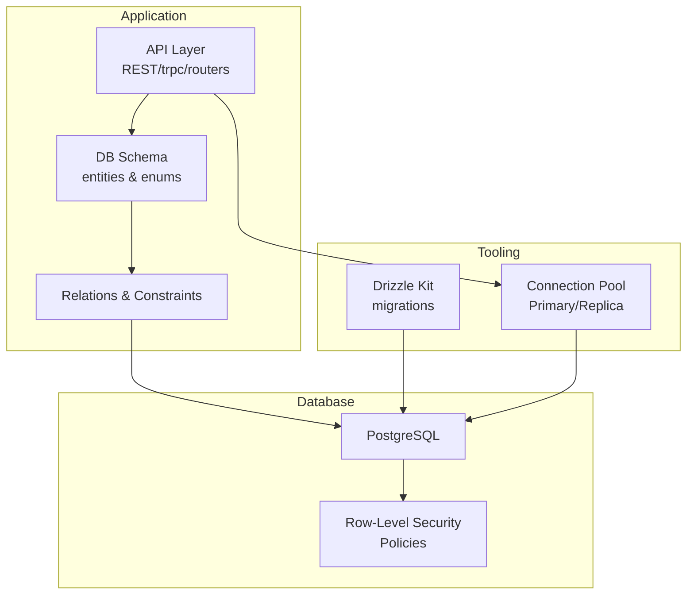
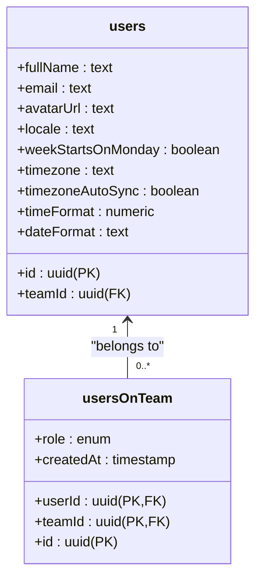
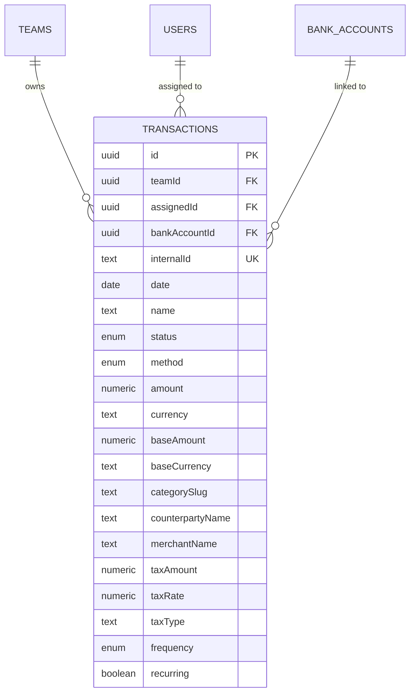
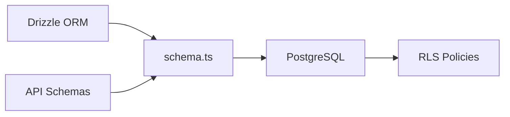

# Data Models & Schemas

<cite>
**Referenced Files in This Document**
- [schema.ts](file://midday/packages/db/src/schema.ts)
- [client.ts](file://midday/packages/db/src/client.ts)
- [drizzle.config.ts](file://midday/packages/db/drizzle.config.ts)
- [users.ts](file://midday/apps/api/src/schemas/users.ts)
</cite>

## Table of Contents
1. [Introduction](#introduction)
2. [Project Structure](#project-structure)
3. [Core Components](#core-components)
4. [Architecture Overview](#architecture-overview)
5. [Detailed Component Analysis](#detailed-component-analysis)
6. [Dependency Analysis](#dependency-analysis)
7. [Performance Considerations](#performance-considerations)
8. [Troubleshooting Guide](#troubleshooting-guide)
9. [Conclusion](#conclusion)
10. [Appendices](#appendices)

## Introduction
This document provides comprehensive data model documentation for Faworra’s database schema and API data structures. It covers the entity relationship model for users, teams, invoices, transactions, customers, documents, and related entities. It also explains Drizzle ORM configuration, migration strategies, indexing approaches, API request/response schemas, validation logic, serialization patterns, data integrity mechanisms, referential constraints, audit trails, and privacy/security considerations.

## Project Structure
The data model is defined centrally in the database package and consumed by the API layer for request/response validation. The database client encapsulates connection pooling, replication, and instrumentation. Migrations are configured via Drizzle Kit.

**Diagram sources**
- [schema.ts](file://midday/packages/db/src/schema.ts#L1-L80)
- [client.ts](file://midday/packages/db/src/client.ts#L1-L60)
- [drizzle.config.ts](file://midday/packages/db/drizzle.config.ts#L1-L11)
- [users.ts](file://midday/apps/api/src/schemas/users.ts#L1-L156)

**Section sources**
- [schema.ts](file://midday/packages/db/src/schema.ts#L1-L80)
- [client.ts](file://midday/packages/db/src/client.ts#L1-L60)
- [drizzle.config.ts](file://midday/packages/db/drizzle.config.ts#L1-L11)
- [users.ts](file://midday/apps/api/src/schemas/users.ts#L1-L156)

## Core Components
- Entities: teams, users, transactions, customers, invoices, documents, tags, transaction attachments, inbox, bank connections/accounts, apps, API keys, OAuth applications/tokens, notifications, insights, and more.
- Enums: account types, bank providers, connection/accounting statuses, invoice states, transaction methods/statuses/frequencies, activity types/sources/statuses, and others.
- Indexes: composite, GIN, HNSW vector, and policy-based access controls.
- Relations: Drizzle relations define foreign keys and one-to-many/many-to-one associations.
- Policies: Row-level security policies enforce team scoping and access checks.

**Section sources**
- [schema.ts](file://midday/packages/db/src/schema.ts#L54-L298)
- [schema.ts](file://midday/packages/db/src/schema.ts#L3033-L3556)
- [schema.ts](file://midday/packages/db/src/schema.ts#L3558-L3992)

## Architecture Overview
The system uses Drizzle ORM with PostgreSQL. The client manages primary and replica pools, logging, and optional performance instrumentation. Migrations are generated via Drizzle Kit against a session pool URL. API schemas validate requests/responses and align with database entities.

**Diagram sources**
- [client.ts](file://midday/packages/db/src/client.ts#L103-L174)
- [drizzle.config.ts](file://midday/packages/db/drizzle.config.ts#L1-L11)
- [schema.ts](file://midday/packages/db/src/schema.ts#L3558-L3628)

## Detailed Component Analysis

### Users
- Purpose: Store user profiles, preferences, and team membership.
- Key fields:
  - Identity: id (PK), fullName, email, avatarUrl
  - Preferences: locale, weekStartsOnMonday, timezone, timezoneAutoSync, timeFormat, dateFormat
  - Team association: teamId (FK to teams)
- Validation rules:
  - fullName: min/max length constraints
  - email: email format
  - avatarUrl: must be from midday.ai domain
  - timezone: IANA timezone validation
  - dateFormat: enum of supported formats
- Business constraints:
  - One user per auth row (auth.users)
  - Team membership via usersOnTeam
- API schema alignment:
  - userSchema and updateUserSchema define OpenAPI-compatible shapes and validations.

**Diagram sources**
- [schema.ts](file://midday/packages/db/src/schema.ts#L2101-L2157)
- [schema.ts](file://midday/packages/db/src/schema.ts#L2541-L2600)
- [users.ts](file://midday/apps/api/src/schemas/users.ts#L1-L156)

**Section sources**
- [schema.ts](file://midday/packages/db/src/schema.ts#L2101-L2157)
- [schema.ts](file://midday/packages/db/src/schema.ts#L2541-L2600)
- [users.ts](file://midday/apps/api/src/schemas/users.ts#L1-L156)

### Teams
- Purpose: Organizational units that own data and enforce access control.
- Key fields: name, logoUrl, inboxId, email, baseCurrency, countryCode, plan, subscriptionStatus, flags, and more.
- Constraints:
  - Unique inboxId
  - Policies for insert/select/update/delete scoped by authenticated users and team membership.

**Section sources**
- [schema.ts](file://midday/packages/db/src/schema.ts#L1657-L1716)

### Transactions
- Purpose: Financial movements with enrichment, categorization, and tagging.
- Key fields:
  - Identity: id (PK), internalId (unique)
  - Amount and currency: amount, baseAmount, currency, baseCurrency
  - Date and status: date, status (posted/pending/excluded/completed/archived/exported)
  - Method: payment/card purchase/atm/transfer/interest/deposit/wire/fee/unknown
  - Enrichment: counterpartyName, merchantName, tax fields, frequency, recurring
  - Relationships: assignedId (user), teamId (team), bankAccountId (bankAccounts)
- Indexes:
  - Composite indexes for date/name/teamId, merchant name trigrams, FTS vector, and reports filtering.
- Policies: Team-scoped insert/select/update/delete.

**Diagram sources**
- [schema.ts](file://midday/packages/db/src/schema.ts#L365-L535)

**Section sources**
- [schema.ts](file://midday/packages/db/src/schema.ts#L365-L535)

### Customers
- Purpose: Client/prospect records with enrichment and portal fields.
- Key fields: name, email, billingEmail, address, website, phone, vatNumber, status, preferredCurrency, defaultPaymentTerms, isArchived, externalId, and enrichment metadata.
- Indexes: FTS, status, archive flag, enrichment status, website, industry.
- Policies: Team-scoped CRUD.

**Section sources**
- [schema.ts](file://midday/packages/db/src/schema.ts#L1045-L1156)

### Invoices
- Purpose: Invoice lifecycle tracking, templating, scheduling, and recurring series.
- Key fields:
  - Identity: id (PK), invoiceNumber, token, scheduledJobId (unique)
  - Amounts: amount, subtotal, tax, vat, discount, fileSize
  - Dates: issueDate, dueDate, sentAt, scheduledAt, paidAt, refundedAt, viewedAt
  - Templates: template, templateId (FK)
  - Recurring: invoiceRecurringId (FK), recurringSequence (unique per series)
  - Relationships: customerId (FK), teamId (FK), userId (FK)
- Indexes: FTS, team+status+paidAt, team+dueDate, team+customer, scheduled job id uniqueness.
- Policies: Team-scoped CRUD.

**Section sources**
- [schema.ts](file://midday/packages/db/src/schema.ts#L887-L1043)

### Documents
- Purpose: Document storage with full-text search and processing status.
- Key fields: name, title, body, content, summary, metadata, pathTokens, processingStatus, language/date, and FTS vectors.
- Indexes: name/teamId, teamId+createdAt, teamId+date, FTS indices.
- Policies: Team-scoped insert/select/update/delete; authenticated insert allowed.

**Section sources**
- [schema.ts](file://midday/packages/db/src/schema.ts#L1718-L1839)

### Tags and Tagging
- Purpose: Attach tags to customers, transactions, projects, and documents.
- Tables:
  - tags: team-scoped tag definitions
  - customer_tags: customer-tag assignments
  - transaction_tags: transaction-tag assignments
  - tracker_project_tags: project-tag assignments
  - document_tag_assignments: document-tag assignments
- Constraints: Uniqueness per pair/team; cascade deletes.

**Section sources**
- [schema.ts](file://midday/packages/db/src/schema.ts#L1183-L1211)
- [schema.ts](file://midday/packages/db/src/schema.ts#L1213-L1311)
- [schema.ts](file://midday/packages/db/src/schema.ts#L1522-L1547)
- [schema.ts](file://midday/packages/db/src/schema.ts#L2496-L2539)

### Transaction Attachments
- Purpose: Link attachments to transactions; supports team scoping and soft-deletion.
- Fields: type, size, name, path, teamId (FK), transactionId (FK).
- Policies: Team-scoped CRUD.

**Section sources**
- [schema.ts](file://midday/packages/db/src/schema.ts#L1600-L1655)

### Inbox and Matching
- Purpose: Email-driven document ingestion and transaction matching.
- Entities:
  - inbox: inbound messages with FTS, status, type, amounts, and metadata
  - inboxAccounts: team email accounts
  - inboxBlocklist: block domains/email addresses
  - transaction_match_suggestions: ML suggestions with confidence scores and user actions
- Indexes: attachmentId, teamId, transactionId, invoiceNumber, groupedInboxId, display name trigrams.
- Policies: Team-scoped CRUD.

**Section sources**
- [schema.ts](file://midday/packages/db/src/schema.ts#L2232-L2353)
- [schema.ts](file://midday/packages/db/src/schema.ts#L640-L690)
- [schema.ts](file://midday/packages/db/src/schema.ts#L2355-L2396)
- [schema.ts](file://midday/packages/db/src/schema.ts#L2398-L2494)

### Bank Integrations
- Entities:
  - institutions: supported banks/providers
  - bankConnections: team connections to providers
  - bankAccounts: team bank accounts with balances and identifiers
- Indexes: provider/providerId combinations, countries, name trigrams.
- Policies: Team-scoped CRUD.

**Section sources**
- [schema.ts](file://midday/packages/db/src/schema.ts#L1369-L1397)
- [schema.ts](file://midday/packages/db/src/schema.ts#L1399-L1456)
- [schema.ts](file://midday/packages/db/src/schema.ts#L692-L777)

### Apps, API Keys, OAuth
- apps: team integrations with configs
- api_keys: hashed keys with scopes
- oauth_applications, oauth_authorization_codes, oauth_access_tokens: OAuth lifecycle
- Policies: Team-scoped CRUD; OAuth tokens scoped to user/team.

**Section sources**
- [schema.ts](file://midday/packages/db/src/schema.ts#L1841-L1889)
- [schema.ts](file://midday/packages/db/src/schema.ts#L2806-L2849)
- [schema.ts](file://midday/packages/db/src/schema.ts#L2851-L3031)

### Notifications and Insights
- notification_settings: per-user channels and types
- insights: AI-generated business insights with metrics, anomalies, milestones, and predictions
- Policies: Team-scoped access; per-user insight status management.

**Section sources**
- [schema.ts](file://midday/packages/db/src/schema.ts#L3630-L3675)
- [schema.ts](file://midday/packages/db/src/schema.ts#L3862-L3938)
- [schema.ts](file://midday/packages/db/src/schema.ts#L3949-L3977)

### Activities and Audit Trail
- activities: event log with type/source/status/priority and metadata
- Indexes optimized for notifications and insights retrieval
- Policies: Team-scoped select; insert/update allowed for team members

**Section sources**
- [schema.ts](file://midday/packages/db/src/schema.ts#L3558-L3628)

## Dependency Analysis
- Drizzle ORM defines entities and relations; PostgreSQL enforces referential integrity.
- Row-level security policies gate access by team membership.
- API schemas validate request/response payloads and align with database entities.

**Diagram sources**
- [schema.ts](file://midday/packages/db/src/schema.ts#L3033-L3556)
- [users.ts](file://midday/apps/api/src/schemas/users.ts#L1-L156)

**Section sources**
- [schema.ts](file://midday/packages/db/src/schema.ts#L3033-L3556)
- [users.ts](file://midday/apps/api/src/schemas/users.ts#L1-L156)

## Performance Considerations
- Connection pooling:
  - Primary and replica pools with configurable sizes, timeouts, and keep-alive.
  - Optional performance instrumentation and pool event logging.
- Indexing:
  - Composite indexes for frequent filters (teamId+status, teamId+date, teamId+customer).
  - GIN/HNSW indexes for full-text search and vector similarity.
  - Partial indexes for scheduler and reporting queries.
- Replication:
  - Region-aware replica selection; fallback to primary when unavailable.

**Section sources**
- [client.ts](file://midday/packages/db/src/client.ts#L18-L28)
- [client.ts](file://midday/packages/db/src/client.ts#L103-L174)
- [schema.ts](file://midday/packages/db/src/schema.ts#L412-L535)
- [schema.ts](file://midday/packages/db/src/schema.ts#L838-L884)
- [schema.ts](file://midday/packages/db/src/schema.ts#L962-L1043)
- [schema.ts](file://midday/packages/db/src/schema.ts#L1131-L1156)

## Troubleshooting Guide
- Connection issues:
  - Verify DATABASE_PRIMARY_URL and replica URLs; check pool stats and logs.
- Permission errors:
  - Ensure policies allow authenticated users and team membership checks.
- Migration failures:
  - Confirm Drizzle Kit configuration points to DATABASE_SESSION_POOLER and migrations directory exists.
- Validation errors:
  - Align API payloads with schemas (e.g., timezone, dateFormat, avatarUrl domain).

**Section sources**
- [client.ts](file://midday/packages/db/src/client.ts#L176-L219)
- [drizzle.config.ts](file://midday/packages/db/drizzle.config.ts#L1-L11)
- [users.ts](file://midday/apps/api/src/schemas/users.ts#L35-L69)

## Conclusion
Faworra’s data model centers on teams and users with robust entity relationships spanning transactions, customers, invoices, documents, and integrations. Drizzle ORM and PostgreSQL provide strong typing, constraints, and RLS. The API schemas ensure validated, secure interactions. The design emphasizes performance via targeted indexes and replication, while policies and unique constraints maintain data integrity and privacy.

## Appendices

### Drizzle ORM Configuration
- Client:
  - Connection pools for primary and replica databases
  - Instrumentation and monitoring hooks
  - Environment-based tuning (development/production)
- Migration:
  - Drizzle Kit configuration pointing to session pool URL

**Section sources**
- [client.ts](file://midday/packages/db/src/client.ts#L103-L174)
- [drizzle.config.ts](file://midday/packages/db/drizzle.config.ts#L1-L11)

### API Request/Response Schemas
- Users:
  - updateUserSchema: validates profile updates with timezone and avatarUrl rules
  - userSchema: response shape including team and fileKey

**Section sources**
- [users.ts](file://midday/apps/api/src/schemas/users.ts#L1-L156)