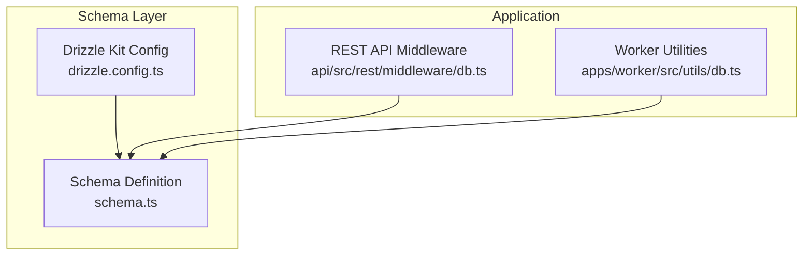
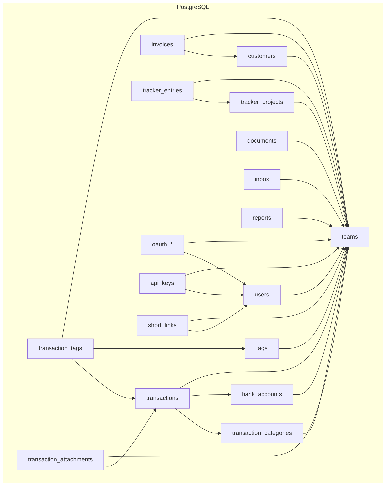
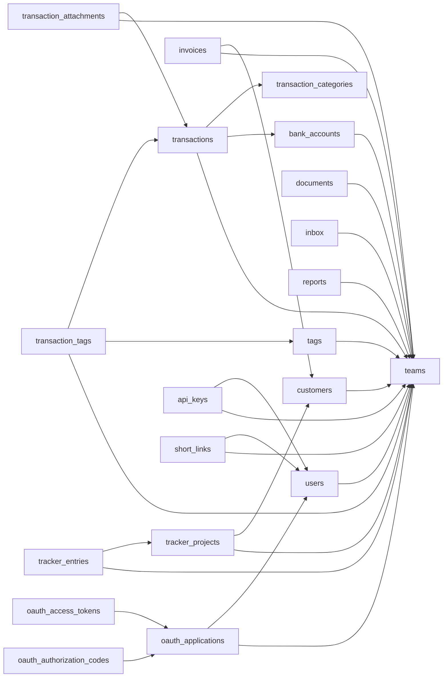

# Database Schema Design

<cite>
**Referenced Files in This Document**
- [schema.ts](file://packages/db/src/schema.ts)
- [drizzle.config.ts](file://packages/db/drizzle.config.ts)
- [db.ts](file://apps/api/src/rest/middleware/db.ts)
- [db.ts](file://apps/worker/src/utils/db.ts)
- [README.md](file://docs/database-connection-pooling.md)
</cite>

## Table of Contents
1. [Introduction](#introduction)
2. [Project Structure](#project-structure)
3. [Core Components](#core-components)
4. [Architecture Overview](#architecture-overview)
5. [Detailed Component Analysis](#detailed-component-analysis)
6. [Dependency Analysis](#dependency-analysis)
7. [Performance Considerations](#performance-considerations)
8. [Troubleshooting Guide](#troubleshooting-guide)
9. [Conclusion](#conclusion)

## Introduction
This document provides comprehensive database schema documentation for Faworra’s PostgreSQL implementation built with Drizzle ORM. It covers the complete entity relationship model, table structures, constraints, indexing strategies, and Drizzle configuration. It also explains connection pooling, migration management, normalization principles, referential integrity, and performance optimization patterns used across the application.

## Project Structure
The database schema is defined centrally in a single Drizzle ORM schema file and configured via a Drizzle Kit configuration. Application services access a shared database client instance, while workers use a specialized worker client optimized for concurrent job processing.

**Diagram sources**
- [drizzle.config.ts](file://packages/db/drizzle.config.ts#L1-L11)
- [schema.ts](file://packages/db/src/schema.ts#L1-L50)
- [db.ts](file://apps/api/src/rest/middleware/db.ts#L1-L13)
- [db.ts](file://apps/worker/src/utils/db.ts#L1-L31)

**Section sources**
- [drizzle.config.ts](file://packages/db/drizzle.config.ts#L1-L11)
- [schema.ts](file://packages/db/src/schema.ts#L1-L50)
- [db.ts](file://apps/api/src/rest/middleware/db.ts#L1-L13)
- [db.ts](file://apps/worker/src/utils/db.ts#L1-L31)

## Core Components
- Drizzle ORM schema module defining all tables, enums, indexes, foreign keys, and row-level security policies.
- Drizzle Kit configuration specifying schema path, migrations output, and PostgreSQL connection URL from environment.
- Shared database clients:
  - API middleware injects a singleton database client into request context.
  - Worker utilities provide a dedicated worker client with reconnection logging.

Key schema highlights:
- Strongly typed enums for domain-specific statuses and classifications.
- Vector embeddings for semantic search on categories and document tags.
- Full-text search (GIN/GiST) indexes for natural language queries.
- Composite indexes supporting common analytical and reporting queries.
- Row-level security policies enforcing team scoping for most resources.
- Self-referencing foreign keys (e.g., transaction categories hierarchy) and partial indexes for scheduler-driven workflows.

**Section sources**
- [schema.ts](file://packages/db/src/schema.ts#L54-L291)
- [schema.ts](file://packages/db/src/schema.ts#L365-L535)
- [schema.ts](file://packages/db/src/schema.ts#L887-L1043)
- [schema.ts](file://packages/db/src/schema.ts#L1657-L1716)
- [schema.ts](file://packages/db/src/schema.ts#L2101-L2157)
- [schema.ts](file://packages/db/src/schema.ts#L2602-L2653)
- [schema.ts](file://packages/db/src/schema.ts#L2851-L3191)
- [drizzle.config.ts](file://packages/db/drizzle.config.ts#L1-L11)
- [db.ts](file://apps/api/src/rest/middleware/db.ts#L1-L13)
- [db.ts](file://apps/worker/src/utils/db.ts#L1-L31)

## Architecture Overview
The database architecture centers on a normalized schema with explicit foreign keys and composite indexes. Drizzle ORM enforces type-safe access, while row-level security ensures per-team isolation. Application services rely on a shared client for request-scoped operations, and workers use a pooled client optimized for concurrency.

**Diagram sources**
- [schema.ts](file://packages/db/src/schema.ts#L1657-L1716)
- [schema.ts](file://packages/db/src/schema.ts#L2101-L2157)
- [schema.ts](file://packages/db/src/schema.ts#L365-L535)
- [schema.ts](file://packages/db/src/schema.ts#L692-L777)
- [schema.ts](file://packages/db/src/schema.ts#L1045-L1156)
- [schema.ts](file://packages/db/src/schema.ts#L887-L1043)
- [schema.ts](file://packages/db/src/schema.ts#L2159-L2230)
- [schema.ts](file://packages/db/src/schema.ts#L537-L601)
- [schema.ts](file://packages/db/src/schema.ts#L1718-L1839)
- [schema.ts](file://packages/db/src/schema.ts#L2232-L2353)
- [schema.ts](file://packages/db/src/schema.ts#L1313-L1367)
- [schema.ts](file://packages/db/src/schema.ts#L1183-L1211)
- [schema.ts](file://packages/db/src/schema.ts#L1549-L1598)
- [schema.ts](file://packages/db/src/schema.ts#L1600-L1655)
- [schema.ts](file://packages/db/src/schema.ts#L2602-L2653)
- [schema.ts](file://packages/db/src/schema.ts#L2853-L3031)
- [schema.ts](file://packages/db/src/schema.ts#L2806-L2849)
- [schema.ts](file://packages/db/src/schema.ts#L2738-L2804)

## Detailed Component Analysis

### Drizzle ORM Configuration
- Schema path: points to the central schema definition.
- Migrations output: directory for generated migration files.
- Dialect: PostgreSQL.
- Credentials: connection URL loaded from environment variable intended for a session pooler.

Operational implications:
- Centralized schema definition enables deterministic migrations.
- Environment-driven credentials support separation of environments and secure credential management.

**Section sources**
- [drizzle.config.ts](file://packages/db/drizzle.config.ts#L1-L11)

### Database Clients and Middleware
- API middleware:
  - Injects a singleton database client into request context for REST handlers.
  - Ensures consistent connection lifecycle per request.
- Worker utilities:
  - Provides a worker-specific client with lazy initialization and error logging.
  - Suitable for stateful servers processing concurrent jobs.

Connection pooling considerations:
- The configuration references a session pooler URL, indicating offloading of connection management to a dedicated service.
- Workers leverage a shared instance with reconnection handling to maintain reliability under load.

**Section sources**
- [db.ts](file://apps/api/src/rest/middleware/db.ts#L1-L13)
- [db.ts](file://apps/worker/src/utils/db.ts#L1-L31)

### Entity Relationship Model and Normalization
- Teams and Users:
  - Users belong to teams; team membership is enforced via foreign keys and row-level policies.
  - Users can be scoped to teams for resource access.
- Transactions:
  - Core financial records with strong typing for methods and statuses.
  - Links to teams, bank accounts, categories, and attachments.
  - Rich indexing for analytics and reporting.
- Bank Accounts and Connections:
  - Bank connections aggregate provider-specific credentials and status.
  - Bank accounts link to connections and teams, with computed balances and identifiers.
- Customers and Invoices:
  - Customer enrichment supports external data ingestion and search.
  - Invoices reference customers, templates, and recurring series with robust indexing for status and timing.
- Tracker Projects and Entries:
  - Time-tracking with project hierarchies and billing rates.
  - Composite indexes optimize insights and reporting queries.
- Documents and Inbox:
  - Document storage with full-text search and language-aware vectors.
  - Inbox integrates with transactions and attachments, with blocklists and categorization.
- Tags and Tagging:
  - Many-to-many relationships for flexible categorization across transactions and documents.
- OAuth and API Keys:
  - First-class OAuth application and token management with scopes and expiration.
  - API keys scoped to users and teams with granular access control.

Normalization principles:
- Separate entities for teams, users, and resources to enforce isolation and reduce duplication.
- Enumerations and typed columns minimize invalid states.
- Foreign keys define strict referential integrity across related entities.
- Composite indexes support targeted queries for analytics and UI filters.

**Section sources**
- [schema.ts](file://packages/db/src/schema.ts#L1657-L1716)
- [schema.ts](file://packages/db/src/schema.ts#L2101-L2157)
- [schema.ts](file://packages/db/src/schema.ts#L365-L535)
- [schema.ts](file://packages/db/src/schema.ts#L692-L777)
- [schema.ts](file://packages/db/src/schema.ts#L1045-L1156)
- [schema.ts](file://packages/db/src/schema.ts#L887-L1043)
- [schema.ts](file://packages/db/src/schema.ts#L2159-L2230)
- [schema.ts](file://packages/db/src/schema.ts#L1718-L1839)
- [schema.ts](file://packages/db/src/schema.ts#L2232-L2353)
- [schema.ts](file://packages/db/src/schema.ts#L1313-L1367)
- [schema.ts](file://packages/db/src/schema.ts#L1183-L1211)
- [schema.ts](file://packages/db/src/schema.ts#L1549-L1598)
- [schema.ts](file://packages/db/src/schema.ts#L1600-L1655)
- [schema.ts](file://packages/db/src/schema.ts#L2602-L2653)
- [schema.ts](file://packages/db/src/schema.ts#L2853-L3031)
- [schema.ts](file://packages/db/src/schema.ts#L2806-L2849)
- [schema.ts](file://packages/db/src/schema.ts#L2738-L2804)

### Indexing Strategies and Query Patterns
Common indexes and their use cases:
- Transactions:
  - Date, name, merchant name trigram, FTS GIN, and composite indexes for analytics and filtering.
- Invoices:
  - FTS, team+status+paidAt, team+dueDate, and recurring sequence uniqueness.
- Customers:
  - FTS, status, archive flag, enrichment status, and website/industry fields.
- Documents:
  - Name, teamId, parent, createdAt/date/name combinations, and multiple language FTS variants.
- Reports and Short Links:
  - Team-scoped indexes and unique constraints for sharing and retrieval.
- OAuth and API Keys:
  - Unique tokens and team/user scoping for secure access.

These indexes align with typical query patterns:
- Filtering by teamId and date ranges.
- Full-text search for names, descriptions, and content.
- Aggregation and reporting by status, currency, and category.
- Upsert and uniqueness checks for products and tags.

**Section sources**
- [schema.ts](file://packages/db/src/schema.ts#L412-L488)
- [schema.ts](file://packages/db/src/schema.ts#L962-L1035)
- [schema.ts](file://packages/db/src/schema.ts#L1131-L1143)
- [schema.ts](file://packages/db/src/schema.ts#L1752-L1806)
- [schema.ts](file://packages/db/src/schema.ts#L1330-L1344)
- [schema.ts](file://packages/db/src/schema.ts#L2755-L2778)
- [schema.ts](file://packages/db/src/schema.ts#L2938-L2966)
- [schema.ts](file://packages/db/src/schema.ts#L2824-L2848)

### Migration Management and Version Control
- Drizzle Kit configuration defines schema and migrations output paths.
- Migrations are stored separately and evolve the schema over time.
- The configuration references a session pooler URL, enabling safe migrations against production-like environments.

Best practices:
- Treat migrations as immutable changesets.
- Use partial indexes and enums to preserve backward compatibility.
- Keep row-level policies aligned with evolving access controls.

**Section sources**
- [drizzle.config.ts](file://packages/db/drizzle.config.ts#L1-L11)

### Data Validation and Constraints
- Enumerations constrain values for statuses, methods, providers, and types.
- Unique constraints prevent duplicates (e.g., tags per team, invoice recurring sequences).
- Partial indexes enforce logical exclusions (e.g., internal vs. external transactions).
- Row-level security policies restrict access to authenticated users and team members.

**Section sources**
- [schema.ts](file://packages/db/src/schema.ts#L54-L291)
- [schema.ts](file://packages/db/src/schema.ts#L1016-L1018)
- [schema.ts](file://packages/db/src/schema.ts#L1689-L1714)
- [schema.ts](file://packages/db/src/schema.ts#L3033-L3191)

## Dependency Analysis
The schema exhibits a well-normalized dependency graph with clear ownership and cascading rules. Foreign keys ensure referential integrity, while composite indexes optimize frequent queries.

**Diagram sources**
- [schema.ts](file://packages/db/src/schema.ts#L1657-L1716)
- [schema.ts](file://packages/db/src/schema.ts#L2101-L2157)
- [schema.ts](file://packages/db/src/schema.ts#L365-L535)
- [schema.ts](file://packages/db/src/schema.ts#L692-L777)
- [schema.ts](file://packages/db/src/schema.ts#L1045-L1156)
- [schema.ts](file://packages/db/src/schema.ts#L887-L1043)
- [schema.ts](file://packages/db/src/schema.ts#L2159-L2230)
- [schema.ts](file://packages/db/src/schema.ts#L537-L601)
- [schema.ts](file://packages/db/src/schema.ts#L1718-L1839)
- [schema.ts](file://packages/db/src/schema.ts#L2232-L2353)
- [schema.ts](file://packages/db/src/schema.ts#L1313-L1367)
- [schema.ts](file://packages/db/src/schema.ts#L1183-L1211)
- [schema.ts](file://packages/db/src/schema.ts#L1549-L1598)
- [schema.ts](file://packages/db/src/schema.ts#L1600-L1655)
- [schema.ts](file://packages/db/src/schema.ts#L2853-L3031)
- [schema.ts](file://packages/db/src/schema.ts#L2806-L2849)
- [schema.ts](file://packages/db/src/schema.ts#L2738-L2804)

**Section sources**
- [schema.ts](file://packages/db/src/schema.ts#L2851-L3191)

## Performance Considerations
- Index selection:
  - Prefer composite indexes for multi-column filters (e.g., teamId + date/status).
  - Use GIN/GiST indexes for full-text search and trigram matching.
  - Leverage vector indexes for semantic similarity on embeddings.
- Query patterns:
  - Use partial indexes to exclude irrelevant rows (e.g., internal vs. external transactions).
  - Apply team scoping early to reduce result sets.
- Connection pooling:
  - Offload connection management to a session pooler via environment-configured URL.
  - Workers benefit from a shared client with reconnection logging for resilience.

[No sources needed since this section provides general guidance]

## Troubleshooting Guide
Common issues and mitigations:
- Authentication and authorization:
  - Row-level policies restrict access to authenticated users and team members; verify JWT claims and team membership.
- Connection failures:
  - Worker client logs errors during initialization; inspect logs and environment variables for connectivity.
- Migration drift:
  - Ensure migrations are applied consistently across environments; verify schema path and credentials in Drizzle Kit config.

**Section sources**
- [schema.ts](file://packages/db/src/schema.ts#L513-L533)
- [schema.ts](file://packages/db/src/schema.ts#L1689-L1714)
- [db.ts](file://apps/worker/src/utils/db.ts#L17-L29)
- [drizzle.config.ts](file://packages/db/drizzle.config.ts#L7-L9)

## Conclusion
Faworra’s database design leverages Drizzle ORM to define a strongly typed, normalized schema with robust indexing and row-level security. The configuration and clients support scalable, team-scoped operations, while migration management ensures controlled evolution. By aligning indexes with query patterns and using connection pooling, the system achieves reliable performance and maintainability.