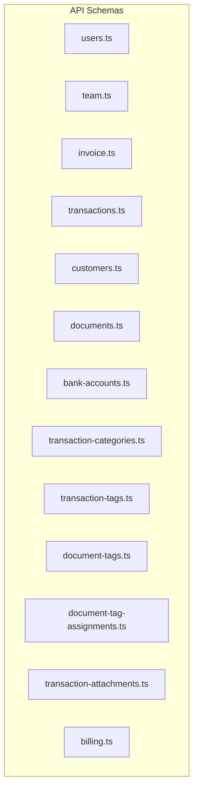
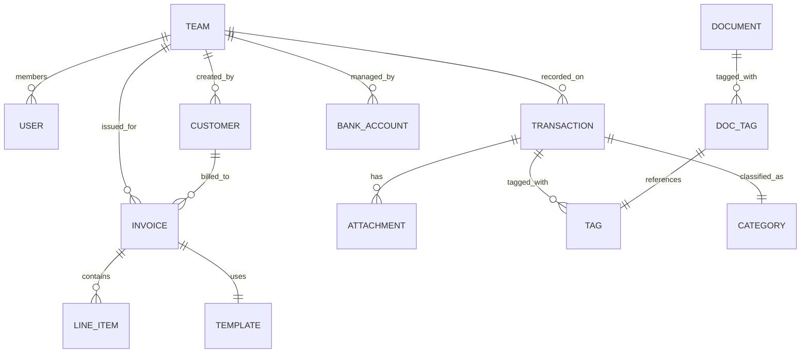
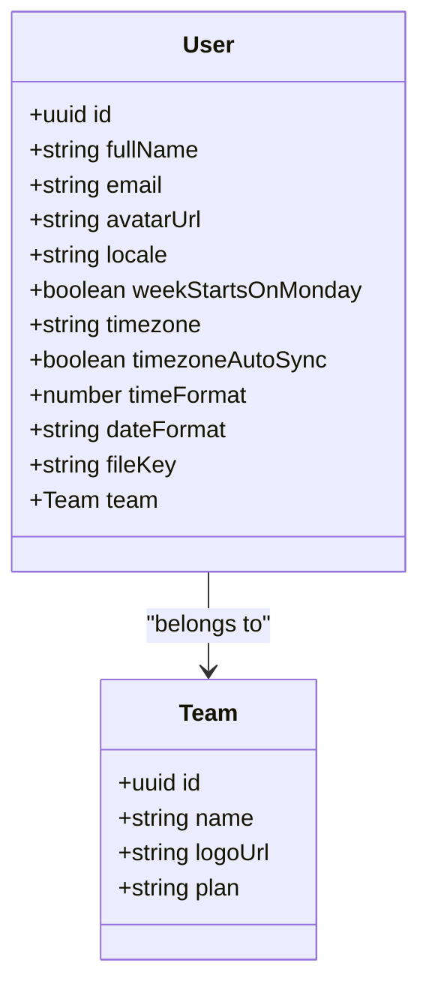
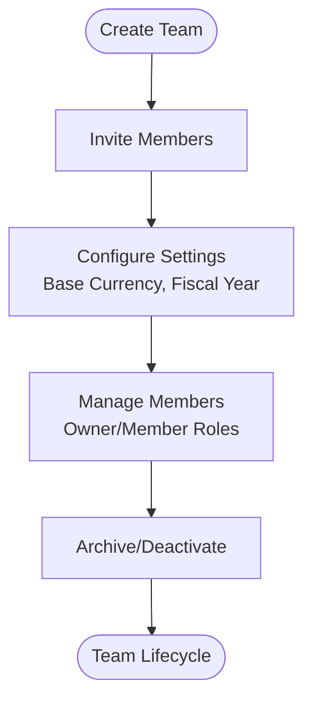
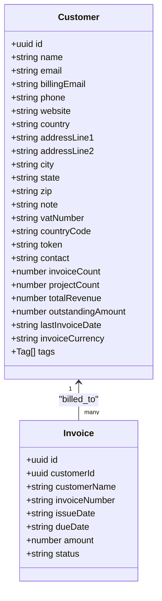
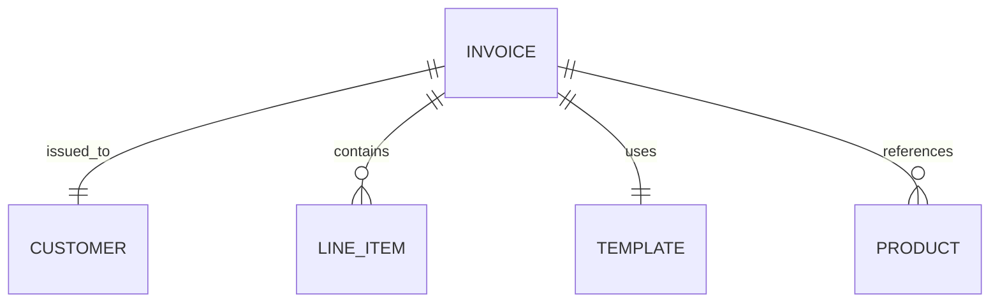
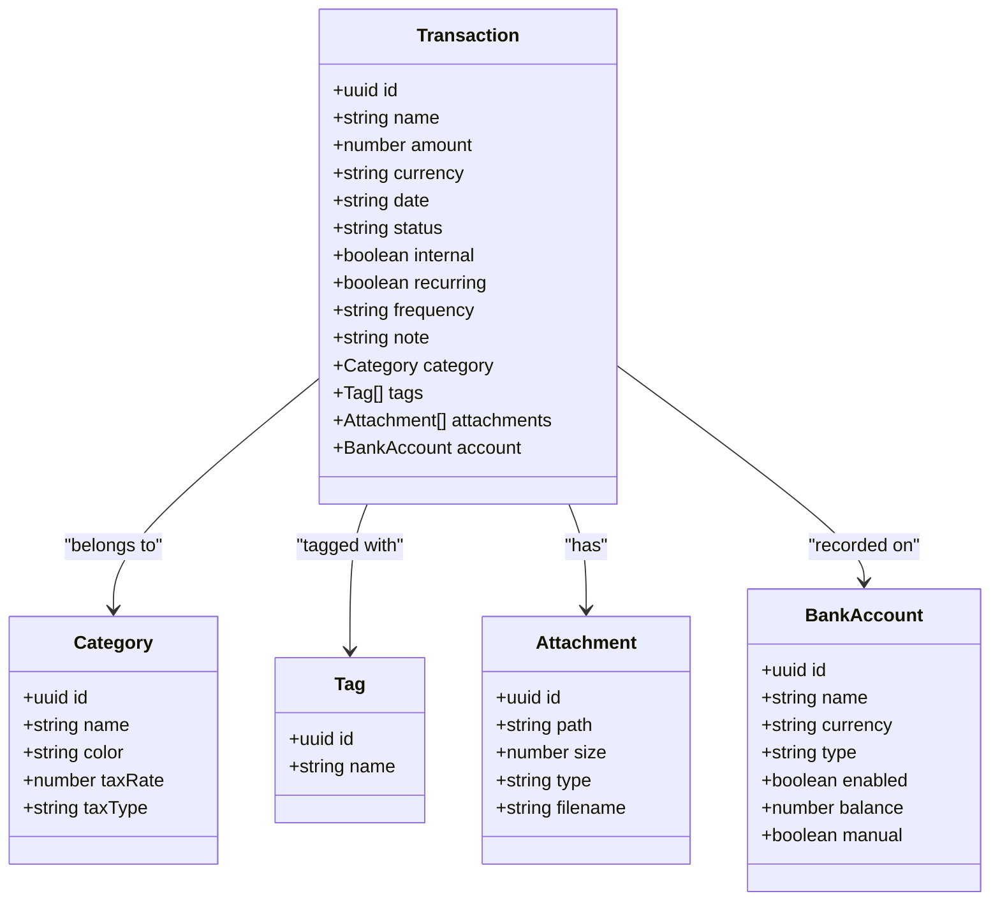
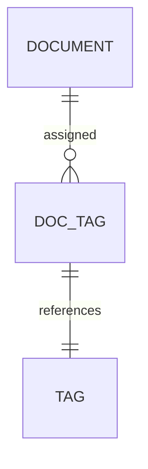
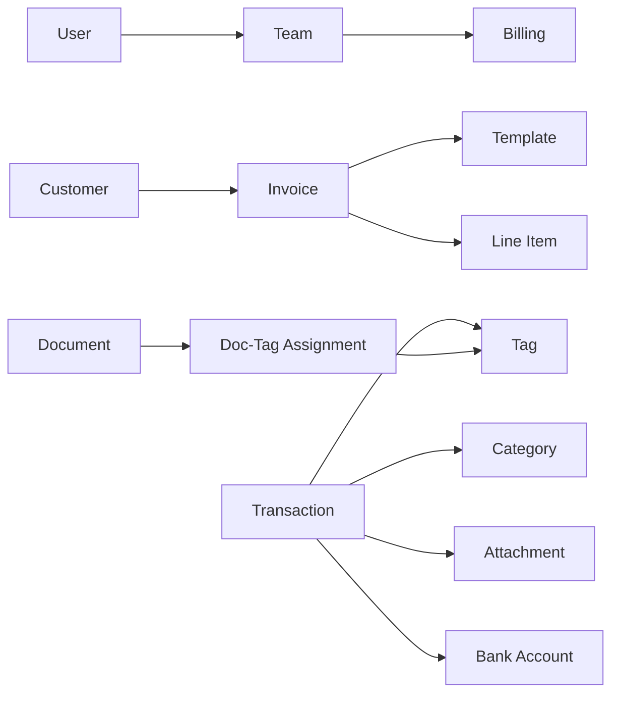

# Entity Relationship Model

<cite>
**Referenced Files in This Document**
- [users.ts](file://midday/apps/api/src/schemas/users.ts)
- [team.ts](file://midday/apps/api/src/schemas/team.ts)
- [invoice.ts](file://midday/apps/api/src/schemas/invoice.ts)
- [transactions.ts](file://midday/apps/api/src/schemas/transactions.ts)
- [customers.ts](file://midday/apps/api/src/schemas/customers.ts)
- [documents.ts](file://midday/apps/api/src/schemas/documents.ts)
- [bank-accounts.ts](file://midday/apps/api/src/schemas/bank-accounts.ts)
- [transaction-categories.ts](file://midday/apps/api/src/schemas/transaction-categories.ts)
- [transaction-tags.ts](file://midday/apps/api/src/schemas/transaction-tags.ts)
- [document-tag-assignments.ts](file://midday/apps/api/src/schemas/document-tag-assignments.ts)
- [document-tags.ts](file://midday/apps/api/src/schemas/document-tags.ts)
- [transaction-attachments.ts](file://midday/apps/api/src/schemas/transaction-attachments.ts)
- [billing.ts](file://midday/apps/api/src/schemas/billing.ts)
</cite>

## Table of Contents
1. [Introduction](#introduction)
2. [Project Structure](#project-structure)
3. [Core Components](#core-components)
4. [Architecture Overview](#architecture-overview)
5. [Detailed Component Analysis](#detailed-component-analysis)
6. [Dependency Analysis](#dependency-analysis)
7. [Performance Considerations](#performance-considerations)
8. [Troubleshooting Guide](#troubleshooting-guide)
9. [Conclusion](#conclusion)
10. [Appendices](#appendices)

## Introduction
This document defines the entity relationship model for Faworra’s core business domains: Users, Teams, Invoices, Transactions, Customers, and Documents. It explains cardinalities, referential integrity, cascade behaviors, lifecycle management, soft deletion strategies, and data archival patterns. It also covers polymorphic associations, many-to-many relationships, and provides ER diagrams and practical query examples to support application workflows.

## Project Structure
The entity model is primarily defined via Zod OpenAPI schemas under the API application. These schemas encode:
- Entity shapes and attributes
- Validation rules and constraints
- Pagination and filtering parameters
- Enumerations and typed relations

**Diagram sources**
- [users.ts](file://midday/apps/api/src/schemas/users.ts#L1-L156)
- [team.ts](file://midday/apps/api/src/schemas/team.ts#L1-L340)
- [invoice.ts](file://midday/apps/api/src/schemas/invoice.ts#L1-L800)
- [transactions.ts](file://midday/apps/api/src/schemas/transactions.ts#L1-L800)
- [customers.ts](file://midday/apps/api/src/schemas/customers.ts#L1-L513)
- [documents.ts](file://midday/apps/api/src/schemas/documents.ts#L1-L269)
- [bank-accounts.ts](file://midday/apps/api/src/schemas/bank-accounts.ts#L1-L193)
- [transaction-categories.ts](file://midday/apps/api/src/schemas/transaction-categories.ts#L1-L47)
- [transaction-tags.ts](file://midday/apps/api/src/schemas/transaction-tags.ts#L1-L12)
- [document-tags.ts](file://midday/apps/api/src/schemas/document-tags.ts#L1-L10)
- [document-tag-assignments.ts](file://midday/apps/api/src/schemas/document-tag-assignments.ts#L1-L12)
- [transaction-attachments.ts](file://midday/apps/api/src/schemas/transaction-attachments.ts#L1-L22)
- [billing.ts](file://midday/apps/api/src/schemas/billing.ts#L1-L37)

**Section sources**
- [users.ts](file://midday/apps/api/src/schemas/users.ts#L1-L156)
- [team.ts](file://midday/apps/api/src/schemas/team.ts#L1-L340)
- [invoice.ts](file://midday/apps/api/src/schemas/invoice.ts#L1-L800)
- [transactions.ts](file://midday/apps/api/src/schemas/transactions.ts#L1-L800)
- [customers.ts](file://midday/apps/api/src/schemas/customers.ts#L1-L513)
- [documents.ts](file://midday/apps/api/src/schemas/documents.ts#L1-L269)
- [bank-accounts.ts](file://midday/apps/api/src/schemas/bank-accounts.ts#L1-L193)
- [transaction-categories.ts](file://midday/apps/api/src/schemas/transaction-categories.ts#L1-L47)
- [transaction-tags.ts](file://midday/apps/api/src/schemas/transaction-tags.ts#L1-L12)
- [document-tags.ts](file://midday/apps/api/src/schemas/document-tags.ts#L1-L10)
- [document-tag-assignments.ts](file://midday/apps/api/src/schemas/document-tag-assignments.ts#L1-L12)
- [transaction-attachments.ts](file://midday/apps/api/src/schemas/transaction-attachments.ts#L1-L22)
- [billing.ts](file://midday/apps/api/src/schemas/billing.ts#L1-L37)

## Core Components
- Users: Individual actors with personal preferences and team membership.
- Team: Organizational container with billing and settings.
- Customers: Business partners with billing contacts and enrichment metadata.
- Invoices: Financial obligations with templates, line items, and status.
- Transactions: Bank/financial movements with categories, tags, attachments, and status.
- Documents: Stored artifacts with metadata and processing status.
- Bank Accounts: Financial account records tied to transactions.
- Categories and Tags: Taxonomic structures for categorization and tagging.

**Section sources**
- [users.ts](file://midday/apps/api/src/schemas/users.ts#L72-L156)
- [team.ts](file://midday/apps/api/src/schemas/team.ts#L3-L35)
- [customers.ts](file://midday/apps/api/src/schemas/customers.ts#L63-L279)
- [invoice.ts](file://midday/apps/api/src/schemas/invoice.ts#L407-L479)
- [transactions.ts](file://midday/apps/api/src/schemas/transactions.ts#L245-L479)
- [documents.ts](file://midday/apps/api/src/schemas/documents.ts#L162-L218)
- [bank-accounts.ts](file://midday/apps/api/src/schemas/bank-accounts.ts#L31-L83)

## Architecture Overview
The system centers around a Team-scoped model where Users belong to Teams. Invoices and Transactions are often associated with Customers. Documents support both financial and administrative workflows. Categories and Tags provide flexible taxonomy for Transactions and Documents.

**Diagram sources**
- [team.ts](file://midday/apps/api/src/schemas/team.ts#L3-L35)
- [users.ts](file://midday/apps/api/src/schemas/users.ts#L132-L151)
- [customers.ts](file://midday/apps/api/src/schemas/customers.ts#L63-L135)
- [invoice.ts](file://midday/apps/api/src/schemas/invoice.ts#L407-L479)
- [transactions.ts](file://midday/apps/api/src/schemas/transactions.ts#L245-L479)
- [bank-accounts.ts](file://midday/apps/api/src/schemas/bank-accounts.ts#L31-L83)
- [transaction-attachments.ts](file://midday/apps/api/src/schemas/transaction-attachments.ts#L1-L22)
- [transaction-tags.ts](file://midday/apps/api/src/schemas/transaction-tags.ts#L1-L12)
- [transaction-categories.ts](file://midday/apps/api/src/schemas/transaction-categories.ts#L1-L47)
- [document-tags.ts](file://midday/apps/api/src/schemas/document-tags.ts#L1-L10)
- [document-tag-assignments.ts](file://midday/apps/api/src/schemas/document-tag-assignments.ts#L1-L12)
- [documents.ts](file://midday/apps/api/src/schemas/documents.ts#L162-L218)

## Detailed Component Analysis

### Users
- Attributes: identity, profile, localization, and team membership.
- Relationship: belongs to Team (one-to-one via team object).
- Lifecycle: created during onboarding; can switch teams; profile updates supported.

**Diagram sources**
- [users.ts](file://midday/apps/api/src/schemas/users.ts#L72-L156)
- [team.ts](file://midday/apps/api/src/schemas/team.ts#L3-L35)

**Section sources**
- [users.ts](file://midday/apps/api/src/schemas/users.ts#L1-L156)
- [team.ts](file://midday/apps/api/src/schemas/team.ts#L1-L340)

### Team
- Attributes: branding, billing plan, settings, and metadata.
- Lifecycle: created by owner; members invited; settings updated; deletion handled via dedicated schema.
- Billing: checkout and cancellation flows defined.

**Diagram sources**
- [team.ts](file://midday/apps/api/src/schemas/team.ts#L154-L221)
- [team.ts](file://midday/apps/api/src/schemas/team.ts#L244-L260)
- [billing.ts](file://midday/apps/api/src/schemas/billing.ts#L10-L36)

**Section sources**
- [team.ts](file://midday/apps/api/src/schemas/team.ts#L1-L340)
- [billing.ts](file://midday/apps/api/src/schemas/billing.ts#L1-L37)

### Customers
- Attributes: contact info, billing emails, address, enrichment metadata, tags.
- Cardinality: one-to-many with Invoices.
- Lifecycle: upsert, enrich, portal enable/disable, invoice summary aggregation.

**Diagram sources**
- [customers.ts](file://midday/apps/api/src/schemas/customers.ts#L63-L279)
- [invoice.ts](file://midday/apps/api/src/schemas/invoice.ts#L407-L479)

**Section sources**
- [customers.ts](file://midday/apps/api/src/schemas/customers.ts#L1-L513)
- [invoice.ts](file://midday/apps/api/src/schemas/invoice.ts#L1-L800)

### Invoices
- Templates: reusable sender/payment details with localization and rendering hints.
- Line Items: products/services with pricing, taxes, quantities.
- Statuses: draft, scheduled, paid, canceled, overdue.
- Associations: Customer, Products, Templates.

**Diagram sources**
- [invoice.ts](file://midday/apps/api/src/schemas/invoice.ts#L407-L479)
- [invoice.ts](file://midday/apps/api/src/schemas/invoice.ts#L480-L518)
- [invoice.ts](file://midday/apps/api/src/schemas/invoice.ts#L420-L448)

**Section sources**
- [invoice.ts](file://midday/apps/api/src/schemas/invoice.ts#L1-L800)

### Transactions
- Attributes: name, amount, currency, date, category, status, tags, attachments.
- Statuses: pending, archived, completed, posted, excluded, exported.
- Associations: Bank Account, Category, Tags, Attachments.

**Diagram sources**
- [transactions.ts](file://midday/apps/api/src/schemas/transactions.ts#L245-L479)
- [transaction-categories.ts](file://midday/apps/api/src/schemas/transaction-categories.ts#L1-L47)
- [transaction-tags.ts](file://midday/apps/api/src/schemas/transaction-tags.ts#L1-L12)
- [transaction-attachments.ts](file://midday/apps/api/src/schemas/transaction-attachments.ts#L1-L22)
- [bank-accounts.ts](file://midday/apps/api/src/schemas/bank-accounts.ts#L31-L83)

**Section sources**
- [transactions.ts](file://midday/apps/api/src/schemas/transactions.ts#L1-L800)
- [transaction-categories.ts](file://midday/apps/api/src/schemas/transaction-categories.ts#L1-L47)
- [transaction-tags.ts](file://midday/apps/api/src/schemas/transaction-tags.ts#L1-L12)
- [transaction-attachments.ts](file://midday/apps/api/src/schemas/transaction-attachments.ts#L1-L22)
- [bank-accounts.ts](file://midday/apps/api/src/schemas/bank-accounts.ts#L1-L193)

### Documents
- Attributes: title, path tokens, metadata, processing status, summary, date.
- Lifecycle: upload, process, reprocess, presigned URL generation, tag assignment.
- Many-to-many with Tags via assignments.

**Diagram sources**
- [documents.ts](file://midday/apps/api/src/schemas/documents.ts#L162-L218)
- [document-tags.ts](file://midday/apps/api/src/schemas/document-tags.ts#L1-L10)
- [document-tag-assignments.ts](file://midday/apps/api/src/schemas/document-tag-assignments.ts#L1-L12)

**Section sources**
- [documents.ts](file://midday/apps/api/src/schemas/documents.ts#L1-L269)
- [document-tags.ts](file://midday/apps/api/src/schemas/document-tags.ts#L1-L10)
- [document-tag-assignments.ts](file://midday/apps/api/src/schemas/document-tag-assignments.ts#L1-L12)

## Dependency Analysis
- Users depend on Team membership.
- Invoices depend on Customers and Templates.
- Transactions depend on Categories, Tags, Attachments, and Bank Accounts.
- Documents depend on Tags via assignments.
- Billing integrates with Team plan management.

**Diagram sources**
- [users.ts](file://midday/apps/api/src/schemas/users.ts#L132-L151)
- [team.ts](file://midday/apps/api/src/schemas/team.ts#L3-L35)
- [customers.ts](file://midday/apps/api/src/schemas/customers.ts#L63-L135)
- [invoice.ts](file://midday/apps/api/src/schemas/invoice.ts#L407-L479)
- [transactions.ts](file://midday/apps/api/src/schemas/transactions.ts#L245-L479)
- [transaction-categories.ts](file://midday/apps/api/src/schemas/transaction-categories.ts#L1-L47)
- [transaction-tags.ts](file://midday/apps/api/src/schemas/transaction-tags.ts#L1-L12)
- [transaction-attachments.ts](file://midday/apps/api/src/schemas/transaction-attachments.ts#L1-L22)
- [bank-accounts.ts](file://midday/apps/api/src/schemas/bank-accounts.ts#L31-L83)
- [documents.ts](file://midday/apps/api/src/schemas/documents.ts#L162-L218)
- [document-tags.ts](file://midday/apps/api/src/schemas/document-tags.ts#L1-L10)
- [document-tag-assignments.ts](file://midday/apps/api/src/schemas/document-tag-assignments.ts#L1-L12)
- [billing.ts](file://midday/apps/api/src/schemas/billing.ts#L10-L36)

**Section sources**
- [users.ts](file://midday/apps/api/src/schemas/users.ts#L1-L156)
- [team.ts](file://midday/apps/api/src/schemas/team.ts#L1-L340)
- [customers.ts](file://midday/apps/api/src/schemas/customers.ts#L1-L513)
- [invoice.ts](file://midday/apps/api/src/schemas/invoice.ts#L1-L800)
- [transactions.ts](file://midday/apps/api/src/schemas/transactions.ts#L1-L800)
- [documents.ts](file://midday/apps/api/src/schemas/documents.ts#L1-L269)
- [bank-accounts.ts](file://midday/apps/api/src/schemas/bank-accounts.ts#L1-L193)
- [transaction-categories.ts](file://midday/apps/api/src/schemas/transaction-categories.ts#L1-L47)
- [transaction-tags.ts](file://midday/apps/api/src/schemas/transaction-tags.ts#L1-L12)
- [document-tags.ts](file://midday/apps/api/src/schemas/document-tags.ts#L1-L10)
- [document-tag-assignments.ts](file://midday/apps/api/src/schemas/document-tag-assignments.ts#L1-L12)
- [billing.ts](file://midday/apps/api/src/schemas/billing.ts#L1-L37)

## Performance Considerations
- Pagination and filtering: Use cursor-based pagination and indexed filters for large lists (Customers, Transactions, Documents).
- Indexing recommendations:
  - Transactions: date, status, categorySlug, bankAccountId, assignedId, tags.
  - Invoices: customerId, issueDate, dueDate, status, invoiceNumber.
  - Customers: name, email, createdAt.
  - Documents: processingStatus, date, tags.
- Aggregation queries: Precompute metrics (e.g., totals, counts) at the edge or in materialized views to reduce runtime joins.
- Attachments: Store references and compute presigned URLs on demand to avoid heavy payloads in listings.

[No sources needed since this section provides general guidance]

## Troubleshooting Guide
- Validation failures: Ensure enums and formats match schema constraints (timezones, currencies, dates).
- Missing relationships: Verify foreign keys (customerId on invoices, bankAccountId on transactions).
- Attachment processing: Confirm attachment paths and types align with transaction-attachment schemas.
- Tagging: Validate many-to-many assignments exist before querying tagged entities.

**Section sources**
- [transactions.ts](file://midday/apps/api/src/schemas/transactions.ts#L552-L622)
- [transaction-attachments.ts](file://midday/apps/api/src/schemas/transaction-attachments.ts#L1-L22)
- [transaction-tags.ts](file://midday/apps/api/src/schemas/transaction-tags.ts#L1-L12)
- [document-tag-assignments.ts](file://midday/apps/api/src/schemas/document-tag-assignments.ts#L1-L12)

## Conclusion
The entity model emphasizes Team scoping, clear ownership boundaries, and flexible taxonomy via Categories and Tags. Invoices and Transactions form the financial backbone, while Documents support auditability and integrations. Robust validation and pagination schemas ensure predictable performance and UX.

[No sources needed since this section summarizes without analyzing specific files]

## Appendices

### Entity Lifecycle Management
- Users: Onboarding, profile updates, team switching.
- Team: Creation, member management, settings updates, deletion.
- Customers: Upsert, enrich, portal enable/disable, invoice summary.
- Invoices: Create/update/schedule/cancel/duplicate; status transitions.
- Transactions: Create/update, categorize, tag, attach receipts, status transitions.
- Documents: Upload/process/reprocess, presigned URL access, tag assignment.

**Section sources**
- [users.ts](file://midday/apps/api/src/schemas/users.ts#L1-L156)
- [team.ts](file://midday/apps/api/src/schemas/team.ts#L154-L260)
- [customers.ts](file://midday/apps/api/src/schemas/customers.ts#L378-L475)
- [invoice.ts](file://midday/apps/api/src/schemas/invoice.ts#L686-L724)
- [transactions.ts](file://midday/apps/api/src/schemas/transactions.ts#L748-L797)
- [documents.ts](file://midday/apps/api/src/schemas/documents.ts#L103-L143)

### Soft Deletion and Archival Patterns
- Transactions support archival and exclusion statuses; consider archiving old entries for compliance.
- Documents can be marked processed/archived; implement retention policies at the storage layer.
- Invoices can be canceled; maintain historical copies for reporting.

**Section sources**
- [transactions.ts](file://midday/apps/api/src/schemas/transactions.ts#L581-L622)
- [documents.ts](file://midday/apps/api/src/schemas/documents.ts#L191-L203)
- [invoice.ts](file://midday/apps/api/src/schemas/invoice.ts#L676-L684)

### Relationship Queries and Join Patterns
- List invoices for a customer with totals and status counts.
- Fetch transactions with category, tags, and attachments for a given period.
- Retrieve documents tagged with specific tags and filtered by date range.
- Join customer enrichment data with invoice summaries for dashboards.

[No sources needed since this section provides general guidance]

### Practical Examples
- Example: “Get all invoices for a customer in the last quarter.”
- Example: “List transactions with category ‘Office Supplies’ and attachments.”
- Example: “Fetch documents processed in Q1 with tag ‘Receipts’.”

[No sources needed since this section provides general guidance]