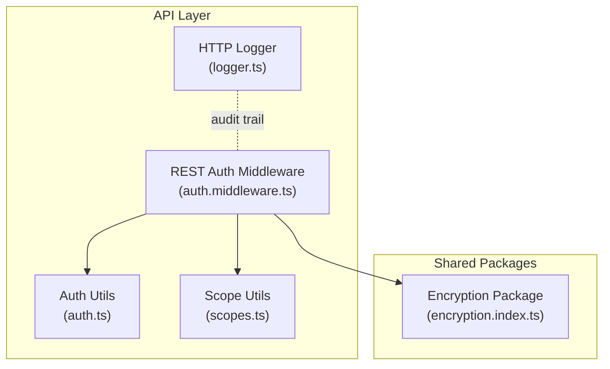
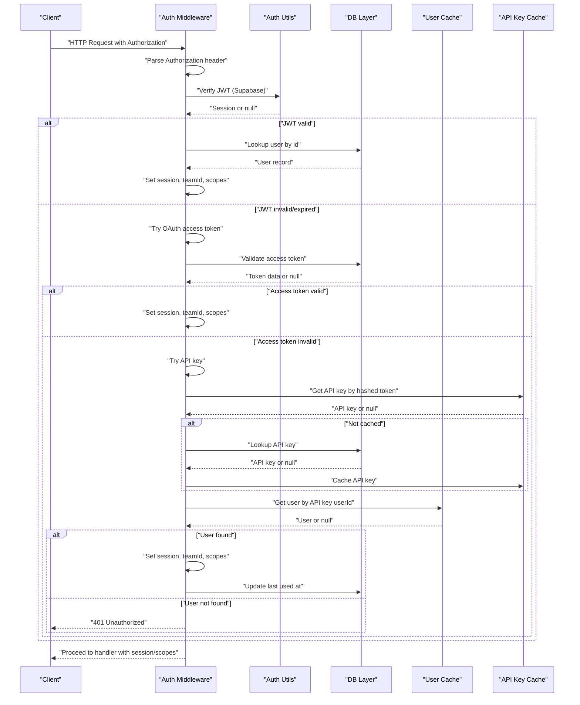
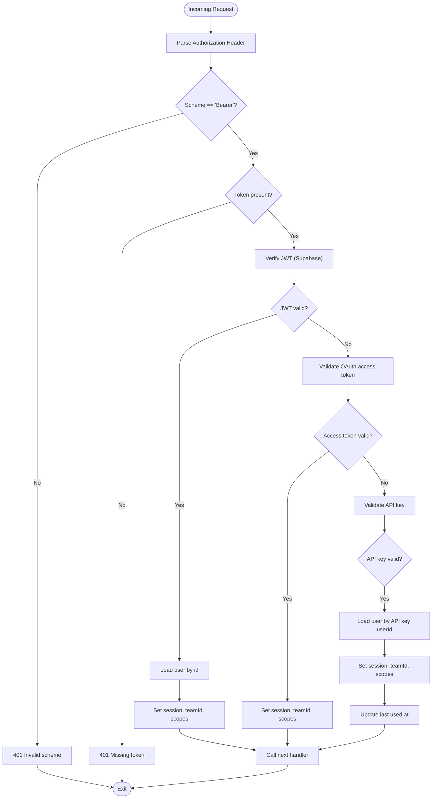
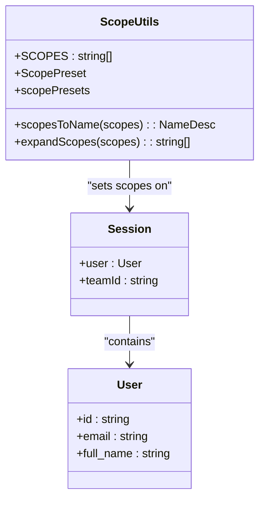
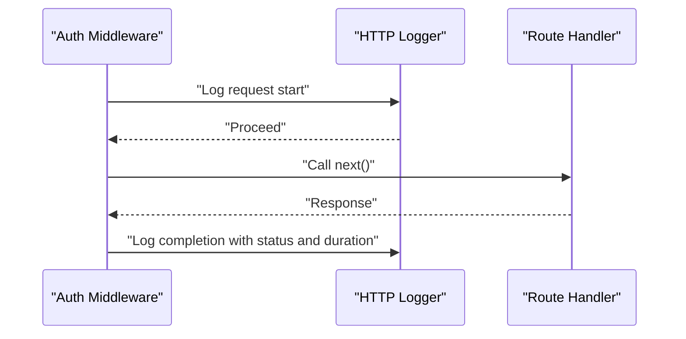
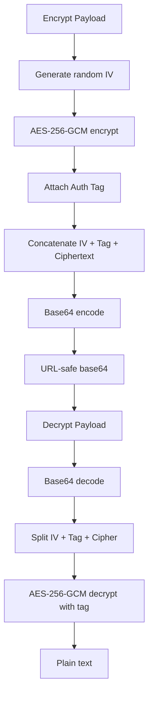
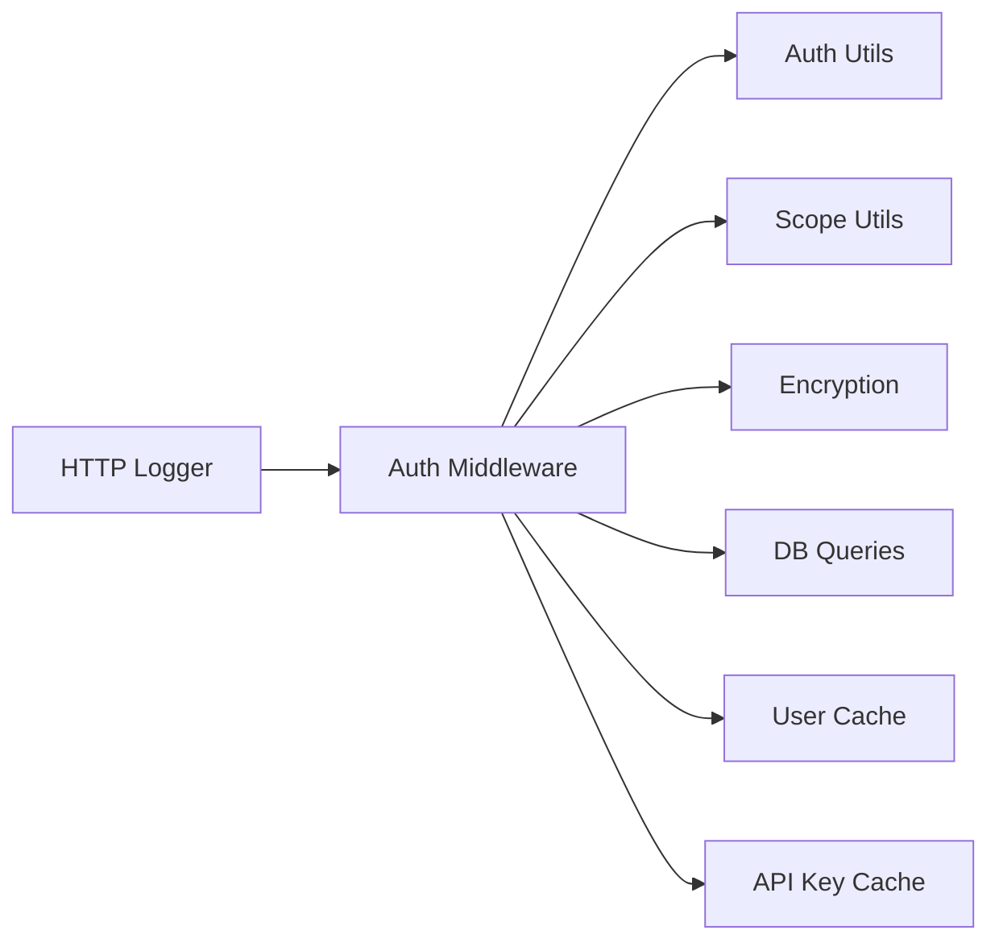

# Validation & Security Rules

<cite>
**Referenced Files in This Document**
- [auth.ts](file://midday/apps/api/src/utils/auth.ts)
- [scopes.ts](file://midday/apps/api/src/utils/scopes.ts)
- [auth.middleware.ts](file://midday/apps/api/src/rest/middleware/auth.ts)
- [logger.ts](file://midday/apps/api/src/utils/logger.ts)
- [encryption.index.ts](file://midday/packages/encryption/src/index.ts)
</cite>

## Table of Contents
1. [Introduction](#introduction)
2. [Project Structure](#project-structure)
3. [Core Components](#core-components)
4. [Architecture Overview](#architecture-overview)
5. [Detailed Component Analysis](#detailed-component-analysis)
6. [Dependency Analysis](#dependency-analysis)
7. [Performance Considerations](#performance-considerations)
8. [Troubleshooting Guide](#troubleshooting-guide)
9. [Conclusion](#conclusion)
10. [Appendices](#appendices)

## Introduction
This document details Faworra’s data validation and security rule implementation across authentication, authorization, scope-based access control, encryption, and observability. It explains how input validation schemas, business rule enforcement, and data sanitization are applied, along with permission checks, scope expansion, and authorization patterns. It also covers security measures such as data encryption, sensitive field protection, and audit logging, alongside rate limiting mechanisms, input sanitization, and protection against injection attacks. Guidance is provided for validation error handling, user feedback patterns, and graceful degradation strategies, as well as data privacy compliance considerations and secure data handling practices.

## Project Structure
Faworra’s validation and security logic is primarily implemented in the API application and shared packages:
- Authentication utilities and session parsing
- Authorization scopes and presets
- Request authentication middleware
- Audit logging middleware
- Encryption utilities for OAuth state, file keys, and hashing

**Diagram sources**
- [auth.middleware.ts](file://midday/apps/api/src/rest/middleware/auth.ts#L1-L152)
- [auth.ts](file://midday/apps/api/src/utils/auth.ts#L1-L44)
- [scopes.ts](file://midday/apps/api/src/utils/scopes.ts#L1-L96)
- [logger.ts](file://midday/apps/api/src/utils/logger.ts#L1-L33)
- [encryption.index.ts](file://midday/packages/encryption/src/index.ts#L1-L220)

**Section sources**
- [auth.middleware.ts](file://midday/apps/api/src/rest/middleware/auth.ts#L1-L152)
- [auth.ts](file://midday/apps/api/src/utils/auth.ts#L1-L44)
- [scopes.ts](file://midday/apps/api/src/utils/scopes.ts#L1-L96)
- [logger.ts](file://midday/apps/api/src/utils/logger.ts#L1-L33)
- [encryption.index.ts](file://midday/packages/encryption/src/index.ts#L1-L220)

## Core Components
- Authentication and session extraction:
  - Validates Authorization header format and token scheme.
  - Supports Supabase JWT tokens, OAuth access tokens, and API keys.
  - Populates session context and sets teamId and scopes.
- Authorization scopes:
  - Defines resource-scoped permissions and presets.
  - Expands wildcard scopes into concrete permissions.
- Audit logging:
  - Logs incoming requests and completion with timing and correlation identifiers.
- Encryption utilities:
  - AES-256-GCM encryption/decryption for sensitive payloads.
  - URL-safe base64 encoding/decoding for OAuth state.
  - Hashing for API key storage and lookup.
  - Compact JWT-based file keys with expiration and grace period.

**Section sources**
- [auth.middleware.ts](file://midday/apps/api/src/rest/middleware/auth.ts#L16-L151)
- [auth.ts](file://midday/apps/api/src/utils/auth.ts#L20-L42)
- [scopes.ts](file://midday/apps/api/src/utils/scopes.ts#L1-L96)
- [logger.ts](file://midday/apps/api/src/utils/logger.ts#L5-L32)
- [encryption.index.ts](file://midday/packages/encryption/src/index.ts#L17-L220)

## Architecture Overview
The authentication pipeline validates tokens, resolves sessions, and enforces scope-based authorization. Audit logging captures request lifecycle for observability. Encryption utilities protect sensitive data and enable secure file access.

**Diagram sources**
- [auth.middleware.ts](file://midday/apps/api/src/rest/middleware/auth.ts#L16-L151)
- [auth.ts](file://midday/apps/api/src/utils/auth.ts#L20-L42)

## Detailed Component Analysis

### Authentication and Token Validation
- Header parsing:
  - Enforces “Bearer” scheme and presence of token.
  - Rejects malformed headers with explicit 401 responses.
- Supabase JWT verification:
  - Uses configured JWT secret to verify signature.
  - Extracts subject and user metadata to build session.
  - Grants broad scopes for authenticated users via Supabase.
- OAuth access tokens:
  - Recognizes prefixed access tokens and validates against DB.
  - Attaches application context and resolved scopes.
- API key validation:
  - Validates format and hashes token for cache/DB lookup.
  - Caches API key and user records to reduce DB load.
  - Updates last-used timestamp upon successful validation.

**Diagram sources**
- [auth.middleware.ts](file://midday/apps/api/src/rest/middleware/auth.ts#L16-L151)
- [auth.ts](file://midday/apps/api/src/utils/auth.ts#L20-L42)

**Section sources**
- [auth.middleware.ts](file://midday/apps/api/src/rest/middleware/auth.ts#L16-L151)
- [auth.ts](file://midday/apps/api/src/utils/auth.ts#L20-L42)

### Authorization Scopes and Presets
- Scope catalog:
  - Resource-specific read/write scopes for multiple domains (e.g., bank accounts, customers, invoices, transactions, users, notifications).
  - Wildcard scopes for blanket read or write access.
- Presets:
  - “All access”, “Read only”, and “Restricted” presets mapped to expanded scope sets.
- Expansion logic:
  - Wildcards expand to concrete scopes; custom scopes exclude wildcard markers.

**Diagram sources**
- [scopes.ts](file://midday/apps/api/src/utils/scopes.ts#L1-L96)
- [auth.middleware.ts](file://midday/apps/api/src/rest/middleware/auth.ts#L56-L94)

**Section sources**
- [scopes.ts](file://midday/apps/api/src/utils/scopes.ts#L1-L96)
- [auth.middleware.ts](file://midday/apps/api/src/rest/middleware/auth.ts#L56-L94)

### Audit Logging and Observability
- HTTP logger:
  - Captures method, path, and correlation identifiers.
  - Logs request start and completion with duration and status code.
  - Provides structured logs for downstream analysis.

**Diagram sources**
- [logger.ts](file://midday/apps/api/src/utils/logger.ts#L5-L32)
- [auth.middleware.ts](file://midday/apps/api/src/rest/middleware/auth.ts#L16-L151)

**Section sources**
- [logger.ts](file://midday/apps/api/src/utils/logger.ts#L5-L32)

### Data Encryption and Sensitive Field Protection
- OAuth state encryption:
  - Encrypts JSON-serializable state payloads using AES-256-GCM.
  - Encodes output as URL-safe base64 for transport.
  - Decrypts and validates with optional validator function.
- General-purpose encryption/decryption:
  - Requires a 64-character hex key environment variable.
  - Concatenates IV, auth tag, and ciphertext; base64 encodes the result.
- Hashing:
  - SHA-256 hashing for API key storage and lookup.
- File key generation and verification:
  - Generates compact JWTs for team file access with 30-day expiry.
  - Verifies with a configurable clock tolerance for grace period.

**Diagram sources**
- [encryption.index.ts](file://midday/packages/encryption/src/index.ts#L112-L171)

**Section sources**
- [encryption.index.ts](file://midday/packages/encryption/src/index.ts#L17-L220)

## Dependency Analysis
- Authentication middleware depends on:
  - Auth utilities for JWT verification.
  - Scope utilities for expanding permissions.
  - Encryption utilities for hashing API keys and validating OAuth state.
  - Caches and DB queries for API key and user resolution.
- Audit logging is orthogonal and integrates around middleware boundaries.

**Diagram sources**
- [auth.middleware.ts](file://midday/apps/api/src/rest/middleware/auth.ts#L1-L152)
- [auth.ts](file://midday/apps/api/src/utils/auth.ts#L1-L44)
- [scopes.ts](file://midday/apps/api/src/utils/scopes.ts#L1-L96)
- [encryption.index.ts](file://midday/packages/encryption/src/index.ts#L1-L220)
- [logger.ts](file://midday/apps/api/src/utils/logger.ts#L1-L33)

**Section sources**
- [auth.middleware.ts](file://midday/apps/api/src/rest/middleware/auth.ts#L1-L152)
- [auth.ts](file://midday/apps/api/src/utils/auth.ts#L1-L44)
- [scopes.ts](file://midday/apps/api/src/utils/scopes.ts#L1-L96)
- [encryption.index.ts](file://midday/packages/encryption/src/index.ts#L1-L220)
- [logger.ts](file://midday/apps/api/src/utils/logger.ts#L1-L33)

## Performance Considerations
- Caching:
  - API key and user records are cached to reduce repeated DB lookups during authentication.
- Token hashing:
  - API key tokens are hashed before DB lookup to accelerate retrieval.
- Encryption overhead:
  - Encryption/decryption occurs on demand; avoid unnecessary re-encryption of stable state.
- Logging cost:
  - Structured logging is lightweight; ensure log levels and sampling are tuned for production.

[No sources needed since this section provides general guidance]

## Troubleshooting Guide
- Authentication failures:
  - Missing or malformed Authorization header yields 401.
  - Invalid scheme or empty token yields 401.
  - JWT verification failures fall back to other token types.
  - Expired or invalid OAuth access tokens yield 401.
  - Invalid API key format or missing user yields 401.
- Scope issues:
  - Ensure scopes are expanded appropriately; wildcard scopes are translated to concrete permissions.
- Encryption errors:
  - Missing or improperly formatted environment variables cause immediate errors during encryption/decryption.
  - Invalid payloads or truncated data raise errors during decryption.
- Logging:
  - Verify correlation IDs and durations to diagnose slow endpoints.

**Section sources**
- [auth.middleware.ts](file://midday/apps/api/src/rest/middleware/auth.ts#L19-L31)
- [auth.middleware.ts](file://midday/apps/api/src/rest/middleware/auth.ts#L64-L71)
- [auth.middleware.ts](file://midday/apps/api/src/rest/middleware/auth.ts#L96-L98)
- [auth.middleware.ts](file://midday/apps/api/src/rest/middleware/auth.ts#L114-L116)
- [auth.ts](file://midday/apps/api/src/utils/auth.ts#L40-L42)
- [encryption.index.ts](file://midday/packages/encryption/src/index.ts#L94-L104)
- [encryption.index.ts](file://midday/packages/encryption/src/index.ts#L140-L151)
- [logger.ts](file://midday/apps/api/src/utils/logger.ts#L14-L30)

## Conclusion
Faworra’s validation and security model centers on robust authentication, granular scope-based authorization, and strong encryption for sensitive data. The middleware pipeline ensures consistent token validation, caching for performance, and structured audit logging. Encryption utilities safeguard OAuth state and file access tokens, while hashing protects API key storage. Together, these components provide a secure foundation for data handling, with clear extension points for additional validation schemas, rate limiting, and privacy controls.

[No sources needed since this section summarizes without analyzing specific files]

## Appendices

### Validation Scenarios and Secure Handling Practices
- OAuth state encryption:
  - Scenario: Redirect with state parameter.
  - Practice: Encrypt state payload before redirect; validate decrypted payload on callback.
- API key access:
  - Scenario: Third-party integrations using API keys.
  - Practice: Hash tokens for storage; cache resolved keys; update last-used timestamps.
- File access:
  - Scenario: Proxy/download links for team files.
  - Practice: Generate compact JWTs with expiry; accept recent expirations via grace period.
- Injection and sanitization:
  - Practice: Treat all external inputs as untrusted; sanitize and validate before persistence; escape output per context; avoid dynamic SQL construction.

[No sources needed since this section provides general guidance]