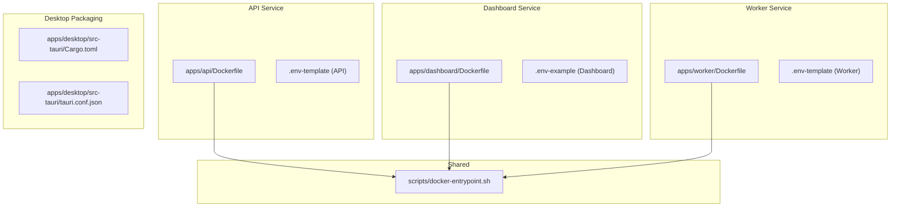
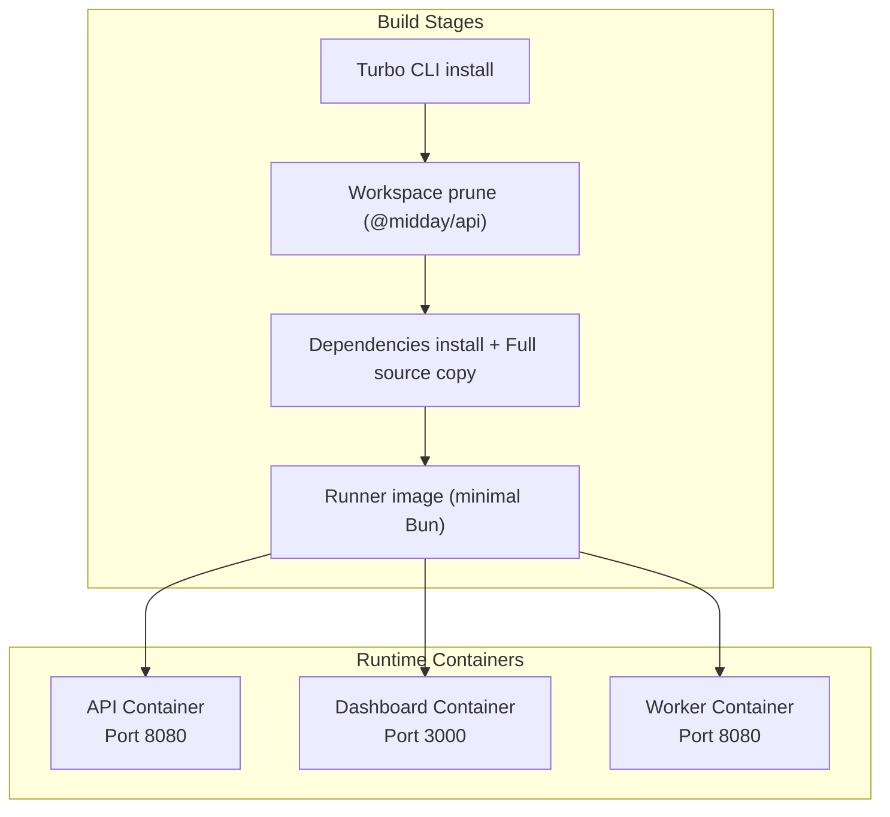
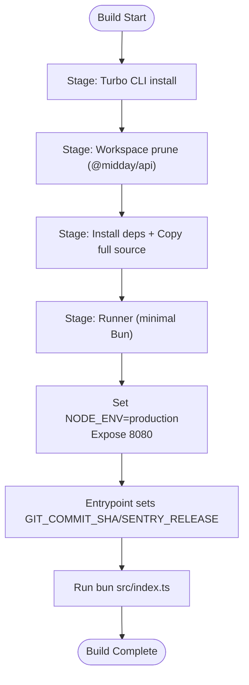
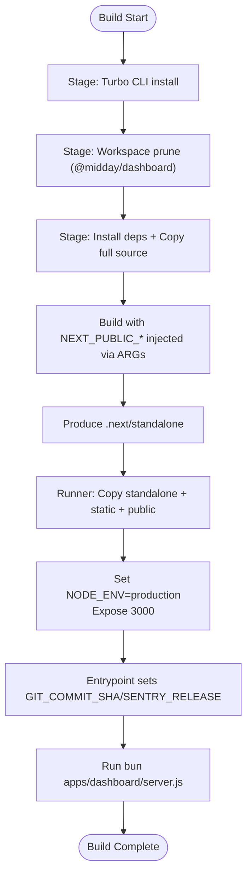
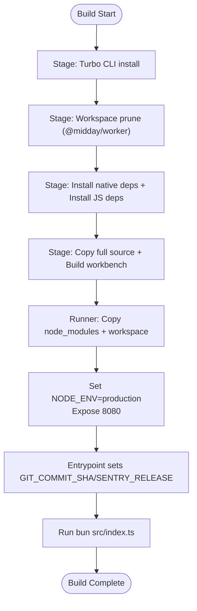
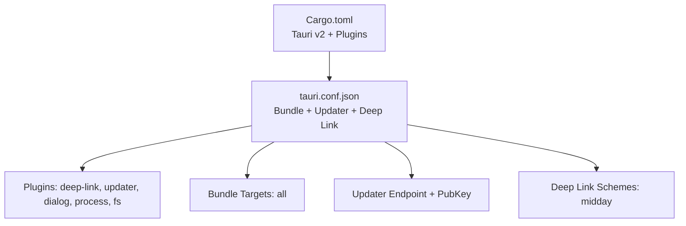
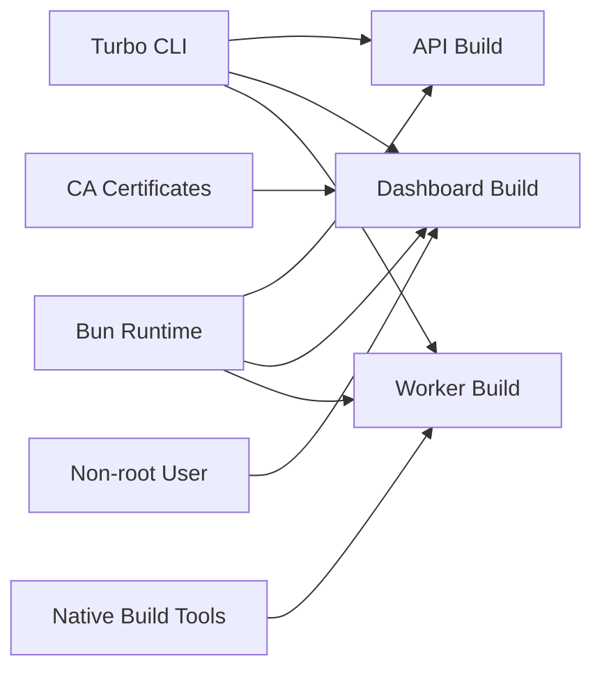

# Containerization & Packaging

<cite>
**Referenced Files in This Document**
- [Dockerfile](file://midday/apps/api/Dockerfile)
- [Dockerfile](file://midday/apps/dashboard/Dockerfile)
- [Dockerfile](file://midday/apps/worker/Dockerfile)
- [docker-entrypoint.sh](file://midday/scripts/docker-entrypoint.sh)
- [.env-template (API)](file://midday/apps/api/.env-template)
- [.env-example (Dashboard)](file://midday/apps/dashboard/.env-example)
- [.env-template (Worker)](file://midday/apps/worker/.env-template)
- [Cargo.toml](file://midday/apps/desktop/src-tauri/Cargo.toml)
- [tauri.conf.json](file://midday/apps/desktop/src-tauri/tauri.conf.json)
</cite>

## Table of Contents
1. [Introduction](#introduction)
2. [Project Structure](#project-structure)
3. [Core Components](#core-components)
4. [Architecture Overview](#architecture-overview)
5. [Detailed Component Analysis](#detailed-component-analysis)
6. [Dependency Analysis](#dependency-analysis)
7. [Performance Considerations](#performance-considerations)
8. [Troubleshooting Guide](#troubleshooting-guide)
9. [Conclusion](#conclusion)
10. [Appendices](#appendices)

## Introduction
This document explains how Faworra applications are containerized and packaged for deployment and distribution. It covers:
- Multi-stage Docker builds for the API, Dashboard, and Worker services
- Dependency management, build-time secrets, and runtime environment handling
- Security considerations for containers and desktop packaging
- Environment variable management and volume mounting strategies
- Container networking and inter-service communication
- Desktop application packaging using Tauri and Rust
- Recommendations for health checks, resource limits, and operational best practices

## Project Structure
The repository organizes containerization artifacts per service under midday/apps/<service>, with shared entrypoint logic and per-service environment templates.

**Diagram sources**
- [Dockerfile](file://midday/apps/api/Dockerfile#L1-L50)
- [Dockerfile](file://midday/apps/dashboard/Dockerfile#L1-L101)
- [Dockerfile](file://midday/apps/worker/Dockerfile#L1-L62)
- [docker-entrypoint.sh](file://midday/scripts/docker-entrypoint.sh#L1-L13)
- [Cargo.toml](file://midday/apps/desktop/src-tauri/Cargo.toml#L1-L40)
- [tauri.conf.json](file://midday/apps/desktop/src-tauri/tauri.conf.json#L1-L46)

**Section sources**
- [Dockerfile](file://midday/apps/api/Dockerfile#L1-L50)
- [Dockerfile](file://midday/apps/dashboard/Dockerfile#L1-L101)
- [Dockerfile](file://midday/apps/worker/Dockerfile#L1-L62)
- [docker-entrypoint.sh](file://midday/scripts/docker-entrypoint.sh#L1-L13)
- [.env-template (API)](file://midday/apps/api/.env-template#L1-L149)
- [.env-example (Dashboard)](file://midday/apps/dashboard/.env-example#L1-L87)
- [.env-template (Worker)](file://midday/apps/worker/.env-template#L1-L123)
- [Cargo.toml](file://midday/apps/desktop/src-tauri/Cargo.toml#L1-L40)
- [tauri.conf.json](file://midday/apps/desktop/src-tauri/tauri.conf.json#L1-L46)

## Core Components
- API service: Multi-stage Docker build using Bun, Turbo pruning, and a minimal runtime image. Uses a shared entrypoint to propagate commit metadata to Sentry.
- Dashboard service: Next.js-based build with standalone output, hardened user and group, and build-time injection of frontend environment variables.
- Worker service: Multi-stage build with native module support, workspace pruning, and runtime execution of job processors.
- Shared entrypoint: Sets GIT_COMMIT_SHA and SENTRY_RELEASE for Sentry release tracking when not provided by the platform.
- Desktop packaging: Tauri/Rust configuration for cross-platform desktop builds with deep linking and updater plugins.

**Section sources**
- [Dockerfile](file://midday/apps/api/Dockerfile#L1-L50)
- [Dockerfile](file://midday/apps/dashboard/Dockerfile#L1-L101)
- [Dockerfile](file://midday/apps/worker/Dockerfile#L1-L62)
- [docker-entrypoint.sh](file://midday/scripts/docker-entrypoint.sh#L1-L13)
- [Cargo.toml](file://midday/apps/desktop/src-tauri/Cargo.toml#L1-L40)
- [tauri.conf.json](file://midday/apps/desktop/src-tauri/tauri.conf.json#L1-L46)

## Architecture Overview
The containerized architecture separates concerns across three services and a shared entrypoint. The Dashboard produces a standalone artifact suitable for minimal runtime images. The API and Worker leverage Turbo workspace pruning to reduce build and runtime footprints.

**Diagram sources**
- [Dockerfile](file://midday/apps/api/Dockerfile#L1-L50)
- [Dockerfile](file://midday/apps/dashboard/Dockerfile#L1-L101)
- [Dockerfile](file://midday/apps/worker/Dockerfile#L1-L62)

## Detailed Component Analysis

### API Service Containerization
- Multi-stage build:
  - Turbo CLI installation
  - Workspace pruning for the API package
  - Dependency installation and full source copy
  - Minimal runtime image with Bun
- Runtime configuration:
  - Exposes port 8080
  - Uses shared entrypoint to set Sentry release metadata
  - Runs the API entrypoint script and main TypeScript file
- Security considerations:
  - Minimal base image reduces attack surface
  - No privileged processes indicated in the build

**Diagram sources**
- [Dockerfile](file://midday/apps/api/Dockerfile#L1-L50)
- [docker-entrypoint.sh](file://midday/scripts/docker-entrypoint.sh#L1-L13)

**Section sources**
- [Dockerfile](file://midday/apps/api/Dockerfile#L1-L50)
- [docker-entrypoint.sh](file://midday/scripts/docker-entrypoint.sh#L1-L13)

### Dashboard Service Containerization
- Multi-stage build:
  - Turbo CLI installation
  - Workspace pruning for the Dashboard package
  - CA certificates installed for Sentry source map uploads
  - Build-time injection of frontend environment variables via ARGs
  - Standalone output produced and copied into a hardened runtime user/group
- Runtime configuration:
  - Exposes port 3000
  - Runs Next.js standalone server under a non-root user
  - Uses shared entrypoint to propagate commit metadata
- Security considerations:
  - Non-root user and group for runtime
  - Build-time environment propagation for frontend secrets

**Diagram sources**
- [Dockerfile](file://midday/apps/dashboard/Dockerfile#L1-L101)
- [docker-entrypoint.sh](file://midday/scripts/docker-entrypoint.sh#L1-L13)

**Section sources**
- [Dockerfile](file://midday/apps/dashboard/Dockerfile#L1-L101)
- [docker-entrypoint.sh](file://midday/scripts/docker-entrypoint.sh#L1-L13)

### Worker Service Containerization
- Multi-stage build:
  - Turbo CLI installation
  - Workspace pruning for the Worker package
  - Native build dependencies installed for packages requiring compilation
  - Dependencies installed and full source copied
  - Workbench build executed
  - Minimal runtime image with Bun
- Runtime configuration:
  - Exposes port 8080
  - Uses shared entrypoint to propagate commit metadata
  - Runs the Worker entrypoint script and main TypeScript file
- Security considerations:
  - Minimal base image
  - No privileged processes indicated in the build

**Diagram sources**
- [Dockerfile](file://midday/apps/worker/Dockerfile#L1-L62)
- [docker-entrypoint.sh](file://midday/scripts/docker-entrypoint.sh#L1-L13)

**Section sources**
- [Dockerfile](file://midday/apps/worker/Dockerfile#L1-L62)
- [docker-entrypoint.sh](file://midday/scripts/docker-entrypoint.sh#L1-L13)

### Desktop Application Packaging (Tauri + Rust)
- Cargo configuration defines plugins and platform-specific dependencies for Tauri v2, including deep linking, updater, dialog, process, and filesystem plugins.
- Tauri configuration:
  - Product name and identifier
  - Bundle targets set to all platforms
  - Updater plugin configured with endpoint and public key
  - Deep link schemes configured for desktop
  - Security policy settings and capability configuration

**Diagram sources**
- [Cargo.toml](file://midday/apps/desktop/src-tauri/Cargo.toml#L1-L40)
- [tauri.conf.json](file://midday/apps/desktop/src-tauri/tauri.conf.json#L1-L46)

**Section sources**
- [Cargo.toml](file://midday/apps/desktop/src-tauri/Cargo.toml#L1-L40)
- [tauri.conf.json](file://midday/apps/desktop/src-tauri/tauri.conf.json#L1-L46)

## Dependency Analysis
- Build-time dependencies:
  - Turbo CLI installed globally in builder stages
  - Platform-native build tools for Worker (Python, build-essential)
  - CA certificates for Sentry source map uploads in Dashboard
- Runtime dependencies:
  - Bun runtime for all services
  - Non-root user for Dashboard runtime
- Inter-service dependencies:
  - Services rely on external systems (Supabase, Redis, providers) configured via environment variables

**Diagram sources**
- [Dockerfile](file://midday/apps/api/Dockerfile#L1-L50)
- [Dockerfile](file://midday/apps/dashboard/Dockerfile#L1-L101)
- [Dockerfile](file://midday/apps/worker/Dockerfile#L1-L62)

**Section sources**
- [Dockerfile](file://midday/apps/api/Dockerfile#L1-L50)
- [Dockerfile](file://midday/apps/dashboard/Dockerfile#L1-L101)
- [Dockerfile](file://midday/apps/worker/Dockerfile#L1-L62)

## Performance Considerations
- Multi-stage builds minimize runtime images and improve cache locality.
- Turbo workspace pruning reduces build artifacts and speeds up installs.
- Dashboard’s standalone output enables efficient cold starts and smaller runtime copies.
- Native build tools are only present during build stages for Worker, reducing runtime overhead.

[No sources needed since this section provides general guidance]

## Troubleshooting Guide
- Sentry release tracking:
  - The shared entrypoint sets GIT_COMMIT_SHA and SENTRY_RELEASE if missing, ensuring proper release attribution.
- Frontend environment propagation:
  - Dashboard injects NEXT_PUBLIC_* variables at build time via ARGs; ensure these are provided by your build platform.
- Non-root runtime:
  - Dashboard runs under a non-root user; verify permissions for mounted volumes if used.
- Health checks and liveness:
  - Add HTTP health endpoints to each service and configure container health probes accordingly.
- Resource limits:
  - Set CPU/memory limits per service to avoid contention in shared environments.
- Networking:
  - Configure service ports and expose only necessary ports (API: 8080, Dashboard: 3000, Worker: 8080).
- Secrets management:
  - Prefer platform-managed secrets or sealed secrets; avoid embedding sensitive values in images.

**Section sources**
- [docker-entrypoint.sh](file://midday/scripts/docker-entrypoint.sh#L1-L13)
- [Dockerfile](file://midday/apps/dashboard/Dockerfile#L33-L71)
- [Dockerfile](file://midday/apps/dashboard/Dockerfile#L74-L100)

## Conclusion
Faworra’s containerization strategy leverages multi-stage Docker builds, Turbo workspace pruning, and minimal runtime images to deliver secure, efficient deployments for the API, Dashboard, and Worker services. The shared entrypoint ensures consistent Sentry release tracking, while Tauri-based desktop packaging provides a robust cross-platform client with deep linking and updater capabilities. Adopting health checks, resource limits, and strict environment management will further harden the deployment posture.

[No sources needed since this section summarizes without analyzing specific files]

## Appendices

### Environment Variables Reference
- API service:
  - Supabase, database, banking providers, storage, logging, OAuth integrations, and Stripe configuration are defined in the template.
- Dashboard service:
  - Public frontend variables, Supabase credentials, Redis, provider integrations, Sentry, and desktop deep link scheme are defined in the example.
- Worker service:
  - Database pooler, Supabase, Redis queue, Slack, LLMs, storage, and insights-related variables are defined in the template.

**Section sources**
- [.env-template (API)](file://midday/apps/api/.env-template#L1-L149)
- [.env-example (Dashboard)](file://midday/apps/dashboard/.env-example#L1-L87)
- [.env-template (Worker)](file://midday/apps/worker/.env-template#L1-L123)

### Volume Mounting Strategies
- Mount logs and persistent data directories as anonymous or named volumes to avoid writing to the container filesystem.
- For development, mount source directories selectively to enable hot reload where applicable (notably for non-standalone services).
- For production, prefer immutable images with minimal writable surfaces.

[No sources needed since this section provides general guidance]

### Container Networking
- Exposed ports:
  - API: 8080
  - Dashboard: 3000
  - Worker: 8080
- Internal communication:
  - Use service discovery and internal DNS to connect to Supabase, Redis, and other backend services.
- External exposure:
  - Use reverse proxies or ingress controllers to terminate TLS and route traffic to the Dashboard and API.

[No sources needed since this section provides general guidance]