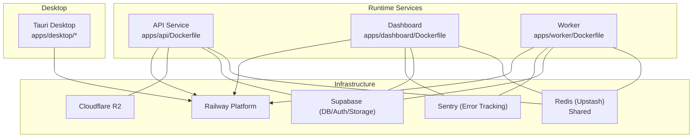
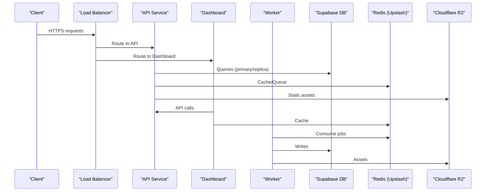
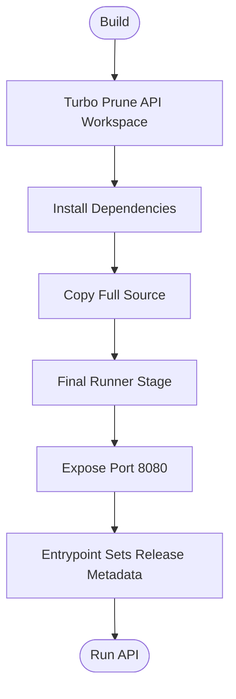
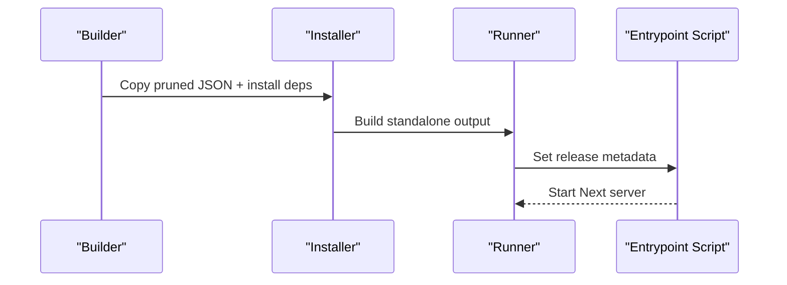
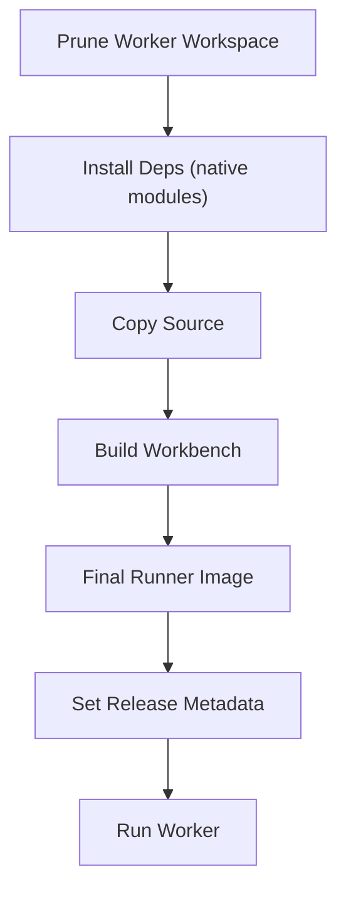
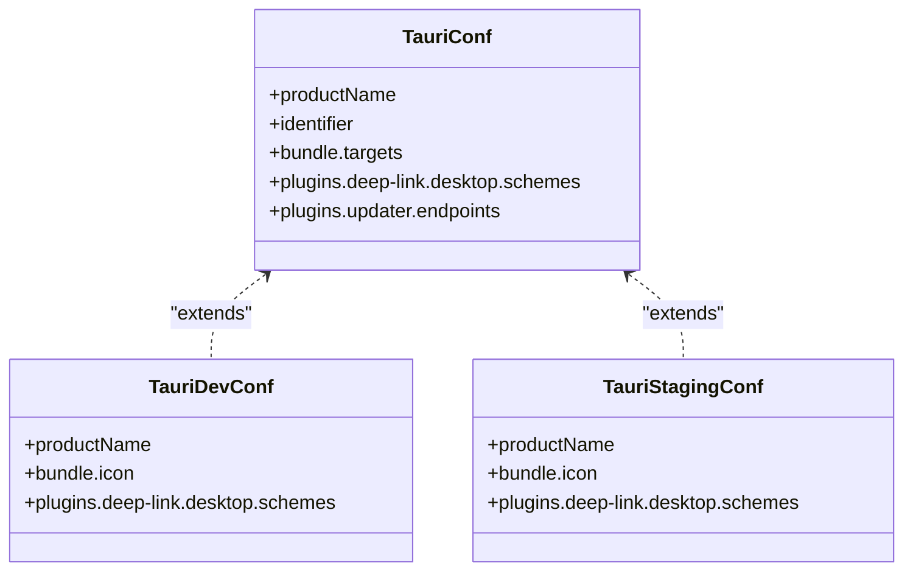
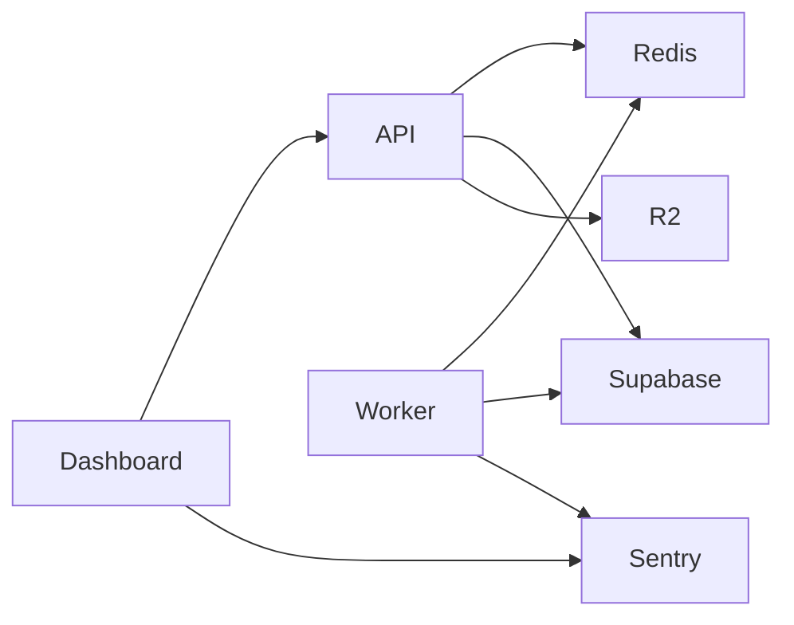

# Deployment & Operations

<cite>
**Referenced Files in This Document**
- [Dockerfile (API)](file://midday/apps/api/Dockerfile)
- [railway.json (API)](file://midday/apps/api/railway.json)
- [.env-template (API)](file://midday/apps/api/.env-template)
- [Dockerfile (Dashboard)](file://midday/apps/dashboard/Dockerfile)
- [railway.json (Dashboard)](file://midday/apps/dashboard/railway.json)
- [.env-example (Dashboard)](file://midday/apps/dashboard/.env-example)
- [Dockerfile (Worker)](file://midday/apps/worker/Dockerfile)
- [railway.json (Worker)](file://midday/apps/worker/railway.json)
- [.env-template (Worker)](file://midday/apps/worker/.env-template)
- [docker-entrypoint.sh](file://midday/scripts/docker-entrypoint.sh)
- [package.json (Desktop)](file://midday/apps/desktop/package.json)
- [tauri.conf.json](file://midday/apps/desktop/src-tauri/tauri.conf.json)
- [tauri.dev.conf.json](file://midday/apps/desktop/src-tauri/tauri.dev.conf.json)
- [tauri.staging.conf.json](file://midday/apps/desktop/src-tauri/tauri.staging.conf.json)
</cite>

## Table of Contents
1. [Introduction](#introduction)
2. [Project Structure](#project-structure)
3. [Core Components](#core-components)
4. [Architecture Overview](#architecture-overview)
5. [Detailed Component Analysis](#detailed-component-analysis)
6. [Dependency Analysis](#dependency-analysis)
7. [Performance Considerations](#performance-considerations)
8. [Monitoring & Alerting](#monitoring--alerting)
9. [Backup & Disaster Recovery](#backup--disaster-recovery)
10. [Security Hardening](#security-hardening)
11. [Troubleshooting Guide](#troubleshooting-guide)
12. [Conclusion](#conclusion)

## Introduction
This document provides comprehensive deployment and operations guidance for Faworra. It covers containerization strategies, multi-environment deployment, infrastructure requirements, scaling and load balancing, monitoring and alerting, backup and disaster recovery, and security hardening. It also includes operational procedures and troubleshooting steps for common deployment issues.

## Project Structure
Faworra consists of three primary runtime components:
- API service: A backend service exposing REST and tRPC endpoints, containerized with a multi-stage Docker build and deployed via Railway.
- Dashboard: A Next.js frontend built as a standalone server and packaged for production, containerized similarly and deployed via Railway.
- Worker: A background job processor using BullMQ queues, containerized and deployed via Railway.
- Desktop client: A Tauri-based desktop application with environment-specific configurations and auto-updater integration.

**Diagram sources**
- [Dockerfile (API)](file://midday/apps/api/Dockerfile#L1-L50)
- [Dockerfile (Dashboard)](file://midday/apps/dashboard/Dockerfile#L1-L101)
- [Dockerfile (Worker)](file://midday/apps/worker/Dockerfile#L1-L62)
- [tauri.conf.json](file://midday/apps/desktop/src-tauri/tauri.conf.json#L1-L46)

**Section sources**
- [Dockerfile (API)](file://midday/apps/api/Dockerfile#L1-L50)
- [Dockerfile (Dashboard)](file://midday/apps/dashboard/Dockerfile#L1-L101)
- [Dockerfile (Worker)](file://midday/apps/worker/Dockerfile#L1-L62)
- [tauri.conf.json](file://midday/apps/desktop/src-tauri/tauri.conf.json#L1-L46)

## Core Components
- API service
  - Multi-stage Docker build with Turbo pruning for the API workspace.
  - Runtime environment variables include port and production mode.
  - Health check endpoint configured for rolling deployments.
  - Multi-region replica distribution across Europe, East US, and West US.
- Dashboard
  - Standalone Next.js build with Sentry source map upload at build time.
  - Server Actions encryption key must be identical across replicas.
  - Health check endpoint for rolling deployments.
  - Higher replica counts per region compared to staging.
- Worker
  - Multi-stage Docker build with native module support.
  - Dedicated region and replica count configuration.
  - Health check endpoint for rolling deployments.
- Desktop
  - Tauri configuration with deep linking and auto-updater.
  - Environment-specific product names and icon sets.
  - Updater endpoint and public key for signed updates.

**Section sources**
- [Dockerfile (API)](file://midday/apps/api/Dockerfile#L1-L50)
- [railway.json (API)](file://midday/apps/api/railway.json#L1-L31)
- [Dockerfile (Dashboard)](file://midday/apps/dashboard/Dockerfile#L1-L101)
- [railway.json (Dashboard)](file://midday/apps/dashboard/railway.json#L1-L31)
- [Dockerfile (Worker)](file://midday/apps/worker/Dockerfile#L1-L62)
- [railway.json (Worker)](file://midday/apps/worker/railway.json#L1-L24)
- [tauri.conf.json](file://midday/apps/desktop/src-tauri/tauri.conf.json#L1-L46)
- [tauri.dev.conf.json](file://midday/apps/desktop/src-tauri/tauri.dev.conf.json#L1-L22)
- [tauri.staging.conf.json](file://midday/apps/desktop/src-tauri/tauri.staging.conf.json#L1-L21)

## Architecture Overview
Faworra’s deployment architecture leverages Railway for containerized deployments with health checks, graceful draining, and overlap windows to minimize downtime. The system spans multiple regions with regional read replicas for databases and a shared Redis instance for queues and caching. Sentry is integrated for error reporting, and Cloudflare R2 is used for static assets.

**Diagram sources**
- [Dockerfile (API)](file://midday/apps/api/Dockerfile#L26-L50)
- [Dockerfile (Dashboard)](file://midday/apps/dashboard/Dockerfile#L73-L101)
- [Dockerfile (Worker)](file://midday/apps/worker/Dockerfile#L38-L62)
- [railway.json (API)](file://midday/apps/api/railway.json#L7-L18)
- [railway.json (Dashboard)](file://midday/apps/dashboard/railway.json#L7-L18)
- [railway.json (Worker)](file://midday/apps/worker/railway.json#L7-L15)

## Detailed Component Analysis

### API Service Deployment
- Containerization
  - Multi-stage build with Turbo workspace pruning for the API package.
  - Runtime image copies only necessary artifacts and installs minimal runtime dependencies.
  - Entrypoint script injects release metadata for observability.
- Environment Variables
  - Database connections via pooler URLs and region-specific read replicas.
  - Redis and queue URLs for caching and background jobs.
  - Provider credentials for banking integrations and external services.
- Deployment
  - Health check path configured for rolling updates.
  - Multi-region replica distribution for high availability.
  - Restart policy and overlap/drain settings for zero-downtime deployments.

**Diagram sources**
- [Dockerfile (API)](file://midday/apps/api/Dockerfile#L8-L49)
- [docker-entrypoint.sh](file://midday/scripts/docker-entrypoint.sh#L1-L13)

**Section sources**
- [Dockerfile (API)](file://midday/apps/api/Dockerfile#L1-L50)
- [.env-template (API)](file://midday/apps/api/.env-template#L1-L149)
- [railway.json (API)](file://midday/apps/api/railway.json#L1-L31)
- [docker-entrypoint.sh](file://midday/scripts/docker-entrypoint.sh#L1-L13)

### Dashboard Deployment
- Containerization
  - Standalone Next.js build with Sentry source map upload at build time.
  - Server Actions encryption key must be identical across all replicas.
  - Final image runs the standalone server on port 3000.
- Environment Variables
  - Public keys and URLs for Supabase, Plaid, Teller, Stripe, and Google APIs.
  - Sentry DSN for client-side error reporting.
- Deployment
  - Health check path configured for rolling updates.
  - Higher replica counts per region for frontend traffic.

**Diagram sources**
- [Dockerfile (Dashboard)](file://midday/apps/dashboard/Dockerfile#L16-L101)
- [docker-entrypoint.sh](file://midday/scripts/docker-entrypoint.sh#L1-L13)

**Section sources**
- [Dockerfile (Dashboard)](file://midday/apps/dashboard/Dockerfile#L1-L101)
- [.env-example (Dashboard)](file://midday/apps/dashboard/.env-example#L1-L87)
- [railway.json (Dashboard)](file://midday/apps/dashboard/railway.json#L1-L31)
- [docker-entrypoint.sh](file://midday/scripts/docker-entrypoint.sh#L1-L13)

### Worker Deployment
- Containerization
  - Multi-stage build with native module support and workspace pruning for the worker package.
  - Final image runs the worker entrypoint with environment variables.
- Environment Variables
  - Database pooler URL, Supabase credentials, and Redis queue URL.
  - Provider credentials for document processing and notifications.
- Deployment
  - Health check path configured for rolling updates.
  - Dedicated region and replica count for background processing.

**Diagram sources**
- [Dockerfile (Worker)](file://midday/apps/worker/Dockerfile#L8-L62)
- [docker-entrypoint.sh](file://midday/scripts/docker-entrypoint.sh#L1-L13)

**Section sources**
- [Dockerfile (Worker)](file://midday/apps/worker/Dockerfile#L1-L62)
- [.env-template (Worker)](file://midday/apps/worker/.env-template#L1-L123)
- [railway.json (Worker)](file://midday/apps/worker/railway.json#L1-L24)
- [docker-entrypoint.sh](file://midday/scripts/docker-entrypoint.sh#L1-L13)

### Desktop Packaging
- Tauri Configuration
  - Product name, identifier, and bundle targets for all platforms.
  - Deep link schemes for development, staging, and production.
  - Auto-updater configuration with endpoint and public key.
- Scripts
  - Development and build commands for Tauri with environment-specific configurations.

**Diagram sources**
- [tauri.conf.json](file://midday/apps/desktop/src-tauri/tauri.conf.json#L1-L46)
- [tauri.dev.conf.json](file://midday/apps/desktop/src-tauri/tauri.dev.conf.json#L1-L22)
- [tauri.staging.conf.json](file://midday/apps/desktop/src-tauri/tauri.staging.conf.json#L1-L21)

**Section sources**
- [package.json (Desktop)](file://midday/apps/desktop/package.json#L1-L40)
- [tauri.conf.json](file://midday/apps/desktop/src-tauri/tauri.conf.json#L1-L46)
- [tauri.dev.conf.json](file://midday/apps/desktop/src-tauri/tauri.dev.conf.json#L1-L22)
- [tauri.staging.conf.json](file://midday/apps/desktop/src-tauri/tauri.staging.conf.json#L1-L21)

## Dependency Analysis
- Inter-service dependencies
  - Dashboard depends on API for backend operations.
  - Worker consumes jobs from Redis and writes to Supabase.
  - API integrates with Supabase, Redis, and R2.
- External dependencies
  - Supabase for database, auth, and storage.
  - Redis (Upstash) for caching and queues.
  - Cloudflare R2 for static assets.
  - Sentry for error tracking and source map uploads.
- Regional distribution
  - API and Dashboard replicas distributed across Europe, East US, and West US.
  - Worker deployed to a dedicated region with replica scaling.

**Diagram sources**
- [Dockerfile (API)](file://midday/apps/api/Dockerfile#L26-L50)
- [Dockerfile (Dashboard)](file://midday/apps/dashboard/Dockerfile#L73-L101)
- [Dockerfile (Worker)](file://midday/apps/worker/Dockerfile#L38-L62)
- [railway.json (API)](file://midday/apps/api/railway.json#L13-L17)
- [railway.json (Dashboard)](file://midday/apps/dashboard/railway.json#L13-L17)
- [railway.json (Worker)](file://midday/apps/worker/railway.json#L13-L14)

**Section sources**
- [railway.json (API)](file://midday/apps/api/railway.json#L1-L31)
- [railway.json (Dashboard)](file://midday/apps/dashboard/railway.json#L1-L31)
- [railway.json (Worker)](file://midday/apps/worker/railway.json#L1-L24)

## Performance Considerations
- Scaling
  - API and Dashboard replicas are scaled across multiple regions for low latency and high availability.
  - Worker replicas are tuned for background processing load.
- Load balancing
  - Railway-managed routing with health checks and overlap/drain windows ensures smooth rollouts.
- Caching and queues
  - Use Redis for caching and BullMQ for reliable background job processing.
- Database
  - Use Supabase pooler URLs and region-specific read replicas to reduce primary DB load.

[No sources needed since this section provides general guidance]

## Monitoring & Alerting
- Sentry
  - Dashboard and Worker builds include Sentry source map uploads at build time.
  - Client-side DSN configured for the Dashboard.
  - Release metadata injected at runtime via the shared entrypoint.
- Application health checks
  - API and Worker expose a /health endpoint for readiness probes.
  - Dashboard exposes a /api/health endpoint for readiness probes.
- Database performance monitoring
  - Monitor Supabase performance dashboards and query patterns.
  - Use connection pooling and read replicas to optimize throughput.

**Section sources**
- [Dockerfile (Dashboard)](file://midday/apps/dashboard/Dockerfile#L49-L71)
- [.env-example (Dashboard)](file://midday/apps/dashboard/.env-example#L62-L63)
- [docker-entrypoint.sh](file://midday/scripts/docker-entrypoint.sh#L1-L13)
- [railway.json (API)](file://midday/apps/api/railway.json#L8-L8)
- [railway.json (Worker)](file://midday/apps/worker/railway.json#L8-L8)
- [railway.json (Dashboard)](file://midday/apps/dashboard/railway.json#L8-L8)

## Backup & Disaster Recovery
- Database backups
  - Configure automated backups via Supabase settings.
  - Validate point-in-time recovery procedures regularly.
- Secrets and keys
  - Store secrets in Railway environment variables or a secure vault.
  - Rotate keys periodically and audit access logs.
- Artifacts and assets
  - Back up R2 bucket contents and versions.
  - Maintain immutable artifact registries for containers.
- DR procedures
  - Practice failover to alternate regions.
  - Automate DNS or load balancer failover to healthy regions.

[No sources needed since this section provides general guidance]

## Security Hardening
- Secrets management
  - Use environment variables for sensitive data; avoid committing secrets to repositories.
  - Enforce strict access controls for Railway environments.
- Network and platform
  - Restrict inbound traffic to necessary ports and paths.
  - Enable platform-level protections (Railway, Supabase, Upstash).
- Observability
  - Limit Sentry DSN exposure to trusted environments.
  - Sanitize logs and avoid logging sensitive data.
- Desktop
  - Verify auto-updater signatures and enforce secure transport.
  - Use environment-specific deep link schemes to prevent cross-environment interference.

[No sources needed since this section provides general guidance]

## Troubleshooting Guide
- Rolling deployment failures
  - Verify health check endpoints return success before marking as ready.
  - Check overlap and drain durations to prevent traffic spikes.
- Release metadata issues
  - Confirm the entrypoint script sets GIT_COMMIT_SHA and SENTRY_RELEASE at runtime.
- Dashboard build failures
  - Ensure Sentry auth token and org/project build args are present during build.
  - Validate NEXT_SERVER_ACTIONS_ENCRYPTION_KEY is identical across replicas.
- Worker job failures
  - Inspect Redis connectivity and queue visibility.
  - Review provider credentials and API limits.
- Desktop update issues
  - Verify updater endpoint and public key configuration.
  - Confirm deep link schemes match the intended environment.

**Section sources**
- [railway.json (API)](file://midday/apps/api/railway.json#L7-L18)
- [railway.json (Dashboard)](file://midday/apps/dashboard/railway.json#L7-L18)
- [railway.json (Worker)](file://midday/apps/worker/railway.json#L7-L15)
- [docker-entrypoint.sh](file://midday/scripts/docker-entrypoint.sh#L1-L13)
- [Dockerfile (Dashboard)](file://midday/apps/dashboard/Dockerfile#L49-L71)
- [tauri.conf.json](file://midday/apps/desktop/src-tauri/tauri.conf.json#L38-L43)

## Conclusion
Faworra’s deployment model emphasizes multi-region resilience, efficient containerization, and observability. By leveraging Railway, Supabase, Redis (Upstash), and Sentry, the system achieves scalable, secure, and observable operations. Adhering to the outlined practices for environment configuration, monitoring, backup, and security will ensure reliable day-2 operations.