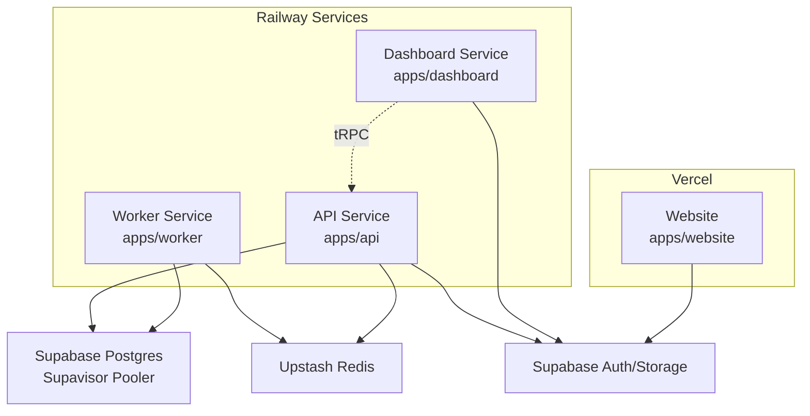
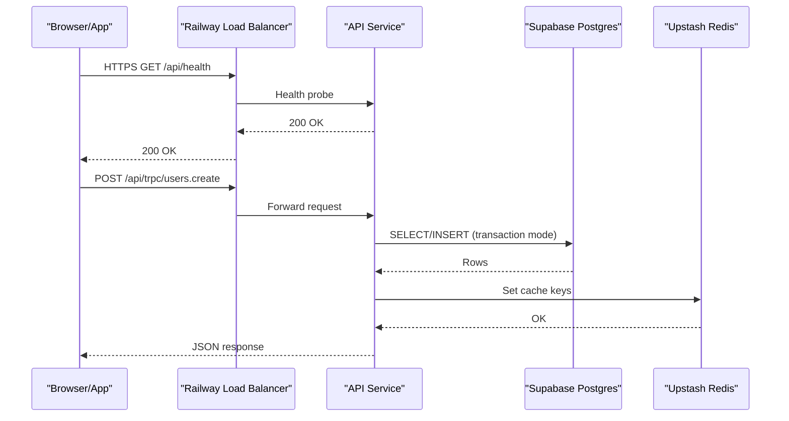
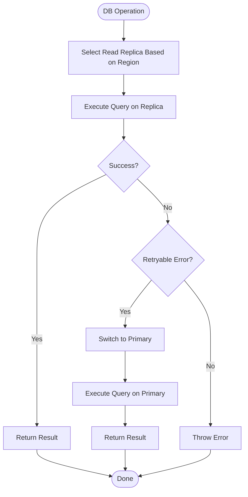
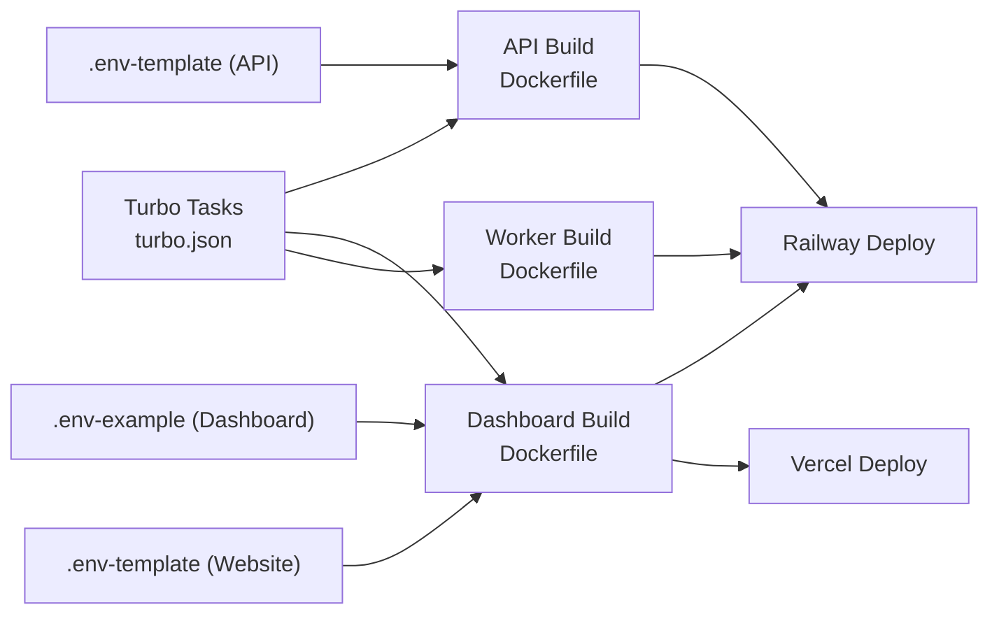

# Infrastructure & Deployment

<cite>
**Referenced Files in This Document**
- [railway.json (API)](file://midday/apps/api/railway.json)
- [railway.json (Dashboard)](file://midday/apps/dashboard/railway.json)
- [vercel.json (Website)](file://midday/apps/website/vercel.json)
- [Dockerfile (API)](file://midday/apps/api/Dockerfile)
- [Dockerfile (Dashboard)](file://midday/apps/dashboard/Dockerfile)
- [Dockerfile (Worker)](file://midday/apps/worker/Dockerfile)
- [docker-entrypoint.sh](file://midday/scripts/docker-entrypoint.sh)
- [turbo.json](file://midday/turbo.json)
- [package.json](file://midday/package.json)
- [.env-template (API)](file://midday/apps/api/.env-template)
- [.env-example (Dashboard)](file://midday/apps/dashboard/.env-example)
- [.env-template (Website)](file://midday/apps/website/.env-template)
- [database-connection-pooling.md](file://midday/docs/database-connection-pooling.md)
- [db-retry.ts](file://midday/apps/api/src/utils/db-retry.ts)
</cite>

## Table of Contents
1. [Introduction](#introduction)
2. [Project Structure](#project-structure)
3. [Core Components](#core-components)
4. [Architecture Overview](#architecture-overview)
5. [Detailed Component Analysis](#detailed-component-analysis)
6. [Dependency Analysis](#dependency-analysis)
7. [Performance Considerations](#performance-considerations)
8. [Troubleshooting Guide](#troubleshooting-guide)
9. [Conclusion](#conclusion)
10. [Appendices](#appendices)

## Introduction
This document describes the infrastructure and deployment model for Faworra across Railway, Vercel, and supporting services. It covers cloud platform configurations, database and Redis strategies, external service integrations, load balancing and SSL/TLS, CDN and caching, infrastructure-as-code patterns, environment-specific configurations, deployment pipelines, and operational procedures such as blue-green deployments, rolling updates, and rollbacks. It also includes cost optimization and scaling guidance.

## Project Structure
Faworra is a monorepo built with Bun and Turbo. It includes three primary applications:
- API service (Next.js server, Hono routes, tRPC)
- Dashboard (Next.js app)
- Worker (background jobs and processors)
- Website (static marketing site)
- Supporting packages for database, caching, and shared utilities

**Diagram sources**
- [Dockerfile (API)](file://midday/apps/api/Dockerfile#L1-L50)
- [Dockerfile (Dashboard)](file://midday/apps/dashboard/Dockerfile#L1-L101)
- [Dockerfile (Worker)](file://midday/apps/worker/Dockerfile#L1-L62)
- [database-connection-pooling.md](file://midday/docs/database-connection-pooling.md#L1-L84)
- [vercel.json (Website)](file://midday/apps/website/vercel.json#L1-L9)

**Section sources**
- [package.json](file://midday/package.json#L1-L70)
- [turbo.json](file://midday/turbo.json#L1-L87)

## Core Components
- API service: HTTP server with REST and tRPC endpoints, runs behind Railway’s managed load balancer and health checks.
- Dashboard: Next.js standalone server with build-time env injection and runtime release tagging.
- Worker: Background job processor with native module support and queue integration.
- Website: Static marketing site deployed via Vercel with regional edge distribution.

Key deployment characteristics:
- Railway-managed multi-region deployments with overlap and draining windows.
- Health checks configured for graceful restarts.
- Build-time environment variables injected into Next.js builds.
- Release tagging via commit SHA for observability.

**Section sources**
- [railway.json (API)](file://midday/apps/api/railway.json#L1-L31)
- [railway.json (Dashboard)](file://midday/apps/dashboard/railway.json#L1-L31)
- [Dockerfile (API)](file://midday/apps/api/Dockerfile#L1-L50)
- [Dockerfile (Dashboard)](file://midday/apps/dashboard/Dockerfile#L1-L101)
- [Dockerfile (Worker)](file://midday/apps/worker/Dockerfile#L1-L62)
- [docker-entrypoint.sh](file://midday/scripts/docker-entrypoint.sh#L1-L13)

## Architecture Overview
The system uses a polyglot microservice pattern within a single repository:
- API handles business logic and integrates with Supabase, Redis, and external providers.
- Dashboard serves the admin UI and delegates data operations to the API.
- Worker performs asynchronous tasks and interacts with Redis and Supabase.
- Website hosts static content and integrates with Supabase for authentication and email.

**Diagram sources**
- [railway.json (API)](file://midday/apps/api/railway.json#L7-L12)
- [Dockerfile (API)](file://midday/apps/api/Dockerfile#L30-L49)
- [database-connection-pooling.md](file://midday/docs/database-connection-pooling.md#L45-L57)

## Detailed Component Analysis

### Railway Platform Configuration
- API service:
  - Multi-region replicas across Europe, East, and West regions.
  - Health check path and timeout configured.
  - Overlap seconds and draining seconds for zero-downtime deployments.
  - Restart policy on failure.
- Dashboard service:
  - Similar multi-region configuration with higher replica counts in production.
  - Health check path aligned with API.
- Environment overrides:
  - Staging environments reduce replica counts for cost control.

Operational implications:
- Blue-green and rolling updates are supported via overlap/drain windows.
- Regional read replicas minimize latency for reads.

**Section sources**
- [railway.json (API)](file://midday/apps/api/railway.json#L1-L31)
- [railway.json (Dashboard)](file://midday/apps/dashboard/railway.json#L1-L31)

### Vercel Platform Configuration
- Website:
  - Regions configured for edge distribution.
  - Public deployment disabled to enforce access control.
  - GitHub integration disabled by default.

**Section sources**
- [vercel.json (Website)](file://midday/apps/website/vercel.json#L1-L9)

### Containerization and Runtime Entrypoints
- API:
  - Single-stage runtime with Bun and exposed port.
  - Entrypoint sets release metadata from build stamp.
- Dashboard:
  - Standalone Next.js build with hardened user and group.
  - Build-time env injection for public keys and Sentry.
  - Entrypoint sets release metadata.
- Worker:
  - Multi-stage build with native dependencies installed.
  - Entrypoint sets release metadata.

Build-time environment variables:
- Dashboard injects public keys and Sentry auth tokens during build.
- Worker and API receive commit SHA for release tagging.

**Section sources**
- [Dockerfile (API)](file://midday/apps/api/Dockerfile#L1-L50)
- [Dockerfile (Dashboard)](file://midday/apps/dashboard/Dockerfile#L1-L101)
- [Dockerfile (Worker)](file://midday/apps/worker/Dockerfile#L1-L62)
- [docker-entrypoint.sh](file://midday/scripts/docker-entrypoint.sh#L1-L13)

### Database Deployment Strategy
- Supavisor transaction mode:
  - Uses pooled connections via port 6543.
  - Enables true pooling; prepared statements are not supported in this mode.
- Regional read replicas:
  - API selects the closest replica using environment variables and wraps queries accordingly.
  - Writes target the primary in EU.
- Pool sizing:
  - Production pool max is tuned to respect PgBouncer limits.
  - Idle timeouts and connection lifecycles optimized for reliability.

**Diagram sources**
- [db-retry.ts](file://midday/apps/api/src/utils/db-retry.ts#L17-L127)
- [database-connection-pooling.md](file://midday/docs/database-connection-pooling.md#L45-L77)

**Section sources**
- [database-connection-pooling.md](file://midday/docs/database-connection-pooling.md#L1-L84)
- [db-retry.ts](file://midday/apps/api/src/utils/db-retry.ts#L1-L128)

### Redis Configuration
- Upstash Redis used for caching and queues.
- Shared across all regions; encryption at rest recommended.
- Worker and API use separate Redis URLs for isolation.

Environment variables:
- API: REDIS_URL and REDIS_QUEUE_URL.
- Dashboard: REDIS_URL.
- Website: UPSTASH_REDIS_REST_URL and UPSTASH_REDIS_REST_TOKEN.

**Section sources**
- [.env-template (API)](file://midday/apps/api/.env-template#L64-L71)
- [.env-example (Dashboard)](file://midday/apps/dashboard/.env-example#L14-L15)
- [.env-template (Website)](file://midday/apps/website/.env-template#L1-L2)

### External Service Integrations
- Supabase: Auth, storage, and database.
- Plaid, GoCardless, Enable Banking, Teller for banking connections.
- Stripe for payments.
- Resend for email.
- OpenAI/Mistral/Anthropic for AI.
- ElevenLabs for audio insights.
- Slack, Outlook, Gmail, WhatsApp, Xero, QuickBooks, Fortnox for integrations.
- Sentry for error tracking and source maps.

Environment templates define required secrets per service.

**Section sources**
- [.env-template (API)](file://midday/apps/api/.env-template#L20-L149)
- [.env-example (Dashboard)](file://midday/apps/dashboard/.env-example#L13-L87)
- [.env-template (Website)](file://midday/apps/website/.env-template#L1-L5)

### Load Balancing and Health Checks
- Railway load balancer distributes traffic across replicas.
- Health checks configured per service to gate traffic until readiness.
- Draining and overlap windows ensure zero-downtime deployments.

**Section sources**
- [railway.json (API)](file://midday/apps/api/railway.json#L7-L12)
- [railway.json (Dashboard)](file://midday/apps/dashboard/railway.json#L7-L12)

### SSL/TLS and CDN
- Railway TLS termination at the edge; HTTPS enforced by platform.
- Vercel provides CDN and HTTPS for the website.
- Supabase endpoints are accessed over HTTPS; SSL verification configured in pools.

**Section sources**
- [Dockerfile (API)](file://midday/apps/api/Dockerfile#L30-L31)
- [Dockerfile (Dashboard)](file://midday/apps/dashboard/Dockerfile#L77-L78)
- [database-connection-pooling.md](file://midday/docs/database-connection-pooling.md#L49-L55)

### Infrastructure-as-Code Patterns
- Railway JSON defines build, deploy, and environment-specific overrides.
- Vercel JSON configures regions and GitHub integration toggles.
- Dockerfiles encode build pipelines and runtime behavior.
- Turbo tasks orchestrate builds and pass environment variables.

**Section sources**
- [railway.json (API)](file://midday/apps/api/railway.json#L1-L31)
- [railway.json (Dashboard)](file://midday/apps/dashboard/railway.json#L1-L31)
- [vercel.json (Website)](file://midday/apps/website/vercel.json#L1-L9)
- [Dockerfile (API)](file://midday/apps/api/Dockerfile#L1-L50)
- [Dockerfile (Dashboard)](file://midday/apps/dashboard/Dockerfile#L1-L101)
- [Dockerfile (Worker)](file://midday/apps/worker/Dockerfile#L1-L62)
- [turbo.json](file://midday/turbo.json#L1-L87)

### Environment-Specific Configurations
- API:
  - Multiple DATABASE_* URLs for primary and regional replicas.
  - Allowed origins, logging level, and encryption keys.
- Dashboard:
  - NEXT_PUBLIC_* keys for client-side integrations.
  - Server Actions encryption key must be identical across regions.
- Website:
  - Upstash Redis credentials and Resend audience.

**Section sources**
- [.env-template (API)](file://midday/apps/api/.env-template#L9-L149)
- [.env-example (Dashboard)](file://midday/apps/dashboard/.env-example#L1-L87)
- [.env-template (Website)](file://midday/apps/website/.env-template#L1-L5)

### Deployment Pipelines
- Build:
  - Turbo orchestrates workspace builds and caches outputs.
  - Dashboard build injects public keys and Sentry release metadata.
- Deploy:
  - Railway builds Docker images and applies health checks and overlap/drain windows.
  - Vercel deploys website with regional edge selection.
- Release tagging:
  - Commit SHA embedded at build time and propagated to runtime via entrypoint.

**Section sources**
- [turbo.json](file://midday/turbo.json#L9-L62)
- [Dockerfile (Dashboard)](file://midday/apps/dashboard/Dockerfile#L66-L71)
- [docker-entrypoint.sh](file://midday/scripts/docker-entrypoint.sh#L6-L10)

### Blue-Green Deployments, Rolling Updates, and Rollbacks
- Blue-Green:
  - Use Railway’s multi-region configuration to run parallel deployments.
  - Switch traffic after validating health checks.
- Rolling Updates:
  - Overlap seconds allow new instances to warm up before draining old ones.
  - Draining seconds ensure in-flight requests complete.
- Rollback:
  - Re-deploy previous release tag or image digest.
  - Use release metadata to identify failing builds.

**Section sources**
- [railway.json (API)](file://midday/apps/api/railway.json#L11-L12)
- [railway.json (Dashboard)](file://midday/apps/dashboard/railway.json#L11-L12)
- [docker-entrypoint.sh](file://midday/scripts/docker-entrypoint.sh#L6-L10)

## Dependency Analysis
Runtime dependencies and build-time inputs are orchestrated by Turbo and passed into Docker builds.

**Diagram sources**
- [turbo.json](file://midday/turbo.json#L1-L87)
- [Dockerfile (API)](file://midday/apps/api/Dockerfile#L1-L50)
- [Dockerfile (Dashboard)](file://midday/apps/dashboard/Dockerfile#L1-L101)
- [Dockerfile (Worker)](file://midday/apps/worker/Dockerfile#L1-L62)
- [.env-template (API)](file://midday/apps/api/.env-template#L1-L149)
- [.env-example (Dashboard)](file://midday/apps/dashboard/.env-example#L1-L87)
- [.env-template (Website)](file://midday/apps/website/.env-template#L1-L5)

**Section sources**
- [turbo.json](file://midday/turbo.json#L1-L87)
- [package.json](file://midday/package.json#L1-L70)

## Performance Considerations
- Database:
  - Use transaction mode pooling to reduce backend connections.
  - Keep pool sizes conservative to fit PgBouncer limits.
  - Prefer replica reads for read-heavy workloads.
- Caching:
  - Use Upstash Redis for hot-path caching and queues.
  - Align TTLs with data freshness requirements.
- Builds:
  - Turbo caching reduces rebuild times.
  - Separate build args for Next.js to avoid unnecessary rebuilds.
- Networking:
  - Multi-region deployments reduce latency.
  - Health checks and drain windows prevent partial failures.

[No sources needed since this section provides general guidance]

## Troubleshooting Guide
- Database timeouts/cancellations:
  - Use retry helper to fall back to primary on retryable errors.
  - Verify pool sizes and idle timeouts.
- Health check failures:
  - Confirm health check paths and ports.
  - Ensure overlap/drain windows accommodate startup time.
- Release tagging:
  - Validate commit SHA propagation via entrypoint.
- Sentry source maps:
  - Ensure auth token and org/project are set during build.

**Section sources**
- [db-retry.ts](file://midday/apps/api/src/utils/db-retry.ts#L84-L100)
- [railway.json (API)](file://midday/apps/api/railway.json#L7-L12)
- [railway.json (Dashboard)](file://midday/apps/dashboard/railway.json#L7-L12)
- [docker-entrypoint.sh](file://midday/scripts/docker-entrypoint.sh#L6-L10)
- [Dockerfile (Dashboard)](file://midday/apps/dashboard/Dockerfile#L49-L52)

## Conclusion
Faworra’s infrastructure leverages Railway for application hosting with multi-region resilience and Vercel for static assets. Supavisor transaction-mode pooling, regional read replicas, and Upstash Redis deliver scalable data access. Build-time environment injection and release tagging improve observability. Operational procedures such as overlap/drain windows support safe, zero-downtime updates.

[No sources needed since this section summarizes without analyzing specific files]

## Appendices

### Cost Optimization Strategies
- Reduce replica counts in staging.
- Right-size pool max per region to fit PgBouncer limits.
- Use regional edge distribution to minimize bandwidth costs.
- Disable unused GitHub integration on Vercel.

**Section sources**
- [railway.json (API)](file://midday/apps/api/railway.json#L19-L29)
- [railway.json (Dashboard)](file://midday/apps/dashboard/railway.json#L19-L29)
- [database-connection-pooling.md](file://midday/docs/database-connection-pooling.md#L49-L57)

### Scaling Policies
- Horizontal scaling:
  - Increase replicas per region for traffic spikes.
  - Ensure pool sizes and queue workers scale proportionally.
- Vertical scaling:
  - Monitor CPU/memory utilization and adjust instance types on Railway.
- Auto-scaling:
  - Combine replica scaling with queue backpressure via Redis.

**Section sources**
- [railway.json (API)](file://midday/apps/api/railway.json#L13-L17)
- [railway.json (Dashboard)](file://midday/apps/dashboard/railway.json#L13-L17)
- [database-connection-pooling.md](file://midday/docs/database-connection-pooling.md#L49-L57)