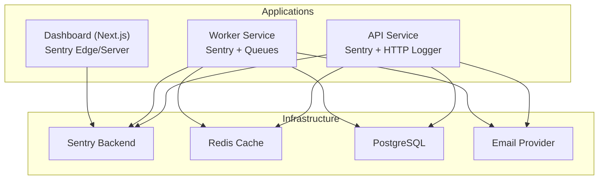
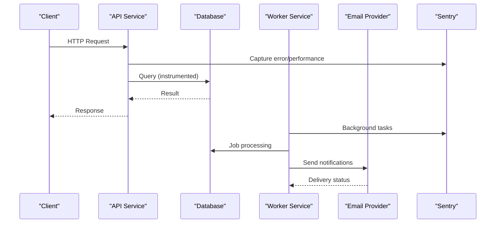
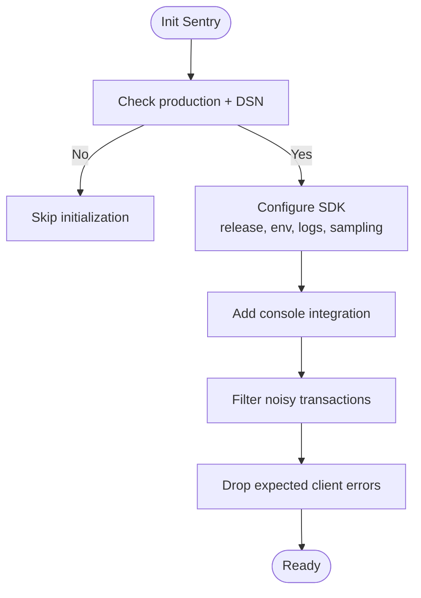
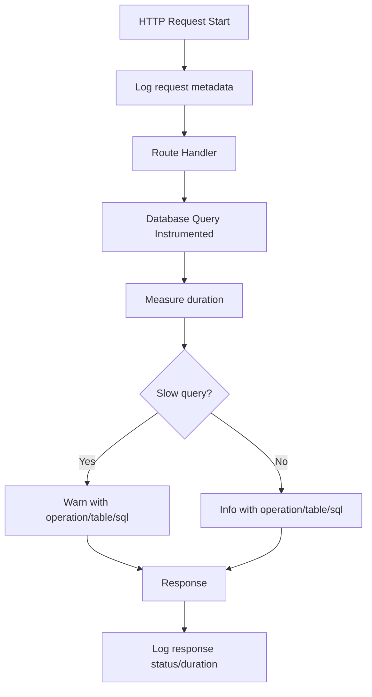
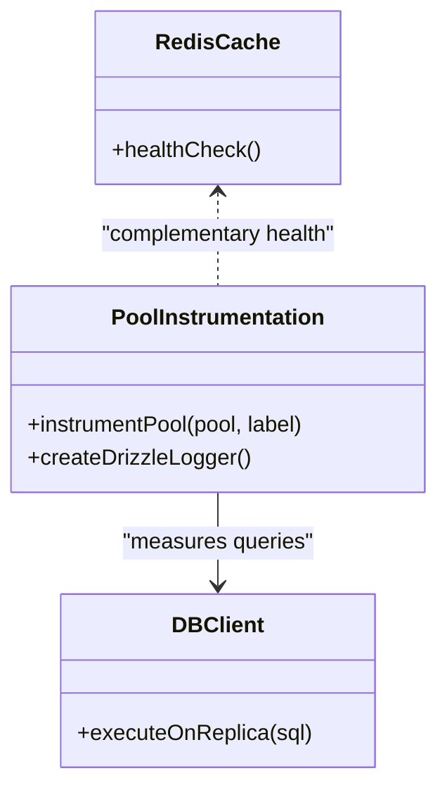
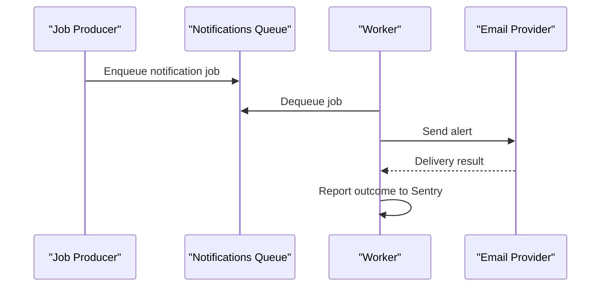
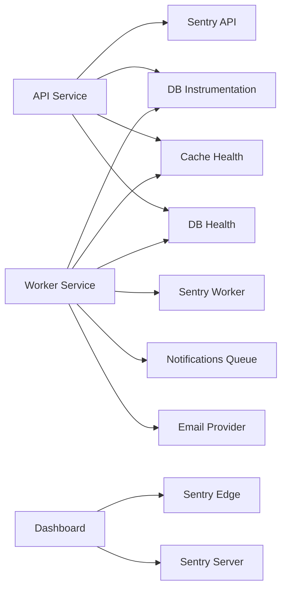

# Monitoring & Alerting

<cite>
**Referenced Files in This Document**
- [sentry.edge.config.ts](file://midday/apps/dashboard/sentry.edge.config.ts)
- [sentry.server.config.ts](file://midday/apps/dashboard/sentry.server.config.ts)
- [instrument.ts](file://midday/apps/api/src/instrument.ts)
- [instrument.ts](file://midday/apps/worker/src/instrument.ts)
- [instrument.ts](file://midday/packages/db/src/instrument.ts)
- [logger.ts](file://midday/apps/api/src/utils/logger.ts)
- [health.ts](file://midday/packages/cache/src/health.ts)
- [health.ts](file://midday/packages/db/src/utils/health.ts)
- [notifications.config.ts](file://midday/apps/worker/src/queues/notifications.config.ts)
- [resend.ts](file://midday/apps/api/src/services/resend.ts)
- [email package README](file://midday/packages/email/README.md)
- [jobs package README](file://midday/packages/jobs/README.md)
- [logger package README](file://midday/packages/logger/README.md)
- [health package README](file://midday/packages/health/README.md)
</cite>

## Table of Contents
1. [Introduction](#introduction)
2. [Project Structure](#project-structure)
3. [Core Components](#core-components)
4. [Architecture Overview](#architecture-overview)
5. [Detailed Component Analysis](#detailed-component-analysis)
6. [Dependency Analysis](#dependency-analysis)
7. [Performance Considerations](#performance-considerations)
8. [Troubleshooting Guide](#troubleshooting-guide)
9. [Conclusion](#conclusion)
10. [Appendices](#appendices)

## Introduction
This document describes the monitoring and alerting strategy for Faworra across all applications. It covers Sentry-based error tracking and performance monitoring, application metrics collection, database performance monitoring, background job tracking, alerting via Slack and email, logging configuration and aggregation, uptime monitoring and health checks, automated incident response procedures, and dashboard creation for KPI tracking.

## Project Structure
Faworra consists of:
- API service (Hono-based) with Sentry instrumentation and structured HTTP logging
- Worker service (Bun-based) with Sentry instrumentation and job queues
- Dashboard (Next.js) with Sentry edge/server-side initialization
- Database instrumentation package for slow query detection and logging
- Notification infrastructure for email alerts
- Health check utilities for cache and database

**Diagram sources**
- [instrument.ts](file://midday/apps/api/src/instrument.ts#L1-L54)
- [instrument.ts](file://midday/apps/worker/src/instrument.ts#L1-L35)
- [sentry.edge.config.ts](file://midday/apps/dashboard/sentry.edge.config.ts#L1-L22)
- [sentry.server.config.ts](file://midday/apps/dashboard/sentry.server.config.ts#L1-L21)
- [instrument.ts](file://midday/packages/db/src/instrument.ts#L1-L88)
- [health.ts](file://midday/packages/cache/src/health.ts#L1-L7)
- [health.ts](file://midday/packages/db/src/utils/health.ts#L1-L7)
- [resend.ts](file://midday/apps/api/src/services/resend.ts)

**Section sources**
- [instrument.ts](file://midday/apps/api/src/instrument.ts#L1-L54)
- [instrument.ts](file://midday/apps/worker/src/instrument.ts#L1-L35)
- [sentry.edge.config.ts](file://midday/apps/dashboard/sentry.edge.config.ts#L1-L22)
- [sentry.server.config.ts](file://midday/apps/dashboard/sentry.server.config.ts#L1-L21)
- [instrument.ts](file://midday/packages/db/src/instrument.ts#L1-L88)
- [health.ts](file://midday/packages/cache/src/health.ts#L1-L7)
- [health.ts](file://midday/packages/db/src/utils/health.ts#L1-L7)
- [resend.ts](file://midday/apps/api/src/services/resend.ts)

## Core Components
- Sentry error and performance monitoring
  - API service: Sentry Bun SDK with transaction filtering and console integration
  - Worker service: Sentry Bun SDK with transaction filtering
  - Dashboard: Sentry Next.js edge and server-side initialization
- Structured logging
  - API HTTP logger middleware for request lifecycle tracing
  - Database instrumentation for slow queries and SQL profiling
- Health checks
  - Cache health via Redis
  - Database health via replica query
- Notifications
  - Email provider integration for alert delivery
  - Worker queue configurations for notifications

**Section sources**
- [instrument.ts](file://midday/apps/api/src/instrument.ts#L1-L54)
- [instrument.ts](file://midday/apps/worker/src/instrument.ts#L1-L35)
- [sentry.edge.config.ts](file://midday/apps/dashboard/sentry.edge.config.ts#L1-L22)
- [sentry.server.config.ts](file://midday/apps/dashboard/sentry.server.config.ts#L1-L21)
- [logger.ts](file://midday/apps/api/src/utils/logger.ts#L1-L33)
- [instrument.ts](file://midday/packages/db/src/instrument.ts#L1-L88)
- [health.ts](file://midday/packages/cache/src/health.ts#L1-L7)
- [health.ts](file://midday/packages/db/src/utils/health.ts#L1-L7)
- [resend.ts](file://midday/apps/api/src/services/resend.ts)

## Architecture Overview
The monitoring stack integrates Sentry across services, structured logs for observability, database performance telemetry, and notification delivery.

**Diagram sources**
- [instrument.ts](file://midday/apps/api/src/instrument.ts#L1-L54)
- [instrument.ts](file://midday/apps/worker/src/instrument.ts#L1-L35)
- [instrument.ts](file://midday/packages/db/src/instrument.ts#L1-L88)
- [resend.ts](file://midday/apps/api/src/services/resend.ts)

## Detailed Component Analysis

### Sentry Integration
- API service
  - Initializes Sentry Bun SDK with release, environment, console integration, logs, and sampling
  - Filters health check and preflight transactions and drops expected client errors originating from health checks
- Worker service
  - Initializes Sentry Bun SDK with similar configuration tailored for background tasks
  - Filters health and admin transactions
- Dashboard (edge/server)
  - Initializes Sentry for edge features and server runtime with reduced sampling and logs enabled

**Diagram sources**
- [instrument.ts](file://midday/apps/api/src/instrument.ts#L1-L54)
- [instrument.ts](file://midday/apps/worker/src/instrument.ts#L1-L35)
- [sentry.edge.config.ts](file://midday/apps/dashboard/sentry.edge.config.ts#L1-L22)
- [sentry.server.config.ts](file://midday/apps/dashboard/sentry.server.config.ts#L1-L21)

**Section sources**
- [instrument.ts](file://midday/apps/api/src/instrument.ts#L1-L54)
- [instrument.ts](file://midday/apps/worker/src/instrument.ts#L1-L35)
- [sentry.edge.config.ts](file://midday/apps/dashboard/sentry.edge.config.ts#L1-L22)
- [sentry.server.config.ts](file://midday/apps/dashboard/sentry.server.config.ts#L1-L21)

### Application Metrics Collection
- HTTP request logging
  - Middleware captures method, path, status code, and duration with request identifiers
- Database performance telemetry
  - Wraps connection pool to measure query durations and categorize operations and tables
  - Emits warnings for slow queries and errors for very slow queries with SQL truncation
- Transaction filtering
  - Health endpoints and preflight requests excluded from performance sampling to reduce noise

**Diagram sources**
- [logger.ts](file://midday/apps/api/src/utils/logger.ts#L1-L33)
- [instrument.ts](file://midday/packages/db/src/instrument.ts#L1-L88)
- [instrument.ts](file://midday/apps/api/src/instrument.ts#L24-L36)

**Section sources**
- [logger.ts](file://midday/apps/api/src/utils/logger.ts#L1-L33)
- [instrument.ts](file://midday/packages/db/src/instrument.ts#L1-L88)
- [instrument.ts](file://midday/apps/api/src/instrument.ts#L24-L36)

### Database Performance Monitoring
- Pool instrumentation
  - Intercepts queries, measures execution time, parses operation and target table, logs warnings and errors accordingly
- Drizzle ORM logger
  - Logs queries with operation, table, and parameter count for visibility
- Health checks
  - Cache health via Redis connectivity
  - Database health via replica query

**Diagram sources**
- [instrument.ts](file://midday/packages/db/src/instrument.ts#L1-L88)
- [health.ts](file://midday/packages/cache/src/health.ts#L1-L7)
- [health.ts](file://midday/packages/db/src/utils/health.ts#L1-L7)

**Section sources**
- [instrument.ts](file://midday/packages/db/src/instrument.ts#L1-L88)
- [health.ts](file://midday/packages/cache/src/health.ts#L1-L7)
- [health.ts](file://midday/packages/db/src/utils/health.ts#L1-L7)

### Background Job Tracking
- Worker service
  - Sentry initialization for background tasks with transaction filtering
  - Queue configurations for various job types (accounting, customers, documents, inbox, insights, institutions, invoices, notifications, rates, teams, transactions)
- Notifications
  - Dedicated queue configuration and email provider integration for alert delivery

**Diagram sources**
- [instrument.ts](file://midday/apps/worker/src/instrument.ts#L1-L35)
- [notifications.config.ts](file://midday/apps/worker/src/queues/notifications.config.ts)
- [resend.ts](file://midday/apps/api/src/services/resend.ts)

**Section sources**
- [instrument.ts](file://midday/apps/worker/src/instrument.ts#L1-L35)
- [notifications.config.ts](file://midday/apps/worker/src/queues/notifications.config.ts)
- [resend.ts](file://midday/apps/api/src/services/resend.ts)

### Alerting Strategies
- Channels
  - Email: via email provider integration
  - Slack: configure webhook-based alerting in the worker or external alerting system
- Filtering and suppression
  - Sentry filters for health checks and preflights to reduce noise
  - Console logs captured and forwarded to Sentry for visibility
- Escalation
  - Critical errors escalate to on-call rotation via external alerting system
  - Low-priority alerts sent to email distribution lists

[No sources needed since this section provides general guidance]

### Logging Configuration and Aggregation
- Structured logs
  - HTTP middleware logs request lifecycle with identifiers
  - Database instrumentation logs SQL operations and durations
- Centralized ingestion
  - Forward Sentry logs and events to centralized logging backend
  - Aggregate application logs and database telemetry for dashboards

**Section sources**
- [logger.ts](file://midday/apps/api/src/utils/logger.ts#L1-L33)
- [instrument.ts](file://midday/packages/db/src/instrument.ts#L1-L88)
- [sentry.edge.config.ts](file://midday/apps/dashboard/sentry.edge.config.ts#L1-L22)
- [sentry.server.config.ts](file://midday/apps/dashboard/sentry.server.config.ts#L1-L21)

### Uptime Monitoring and Health Checks
- Health endpoints
  - Cache: Redis connectivity health check
  - Database: replica query health check
- Integration
  - External uptime monitors probe health endpoints
  - Combine with Sentry error rates and latency for comprehensive SLIs/SLOs

**Section sources**
- [health.ts](file://midday/packages/cache/src/health.ts#L1-L7)
- [health.ts](file://midday/packages/db/src/utils/health.ts#L1-L7)

### Automated Incident Response Procedures
- Detection
  - Sentry thresholds for error rate, P95/P99 latency, and database timeouts
- Playbooks
  - Auto-assign tickets to on-call rotation
  - Postmortems triggered for SLO breaches
- Runbooks
  - Scale resources, pause noisy queues, roll back releases

[No sources needed since this section provides general guidance]

### Dashboard Creation and KPI Tracking
- Dashboards
  - Error rate, throughput, latency, saturation, and saturation metrics
  - Database query latency and slow query counts
  - Job queue depth and failure rates
- KPIs
  - Apdex, MTTR/MTTF, SLO compliance, and availability

[No sources needed since this section provides general guidance]

## Dependency Analysis
- Sentry SDKs are initialized per service with environment-specific settings
- Database instrumentation depends on the logger package and wraps the connection pool
- Health checks depend on Redis and database clients
- Notifications depend on the email provider and worker queues

**Diagram sources**
- [instrument.ts](file://midday/apps/api/src/instrument.ts#L1-L54)
- [instrument.ts](file://midday/apps/worker/src/instrument.ts#L1-L35)
- [sentry.edge.config.ts](file://midday/apps/dashboard/sentry.edge.config.ts#L1-L22)
- [sentry.server.config.ts](file://midday/apps/dashboard/sentry.server.config.ts#L1-L21)
- [instrument.ts](file://midday/packages/db/src/instrument.ts#L1-L88)
- [health.ts](file://midday/packages/cache/src/health.ts#L1-L7)
- [health.ts](file://midday/packages/db/src/utils/health.ts#L1-L7)
- [notifications.config.ts](file://midday/apps/worker/src/queues/notifications.config.ts)
- [resend.ts](file://midday/apps/api/src/services/resend.ts)

**Section sources**
- [instrument.ts](file://midday/apps/api/src/instrument.ts#L1-L54)
- [instrument.ts](file://midday/apps/worker/src/instrument.ts#L1-L35)
- [sentry.edge.config.ts](file://midday/apps/dashboard/sentry.edge.config.ts#L1-L22)
- [sentry.server.config.ts](file://midday/apps/dashboard/sentry.server.config.ts#L1-L21)
- [instrument.ts](file://midday/packages/db/src/instrument.ts#L1-L88)
- [health.ts](file://midday/packages/cache/src/health.ts#L1-L7)
- [health.ts](file://midday/packages/db/src/utils/health.ts#L1-L7)
- [notifications.config.ts](file://midday/apps/worker/src/queues/notifications.config.ts)
- [resend.ts](file://midday/apps/api/src/services/resend.ts)

## Performance Considerations
- Reduce sampling for performance traces in production to control costs
- Filter noisy transactions (health checks, preflights) to improve signal quality
- Use structured logs for efficient querying and correlation
- Monitor database query latency and optimize slow operations

[No sources needed since this section provides general guidance]

## Troubleshooting Guide
- Sentry not capturing logs
  - Verify environment variables and DSN configuration
  - Confirm logs are enabled and console integration is active
- Excessive noise in Sentry
  - Adjust transaction filtering rules for health checks and preflights
  - Tune sampling rates and beforeSend logic
- Database slowdowns
  - Review slow query warnings and errors emitted by instrumentation
  - Inspect parsed operation and table to identify hotspots
- Health check failures
  - Validate Redis connectivity and database replica access
  - Confirm health endpoint responses and status codes

**Section sources**
- [instrument.ts](file://midday/apps/api/src/instrument.ts#L1-L54)
- [instrument.ts](file://midday/apps/worker/src/instrument.ts#L1-L35)
- [instrument.ts](file://midday/packages/db/src/instrument.ts#L1-L88)
- [health.ts](file://midday/packages/cache/src/health.ts#L1-L7)
- [health.ts](file://midday/packages/db/src/utils/health.ts#L1-L7)

## Conclusion
Faworra’s monitoring and alerting stack leverages Sentry for error and performance telemetry, structured logging for request and database visibility, health checks for uptime assurance, and notification channels for timely incident response. By tuning sampling, filtering noise, and aggregating logs, teams can maintain strong observability and reliable operations.

[No sources needed since this section summarizes without analyzing specific files]

## Appendices
- Package references
  - Email provider: see package documentation for configuration and usage
  - Jobs and queues: see package documentation for queue definitions and worker behavior
  - Logger: see package documentation for structured logging conventions

**Section sources**
- [email package README](file://midday/packages/email/README.md)
- [jobs package README](file://midday/packages/jobs/README.md)
- [logger package README](file://midday/packages/logger/README.md)
- [health package README](file://midday/packages/health/README.md)