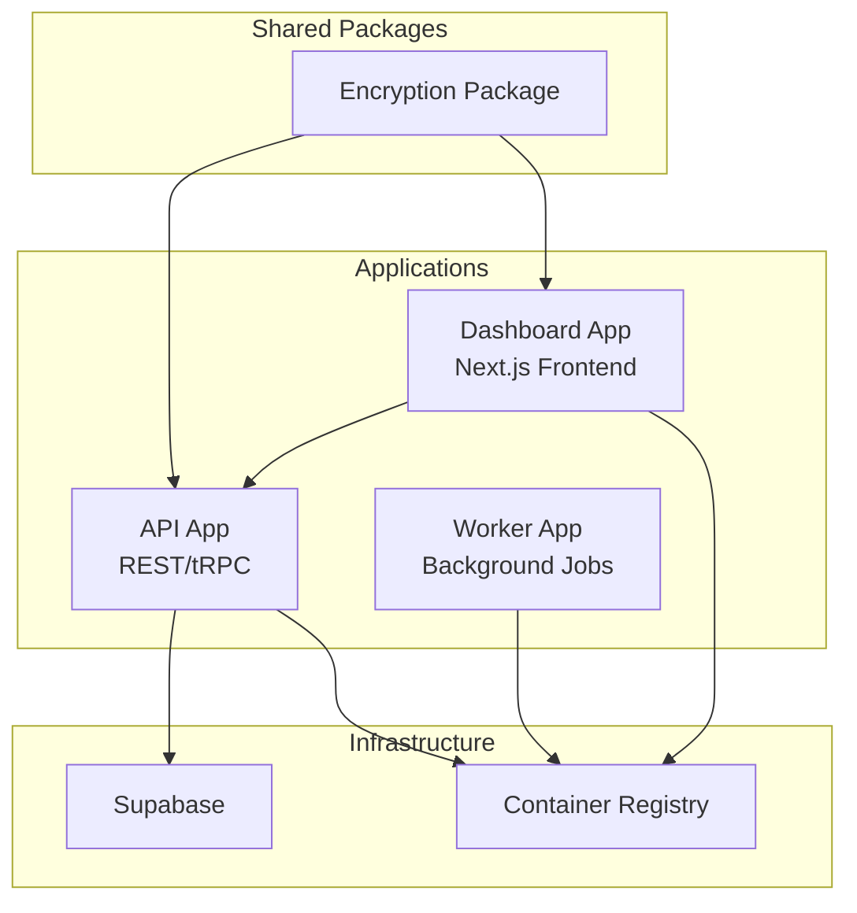
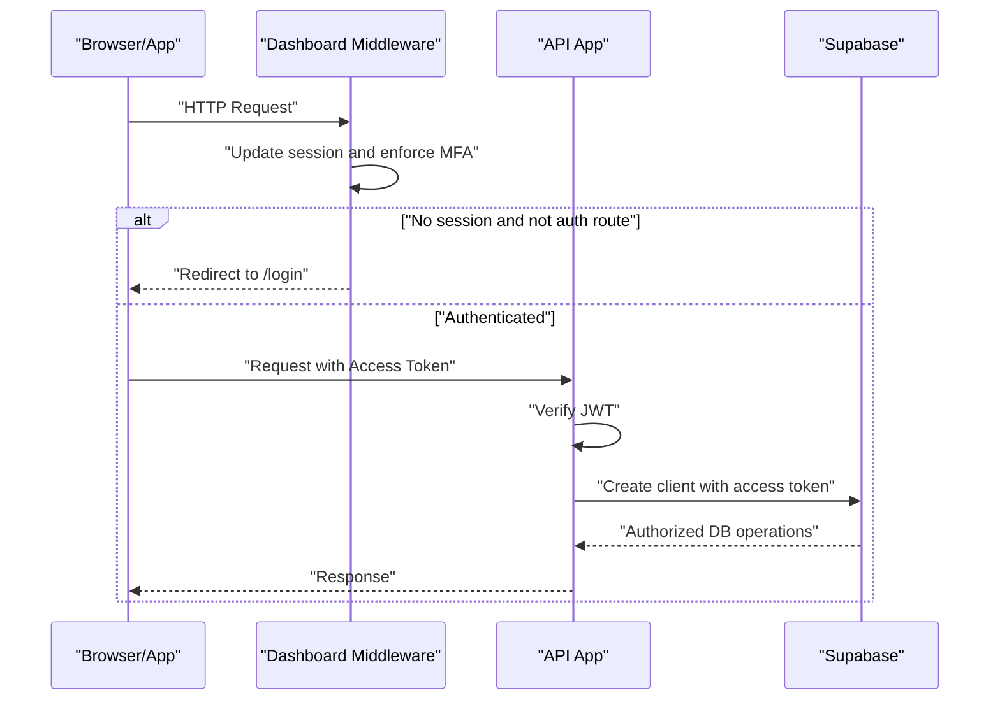
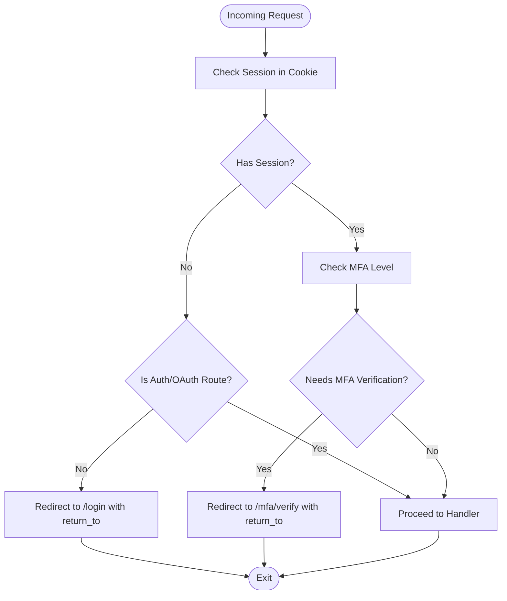
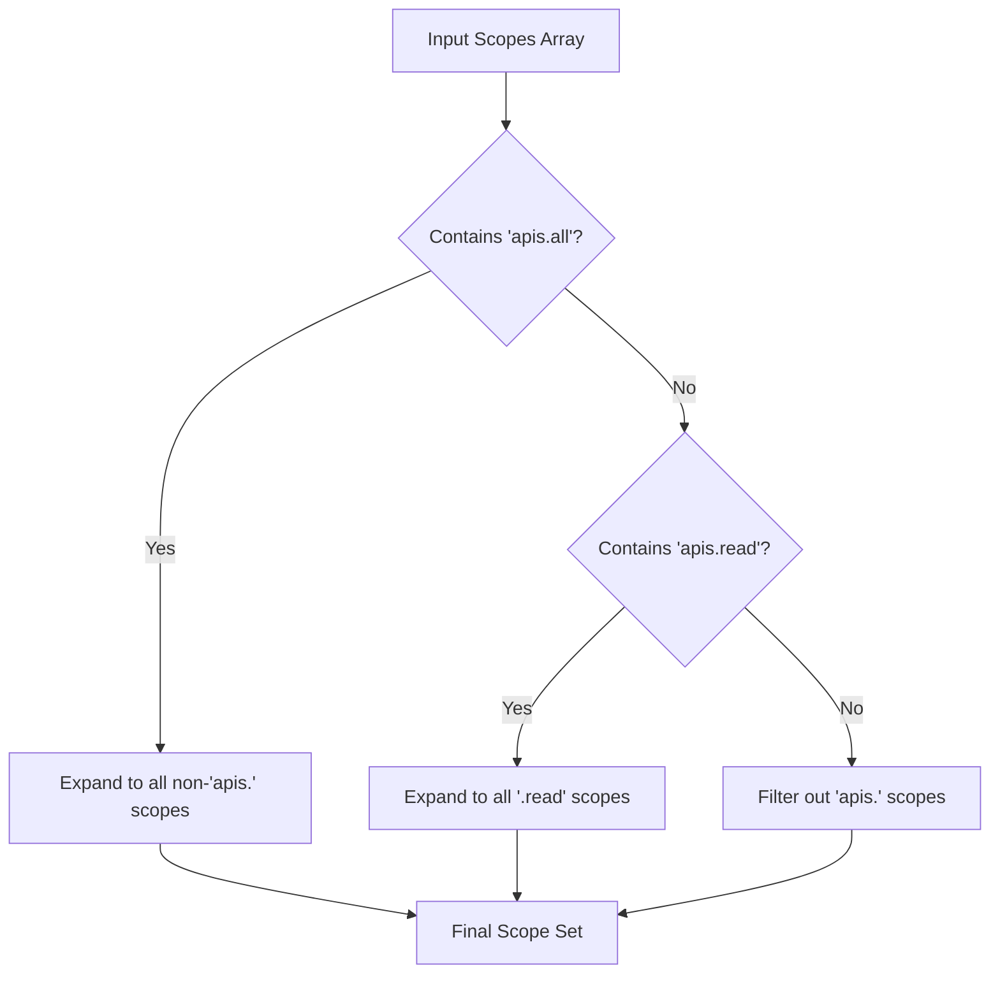
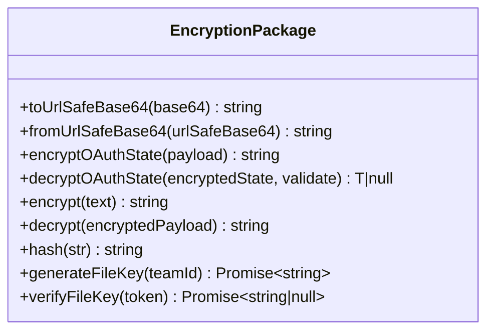
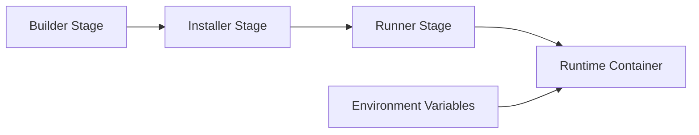
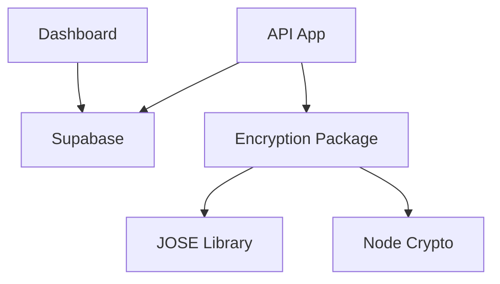

# Security & Operations

<cite>
**Referenced Files in This Document**
- [SECURITY.md](file://SECURITY.md)
- [apps/api/src/utils/auth.ts](file://apps/api/src/utils/auth.ts)
- [apps/api/src/utils/scopes.ts](file://apps/api/src/utils/scopes.ts)
- [apps/api/src/services/supabase.ts](file://apps/api/src/services/supabase.ts)
- [apps/dashboard/src/middleware.ts](file://apps/dashboard/src/middleware.ts)
- [packages/encryption/src/index.ts](file://packages/encryption/src/index.ts)
- [apps/api/Dockerfile](file://apps/api/Dockerfile)
- [apps/dashboard/Dockerfile](file://apps/dashboard/Dockerfile)
- [packages/encryption/package.json](file://packages/encryption/package.json)
</cite>

## Table of Contents
1. [Introduction](#introduction)
2. [Project Structure](#project-structure)
3. [Core Components](#core-components)
4. [Architecture Overview](#architecture-overview)
5. [Detailed Component Analysis](#detailed-component-analysis)
6. [Dependency Analysis](#dependency-analysis)
7. [Performance Considerations](#performance-considerations)
8. [Troubleshooting Guide](#troubleshooting-guide)
9. [Conclusion](#conclusion)
10. [Appendices](#appendices)

## Introduction
This document provides comprehensive security and operations guidance for Faworra. It covers authentication and authorization flows, access control and permissions, encryption strategies, database and API security, audit and vulnerability assessment, incident response, compliance and privacy, and operational security including backups and disaster recovery.

## Project Structure
Faworra is a monorepo organized around multiple applications and shared packages:
- API application: exposes REST and tRPC endpoints, handles authentication verification, and integrates with Supabase.
- Dashboard application: Next.js frontend enforcing session and MFA checks via middleware.
- Worker application: background processing and scheduling.
- Encryption package: cryptographic utilities for OAuth state, file keys, hashing, and symmetric encryption.
- Dockerfiles for API and Dashboard define production containers and runtime environments.

**Section sources**
- [apps/api/Dockerfile](file://apps/api/Dockerfile#L1-L50)
- [apps/dashboard/Dockerfile](file://apps/dashboard/Dockerfile#L1-L101)

## Core Components
- Authentication and session verification in the API rely on JWT verification against a configured secret.
- Authorization scopes define granular permissions across resources.
- Supabase client creation supports access-token-based requests.
- Dashboard enforces session and MFA via middleware and redirects unauthenticated users appropriately.
- Encryption utilities provide AES-256-GCM for state payloads, compact JWT file keys, and hashing.

**Section sources**
- [apps/api/src/utils/auth.ts](file://apps/api/src/utils/auth.ts#L1-L44)
- [apps/api/src/utils/scopes.ts](file://apps/api/src/utils/scopes.ts#L1-L96)
- [apps/api/src/services/supabase.ts](file://apps/api/src/services/supabase.ts#L1-L22)
- [apps/dashboard/src/middleware.ts](file://apps/dashboard/src/middleware.ts#L1-L86)
- [packages/encryption/src/index.ts](file://packages/encryption/src/index.ts#L1-L220)

## Architecture Overview
The system relies on Supabase for identity and database access. The API verifies access tokens and constructs Supabase clients with service keys or access tokens. The Dashboard enforces session and MFA checks and redirects to login when needed. Encryption utilities secure OAuth state and file access tokens.

**Diagram sources**
- [apps/dashboard/src/middleware.ts](file://apps/dashboard/src/middleware.ts#L13-L81)
- [apps/api/src/utils/auth.ts](file://apps/api/src/utils/auth.ts#L20-L43)
- [apps/api/src/services/supabase.ts](file://apps/api/src/services/supabase.ts#L4-L14)

## Detailed Component Analysis

### Authentication and Session Management
- Access token verification uses a shared secret to validate JWTs issued by Supabase.
- The API constructs Supabase clients either with a service key or an access token for per-request authorization.
- The Dashboard middleware updates sessions, enforces MFA progression, and redirects unauthenticated users to login while preserving intended destination.

**Diagram sources**
- [apps/dashboard/src/middleware.ts](file://apps/dashboard/src/middleware.ts#L33-L78)

**Section sources**
- [apps/api/src/utils/auth.ts](file://apps/api/src/utils/auth.ts#L20-L43)
- [apps/api/src/services/supabase.ts](file://apps/api/src/services/supabase.ts#L4-L14)
- [apps/dashboard/src/middleware.ts](file://apps/dashboard/src/middleware.ts#L13-L81)

### Authorization Scopes and Permission Management
- A fixed set of resource scopes defines read/write permissions across domains (e.g., invoices, transactions, users).
- Preset expansions normalize custom scopes into concrete permissions, ensuring consistent enforcement across APIs and UI.

**Diagram sources**
- [apps/api/src/utils/scopes.ts](file://apps/api/src/utils/scopes.ts#L80-L95)

**Section sources**
- [apps/api/src/utils/scopes.ts](file://apps/api/src/utils/scopes.ts#L1-L96)

### Encryption Strategies
- OAuth state encryption uses AES-256-GCM with URL-safe base64 encoding for transport safety.
- Compact JWT file keys are signed with HS256 and include a grace period for verification.
- Hashing uses SHA-256 for deterministic digests.

**Diagram sources**
- [packages/encryption/src/index.ts](file://packages/encryption/src/index.ts#L17-L220)

**Section sources**
- [packages/encryption/src/index.ts](file://packages/encryption/src/index.ts#L49-L84)
- [packages/encryption/src/index.ts](file://packages/encryption/src/index.ts#L112-L171)
- [packages/encryption/src/index.ts](file://packages/encryption/src/index.ts#L185-L219)
- [packages/encryption/package.json](file://packages/encryption/package.json#L1-L17)

### Database Security and API Access Control
- Supabase client creation supports per-request access tokens, enabling row-level security and fine-grained controls.
- Environment variables store secrets for JWT verification and encryption; ensure they are managed securely and rotated regularly.

**Section sources**
- [apps/api/src/services/supabase.ts](file://apps/api/src/services/supabase.ts#L4-L14)
- [apps/api/src/utils/auth.ts](file://apps/api/src/utils/auth.ts#L25-L39)

### Operational Security and Container Hardening
- Production Dockerfiles isolate runtime users, expose minimal ports, and copy only necessary artifacts.
- Build-time and runtime environment variables are handled carefully; secrets should be injected via secure orchestration.

**Diagram sources**
- [apps/api/Dockerfile](file://apps/api/Dockerfile#L8-L50)
- [apps/dashboard/Dockerfile](file://apps/dashboard/Dockerfile#L14-L101)

**Section sources**
- [apps/api/Dockerfile](file://apps/api/Dockerfile#L26-L50)
- [apps/dashboard/Dockerfile](file://apps/dashboard/Dockerfile#L73-L101)

## Dependency Analysis
- API depends on Supabase for identity and database operations and on the encryption package for secure state handling.
- Dashboard middleware depends on Supabase for MFA and session checks.
- Encryption package depends on the JOSE library for JWT operations and Node’s crypto for symmetric encryption.

**Diagram sources**
- [apps/api/src/services/supabase.ts](file://apps/api/src/services/supabase.ts#L1-L22)
- [packages/encryption/src/index.ts](file://packages/encryption/src/index.ts#L1-L2)
- [packages/encryption/package.json](file://packages/encryption/package.json#L13-L15)

**Section sources**
- [apps/api/src/services/supabase.ts](file://apps/api/src/services/supabase.ts#L1-L22)
- [packages/encryption/package.json](file://packages/encryption/package.json#L13-L15)

## Performance Considerations
- Prefer scoped access tokens and narrow permissions to reduce unnecessary database queries.
- Cache validated JWTs and file keys at the edge when appropriate, bounded by expiration and grace periods.
- Minimize encryption/decryption overhead by avoiding repeated operations in hot paths.

## Troubleshooting Guide
- Authentication failures: Verify the access token secret and that the token originates from the expected issuer.
- MFA redirection loops: Confirm MFA level checks and ensure the redirect preserves the intended destination.
- Encryption errors: Validate the encryption key format and presence, and ensure URL-safe base64 handling is consistent.
- Supabase client initialization: Confirm environment variables for URL and service key are present and correct.

**Section sources**
- [apps/api/src/utils/auth.ts](file://apps/api/src/utils/auth.ts#L25-L43)
- [apps/dashboard/src/middleware.ts](file://apps/dashboard/src/middleware.ts#L62-L78)
- [packages/encryption/src/index.ts](file://packages/encryption/src/index.ts#L94-L105)
- [apps/api/src/services/supabase.ts](file://apps/api/src/services/supabase.ts#L5-L13)

## Conclusion
Faworra implements layered security with JWT-based authentication, granular scopes, Supabase-driven authorization, and robust encryption utilities. Operational practices emphasize container hardening, secret management, and secure defaults. Align ongoing maintenance with the documented audit, vulnerability, and incident response procedures.

## Appendices

### Security Audit Procedures
- Conduct periodic reviews of access token secrets, encryption keys, and Supabase service keys.
- Validate scope expansion logic and permission boundaries across APIs and UI.
- Review middleware redirections and MFA enforcement to prevent bypasses.

**Section sources**
- [apps/api/src/utils/scopes.ts](file://apps/api/src/utils/scopes.ts#L80-L95)
- [apps/dashboard/src/middleware.ts](file://apps/dashboard/src/middleware.ts#L33-L78)

### Vulnerability Assessment Workflow
- Report findings privately to the designated security contact.
- Avoid automated scanning without prior coordination; coordinate with the team for controlled testing.
- Provide reproducible steps and affected endpoints.

**Section sources**
- [SECURITY.md](file://SECURITY.md#L1-L57)

### Incident Response Plan
- Contain: Rotate compromised secrets and revoke affected tokens.
- Eradicate: Remove vulnerable code or misconfigurations.
- Recover: Restore from verified backups and re-validate access controls.
- Communicate: Follow responsible disclosure and notify affected parties per policy.

[No sources needed since this section provides general guidance]

### Compliance and Privacy
- Data minimization: Limit collection to necessary fields and enforce scope-based access.
- Retention: Define and enforce data retention schedules aligned with jurisdictional requirements.
- Privacy: Use encryption for sensitive data at rest and in transit; avoid logging secrets.

[No sources needed since this section provides general guidance]

### Backup Verification and Disaster Recovery Testing
- Backup: Regularly snapshot database and configuration artifacts.
- Verify: Periodically restore to isolated environments and validate authentication and encryption flows.
- Test: Run disaster recovery drills simulating secret rotation and container rebuilds.

[No sources needed since this section provides general guidance]