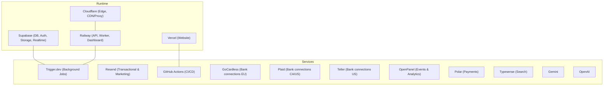
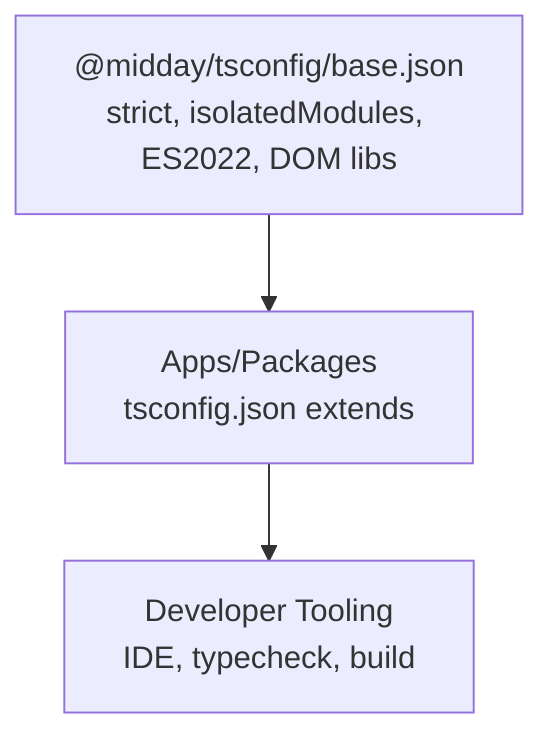
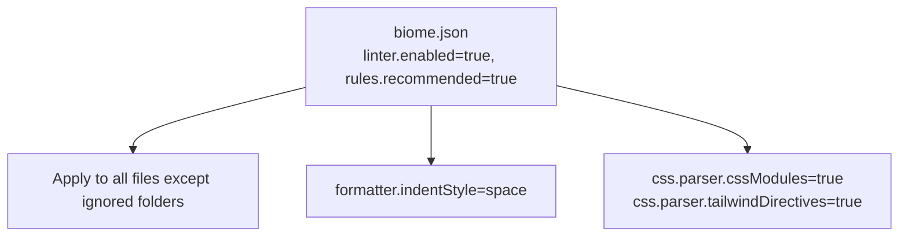
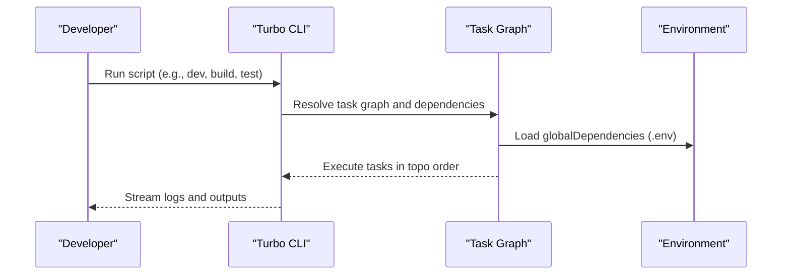
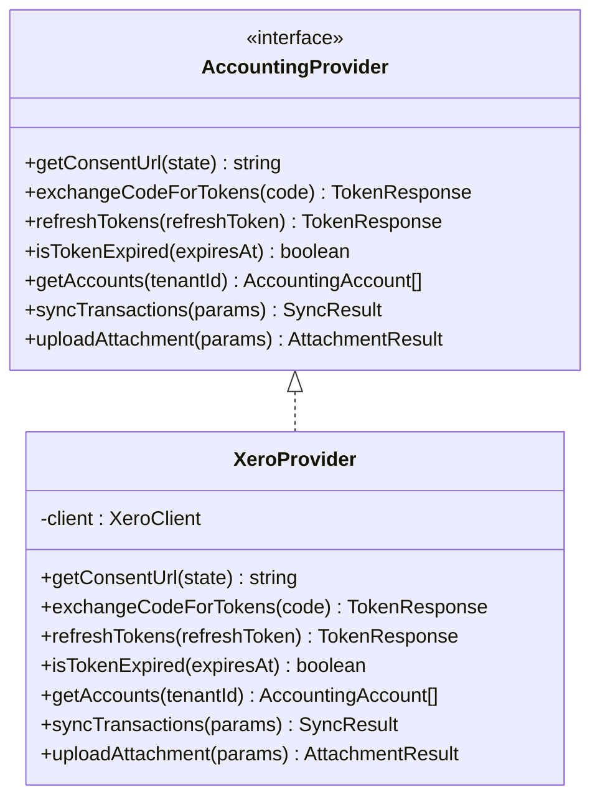
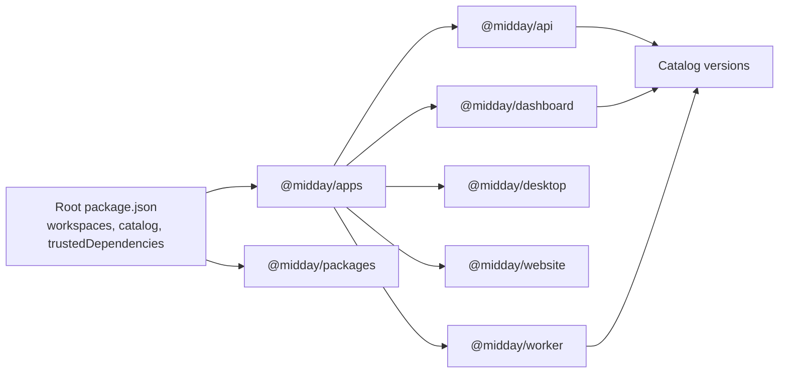

# Developer Guidelines

<cite>
**Referenced Files in This Document**
- [README.md](file://README.md)
- [SECURITY.md](file://SECURITY.md)
- [biome.json](file://biome.json)
- [package.json](file://package.json)
- [tsconfig.json](file://tsconfig.json)
- [turbo.json](file://turbo.json)
- [packages/tsconfig/package.json](file://packages/tsconfig/package.json)
- [packages/tsconfig/base.json](file://packages/tsconfig/base.json)
- [apps/api/package.json](file://apps/api/package.json)
- [apps/dashboard/package.json](file://apps/dashboard/package.json)
- [packages/accounting/ARCHITECTURE.md](file://packages/accounting/ARCHITECTURE.md)
</cite>

## Table of Contents
1. [Introduction](#introduction)
2. [Project Structure](#project-structure)
3. [Core Components](#core-components)
4. [Architecture Overview](#architecture-overview)
5. [Detailed Component Analysis](#detailed-component-analysis)
6. [Dependency Analysis](#dependency-analysis)
7. [Performance Considerations](#performance-considerations)
8. [Security Practices](#security-practices)
9. [Accessibility Guidelines](#accessibility-guidelines)
10. [Contribution Workflow](#contribution-workflow)
11. [Monorepo and Package Management](#monorepo-and-package-management)
12. [Testing Expectations](#testing-expectations)
13. [Documentation Requirements](#documentation-requirements)
14. [Release Procedures](#release-procedures)
15. [Onboarding Guide](#onboarding-guide)
16. [Project Governance](#project-governance)
17. [Troubleshooting Guide](#troubleshooting-guide)
18. [Conclusion](#conclusion)

## Introduction
This document provides comprehensive developer guidelines for contributing to Faworra. It covers code style standards using Biome, TypeScript configuration, architectural principles, contribution workflow, monorepo practices, dependency management, security, performance, accessibility, documentation, testing, releases, onboarding, and governance.

## Project Structure
Faworra is a monorepo built with Bun, organized into:
- apps: API server, Next.js dashboard, Tauri desktop app, marketing website, and background worker
- packages: Shared libraries and typed configs
- root: Workspace configuration, linting, and shared TS setup

```mermaid
graph TB
Root["Repository Root<br/>package.json, biome.json, turbo.json, tsconfig.json"]
Apps["Apps"]
Packages["Packages"]
Docs["Docs"]
Root --> Apps
Root --> Packages
Root --> Docs
Apps --> API["@midday/api"]
Apps --> Dashboard["@midday/dashboard"]
Apps --> Desktop["@midday/desktop"]
Apps --> Website["@midday/website"]
Apps --> Worker["@midday/worker"]
Packages --> TSConfig["@midday/tsconfig"]
Packages --> Accounting["@midday/accounting"]
Packages --> Banking["@midday/banking"]
Packages --> Cache["@midday/cache"]
Packages --> Categories["@midday/categories"]
Packages --> Customers["@midday/customers"]
Packages --> Db["@midday/db"]
Packages --> Documents["@midday/documents"]
Packages --> Email["@midday/email"]
Packages --> Encryption["@midday/encryption"]
Packages --> Events["@midday/events"]
Packages --> Health["@midday/health"]
Packages --> Import["@midday/import"]
Packages --> Inbox["@midday/inbox"]
Packages --> Insights["@midday/insights"]
Packages --> Invoice["@midday/invoice"]
Packages --> JobClient["@midday/job-client"]
Packages --> Jobs["@midday/jobs"]
Packages --> Location["@midday/location"]
Packages --> Logger["@midday/logger"]
Packages --> Notifications["@midday/notifications"]
Packages --> Plans["@midday/plans"]
Packages --> Supabase["@midday/supabase"]
Packages --> Trpc["@midday/trpc"]
Packages --> Ui["@midday/ui"]
Packages --> Utils["@midday/utils"]
Packages --> Workbench["@midday/workbench"]
```

**Section sources**
- [README.md](file://README.md#L42-L75)
- [package.json](file://package.json#L4-L7)
- [tsconfig.json](file://tsconfig.json#L1-L3)

## Core Components
- Linting and formatting: Biome configured via root biome.json
- Type checking: Shared TypeScript config extended by @midday/tsconfig/base.json
- Build/dev/test orchestration: Turborepo tasks and scripts
- Workspace management: Bun workspaces and catalog for consistent dependency versions

**Section sources**
- [biome.json](file://biome.json#L1-L66)
- [packages/tsconfig/base.json](file://packages/tsconfig/base.json#L1-L25)
- [package.json](file://package.json#L8-L24)
- [turbo.json](file://turbo.json#L5-L84)

## Architecture Overview
High-level architecture and runtime environment:
- Monorepo with Bun, React, Next.js, Supabase, Tauri, and Expo
- CI/CD via GitHub Actions, hosting on Supabase, Railway, Vercel, Cloudflare
- Background jobs via Trigger.dev and BullMQ queues

**Section sources**
- [README.md](file://README.md#L55-L75)

## Detailed Component Analysis

### TypeScript Configuration
- Centralized via @midday/tsconfig/base.json with strict compiler options
- Extends in apps and packages to enforce consistent type safety and module resolution

**Section sources**
- [packages/tsconfig/base.json](file://packages/tsconfig/base.json#L1-L25)
- [tsconfig.json](file://tsconfig.json#L1-L3)

### Biome Code Style
- Enabled linter with recommended rules and selective overrides
- Formatter configured with space indentation
- CSS parsing tuned for CSS Modules and Tailwind directives

**Section sources**
- [biome.json](file://biome.json#L1-L66)

### Turborepo Orchestration
- Global env passthrough for secrets and keys
- Task caching disabled for dev/test/jobs, enabled for build with explicit outputs
- Scripts in root package.json delegate to turborepo

**Section sources**
- [turbo.json](file://turbo.json#L1-L87)
- [package.json](file://package.json#L8-L24)

### Accounting Integration Architecture (Example Domain)
The accounting package demonstrates a provider abstraction, queue-driven workers, and robust retry/error handling.

**Diagram sources**
- [packages/accounting/ARCHITECTURE.md](file://packages/accounting/ARCHITECTURE.md#L9-L44)

**Section sources**
- [packages/accounting/ARCHITECTURE.md](file://packages/accounting/ARCHITECTURE.md#L1-L490)

## Dependency Analysis
- Root package.json defines workspaces for apps and packages
- Catalog section centralizes versions for major libraries
- Trusted dependencies list identifies trusted binaries/tools
- Individual apps define workspace-local dependencies and catalog-based versions

**Section sources**
- [package.json](file://package.json#L4-L7)
- [package.json](file://package.json#L27-L63)
- [apps/api/package.json](file://apps/api/package.json#L15-L77)
- [apps/dashboard/package.json](file://apps/dashboard/package.json#L16-L98)

## Performance Considerations
- Prefer batching and concurrency limits for external API calls
- Use Turborepo caching for builds and avoid caching for dev/test/jobs
- Keep type-checking incremental and isolated to reduce memory pressure
- Minimize unnecessary re-renders in UI and offload heavy work to workers

[No sources needed since this section provides general guidance]

## Security Practices
- Report vulnerabilities privately to the dedicated security contact
- Follow responsible disclosure guidelines and avoid public disclosure until resolved
- Secrets are managed via environment variables and service roles; avoid committing secrets

**Section sources**
- [SECURITY.md](file://SECURITY.md#L1-L57)

## Accessibility Guidelines
- Follow WCAG guidelines for interactive components and semantic markup
- Ensure keyboard navigation and screen reader compatibility
- Provide meaningful labels and ARIA attributes where appropriate

[No sources needed since this section provides general guidance]

## Contribution Workflow
- Branching: Use feature branches from develop/main; keep PRs focused and small
- Commit hygiene: Clear messages, minimal diffs, and relevant scope prefixes
- Pull requests: Link issues, include screenshots for UI changes, and ensure checks pass
- Code review: Address comments promptly, maintain readability, and preserve architectural consistency

[No sources needed since this section provides general guidance]

## Monorepo and Package Management
- Use workspace:* for intra-monorepo dependencies
- Prefer catalog versions for external libraries to keep versions aligned
- Run shared scripts via root (build, dev, test, lint, typecheck)
- Keep package versions synchronized across apps and packages

**Section sources**
- [apps/api/package.json](file://apps/api/package.json#L28-L49)
- [apps/dashboard/package.json](file://apps/dashboard/package.json#L28-L39)
- [package.json](file://package.json#L27-L55)
- [package.json](file://package.json#L8-L24)

## Testing Expectations
- Add unit and integration tests alongside features
- Use existing test discovery patterns in apps
- Ensure tests are hermetic and deterministic

**Section sources**
- [apps/api/package.json](file://apps/api/package.json#L9-L9)
- [apps/dashboard/package.json](file://apps/dashboard/package.json#L14-L14)

## Documentation Requirements
- Update inline docs for public APIs and complex logic
- Maintain architecture docs for major subsystems
- Keep READMEs concise and link to deeper docs

**Section sources**
- [packages/accounting/ARCHITECTURE.md](file://packages/accounting/ARCHITECTURE.md#L1-L490)

## Release Procedures
- Tag releases and publish packages when ready
- Update changelogs and notify stakeholders
- Verify environment variables and secrets before deployment

[No sources needed since this section provides general guidance]

## Onboarding Guide
- Install Bun and clone the repo
- Run setup scripts to install dependencies
- Use root scripts to start dev servers for specific apps
- Explore architecture docs for domain areas of interest

**Section sources**
- [README.md](file://README.md#L38-L41)

## Project Governance
- Decisions are made collaboratively; maintain consensus on architectural changes
- Security disclosures follow a defined process
- License is AGPL-3.0 for non-commercial use; commercial use requires separate agreement

**Section sources**
- [SECURITY.md](file://SECURITY.md#L1-L57)
- [README.md](file://README.md#L80-L89)

## Troubleshooting Guide
- Formatting/linting: Use biome format and check commands
- Type errors: Run typecheck; fix strict mode violations
- Build failures: Clear caches and rebuild; verify environment variables
- CI issues: Inspect turborepo task logs and globalDependencies

**Section sources**
- [biome.json](file://biome.json#L62-L64)
- [package.json](file://package.json#L22-L24)
- [turbo.json](file://turbo.json#L79-L84)

## Conclusion
These guidelines standardize development practices across the monorepo, ensuring consistent quality, security, and maintainability. Follow the outlined workflows and principles to contribute effectively.