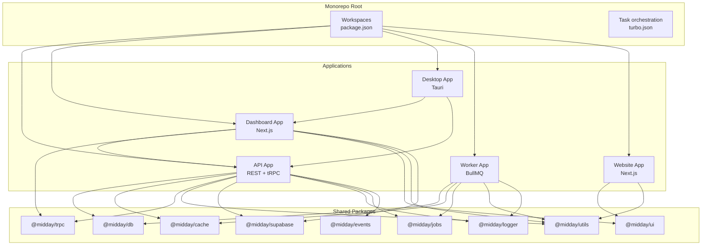
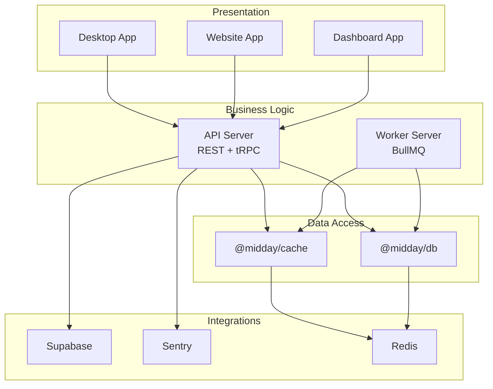
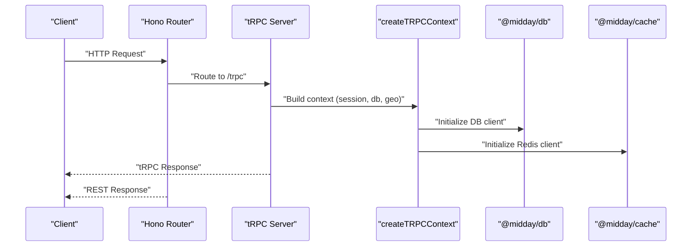
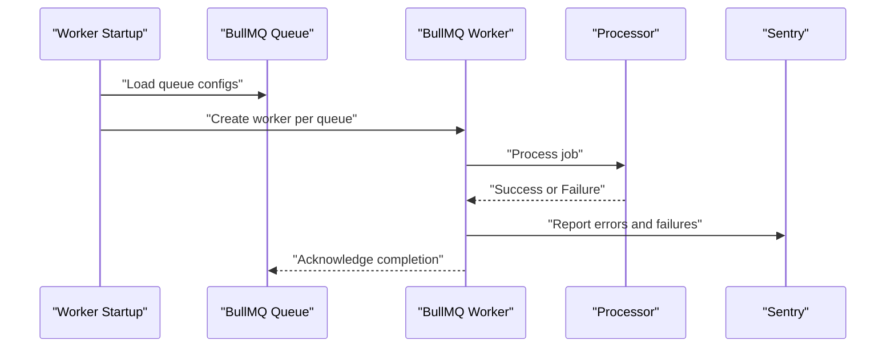
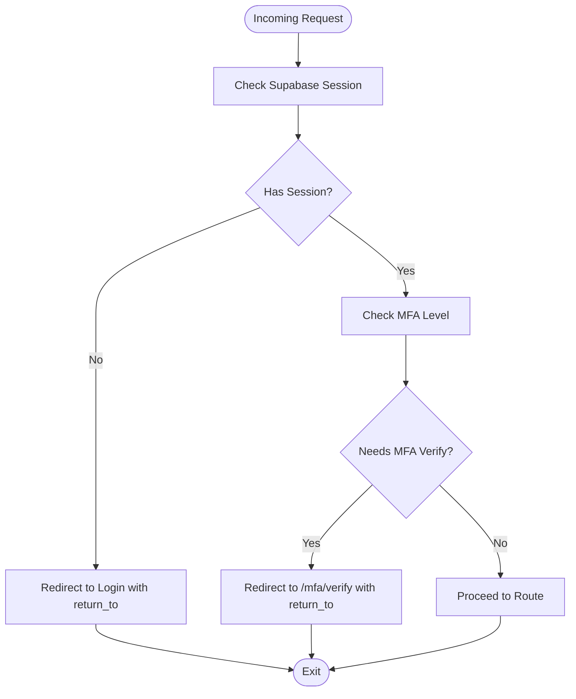
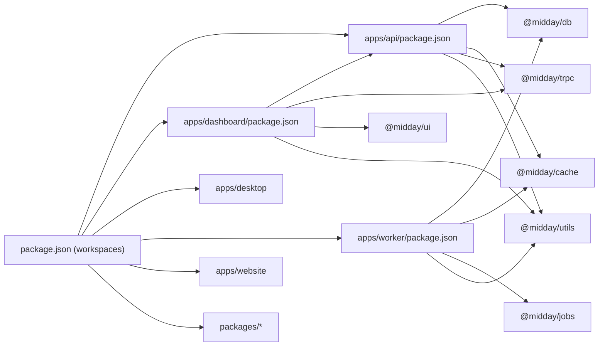

# Architecture Overview

<cite>
**Referenced Files in This Document**
- [package.json](file://package.json)
- [turbo.json](file://turbo.json)
- [apps/api/package.json](file://apps/api/package.json)
- [apps/api/src/index.ts](file://apps/api/src/index.ts)
- [apps/api/src/rest/types.ts](file://apps/api/src/rest/types.ts)
- [apps/api/src/trpc/init.ts](file://apps/api/src/trpc/init.ts)
- [apps/dashboard/package.json](file://apps/dashboard/package.json)
- [apps/dashboard/src/middleware.ts](file://apps/dashboard/src/middleware.ts)
- [apps/worker/package.json](file://apps/worker/package.json)
- [apps/worker/src/index.ts](file://apps/worker/src/index.ts)
- [packages/db/package.json](file://packages/db/package.json)
- [packages/cache/package.json](file://packages/cache/package.json)
- [packages/trpc/package.json](file://packages/trpc/package.json)
- [packages/ui/package.json](file://packages/ui/package.json)
- [packages/utils/package.json](file://packages/utils/package.json)
- [apps/website/package.json](file://apps/website/package.json)
</cite>

## Table of Contents
1. [Introduction](#introduction)
2. [Project Structure](#project-structure)
3. [Core Components](#core-components)
4. [Architecture Overview](#architecture-overview)
5. [Detailed Component Analysis](#detailed-component-analysis)
6. [Dependency Analysis](#dependency-analysis)
7. [Performance Considerations](#performance-considerations)
8. [Troubleshooting Guide](#troubleshooting-guide)
9. [Conclusion](#conclusion)

## Introduction
This document presents Faworra’s (Midday) architecture overview, focusing on the monorepo structure, layered architecture pattern, API-first design, event-driven background processing, real-time capabilities, caching strategies, and microservice-like organization within a single repository. It also covers system boundaries, component relationships, data flows, scalability considerations, and deployment topology.

## Project Structure
Faworra is a Turborepo-managed monorepo containing:
- Five main applications:
  - api: REST and tRPC API server
  - dashboard: Next.js admin frontend
  - desktop: Tauri desktop client
  - worker: Background job processor using BullMQ
  - website: Marketing and informational site
- Twenty-five plus shared packages providing reusable business logic, UI, data access, caching, and integrations

**Diagram sources**
- [package.json](file://package.json#L1-L70)
- [turbo.json](file://turbo.json#L1-L87)
- [apps/api/package.json](file://apps/api/package.json#L1-L78)
- [apps/dashboard/package.json](file://apps/dashboard/package.json#L1-L112)
- [apps/worker/package.json](file://apps/worker/package.json#L1-L57)
- [apps/website/package.json](file://apps/website/package.json#L1-L40)
- [packages/db/package.json](file://packages/db/package.json#L1-L59)
- [packages/cache/package.json](file://packages/cache/package.json#L1-L30)
- [packages/trpc/package.json](file://packages/trpc/package.json#L1-L26)
- [packages/ui/package.json](file://packages/ui/package.json#L1-L179)
- [packages/utils/package.json](file://packages/utils/package.json#L1-L24)

**Section sources**
- [package.json](file://package.json#L1-L70)
- [turbo.json](file://turbo.json#L1-L87)

## Core Components
- API Application
  - REST endpoints and tRPC procedures under a unified Hono server
  - OpenAPI documentation and scalar reference
  - Health checks, readiness probes, and Sentry error reporting
  - CORS, secure headers, and request tracing
- Dashboard Application
  - Next.js app with i18n middleware, Supabase session management, and MFA enforcement
  - Uses tRPC client and shared UI components
- Worker Application
  - Dynamic BullMQ workers consuming queues with centralized error handling and Sentry capture
  - Workbench admin UI for queue monitoring
- Shared Packages
  - @midday/db: database client, queries, schema, and utilities
  - @midday/cache: Redis clients and caches for API keys, teams, permissions, chat, and more
  - @midday/trpc: client and retry utilities
  - @midday/ui: shared UI primitives and animations
  - @midday/utils: environment helpers, formatting, and redirects
  - Others: @midday/supabase, @midday/logger, @midday/jobs, @midday/events, etc.

**Section sources**
- [apps/api/src/index.ts](file://apps/api/src/index.ts#L1-L288)
- [apps/api/src/rest/types.ts](file://apps/api/src/rest/types.ts#L1-L15)
- [apps/api/src/trpc/init.ts](file://apps/api/src/trpc/init.ts#L1-L187)
- [apps/dashboard/src/middleware.ts](file://apps/dashboard/src/middleware.ts#L1-L86)
- [apps/worker/src/index.ts](file://apps/worker/src/index.ts#L1-L312)
- [packages/db/package.json](file://packages/db/package.json#L1-L59)
- [packages/cache/package.json](file://packages/cache/package.json#L1-L30)
- [packages/trpc/package.json](file://packages/trpc/package.json#L1-L26)
- [packages/ui/package.json](file://packages/ui/package.json#L1-L179)
- [packages/utils/package.json](file://packages/utils/package.json#L1-L24)

## Architecture Overview
Faworra follows a layered architecture:
- Presentation Layer
  - Dashboard (Next.js) and Website (Next.js) deliver user experiences
  - Desktop app integrates with the dashboard and API
- Business Logic Layer
  - API exposes REST endpoints and tRPC procedures
  - Worker executes background jobs and scheduled tasks
- Data Access Layer
  - @midday/db encapsulates database connectivity and queries
  - @midday/cache provides Redis-backed caches for performance and consistency
- Integration Layer
  - Supabase for auth and session management
  - Sentry for observability and error reporting
  - BullMQ for asynchronous job processing

**Diagram sources**
- [apps/api/src/index.ts](file://apps/api/src/index.ts#L1-L288)
- [apps/worker/src/index.ts](file://apps/worker/src/index.ts#L1-L312)
- [packages/db/package.json](file://packages/db/package.json#L1-L59)
- [packages/cache/package.json](file://packages/cache/package.json#L1-L30)
- [apps/dashboard/src/middleware.ts](file://apps/dashboard/src/middleware.ts#L1-L86)

## Detailed Component Analysis

### API Application
- Responsibilities
  - Serve REST endpoints and tRPC procedures
  - Enforce authentication and permissions
  - Expose OpenAPI docs and health endpoints
  - Manage database and Redis lifecycle
- Key flows
  - Request enters via Hono router, applies CORS and secure headers
  - tRPC server delegates to appRouter with a context factory that builds session, Supabase client, DB client, and geo context
  - REST routers are mounted under the root path
  - Health endpoints report readiness and dependency status
  - Graceful shutdown closes DB and Redis connections and flushes Sentry

**Diagram sources**
- [apps/api/src/index.ts](file://apps/api/src/index.ts#L1-L288)
- [apps/api/src/trpc/init.ts](file://apps/api/src/trpc/init.ts#L1-L187)
- [apps/api/src/rest/types.ts](file://apps/api/src/rest/types.ts#L1-L15)

**Section sources**
- [apps/api/src/index.ts](file://apps/api/src/index.ts#L1-L288)
- [apps/api/src/trpc/init.ts](file://apps/api/src/trpc/init.ts#L1-L187)
- [apps/api/src/rest/types.ts](file://apps/api/src/rest/types.ts#L1-L15)

### Worker Application
- Responsibilities
  - Consume BullMQ queues with dynamic workers
  - Centralized error handling and Sentry reporting
  - Provide Workbench admin UI for queue inspection
  - Health checks and graceful shutdown
- Key flows
  - On startup, iterate queue configs and spawn workers
  - Attach error and failed handlers to capture exceptions and job failures
  - Initialize Workbench dashboard with optional auth
  - Expose health/readiness endpoints and info endpoint listing queues

**Diagram sources**
- [apps/worker/src/index.ts](file://apps/worker/src/index.ts#L1-L312)

**Section sources**
- [apps/worker/src/index.ts](file://apps/worker/src/index.ts#L1-L312)

### Dashboard Application
- Responsibilities
  - Enforce session and MFA policies via middleware
  - Integrate with Supabase for auth
  - Provide localized routing and navigation
- Key flows
  - Middleware validates session and enforces MFA transitions
  - Redirects unauthenticated users to login while preserving return_to
  - Routes excluded from auth include public pages and OAuth callbacks

**Diagram sources**
- [apps/dashboard/src/middleware.ts](file://apps/dashboard/src/middleware.ts#L1-L86)

**Section sources**
- [apps/dashboard/src/middleware.ts](file://apps/dashboard/src/middleware.ts#L1-L86)

### Shared Packages
- @midday/db
  - Provides database client, worker client, job client, schema, SQL utilities, and health helpers
  - Exported entry points enable reuse across API and Worker
- @midday/cache
  - Offers Redis clients and caches for API keys, teams, permissions, chat, and widget preferences
  - Includes shared-redis client and bun-redis-adapter
- @midday/trpc
  - Client and retry utilities for tRPC consumers
- @midday/ui
  - Extensive UI primitives, animations, and Tailwind configuration
- @midday/utils
  - Environment helpers, formatting, redirect sanitization, and tax utilities

**Section sources**
- [packages/db/package.json](file://packages/db/package.json#L1-L59)
- [packages/cache/package.json](file://packages/cache/package.json#L1-L30)
- [packages/trpc/package.json](file://packages/trpc/package.json#L1-L26)
- [packages/ui/package.json](file://packages/ui/package.json#L1-L179)
- [packages/utils/package.json](file://packages/utils/package.json#L1-L24)

## Dependency Analysis
- Monorepo tooling
  - Workspaces define package locations for API, dashboard, desktop, worker, website, and packages/*
  - Turborepo orchestrates builds, dev servers, and persistent jobs
- Application dependencies
  - API depends on @midday/db, @midday/cache, @midday/trpc, @midday/utils, Supabase, Sentry, and others
  - Dashboard depends on @midday/api, @midday/trpc, @midday/ui, @midday/utils, Supabase
  - Worker depends on @midday/db, @midday/cache, @midday/jobs, @midday/utils, Sentry, and BullMQ
- Task orchestration
  - Turbo tasks define inputs, outputs, and environment variables for build/dev/start/jobs
  - Persistent jobs task supports long-running worker processes

**Diagram sources**
- [package.json](file://package.json#L1-L70)
- [apps/api/package.json](file://apps/api/package.json#L1-L78)
- [apps/dashboard/package.json](file://apps/dashboard/package.json#L1-L112)
- [apps/worker/package.json](file://apps/worker/package.json#L1-L57)
- [apps/website/package.json](file://apps/website/package.json#L1-L40)
- [packages/db/package.json](file://packages/db/package.json#L1-L59)
- [packages/cache/package.json](file://packages/cache/package.json#L1-L30)
- [packages/trpc/package.json](file://packages/trpc/package.json#L1-L26)
- [packages/ui/package.json](file://packages/ui/package.json#L1-L179)
- [packages/utils/package.json](file://packages/utils/package.json#L1-L24)

**Section sources**
- [package.json](file://package.json#L1-L70)
- [turbo.json](file://turbo.json#L1-L87)
- [apps/api/package.json](file://apps/api/package.json#L1-L78)
- [apps/dashboard/package.json](file://apps/dashboard/package.json#L1-L112)
- [apps/worker/package.json](file://apps/worker/package.json#L1-L57)
- [apps/website/package.json](file://apps/website/package.json#L1-L40)

## Performance Considerations
- Database pooling and statistics
  - API and Worker log database pool stats at intervals configurable via environment variables
  - Workers gracefully close DB connections on shutdown to avoid leaks
- Request tracing and timing
  - API logs tRPC procedure timings and JWT/Supa client creation durations when enabled
  - Worker logs job processing durations and worker lifecycle events
- Caching
  - Shared Redis caches reduce repeated reads and improve latency for frequently accessed data
- Observability
  - Sentry captures unhandled exceptions and rejections, aiding performance diagnostics and incident response

**Section sources**
- [apps/api/src/index.ts](file://apps/api/src/index.ts#L67-L86)
- [apps/api/src/trpc/init.ts](file://apps/api/src/trpc/init.ts#L18-L68)
- [apps/worker/src/index.ts](file://apps/worker/src/index.ts#L205-L226)

## Troubleshooting Guide
- Health and readiness
  - API exposes /health and /health/ready endpoints; readiness checks validate dependencies
  - Worker exposes /health and /health/ready endpoints; readiness checks validate DB and Redis
- Error handling
  - API captures unhandled route errors and tRPC errors to Sentry
  - Worker captures worker errors, job failures, and unhandled exceptions/rejections to Sentry
- Graceful shutdown
  - API and Worker close DB and Redis connections and flush Sentry before exiting
- Logging
  - Structured logs include request IDs, Cloudflare Ray IDs, and pool stats for correlation

**Section sources**
- [apps/api/src/index.ts](file://apps/api/src/index.ts#L118-L130)
- [apps/api/src/index.ts](file://apps/api/src/index.ts#L201-L211)
- [apps/worker/src/index.ts](file://apps/worker/src/index.ts#L172-L182)
- [apps/worker/src/index.ts](file://apps/worker/src/index.ts#L279-L281)

## Conclusion
Faworra’s architecture combines a monorepo with a layered design, an API-first approach, and event-driven background processing. The separation between presentation, business logic, and data access enables maintainability and scalability. Shared packages promote reuse across applications, while BullMQ and Redis power reliable asynchronous workflows. Health checks, Sentry, and structured logging support operational excellence, and Turborepo streamlines development and deployment across the five main applications and twenty-five-plus shared packages.