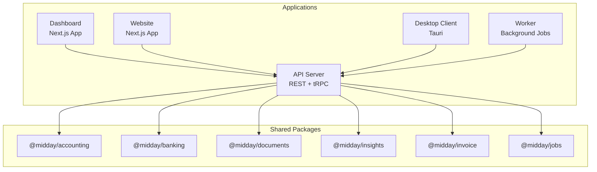
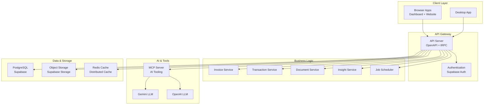
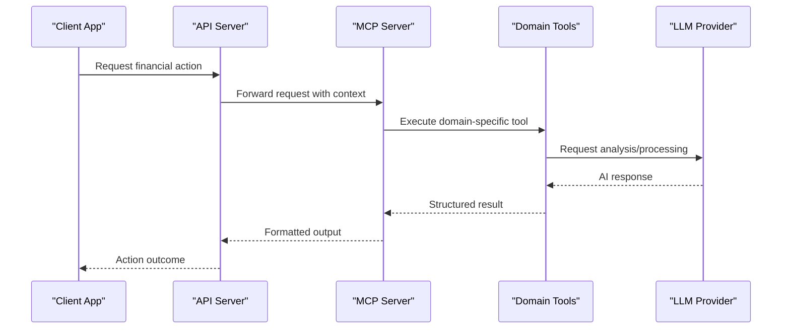
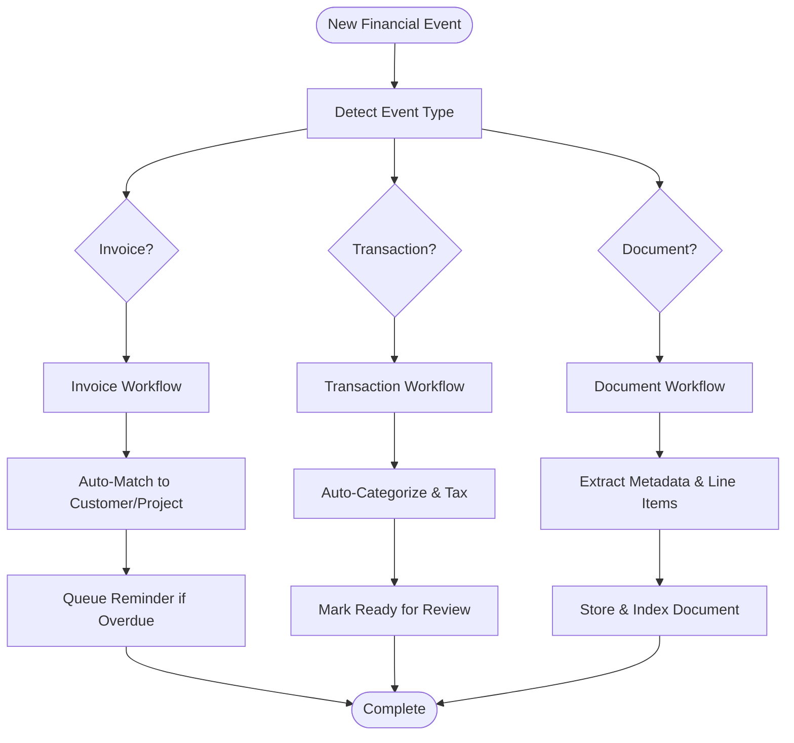
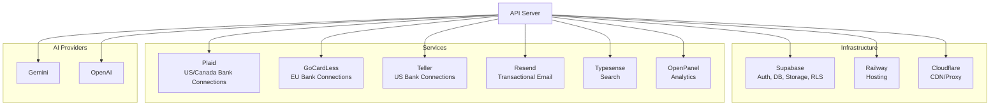

# Introduction

<cite>
**Referenced Files in This Document**
- [midday/README.md](file://midday/README.md)
- [midday/apps/api/README.md](file://midday/apps/api/README.md)
- [midday/apps/api/src/index.ts](file://midday/apps/api/src/index.ts)
- [midday/apps/api/src/schemas/invoice.ts](file://midday/apps/api/src/schemas/invoice.ts)
- [midday/apps/api/src/schemas/transactions.ts](file://midday/apps/api/src/schemas/transactions.ts)
- [midday/apps/api/src/schemas/documents.ts](file://midday/apps/api/src/schemas/documents.ts)
- [midday/apps/api/src/mcp/server.ts](file://midday/apps/api/src/mcp/server.ts)
- [midday/docs/README.md](file://midday/docs/README.md)
</cite>

## Table of Contents
1. [Introduction](#introduction)
2. [Project Structure](#project-structure)
3. [Core Components](#core-components)
4. [Architecture Overview](#architecture-overview)
5. [Detailed Component Analysis](#detailed-component-analysis)
6. [Dependency Analysis](#dependency-analysis)
7. [Performance Considerations](#performance-considerations)
8. [Troubleshooting Guide](#troubleshooting-guide)
9. [Conclusion](#conclusion)

## Introduction
Faworra (formerly Midday) is an AI-powered business automation platform designed to streamline financial operations for modern businesses. Its mission is to eliminate manual bookkeeping tasks through intelligent automation, enabling teams to focus on growth while the platform handles repetitive financial processes.

At its core, Faworra solves the time-consuming problems that plague small and growing businesses:
- Time wasted on invoice processing and follow-ups
- Manual expense tracking and categorization
- Lengthy bank reconciliation cycles
- Fragmented financial data across multiple tools

By automating these tasks, Faworra delivers measurable benefits:
- Increased operational efficiency through intelligent automation
- Reduced human errors via structured workflows and AI-driven matching
- Enhanced financial insights with automated reporting and projections

Target market and focus:
- Primarily serves freelancers, contractors, consultants, and small to medium-sized enterprises
- Emphasizes ease of use for non-technical users while providing powerful automation
- Designed for teams that need a unified solution for invoicing, expense tracking, document management, and financial insights

Value proposition for different audiences:
- For business owners: Save hours each week on bookkeeping, reduce mistakes, and gain actionable financial insights
- For technical decision-makers: Modern, extensible architecture with AI tooling, robust APIs, and scalable infrastructure

## Project Structure
The repository follows a monorepo layout with distinct applications and shared packages:
- apps/api: Core backend service exposing REST and tRPC APIs, AI tooling, and business logic
- apps/dashboard: Web application for managing finances, invoices, and insights
- apps/website: Public marketing site and documentation
- apps/desktop: Desktop client built with Tauri for offline access
- apps/worker: Background job processing for automation tasks
- packages: Shared libraries for accounting, banking, notifications, and utilities
- docs: Technical documentation for key features and algorithms

**Diagram sources**
- [midday/README.md](file://midday/README.md#L42-L54)
- [midday/apps/api/src/index.ts](file://midday/apps/api/src/index.ts#L1-L288)

**Section sources**
- [midday/README.md](file://midday/README.md#L42-L54)
- [midday/apps/api/README.md](file://midday/apps/api/README.md#L1-L76)

## Core Components
Faworra’s automation capabilities are built around three pillars:

1) AI-Powered Matching and Processing
- Automatic invoice and receipt matching to transactions
- Document processing with AI classification and extraction
- Deterministic inbox matching with team calibration and verification

2) Intelligent Financial Workflows
- Automated invoice creation, reminders, and status tracking
- Smart expense categorization and tax calculation
- Recurring transaction detection and management

3) Unified Financial Intelligence
- Real-time dashboards and insights
- Automated reporting and projections
- Seamless integrations with banking providers

Key schemas demonstrate the platform’s automation-first approach:
- Invoice processing with templating, line items, and status tracking
- Transaction management with categorization, tags, and export readiness
- Document processing with metadata extraction and storage

**Section sources**
- [midday/README.md](file://midday/README.md#L21-L34)
- [midday/apps/api/src/schemas/invoice.ts](file://midday/apps/api/src/schemas/invoice.ts#L1-L800)
- [midday/apps/api/src/schemas/transactions.ts](file://midday/apps/api/src/schemas/transactions.ts#L1-L800)
- [midday/apps/api/src/schemas/documents.ts](file://midday/apps/api/src/schemas/documents.ts#L1-L269)

## Architecture Overview
Faworra employs a modern microservices architecture with clear separation of concerns:

**Diagram sources**
- [midday/README.md](file://midday/README.md#L42-L75)
- [midday/apps/api/src/index.ts](file://midday/apps/api/src/index.ts#L132-L174)
- [midday/apps/api/src/mcp/server.ts](file://midday/apps/api/src/mcp/server.ts#L1-L48)

The architecture emphasizes:
- Scalable API design with OpenAPI and tRPC
- AI tooling via Model Context Protocol (MCP) for extensible automation
- Distributed caching for performance and consistency
- Multi-region database support for reliability
- Modular services for maintainability

**Section sources**
- [midday/README.md](file://midday/README.md#L42-L75)
- [midday/apps/api/src/index.ts](file://midday/apps/api/src/index.ts#L132-L174)
- [midday/apps/api/src/mcp/server.ts](file://midday/apps/api/src/mcp/server.ts#L1-L48)

## Detailed Component Analysis

### AI-Powered Automation Engine
Faworra’s AI engine operates through the Model Context Protocol (MCP), providing structured tools for financial automation:

**Diagram sources**
- [midday/apps/api/src/mcp/server.ts](file://midday/apps/api/src/mcp/server.ts#L20-L47)

The MCP server registers tools across domains:
- Transactions: Categorization, matching, and status updates
- Invoices: Creation, reminders, and lifecycle management
- Documents: Classification and metadata extraction
- Banking: Account linking and transaction sync
- Insights: Reporting and predictive analytics

**Section sources**
- [midday/apps/api/src/mcp/server.ts](file://midday/apps/api/src/mcp/server.ts#L1-L48)

### Financial Workflows: Invoices, Transactions, and Documents
Faworra’s core schemas define the automation workflows:

**Diagram sources**
- [midday/apps/api/src/schemas/invoice.ts](file://midday/apps/api/src/schemas/invoice.ts#L686-L713)
- [midday/apps/api/src/schemas/transactions.ts](file://midday/apps/api/src/schemas/transactions.ts#L552-L667)
- [midday/apps/api/src/schemas/documents.ts](file://midday/apps/api/src/schemas/documents.ts#L103-L109)

**Section sources**
- [midday/apps/api/src/schemas/invoice.ts](file://midday/apps/api/src/schemas/invoice.ts#L1-L800)
- [midday/apps/api/src/schemas/transactions.ts](file://midday/apps/api/src/schemas/transactions.ts#L1-L800)
- [midday/apps/api/src/schemas/documents.ts](file://midday/apps/api/src/schemas/documents.ts#L1-L269)

### Conceptual Overview
Faworra transforms traditional financial workflows by embedding intelligence at every step. Instead of manual data entry and reconciliation, the platform:
- Automatically ingests financial data from bank feeds
- Matches receipts and invoices to transactions
- Categorizes expenses and calculates taxes
- Generates invoices and sends reminders
- Produces insights and forecasts

[No sources needed since this diagram shows conceptual workflow, not actual code structure]

## Dependency Analysis
Faworra’s external dependencies reflect a modern cloud-native stack:

**Diagram sources**
- [midday/README.md](file://midday/README.md#L62-L75)

**Section sources**
- [midday/README.md](file://midday/README.md#L62-L75)

## Performance Considerations
- Distributed caching with Redis ensures low-latency access to frequently used data
- Multi-region database setup with read replicas improves availability and performance
- Background job processing offloads heavy computations from request threads
- API gateway with CORS and security headers optimizes client-server communication
- Monitoring and observability integrated with Sentry and health checks

[No sources needed since this section provides general guidance]

## Troubleshooting Guide
Common operational concerns and resolutions:
- Health checks: Use the `/health` endpoint to verify service readiness
- Dependency probes: Monitor external service connectivity via `/health/dependencies`
- Database pool monitoring: Configure periodic logging of connection pool statistics
- Graceful shutdown: The API supports SIGTERM/SIGINT with connection cleanup
- Error tracking: Centralized logging and Sentry integration for production issues

**Section sources**
- [midday/apps/api/src/index.ts](file://midday/apps/api/src/index.ts#L118-L130)
- [midday/apps/api/src/index.ts](file://midday/apps/api/src/index.ts#L186-L199)
- [midday/apps/api/src/index.ts](file://midday/apps/api/src/index.ts#L217-L254)
- [midday/apps/api/README.md](file://midday/apps/api/README.md#L50-L76)

## Conclusion
Faworra represents a paradigm shift in business finance management. By combining AI-powered automation with a modern, scalable architecture, it addresses the core pain points that drain productivity from financial operations. For business owners, it means more time focusing on growth and less time on bookkeeping. For technical leaders, it offers a robust, extensible foundation that can evolve with organizational needs.

The platform’s commitment to intelligent automation, unified workflows, and transparent architecture positions it as a strong choice for organizations seeking to transform their financial operations through technology.