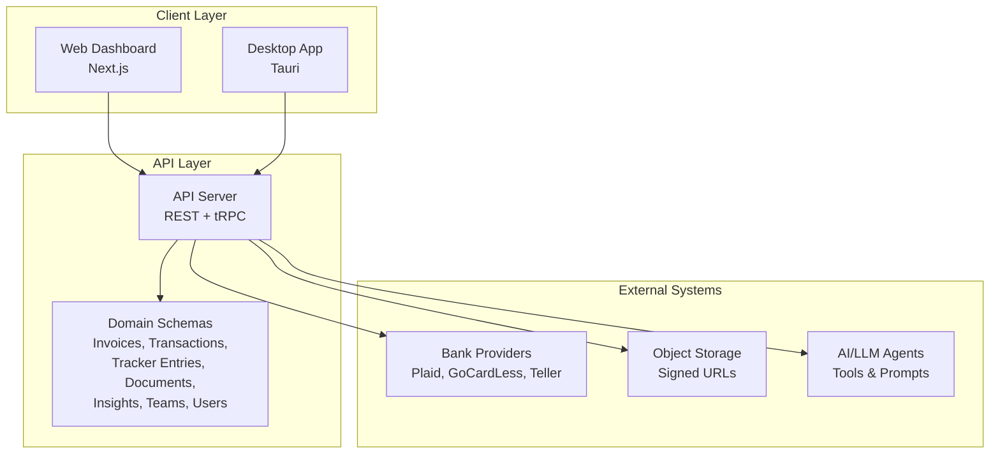
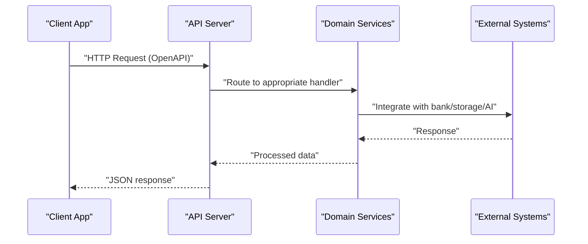
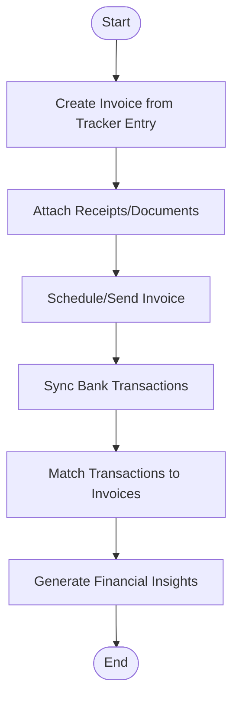
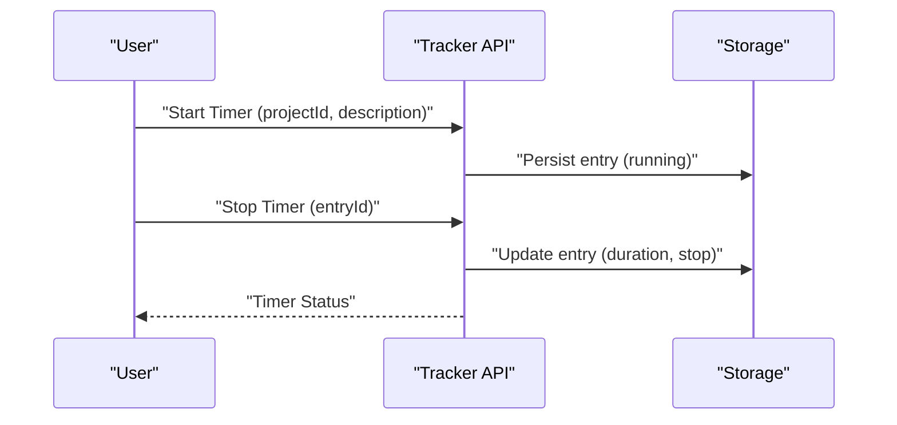
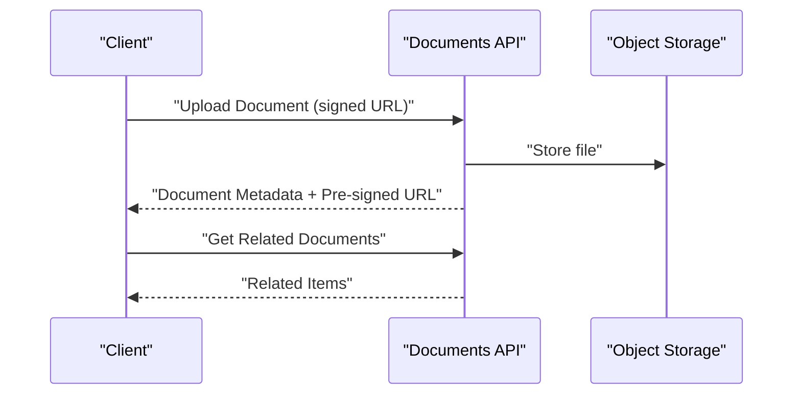
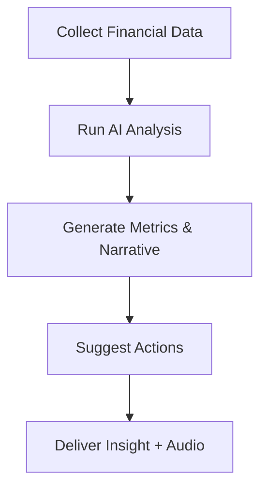
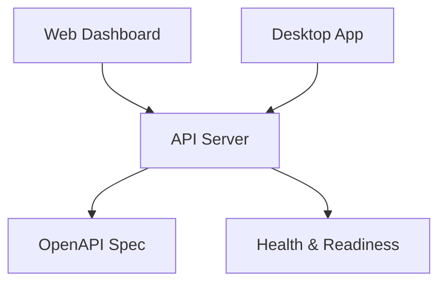
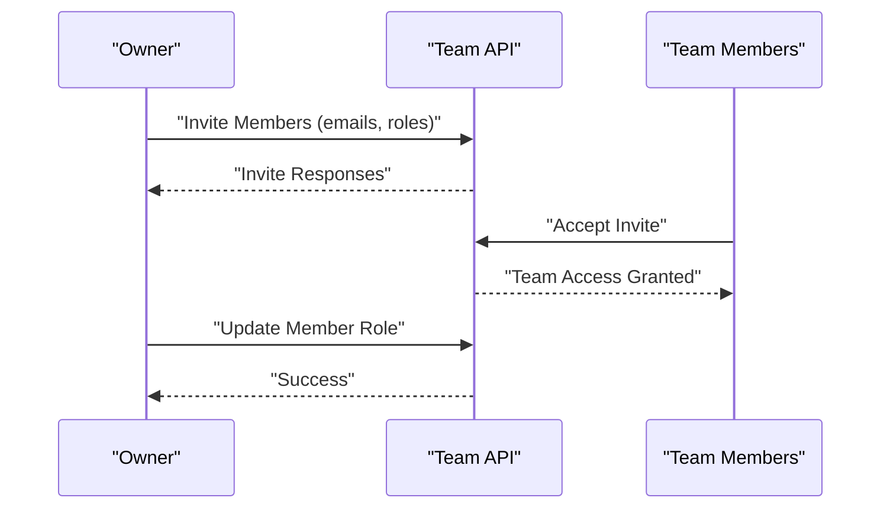
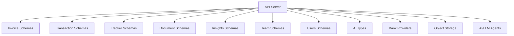

# Key Features

<cite>
**Referenced Files in This Document**
- [README.md](file://midday/README.md)
- [index.ts](file://midday/apps/api/src/index.ts)
- [invoice.ts](file://midday/apps/api/src/schemas/invoice.ts)
- [transactions.ts](file://midday/apps/api/src/schemas/transactions.ts)
- [tracker-entries.ts](file://midday/apps/api/src/schemas/tracker-entries.ts)
- [documents.ts](file://midday/apps/api/src/schemas/documents.ts)
- [insights.ts](file://midday/apps/api/src/schemas/insights.ts)
- [types.ts](file://midday/apps/api/src/ai/types.ts)
- [team.ts](file://midday/apps/api/src/schemas/team.ts)
- [users.ts](file://midday/apps/api/src/schemas/users.ts)
</cite>

## Table of Contents
1. [Introduction](#introduction)
2. [Project Structure](#project-structure)
3. [Core Components](#core-components)
4. [Architecture Overview](#architecture-overview)
5. [Detailed Component Analysis](#detailed-component-analysis)
6. [Dependency Analysis](#dependency-analysis)
7. [Performance Considerations](#performance-considerations)
8. [Troubleshooting Guide](#troubleshooting-guide)
9. [Conclusion](#conclusion)

## Introduction
This document presents Faworra’s key feature areas as implemented in the codebase. It focuses on how Financial Management (invoicing, expense tracking, bank reconciliation), Time & Project Management (time tracking, project allocation), Document Management (multi-format upload, AI processing), AI-Powered Insights (financial analytics, recommendations), Multi-Platform Access (web dashboard, desktop app, API), and Team Collaboration (user management, permissions) are structured and integrated. Each feature area includes capabilities, benefits, integration points, and practical use cases that demonstrate how the platform automates business workflows end-to-end.

## Project Structure
Faworra is a monorepo with three primary applications:
- API service exposing REST and tRPC endpoints
- Web dashboard built with Next.js
- Desktop client using Tauri

The API defines schemas for core domains (invoices, transactions, tracker entries, documents, insights, teams, users) and serves as the integration hub for all features. The dashboard and desktop consume these APIs to deliver a cohesive multi-platform experience.

**Diagram sources**
- [index.ts](file://midday/apps/api/src/index.ts#L1-L288)
- [README.md](file://midday/README.md#L42-L75)

**Section sources**
- [README.md](file://midday/README.md#L42-L75)
- [index.ts](file://midday/apps/api/src/index.ts#L1-L288)

## Core Components
This section outlines the six major feature categories and how they are represented in the codebase.

- Financial Management
  - Invoicing: invoice templates, line items, products, creation/update/reminders, scheduling, and status management.
  - Expense tracking: transaction ingestion, categorization, tagging, status tracking, and export controls.
  - Bank reconciliation: bank account connections, provider integrations, and transaction matching.

- Time & Project Management
  - Time tracking: timer lifecycle (start/stop/pause), entries by date/range, durations, rates, and billing flags.
  - Project allocation: project metadata, billable estimates, customer linkage, and assignment.

- Document Management
  - Multi-format upload: signed URLs, MIME types, sizes, and storage paths.
  - AI processing: document summaries, processing status, and related document discovery.

- AI-Powered Insights
  - Financial analytics: periodic insights with metrics, narratives, and recommended actions.
  - Recommendations: actionable suggestions surfaced from AI agents and tools.

- Multi-Platform Access
  - Web dashboard: Next.js app consuming API endpoints.
  - Desktop app: Tauri-based native client.
  - API: OpenAPI spec, CORS, security schemes, and health endpoints.

- Team Collaboration
  - User management: profile settings, locale/timezone/date preferences.
  - Permissions: team membership, roles (owner/member), invites, and base currency.

**Section sources**
- [invoice.ts](file://midday/apps/api/src/schemas/invoice.ts#L1-L800)
- [transactions.ts](file://midday/apps/api/src/schemas/transactions.ts#L1-L800)
- [tracker-entries.ts](file://midday/apps/api/src/schemas/tracker-entries.ts#L1-L409)
- [documents.ts](file://midday/apps/api/src/schemas/documents.ts#L1-L269)
- [insights.ts](file://midday/apps/api/src/schemas/insights.ts#L1-L290)
- [team.ts](file://midday/apps/api/src/schemas/team.ts#L1-L340)
- [users.ts](file://midday/apps/api/src/schemas/users.ts#L1-L156)
- [types.ts](file://midday/apps/api/src/ai/types.ts#L1-L27)
- [index.ts](file://midday/apps/api/src/index.ts#L1-L288)

## Architecture Overview
The API exposes OpenAPI endpoints and tRPC routers. Clients (web/dashboard and desktop) call the API for all feature interactions. The API orchestrates integrations with external systems (bank providers, storage) and AI agents/tools for insights and document processing.

**Diagram sources**
- [index.ts](file://midday/apps/api/src/index.ts#L132-L176)
- [README.md](file://midday/README.md#L62-L75)

## Detailed Component Analysis

### Financial Management
Financial Management spans invoicing, expense tracking, and bank reconciliation.

- Invoicing
  - Templates and line items support rich customization (payment details, taxes, units, QR inclusion).
  - Drafts, creation, updates, reminders, scheduling, duplication, and status transitions.
  - Products catalog supports reusable line items with pricing and tax rates.

- Expense tracking
  - Comprehensive transaction listing with filters (categories, tags, accounts, statuses, amounts, types).
  - Transaction CRUD, status updates, recurring flags, and attachment handling.
  - Similarity and match search for intelligent linking.

- Bank reconciliation
  - Bank account and connection schemas indicate provider integrations.
  - Transaction ingestion and matching tie receipts/invoices to recorded expenses.

Benefits:
- Automated invoice generation and reminders reduce admin overhead.
- Categorization and tagging streamline reporting and tax prep.
- Bank connections minimize manual data entry and improve accuracy.

Integration points:
- Transactions feed into insights and reporting.
- Invoices link to time tracking for billing.
- Documents (receipts) attach to transactions and invoices.

Use case scenario:
- A freelancer creates an invoice from a time-tracking entry, attaches receipt PDFs, schedules payment, and sends reminders. The system auto-categorizes expenses and generates weekly insights.

**Diagram sources**
- [invoice.ts](file://midday/apps/api/src/schemas/invoice.ts#L686-L724)
- [transactions.ts](file://midday/apps/api/src/schemas/transactions.ts#L699-L746)
- [insights.ts](file://midday/apps/api/src/schemas/insights.ts#L10-L34)

**Section sources**
- [invoice.ts](file://midday/apps/api/src/schemas/invoice.ts#L1-L800)
- [transactions.ts](file://midday/apps/api/src/schemas/transactions.ts#L1-L800)

### Time & Project Management
Time tracking and project allocation enable accurate billing and resource planning.

Capabilities:
- Timer lifecycle: start, stop, pause, continue from entry, and current status queries.
- Batch entry creation and date-range retrieval.
- Entry metadata: user, project, description, duration, rate, currency, and billed flag.

Benefits:
- Real-time visibility into billable hours.
- Seamless conversion to invoices and revenue tracking.
- Project-level estimates and customer attribution.

Integration points:
- Tracker entries feed into invoicing and insights.
- Projects link to customers and time allocations.

Use case scenario:
- A developer tracks daily work against a project, pauses for meetings, and resumes later. At month-end, tracked hours are converted into proforma invoices.

**Diagram sources**
- [tracker-entries.ts](file://midday/apps/api/src/schemas/tracker-entries.ts#L297-L343)

**Section sources**
- [tracker-entries.ts](file://midday/apps/api/src/schemas/tracker-entries.ts#L1-L409)

### Document Management
Document Management supports multi-format uploads and AI-driven processing.

Capabilities:
- List, search, and retrieve documents with metadata (size, MIME type).
- Pre-signed URLs for secure access and downloads.
- Reprocessing and related document discovery.
- AI processing status and summaries.

Benefits:
- Centralized storage for contracts, invoices, receipts, and reports.
- AI-powered extraction improves searchability and categorization.
- Controlled access via signed URLs.

Integration points:
- Documents attach to transactions and invoices.
- AI agents/processors enrich document content.

Use case scenario:
- Upload a PDF receipt, receive a summary and processing status, and link it to a transaction for audit trail.

**Diagram sources**
- [documents.ts](file://midday/apps/api/src/schemas/documents.ts#L103-L160)

**Section sources**
- [documents.ts](file://midday/apps/api/src/schemas/documents.ts#L1-L269)

### AI-Powered Insights
AI Insights provide financial analytics and recommendations.

Capabilities:
- Periodic insights (weekly/monthly/quarterly/yearly) with metrics and narratives.
- Recommended actions with optional deep links to entities (invoice, project, customer, transaction).
- Audio playback URLs for accessibility.
- Dismissal and read tracking.

Benefits:
- Proactive financial awareness with actionable recommendations.
- Narratives explain trends and anomalies.
- Accessibility via audio summaries.

Integration points:
- Insights leverage transaction and invoice data.
- Tools and agents inform recommendations.

Use case scenario:
- Weekly insight highlights unusual spending, suggests cost-cutting actions, and provides a downloadable audio summary.

**Diagram sources**
- [insights.ts](file://midday/apps/api/src/schemas/insights.ts#L150-L225)
- [types.ts](file://midday/apps/api/src/ai/types.ts#L1-L27)

**Section sources**
- [insights.ts](file://midday/apps/api/src/schemas/insights.ts#L1-L290)
- [types.ts](file://midday/apps/api/src/ai/types.ts#L1-L27)

### Multi-Platform Access
Multi-Platform Access ensures consistent experiences across web, desktop, and API.

Capabilities:
- Web dashboard built with Next.js consumes API endpoints.
- Desktop app built with Tauri provides native access.
- API exposes OpenAPI spec, CORS, security schemes, and health checks.

Benefits:
- Consistent workflows across devices.
- Developer-friendly API for third-party integrations.

Integration points:
- All clients call the same API routes.
- Health and readiness endpoints support deployment monitoring.

Use case scenario:
- A user manages finances on the web dashboard, reviews insights on the desktop app, and automates integrations via the API.

**Diagram sources**
- [index.ts](file://midday/apps/api/src/index.ts#L132-L176)

**Section sources**
- [index.ts](file://midday/apps/api/src/index.ts#L1-L288)
- [README.md](file://midday/README.md#L42-L75)

### Team Collaboration
Team Collaboration covers user management and permissions.

Capabilities:
- Team profiles, base currency, fiscal year, and export settings.
- Member invites, role updates (owner/member), and removal.
- User preferences: locale, timezone, date/time formats, and file keys for secure access.

Benefits:
- Shared access with granular permission control.
- Consistent regional settings across the team.
- Secure file access via team-scoped tokens.

Integration points:
- Documents and files carry team context.
- Insights and reports reflect team-level data.

Use case scenario:
- Owner invites members, assigns roles, sets base currency, and shares documents securely using file keys.

**Diagram sources**
- [team.ts](file://midday/apps/api/src/schemas/team.ts#L278-L298)
- [users.ts](file://midday/apps/api/src/schemas/users.ts#L126-L131)

**Section sources**
- [team.ts](file://midday/apps/api/src/schemas/team.ts#L1-L340)
- [users.ts](file://midday/apps/api/src/schemas/users.ts#L1-L156)

## Dependency Analysis
The API acts as the central dependency for all features. Clients depend on API stability, while the API depends on external systems for data and processing.

**Diagram sources**
- [index.ts](file://midday/apps/api/src/index.ts#L1-L288)
- [README.md](file://midday/README.md#L62-L75)

**Section sources**
- [index.ts](file://midday/apps/api/src/index.ts#L1-L288)
- [README.md](file://midday/README.md#L62-L75)

## Performance Considerations
- API performance logging and tracing are enabled conditionally for diagnostics.
- Database pool statistics are logged periodically to monitor connection usage.
- Health and readiness endpoints facilitate deployment monitoring and scaling decisions.

Recommendations:
- Monitor pool stats and adjust intervals based on workload.
- Use pagination and filters for large datasets (transactions, documents, insights).
- Cache frequently accessed metadata (templates, categories) at the application level.

**Section sources**
- [index.ts](file://midday/apps/api/src/index.ts#L178-L199)
- [transactions.ts](file://midday/apps/api/src/schemas/transactions.ts#L3-L243)
- [documents.ts](file://midday/apps/api/src/schemas/documents.ts#L3-L50)
- [insights.ts](file://midday/apps/api/src/schemas/insights.ts#L10-L34)

## Troubleshooting Guide
- API health and readiness: Use the health endpoints to verify service availability and dependency status.
- Error handling: Global error handlers capture unhandled exceptions and rejections, sending telemetry to Sentry.
- Graceful shutdown: Database connections and Redis clients are closed during process termination signals.

Operational checks:
- Verify CORS configuration allows expected origins.
- Confirm security headers and bearer token scheme are respected.
- Review pool stats logs to detect connection pressure.

**Section sources**
- [index.ts](file://midday/apps/api/src/index.ts#L118-L130)
- [index.ts](file://midday/apps/api/src/index.ts#L201-L211)
- [index.ts](file://midday/apps/api/src/index.ts#L217-L254)

## Conclusion
Faworra’s six feature areas are tightly integrated around a robust API that connects financial workflows, time/project tracking, document management, AI insights, multi-platform access, and team collaboration. Together, they form a cohesive business automation solution that reduces manual effort, improves accuracy, and empowers data-driven decisions across invoicing, expenses, time, documents, and team coordination.