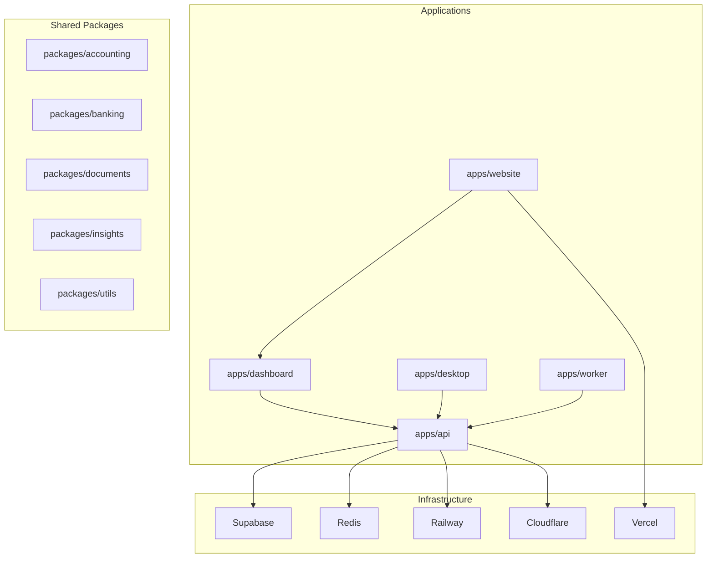
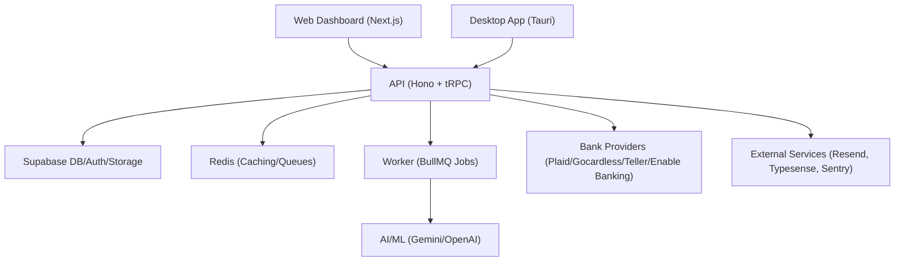
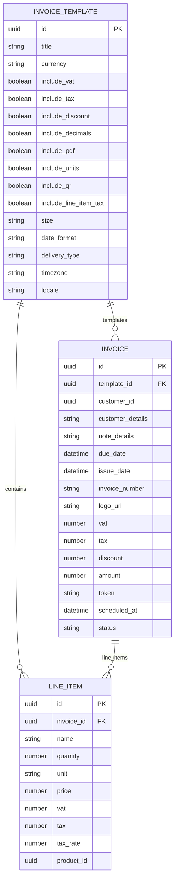
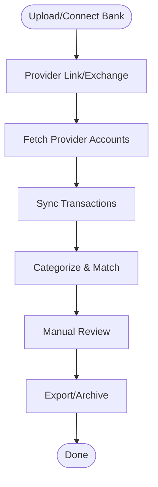
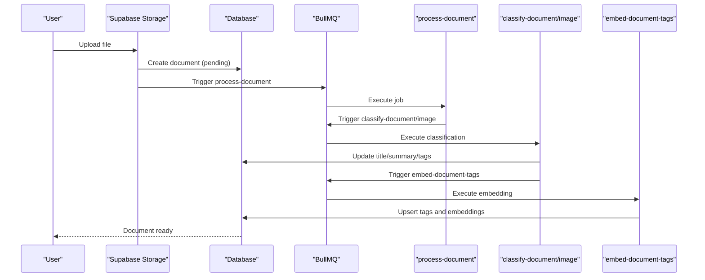
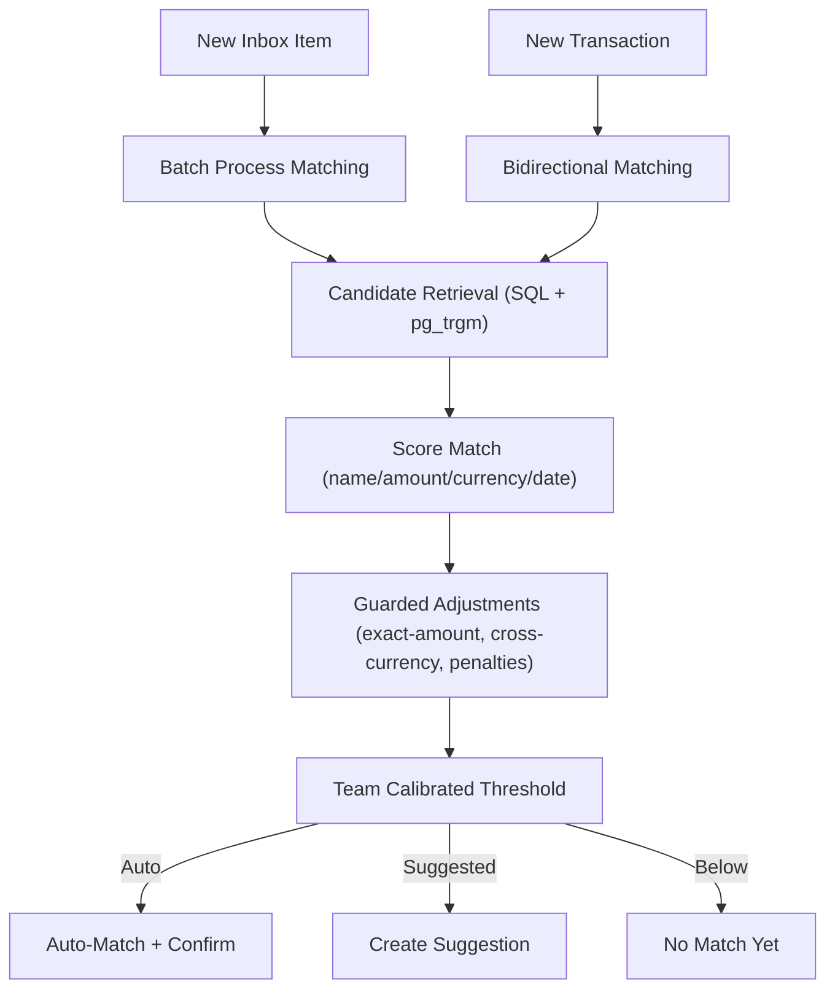
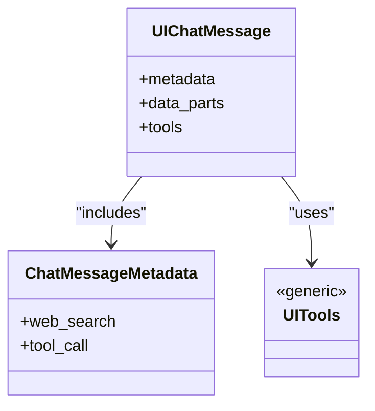
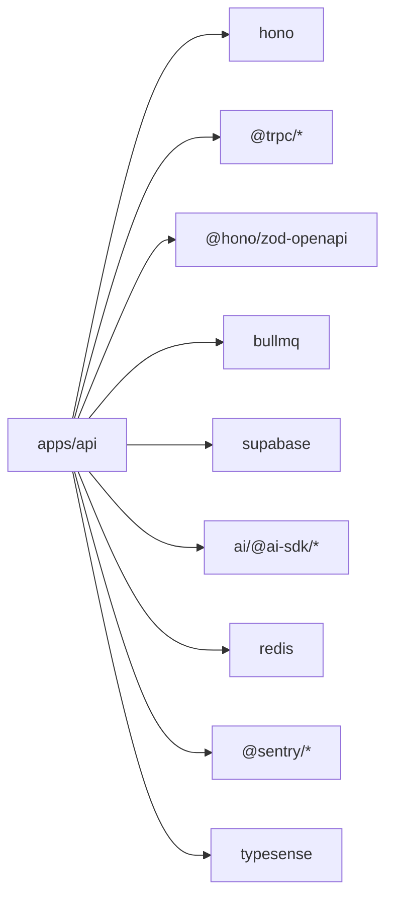

# Project Overview

<cite>
**Referenced Files in This Document**
- [README.md](file://midday/README.md)
- [package.json](file://midday/package.json)
- [apps/api/README.md](file://midday/apps/api/README.md)
- [apps/api/src/schemas/invoice.ts](file://midday/apps/api/src/schemas/invoice.ts)
- [apps/api/src/schemas/transactions.ts](file://midday/apps/api/src/schemas/transactions.ts)
- [apps/api/src/schemas/documents.ts](file://midday/apps/api/src/schemas/documents.ts)
- [apps/api/src/schemas/banking.ts](file://midday/apps/api/src/schemas/banking.ts)
- [apps/api/src/ai/types.ts](file://midday/apps/api/src/ai/types.ts)
- [apps/desktop/README.md](file://midday/apps/desktop/README.md)
- [docs/document-processing.md](file://midday/docs/document-processing.md)
- [docs/inbox-matching.md](file://midday/docs/inbox-matching.md)
</cite>

## Table of Contents
1. [Introduction](#introduction)
2. [Project Structure](#project-structure)
3. [Core Components](#core-components)
4. [Architecture Overview](#architecture-overview)
5. [Detailed Component Analysis](#detailed-component-analysis)
6. [Dependency Analysis](#dependency-analysis)
7. [Performance Considerations](#performance-considerations)
8. [Troubleshooting Guide](#troubleshooting-guide)
9. [Conclusion](#conclusion)

## Introduction
Faworra (formerly Midday) is an AI-powered business automation platform designed to streamline financial operations for freelancers, contractors, consultants, and small teams. It unifies invoicing, time tracking, banking reconciliation, document processing, and intelligent insights into a single cohesive system. The platform emphasizes automation, intelligent matching, and seamless integrations to reduce manual effort and improve accuracy.

Key value propositions:
- Intelligent automation: AI-driven document classification, matching, and insights reduce manual work.
- Unified financial operations: Invoicing, transactions, and documents in one place.
- Multi-environment accessibility: Web dashboard, desktop application, and API for flexible deployment.
- Real-time integrations: Bank connections across regions and providers for automated reconciliation.
- Scalable infrastructure: Monorepo architecture with modern tooling and cloud-native hosting.

Target audience:
- Freelancers and solopreneurs managing their own books.
- Small teams and agencies needing streamlined invoicing and expense tracking.
- Bookkeepers and accountants supporting small businesses with automated workflows.

Core business benefits:
- Faster invoice cycles and improved cash flow via smart templates and reminders.
- Reduced time spent on categorizing expenses and reconciling bank statements.
- Enhanced visibility with intelligent insights and reporting.
- Lower operational overhead through automated document processing and matching.

## Project Structure
The project is organized as a monorepo with multiple applications and shared packages:
- apps/api: Backend service exposing REST and tRPC APIs, AI/ML orchestration, and business logic.
- apps/dashboard: Next.js-based web dashboard for end-user interactions.
- apps/desktop: Tauri-based desktop application for offline-capable workflows.
- apps/website: Public marketing site and landing pages.
- apps/worker: Background job processing using BullMQ for document and data tasks.
- packages/*: Shared libraries for accounting, banking, documents, insights, and utilities.
- docs: Internal documentation for features like document processing and inbox matching.

Technology stack overview:
- Frontend: Next.js, React, TypeScript, TailwindCSS, Shadcn UI.
- Backend: Hono (web framework), tRPC, Zod (schema validation), Supabase (database, auth, storage).
- AI/ML: Gemini, OpenAI, and related tooling for document classification and insights.
- Infrastructure: Bun, Turborepo, Redis, BullMQ, Docker, and cloud providers (Railway, Supabase, Vercel, Cloudflare).

**Diagram sources**
- [package.json](file://midday/package.json#L1-L70)
- [README.md](file://midday/README.md#L42-L75)

**Section sources**
- [README.md](file://midday/README.md#L21-L75)
- [package.json](file://midday/package.json#L1-L70)

## Core Components
- Invoicing: Full lifecycle for creating, templating, scheduling, and tracking invoices with rich metadata and editor support.
- Transactions and Banking: Bank connections, transaction ingestion, categorization, and reconciliation workflows.
- Document Processing: Automated classification, tagging, and search-ready metadata generation with graceful fallbacks.
- Inbox Matching: Deterministic algorithm to link inbox documents to transactions using name, amount, currency, and date signals.
- Insights: AI-powered summaries and recommendations for financial trends and anomalies.
- Desktop Application: Native desktop client for offline access and environment switching.

High-level feature descriptions:
- Time tracking: Live project timers and productivity insights.
- Magic Inbox: Automatic matching of incoming invoices/receipts to transactions.
- Vault: Secure, searchable storage for contracts, invoices, and receipts.
- Seamless export: CSV exports for accountants and integrations.
- Assistant: Financial insights and document discovery powered by AI.

Use case scenarios:
- Onboarding a new client: Create a template, generate a draft invoice, schedule sending, and track status.
- Monthly reconciliation: Import bank transactions, run inbox matching, and reconcile discrepancies.
- Document onboarding: Upload receipts, rely on AI classification, and search by tags or content.
- Cross-border payments: Handle multi-currency transactions with automatic currency conversion and categorization.

**Section sources**
- [README.md](file://midday/README.md#L26-L34)
- [apps/api/src/schemas/invoice.ts](file://midday/apps/api/src/schemas/invoice.ts#L1-L120)
- [apps/api/src/schemas/transactions.ts](file://midday/apps/api/src/schemas/transactions.ts#L1-L120)
- [apps/api/src/schemas/documents.ts](file://midday/apps/api/src/schemas/documents.ts#L1-L120)
- [apps/api/src/schemas/banking.ts](file://midday/apps/api/src/schemas/banking.ts#L1-L92)
- [docs/document-processing.md](file://midday/docs/document-processing.md#L1-L18)
- [docs/inbox-matching.md](file://midday/docs/inbox-matching.md#L1-L26)

## Architecture Overview
Multi-platform architecture:
- Web dashboard (Next.js): Primary UI for invoicing, transactions, documents, and settings.
- Desktop application (Tauri): Native client supporting development, staging, and production environments.
- API (Hono + tRPC): Centralized business logic, validation, and AI orchestration.
- Worker (BullMQ): Asynchronous processing for document classification, embeddings, and background jobs.
- Integrations: Bank providers (GoCardless, Plaid, Teller, Enable Banking), AI providers (Gemini, OpenAI), and cloud services (Supabase, Railway, Vercel, Cloudflare).

**Diagram sources**
- [apps/desktop/README.md](file://midday/apps/desktop/README.md#L1-L80)
- [apps/api/README.md](file://midday/apps/api/README.md#L1-L76)
- [README.md](file://midday/README.md#L55-L75)

**Section sources**
- [apps/desktop/README.md](file://midday/apps/desktop/README.md#L1-L80)
- [apps/api/README.md](file://midday/apps/api/README.md#L1-L76)
- [README.md](file://midday/README.md#L42-L75)

## Detailed Component Analysis

### Invoicing System
The invoicing module defines comprehensive schemas for templates, line items, drafts, and full invoices. It supports rich editor content, timezone-aware rendering, and flexible delivery options (create, send, schedule).

**Diagram sources**
- [apps/api/src/schemas/invoice.ts](file://midday/apps/api/src/schemas/invoice.ts#L76-L150)
- [apps/api/src/schemas/invoice.ts](file://midday/apps/api/src/schemas/invoice.ts#L407-L479)
- [apps/api/src/schemas/invoice.ts](file://midday/apps/api/src/schemas/invoice.ts#L192-L283)

**Section sources**
- [apps/api/src/schemas/invoice.ts](file://midday/apps/api/src/schemas/invoice.ts#L1-L120)
- [apps/api/src/schemas/invoice.ts](file://midday/apps/api/src/schemas/invoice.ts#L120-L220)
- [apps/api/src/schemas/invoice.ts](file://midday/apps/api/src/schemas/invoice.ts#L220-L335)
- [apps/api/src/schemas/invoice.ts](file://midday/apps/api/src/schemas/invoice.ts#L335-L405)

### Transactions and Banking
Banking schemas define provider enums, account types, and connection flows. Transaction schemas support extensive filtering, categorization, and status management.

**Diagram sources**
- [apps/api/src/schemas/banking.ts](file://midday/apps/api/src/schemas/banking.ts#L1-L92)
- [apps/api/src/schemas/transactions.ts](file://midday/apps/api/src/schemas/transactions.ts#L1-L120)

**Section sources**
- [apps/api/src/schemas/banking.ts](file://midday/apps/api/src/schemas/banking.ts#L1-L92)
- [apps/api/src/schemas/transactions.ts](file://midday/apps/api/src/schemas/transactions.ts#L1-L120)

### Document Processing Pipeline
The document processing pipeline automates classification, tagging, and embedding with graceful degradation and retry mechanisms.

**Diagram sources**
- [docs/document-processing.md](file://midday/docs/document-processing.md#L18-L70)
- [docs/document-processing.md](file://midday/docs/document-processing.md#L125-L177)

**Section sources**
- [docs/document-processing.md](file://midday/docs/document-processing.md#L1-L18)
- [docs/document-processing.md](file://midday/docs/document-processing.md#L179-L234)
- [docs/document-processing.md](file://midday/docs/document-processing.md#L235-L294)
- [docs/document-processing.md](file://midday/docs/document-processing.md#L295-L354)

### Inbox Matching Algorithm
The inbox matching system uses a deterministic scoring model to link inbox documents to transactions, incorporating name similarity, amount proximity, currency alignment, and date sensitivity, with team-calibrated thresholds and hard-negative memory.

**Diagram sources**
- [docs/inbox-matching.md](file://midday/docs/inbox-matching.md#L27-L44)
- [docs/inbox-matching.md](file://midday/docs/inbox-matching.md#L60-L75)
- [docs/inbox-matching.md](file://midday/docs/inbox-matching.md#L102-L124)

**Section sources**
- [docs/inbox-matching.md](file://midday/docs/inbox-matching.md#L1-L26)
- [docs/inbox-matching.md](file://midday/docs/inbox-matching.md#L60-L124)
- [docs/inbox-matching.md](file://midday/docs/inbox-matching.md#L126-L184)

### AI/ML Orchestration
AI orchestration coordinates tooling, messages, and agents for intelligent insights and document processing. The UI chat message type supports metadata and tool choices, enabling structured AI interactions.

**Diagram sources**
- [apps/api/src/ai/types.ts](file://midday/apps/api/src/ai/types.ts#L1-L27)

**Section sources**
- [apps/api/src/ai/types.ts](file://midday/apps/api/src/ai/types.ts#L1-L27)

## Dependency Analysis
Internal and external dependencies:
- Internal: Shared packages for accounting, banking, documents, insights, and utilities.
- External: Hono, tRPC, Zod, BullMQ, Redis, Supabase, AI SDKs, Sentry, Typesense, and CI/CD tooling.

**Diagram sources**
- [package.json](file://midday/package.json#L43-L55)

**Section sources**
- [package.json](file://midday/package.json#L1-L70)

## Performance Considerations
- Caching and consistency: Distributed caching with Redis and replication tracking for read-after-write consistency across multiple server instances.
- Queue concurrency and rate limiting: Controlled concurrency and limiter configuration to avoid provider rate limits and memory pressure.
- Image optimization: Resizing and HEIC conversion to optimize vision model performance and cost.
- Graceful degradation: Documents always reach a usable state even if AI classification fails, ensuring user access and retry capability.

[No sources needed since this section provides general guidance]

## Troubleshooting Guide
Common areas to investigate:
- API cache configuration: Verify Redis URLs and environment-specific settings for cache and queue clients.
- Document processing retries: Use the reprocessDocument endpoint and UI retry controls to recover from transient failures.
- Inbox matching thresholds: Review team-calibrated thresholds and evaluation scripts for accuracy tuning.
- Bank provider connectivity: Validate provider credentials and exchange flows for Plaid, GoCardless, Teller, and Enable Banking.

**Section sources**
- [apps/api/README.md](file://midday/apps/api/README.md#L50-L76)
- [docs/document-processing.md](file://midday/docs/document-processing.md#L235-L294)
- [docs/inbox-matching.md](file://midday/docs/inbox-matching.md#L102-L124)

## Conclusion
Faworra delivers a comprehensive, AI-enhanced solution for financial operations with a focus on automation, accuracy, and accessibility. Its multi-platform architecture enables flexible deployment, while robust schemas and workflows ensure scalability and reliability. By combining intelligent document processing, deterministic matching, and seamless integrations, it empowers users to manage invoicing, transactions, and insights with minimal manual effort.

[No sources needed since this section summarizes without analyzing specific files]