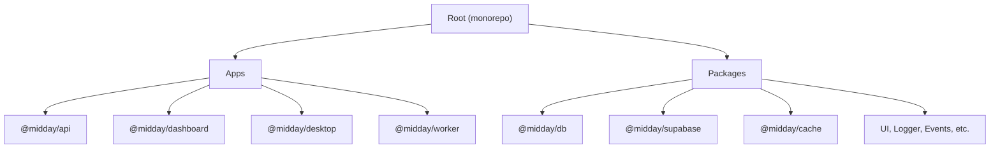
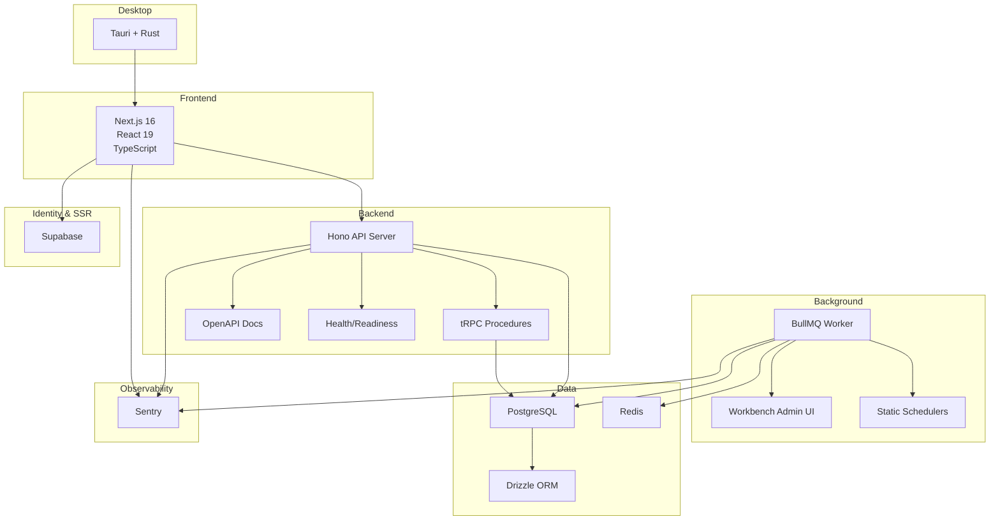
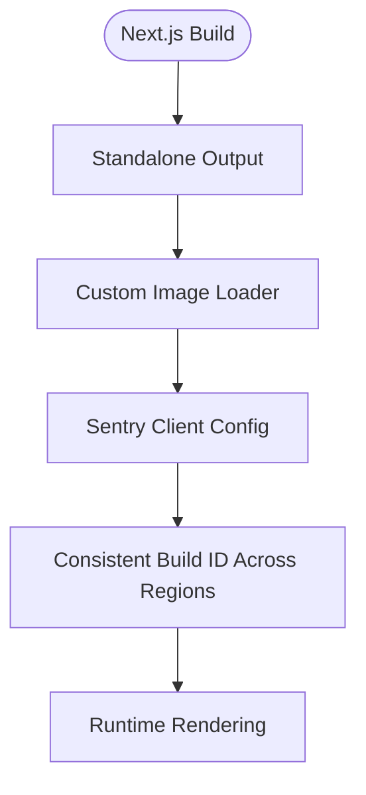
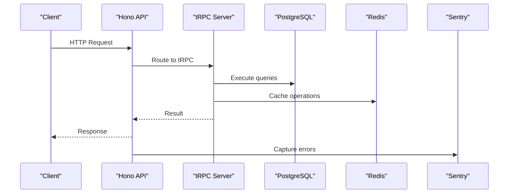
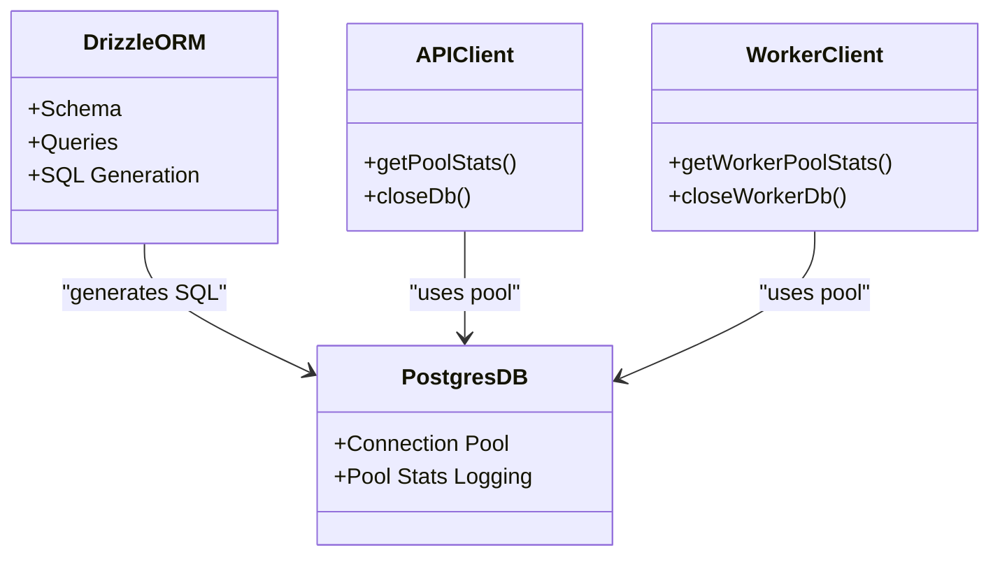
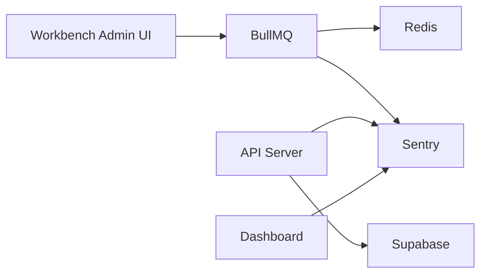
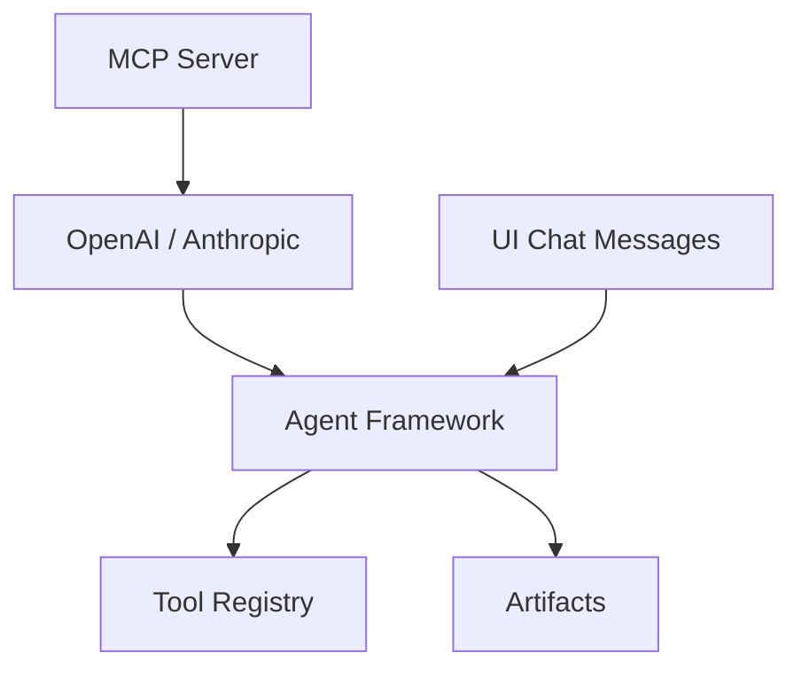
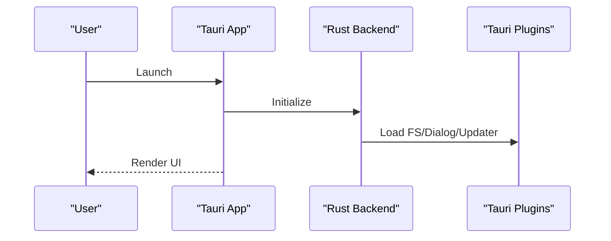
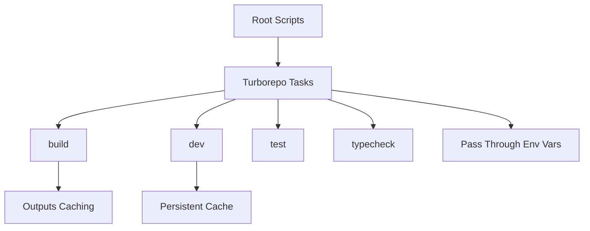
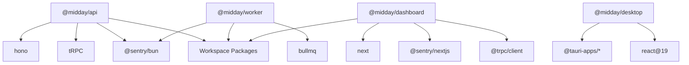

# Technology Stack

<cite>
**Referenced Files in This Document**
- [package.json](file://package.json)
- [turbo.json](file://turbo.json)
- [apps/api/package.json](file://apps/api/package.json)
- [apps/api/src/index.ts](file://apps/api/src/index.ts)
- [apps/api/src/rest/routers/index.ts](file://apps/api/src/rest/routers/index.ts)
- [apps/api/src/services/supabase.ts](file://apps/api/src/services/supabase.ts)
- [apps/api/src/services/resend.ts](file://apps/api/src/services/resend.ts)
- [apps/dashboard/package.json](file://apps/dashboard/package.json)
- [apps/dashboard/next.config.ts](file://apps/dashboard/next.config.ts)
- [apps/desktop/package.json](file://apps/desktop/package.json)
- [apps/desktop/src/main.tsx](file://apps/desktop/src/main.tsx)
- [apps/worker/package.json](file://apps/worker/package.json)
- [apps/worker/src/index.ts](file://apps/worker/src/index.ts)
- [packages/db/package.json](file://packages/db/package.json)
- [packages/supabase/package.json](file://packages/supabase/package.json)
- [packages/cache/package.json](file://packages/cache/package.json)
</cite>

## Table of Contents
1. [Introduction](#introduction)
2. [Project Structure](#project-structure)
3. [Core Components](#core-components)
4. [Architecture Overview](#architecture-overview)
5. [Detailed Component Analysis](#detailed-component-analysis)
6. [Dependency Analysis](#dependency-analysis)
7. [Performance Considerations](#performance-considerations)
8. [Troubleshooting Guide](#troubleshooting-guide)
9. [Conclusion](#conclusion)
10. [Appendices](#appendices)

## Introduction
This document describes Faworra’s (formerly Midday) technology stack and architecture. It covers the frontend (Next.js 16, React 19, TypeScript), backend (Hono framework, tRPC, Node.js/Bun runtime), database (PostgreSQL with Drizzle ORM), AI/ML components (OpenAI, Anthropic, custom agent framework), and desktop development (Tauri with Rust). It also documents infrastructure components (Redis, BullMQ, Supabase, Sentry), the monorepo managed by Turborepo, cross-platform considerations, deployment technologies, and technical prerequisites for contributors and deployers.

## Project Structure
Faworra is a monorepo organized around workspaces for applications and shared packages. The root manages shared scripts, tooling, and environment variables, while apps define the API server, Next.js dashboard, Tauri desktop app, and a background worker. Shared packages encapsulate database clients, caching, Supabase integration, and reusable UI/logic.

**Diagram sources**
- [package.json](file://package.json#L4-L7)
- [turbo.json](file://turbo.json#L1-L87)

**Section sources**
- [package.json](file://package.json#L1-L70)
- [turbo.json](file://turbo.json#L1-L87)

## Core Components
- Frontend: Next.js 16 with React 19, TypeScript, Sentry for client-side error monitoring, and a custom image loader.
- Backend: Hono-based API server with tRPC integration, OpenAPI documentation, and health/readiness endpoints.
- Database: PostgreSQL via Drizzle ORM with Bun-based clients and connection pooling.
- Infrastructure: Redis-backed caching, BullMQ for job queues and scheduling, Supabase for authentication and SSR, Sentry for observability.
- AI/ML: OpenAI and Anthropic SDKs integrated with a custom agent framework and MCP server support.
- Desktop: Tauri with Rust for native desktop builds, React 19 for UI.

**Section sources**
- [apps/dashboard/package.json](file://apps/dashboard/package.json#L16-L112)
- [apps/dashboard/next.config.ts](file://apps/dashboard/next.config.ts#L1-L95)
- [apps/api/package.json](file://apps/api/package.json#L15-L78)
- [apps/api/src/index.ts](file://apps/api/src/index.ts#L1-L288)
- [packages/db/package.json](file://packages/db/package.json#L37-L59)
- [packages/cache/package.json](file://packages/cache/package.json#L1-L30)
- [apps/worker/package.json](file://apps/worker/package.json#L13-L57)
- [apps/api/src/services/supabase.ts](file://apps/api/src/services/supabase.ts#L1-L22)
- [apps/api/src/services/resend.ts](file://apps/api/src/services/resend.ts#L1-L4)
- [apps/desktop/package.json](file://apps/desktop/package.json#L1-L40)
- [apps/desktop/src/main.tsx](file://apps/desktop/src/main.tsx#L1-L9)

## Architecture Overview
The system is layered:
- Presentation: Next.js dashboard handles UI, routing, and client integrations.
- API: Hono server exposes REST endpoints and tRPC procedures, with OpenAPI docs and health checks.
- Background: Worker service runs BullMQ jobs and schedulers, exposing a Workbench admin UI.
- Persistence: PostgreSQL via Drizzle ORM; Redis for caching and queue coordination.
- Identity and SSR: Supabase client libraries.
- Observability: Sentry for error reporting and performance monitoring.
- Desktop: Tauri app wraps a React UI for native desktop experiences.

**Diagram sources**
- [apps/api/src/index.ts](file://apps/api/src/index.ts#L26-L177)
- [apps/api/src/rest/routers/index.ts](file://apps/api/src/rest/routers/index.ts#L1-L62)
- [apps/worker/src/index.ts](file://apps/worker/src/index.ts#L25-L118)
- [packages/db/package.json](file://packages/db/package.json#L37-L59)
- [packages/cache/package.json](file://packages/cache/package.json#L5-L28)
- [apps/api/src/services/supabase.ts](file://apps/api/src/services/supabase.ts#L1-L22)
- [apps/api/src/services/resend.ts](file://apps/api/src/services/resend.ts#L1-L4)
- [apps/dashboard/next.config.ts](file://apps/dashboard/next.config.ts#L1-L95)
- [apps/desktop/package.json](file://apps/desktop/package.json#L1-L40)

## Detailed Component Analysis

### Frontend: Next.js 16, React 19, TypeScript
- Next.js 16 with Turbopack for fast dev, standalone output for containerization, and a custom image loader.
- React 19 with strict mode and optimized transpilation for shared packages.
- Sentry integration for client-side error monitoring and source map uploads.
- Environment-driven build IDs and deployment IDs for multi-region consistency.

**Diagram sources**
- [apps/dashboard/next.config.ts](file://apps/dashboard/next.config.ts#L4-L61)
- [apps/dashboard/package.json](file://apps/dashboard/package.json#L16-L112)

**Section sources**
- [apps/dashboard/next.config.ts](file://apps/dashboard/next.config.ts#L1-L95)
- [apps/dashboard/package.json](file://apps/dashboard/package.json#L16-L112)

### Backend: Hono, tRPC, Bun Runtime
- Hono server with CORS, secure headers, OpenAPI documentation, and health endpoints.
- tRPC integration with a centralized context factory and error capture to Sentry.
- Bun runtime for fast startup and hot reloading in development.
- Graceful shutdown handling for DB and Redis connections.

**Diagram sources**
- [apps/api/src/index.ts](file://apps/api/src/index.ts#L26-L113)
- [apps/api/src/rest/routers/index.ts](file://apps/api/src/rest/routers/index.ts#L1-L62)

**Section sources**
- [apps/api/src/index.ts](file://apps/api/src/index.ts#L1-L288)
- [apps/api/src/rest/routers/index.ts](file://apps/api/src/rest/routers/index.ts#L1-L62)
- [apps/api/package.json](file://apps/api/package.json#L15-L78)

### Database: PostgreSQL with Drizzle ORM
- PostgreSQL as the primary datastore.
- Drizzle ORM for schema definitions and SQL generation.
- Dedicated Bun-based DB clients for API and worker contexts with connection pooling and stats logging.

**Diagram sources**
- [packages/db/package.json](file://packages/db/package.json#L37-L59)
- [apps/api/src/index.ts](file://apps/api/src/index.ts#L178-L199)
- [apps/worker/src/index.ts](file://apps/worker/src/index.ts#L205-L226)

**Section sources**
- [packages/db/package.json](file://packages/db/package.json#L1-L59)
- [apps/api/src/index.ts](file://apps/api/src/index.ts#L178-L200)
- [apps/worker/src/index.ts](file://apps/worker/src/index.ts#L205-L227)

### Infrastructure: Redis, BullMQ, Supabase, Sentry
- Redis: Caching and queue coordination via shared clients and adapters.
- BullMQ: Job queues and schedulers with Workbench admin UI, centralized error handling, and graceful shutdown.
- Supabase: SSR and client SDKs for authentication and data access.
- Sentry: Unified error monitoring across API, worker, and dashboard.

**Diagram sources**
- [packages/cache/package.json](file://packages/cache/package.json#L5-L28)
- [apps/worker/src/index.ts](file://apps/worker/src/index.ts#L25-L118)
- [apps/api/src/services/supabase.ts](file://apps/api/src/services/supabase.ts#L1-L22)
- [apps/api/src/services/resend.ts](file://apps/api/src/services/resend.ts#L1-L4)

**Section sources**
- [packages/cache/package.json](file://packages/cache/package.json#L1-L30)
- [apps/worker/src/index.ts](file://apps/worker/src/index.ts#L1-L312)
- [apps/api/src/services/supabase.ts](file://apps/api/src/services/supabase.ts#L1-L22)
- [apps/api/src/services/resend.ts](file://apps/api/src/services/resend.ts#L1-L4)

### AI/ML Components: OpenAI, Anthropic, Custom Agent Framework
- OpenAI and Anthropic SDKs integrated for LLM interactions.
- Custom agent framework and artifact/tool registries for structured reasoning and tool execution.
- MCP server support for model-context protocol compatibility.
- UI chat message types and metadata for tool choices and web search.

**Diagram sources**
- [apps/api/package.json](file://apps/api/package.json#L16-L25)
- [apps/api/src/ai/types.ts](file://apps/api/src/ai/types.ts#L1-L27)

**Section sources**
- [apps/api/package.json](file://apps/api/package.json#L15-L78)
- [apps/api/src/ai/types.ts](file://apps/api/src/ai/types.ts#L1-L27)

### Desktop Development: Tauri with Rust
- Tauri app with Rust backend and React 19 frontend.
- Vite-based build pipeline with Tauri CLI integration.
- Platform-specific plugins for filesystem, dialogs, updater, and deep linking.

**Diagram sources**
- [apps/desktop/package.json](file://apps/desktop/package.json#L1-L40)
- [apps/desktop/src/main.tsx](file://apps/desktop/src/main.tsx#L1-L9)

**Section sources**
- [apps/desktop/package.json](file://apps/desktop/package.json#L1-L40)
- [apps/desktop/src/main.tsx](file://apps/desktop/src/main.tsx#L1-L9)

### Monorepo Management: Turborepo and Workspace Scripts
- Root defines workspaces for apps and packages, and scripts for building, developing, testing, and type-checking across the repo.
- Turborepo orchestrates task execution, caching, and environment propagation.
- Environment variables are passed through for secrets and feature flags.

**Diagram sources**
- [package.json](file://package.json#L8-L25)
- [turbo.json](file://turbo.json#L5-L84)

**Section sources**
- [package.json](file://package.json#L1-L70)
- [turbo.json](file://turbo.json#L1-L87)

## Dependency Analysis
- Application dependencies are declared per app and package, with shared catalog entries for consistent versions across the monorepo.
- API depends on Hono, tRPC, Sentry, and workspace packages for domain logic.
- Worker depends on BullMQ, Sentry, and workspace packages for job processing.
- Dashboard depends on Next.js, Sentry, tRPC client, and workspace packages for UI and logic.
- Desktop depends on Tauri APIs and React 19.

**Diagram sources**
- [apps/api/package.json](file://apps/api/package.json#L15-L78)
- [apps/worker/package.json](file://apps/worker/package.json#L13-L57)
- [apps/dashboard/package.json](file://apps/dashboard/package.json#L16-L112)
- [apps/desktop/package.json](file://apps/desktop/package.json#L18-L30)

**Section sources**
- [apps/api/package.json](file://apps/api/package.json#L15-L78)
- [apps/worker/package.json](file://apps/worker/package.json#L13-L57)
- [apps/dashboard/package.json](file://apps/dashboard/package.json#L16-L112)
- [apps/desktop/package.json](file://apps/desktop/package.json#L18-L30)

## Performance Considerations
- Bun runtime reduces cold starts and improves iteration speed for API and worker services.
- Connection pooling and periodic pool stats logging help monitor DB utilization.
- Turborepo caching accelerates builds and tests across the monorepo.
- Next.js standalone output and optimized transpile packages reduce bundle sizes and improve startup times.
- BullMQ workers and schedulers are designed for production-grade resilience with centralized error handling and graceful shutdown.

[No sources needed since this section provides general guidance]

## Troubleshooting Guide
- Sentry error reporting: Configure DSN and auth tokens; ensure release tagging matches deployment commits.
- Health endpoints: Use readiness probes to verify DB and Redis connectivity before traffic switching.
- Graceful shutdown: Verify signal handlers close DB and Redis connections and flush Sentry events.
- Worker dashboard: Use Workbench to inspect queue statuses and failed jobs; configure credentials for admin access.

**Section sources**
- [apps/api/src/index.ts](file://apps/api/src/index.ts#L201-L281)
- [apps/worker/src/index.ts](file://apps/worker/src/index.ts#L167-L203)
- [apps/worker/src/index.ts](file://apps/worker/src/index.ts#L232-L281)

## Conclusion
Faworra’s stack combines modern frontend tooling (Next.js 16, React 19), a performant backend (Hono + tRPC on Bun), robust persistence (PostgreSQL with Drizzle), scalable background processing (BullMQ), and cross-platform desktop delivery (Tauri). Infrastructure components (Redis, Supabase, Sentry) provide reliability, identity, and observability. Turborepo streamlines development and deployment across the monorepo.

[No sources needed since this section summarizes without analyzing specific files]

## Appendices

### Deployment Technologies
- Containerization: Next.js standalone output supports minimal Docker images; API and worker services use Bun runtime.
- Orchestration: Services expose health and readiness endpoints suitable for platform health checks.
- Static hosting: Website app configured for static exports and CDN-friendly assets.

**Section sources**
- [apps/dashboard/next.config.ts](file://apps/dashboard/next.config.ts#L4-L61)
- [apps/api/src/index.ts](file://apps/api/src/index.ts#L118-L130)
- [apps/worker/src/index.ts](file://apps/worker/src/index.ts#L167-L182)

### Cross-Platform Considerations
- Desktop: Tauri abstracts OS differences; ensure platform-specific plugin usage aligns with target OS capabilities.
- Database: Drizzle ORM targets PostgreSQL; maintain consistent schema migrations across environments.
- Caching: Redis is transport-agnostic; configure cluster/replication for high availability.

**Section sources**
- [apps/desktop/package.json](file://apps/desktop/package.json#L18-L30)
- [packages/db/package.json](file://packages/db/package.json#L37-L59)
- [packages/cache/package.json](file://packages/cache/package.json#L5-L28)

### Technical Prerequisites and System Requirements
- Node.js/Bun: Required for development and runtime; Bun is the preferred runtime for API and worker.
- Rust: Required for Tauri desktop builds.
- PostgreSQL: Local or hosted instance for development and production.
- Redis: Required for caching and queue coordination.
- Supabase: Credentials for authentication and SSR.
- Sentry: Organization, project, and auth token for error monitoring and source map uploads.
- Environment variables: Defined via .env templates and propagated by Turborepo tasks.

**Section sources**
- [package.json](file://package.json#L26-L27)
- [turbo.json](file://turbo.json#L21-L61)
- [apps/api/package.json](file://apps/api/package.json#L15-L78)
- [apps/worker/package.json](file://apps/worker/package.json#L13-L57)
- [apps/dashboard/package.json](file://apps/dashboard/package.json#L16-L112)
- [apps/desktop/package.json](file://apps/desktop/package.json#L18-L30)