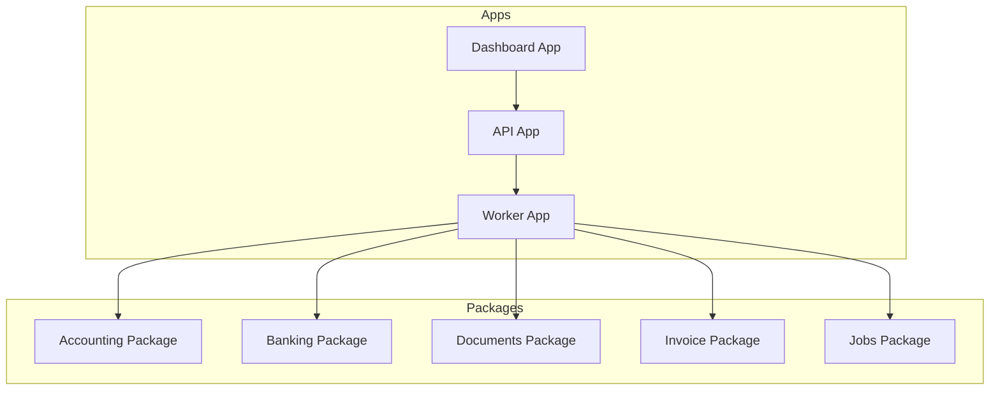
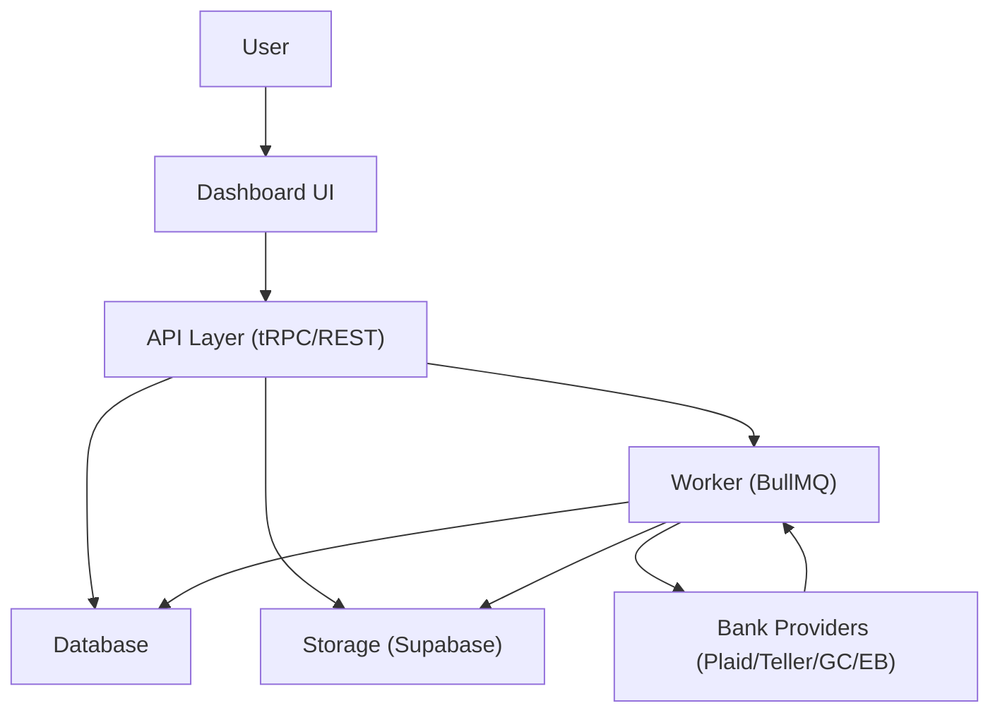
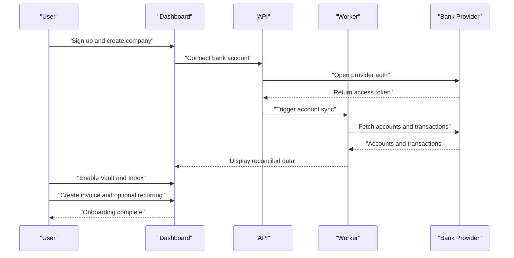
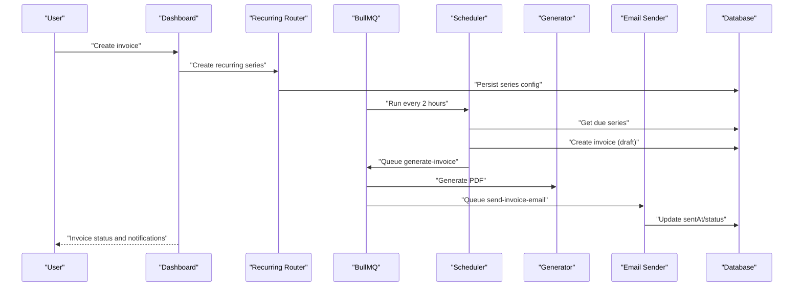
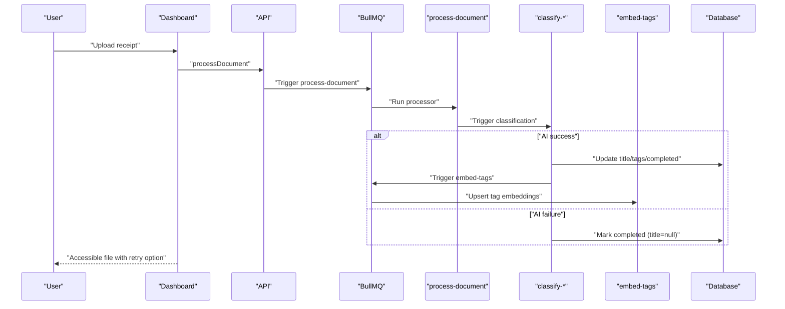
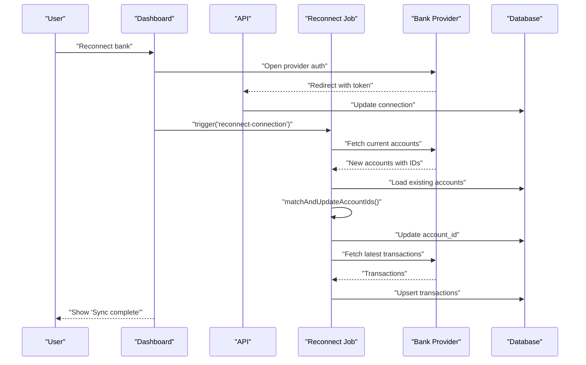
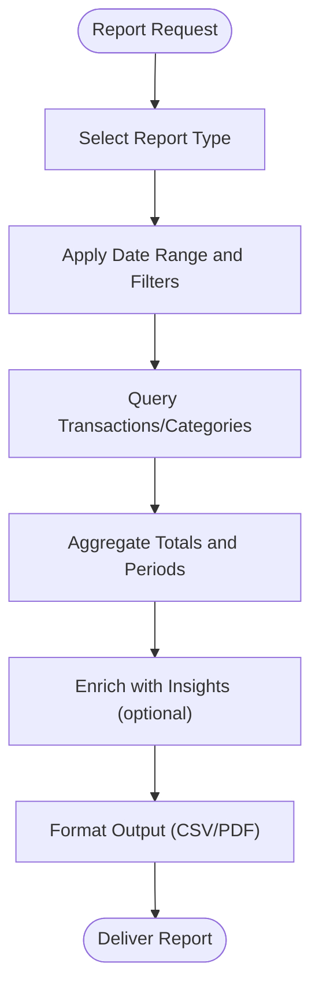
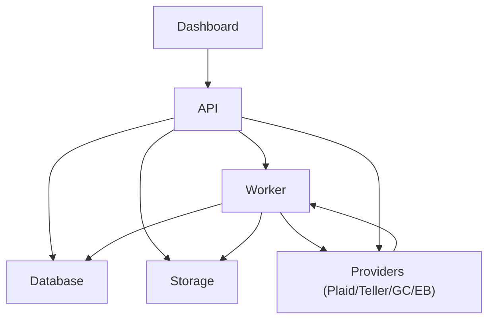

# Use Cases & Scenarios

<cite>
**Referenced Files in This Document**
- [README.md](file://midday/README.md)
- [docs/README.md](file://midday/docs/README.md)
- [docs/invoice-recurring.md](file://midday/docs/invoice-recurring.md)
- [docs/inbox-matching.md](file://midday/docs/inbox-matching.md)
- [docs/document-processing.md](file://midday/docs/document-processing.md)
- [docs/bank-account-reconnect.md](file://midday/docs/bank-account-reconnect.md)
- [docs/credit-card-transaction-handling.md](file://midday/docs/credit-card-transaction-handling.md)
</cite>

## Table of Contents
1. [Introduction](#introduction)
2. [Project Structure](#project-structure)
3. [Core Components](#core-components)
4. [Architecture Overview](#architecture-overview)
5. [Detailed Component Analysis](#detailed-component-analysis)
6. [Dependency Analysis](#dependency-analysis)
7. [Performance Considerations](#performance-considerations)
8. [Troubleshooting Guide](#troubleshooting-guide)
9. [Conclusion](#conclusion)
10. [Appendices](#appendices)

## Introduction
This document presents practical use cases and scenarios for Faworra (formerly Midday), focusing on end-to-end workflows for common financial tasks. It targets diverse user personas—small business owners, freelancers, accounting professionals, and finance teams—and maps them to realistic journeys: new user onboarding, invoice creation and management, expense processing with receipt uploads, bank reconciliation, and report generation. It also outlines integration touchpoints with existing business tools and systems, success metrics, and collaboration patterns for both individuals and teams.

## Project Structure
Faworra is organized as a monorepo with distinct applications and packages:
- API service: exposes REST and tRPC endpoints for business logic
- Dashboard (Next.js): primary user interface for invoicing, transactions, vault, and settings
- Worker: background job processing for recurring invoices, document classification, and bank reconciliation
- Packages: shared libraries for accounting, banking, documents, and utilities
- Docs: technical documentation for key subsystems

**Section sources**
- [README.md](file://midday/README.md#L42-L75)

## Core Components
This section highlights the core capabilities that underpin the use cases:
- Invoicing and recurring invoices: automated invoice generation with scheduling, templates, and notifications
- Magic Inbox: automatic matching of receipts/invoices to transactions
- Vault: secure document storage with AI-powered classification and search
- Bank connections: multi-provider integrations with reconnect and reconciliation logic
- Credit card handling: provider-specific transformations to ensure correct signs and categories

These components collectively enable streamlined financial workflows for individuals and teams.

**Section sources**
- [README.md](file://midday/README.md#L26-L34)
- [docs/invoice-recurring.md](file://midday/docs/invoice-recurring.md#L3-L16)
- [docs/inbox-matching.md](file://midday/docs/inbox-matching.md#L3-L16)
- [docs/document-processing.md](file://midday/docs/document-processing.md#L3-L17)
- [docs/bank-account-reconnect.md](file://midday/docs/bank-account-reconnect.md#L3-L6)
- [docs/credit-card-transaction-handling.md](file://midday/docs/credit-card-transaction-handling.md#L3-L15)

## Architecture Overview
The system orchestrates user-facing tasks through the Dashboard, backed by the API and Worker. Background jobs handle long-running operations such as recurring invoice generation, document classification, and bank reconciliation. Integrations with external providers (Plaid, Teller, GoCardless, EnableBanking) are abstracted behind provider-specific transformers and matching utilities.

**Section sources**
- [README.md](file://midday/README.md#L55-L75)
- [docs/invoice-recurring.md](file://midday/docs/invoice-recurring.md#L13-L55)
- [docs/document-processing.md](file://midday/docs/document-processing.md#L18-L71)
- [docs/bank-account-reconnect.md](file://midday/docs/bank-account-reconnect.md#L7-L54)

## Detailed Component Analysis

### Persona: Small Business Owner
Primary goals:
- Track income and expenses across multiple bank accounts
- Issue invoices quickly and collect payments
- Automate recurring billing to reduce admin overhead
- Keep receipts and contracts organized for tax season

Typical tasks and workflows:
- Bank reconciliation: connect accounts, resolve mismatches, and reconcile balances
- Expense processing: upload receipts, categorize, and match to transactions
- Invoicing: create invoices, set recurring schedules, and monitor collections
- Reporting: generate P&L, VAT, and cash flow reports

Success metrics:
- % of receipts auto-matched to transactions
- Average days to payment (ADTP)
- % of invoices paid on time
- Time saved vs. manual spreadsheets

Collaboration:
- Share dashboards and reports with bookkeepers
- Approve suggested matches and categories

**Section sources**
- [README.md](file://midday/README.md#L21-L34)
- [docs/invoice-recurring.md](file://midday/docs/invoice-recurring.md#L297-L311)
- [docs/inbox-matching.md](file://midday/docs/inbox-matching.md#L126-L137)
- [docs/document-processing.md](file://midday/docs/document-processing.md#L74-L124)

### Persona: Freelancer
Primary goals:
- Track project income and project-related expenses
- Issue one-off and recurring invoices
- Maintain a personal financial overview

Typical tasks and workflows:
- Upload receipts and contracts to Vault
- Use Magic Inbox to auto-link receipts to transactions
- Set up recurring invoices for retainer clients
- Export data for tax reporting

Success metrics:
- % of receipts auto-classified and tagged
- % of recurring invoices auto-generated and sent
- Time spent per month on bookkeeping tasks

Collaboration:
- Minimal; primarily self-service with occasional accountant review

**Section sources**
- [docs/document-processing.md](file://midday/docs/document-processing.md#L125-L177)
- [docs/inbox-matching.md](file://midday/docs/inbox-matching.md#L27-L44)
- [docs/invoice-recurring.md](file://midday/docs/invoice-recurring.md#L174-L213)

### Persona: Accounting Professional
Primary goals:
- Validate and approve client data
- Ensure compliance and accuracy in categorization
- Support multiple clients with team workflows

Typical tasks and workflows:
- Review suggested matches and categories
- Adjust auto-categorizations and tags
- Monitor recurring invoice series and pause/resume as needed
- Generate client-ready reports and exports

Success metrics:
- % of suggested matches confirmed
- Number of auto-paused recurring series (indicating issues needing attention)
- Report completeness and accuracy

Collaboration:
- Use team features to assign tasks and review submissions
- Provide onboarding guidance to clients

**Section sources**
- [docs/inbox-matching.md](file://midday/docs/inbox-matching.md#L102-L125)
- [docs/invoice-recurring.md](file://midday/docs/invoice-recurring.md#L125-L158)

### Persona: Finance Team (Small Company)
Primary goals:
- Centralize financial data across departments
- Automate invoice and expense workflows
- Maintain audit trails and approvals

Typical tasks and workflows:
- Configure bank connections and reconcile accounts
- Approve or correct categorizations and tags
- Monitor recurring invoice series and resolve failures
- Generate departmental and consolidated reports

Success metrics:
- % of transactions auto-matched
- % of recurring invoices delivered on time
- Number of reconciliation exceptions

Collaboration:
- Cross-functional approvals and shared dashboards

**Section sources**
- [docs/bank-account-reconnect.md](file://midday/docs/bank-account-reconnect.md#L90-L112)
- [docs/inbox-matching.md](file://midday/docs/inbox-matching.md#L126-L137)
- [docs/invoice-recurring.md](file://midday/docs/invoice-recurring.md#L223-L234)

### New User Onboarding Workflow
Step-by-step process:
1. Sign up and configure company profile
2. Connect bank accounts via provider-specific flows
3. Review initial transactions and balances
4. Enable Magic Inbox and Vault
5. Create first invoice and optionally set up recurring series
6. Review initial suggestions and adjust categorizations
7. Export data for first tax period or accountant handover

**Section sources**
- [docs/bank-account-reconnect.md](file://midday/docs/bank-account-reconnect.md#L9-L54)
- [docs/invoice-recurring.md](file://midday/docs/invoice-recurring.md#L312-L321)

### Invoice Creation and Management
End-to-end flow:
1. Draft invoice with customer, line items, and due date
2. Save as draft or schedule recurring series
3. System validates customer email and calculates next run
4. Worker generates PDF and sends email
5. Track status and upcoming notifications

**Section sources**
- [docs/invoice-recurring.md](file://midday/docs/invoice-recurring.md#L174-L213)
- [docs/invoice-recurring.md](file://midday/docs/invoice-recurring.md#L297-L311)

### Expense Processing with Receipt Uploads
End-to-end flow:
1. Upload receipt to Vault
2. Worker extracts content and classifies via AI
3. If classification fails, document remains accessible with retry option
4. Match receipt to transaction via Magic Inbox scoring and team calibration
5. Adjust category or create suggestion if below threshold

**Section sources**
- [docs/document-processing.md](file://midday/docs/document-processing.md#L125-L177)
- [docs/document-processing.md](file://midday/docs/document-processing.md#L235-L294)

### Bank Reconciliation Processes
End-to-end flow:
1. User initiates reconnect
2. Provider re-authentication returns updated credentials
3. Backend updates connection and triggers reconnect job
4. Job fetches new accounts, matches by reference/type/currency, and updates IDs
5. Worker syncs latest transactions and upserts to DB
6. UI reflects reconciliation status and refreshed data

**Section sources**
- [docs/bank-account-reconnect.md](file://midday/docs/bank-account-reconnect.md#L9-L54)
- [docs/bank-account-reconnect.md](file://midday/docs/bank-account-reconnect.md#L212-L226)

### Report Generation
Common report types and data sources:
- Profit and Loss: income, expenses, and taxes from categorized transactions
- VAT/GST: summarized by tax rate and period
- Cash Flow: projected burn rate and runway based on recent trends
- Collections: aging, ADTP, and collection efficiency

**Section sources**
- [docs/README.md](file://midday/docs/README.md#L7-L11)

## Dependency Analysis
The following diagram shows how major components depend on each other and external providers:

**Section sources**
- [README.md](file://midday/README.md#L55-L75)
- [docs/invoice-recurring.md](file://midday/docs/invoice-recurring.md#L13-L55)
- [docs/document-processing.md](file://midday/docs/document-processing.md#L18-L71)
- [docs/bank-account-reconnect.md](file://midday/docs/bank-account-reconnect.md#L7-L54)

## Performance Considerations
- Batched processing: recurring invoice generation and notifications are batched to avoid overload
- Graceful degradation: documents complete even if AI classification fails, ensuring user access
- Provider-specific transformations: credit card handling ensures correct signs and categories across providers
- Queue concurrency and timeouts: balanced to prevent API throttling and memory pressure

**Section sources**
- [docs/invoice-recurring.md](file://midday/docs/invoice-recurring.md#L246-L260)
- [docs/document-processing.md](file://midday/docs/document-processing.md#L235-L294)
- [docs/credit-card-transaction-handling.md](file://midday/docs/credit-card-transaction-handling.md#L16-L55)

## Troubleshooting Guide
Common issues and resolutions:
- Recurring invoices not generated:
  - Check consecutive failures and auto-pause
  - Verify customer email and template validity
- Stuck document processing:
  - Use retry buttons; stale documents (>10 minutes) show retry option
  - Inspect error categories and job logs
- Bank reconnect problems:
  - Confirm account reference matching and provider-specific identifiers
  - Check error retries and logs for unmatched accounts
- Credit card misclassification:
  - Ensure provider-specific sign transformations and payment indicators are applied

**Section sources**
- [docs/invoice-recurring.md](file://midday/docs/invoice-recurring.md#L223-L234)
- [docs/document-processing.md](file://midday/docs/document-processing.md#L235-L294)
- [docs/bank-account-reconnect.md](file://midday/docs/bank-account-reconnect.md#L212-L226)
- [docs/credit-card-transaction-handling.md](file://midday/docs/credit-card-transaction-handling.md#L75-L89)

## Conclusion
Faworra streamlines financial operations for individuals and teams by combining automation, intelligent matching, and robust integrations. By aligning workflows with user personas and providing clear success metrics, organizations can reduce manual effort, improve accuracy, and accelerate reporting. The documented components and flows serve as a blueprint for implementing and extending these capabilities.

## Appendices

### Integration Scenarios with Existing Tools
- Bank providers: Plaid (US/Canada), Teller (US), GoCardless/EnableBanking (EU/UK)
- Payment and analytics: Stripe-like integrations for payments and analytics
- Search and discovery: Typesense for document search
- Observability: OpenPanel for events and analytics

**Section sources**
- [README.md](file://midday/README.md#L62-L75)

### Success Metrics by Persona
- Small Business Owner: % auto-matched receipts, ADTP, % invoices paid on time, time saved
- Freelancer: % auto-classified receipts, % recurring invoices auto-generated, time per month on bookkeeping
- Accounting Professional: % suggested matches confirmed, auto-paused series count, report accuracy
- Finance Team: % auto-matched transactions, % delivered on time, reconciliation exceptions

**Section sources**
- [docs/invoice-recurring.md](file://midday/docs/invoice-recurring.md#L297-L311)
- [docs/inbox-matching.md](file://midday/docs/inbox-matching.md#L126-L137)
- [docs/document-processing.md](file://midday/docs/document-processing.md#L74-L124)