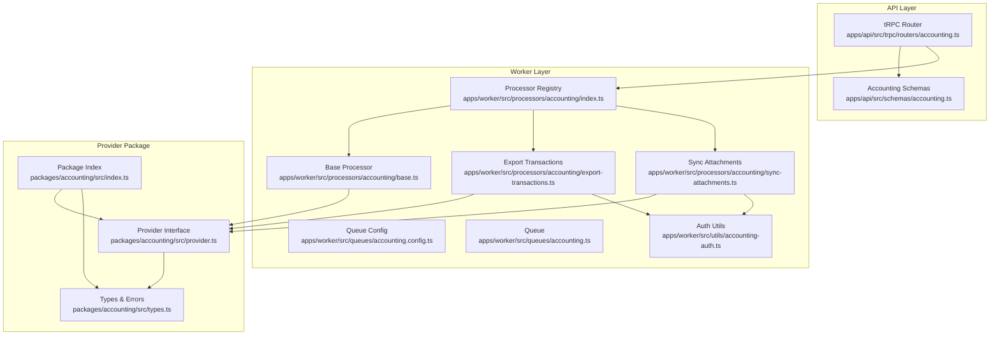
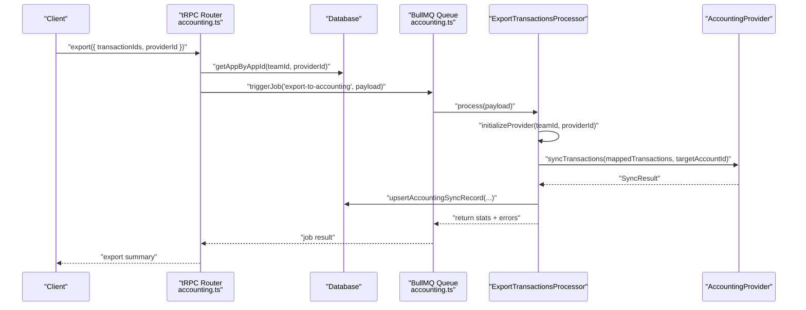
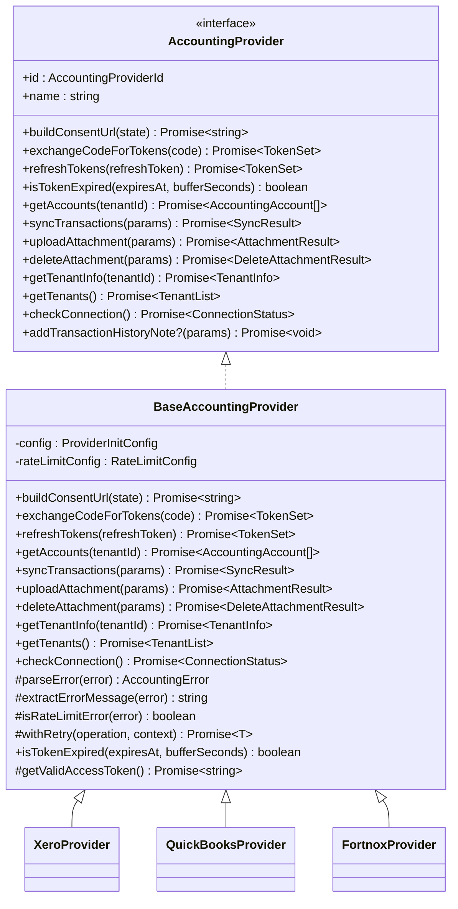
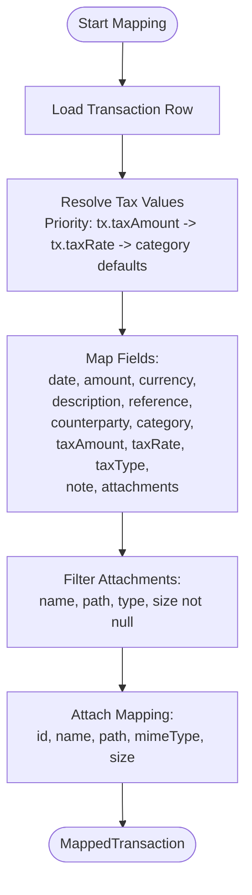
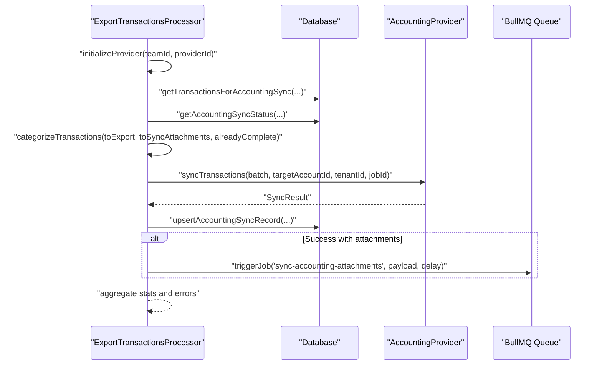
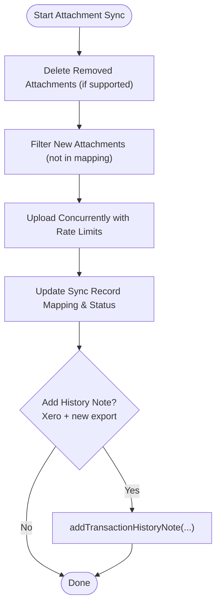
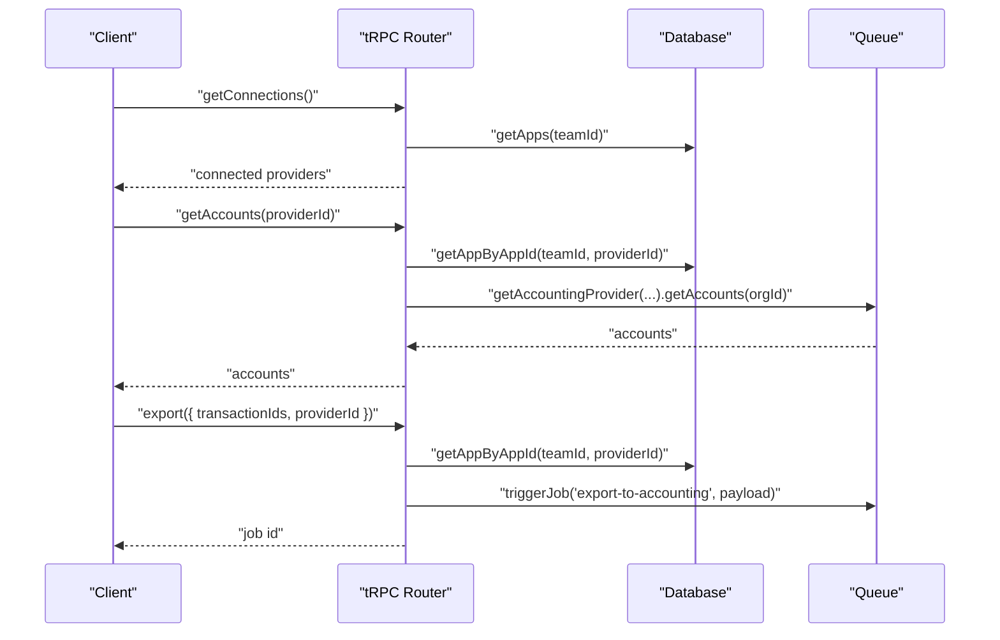
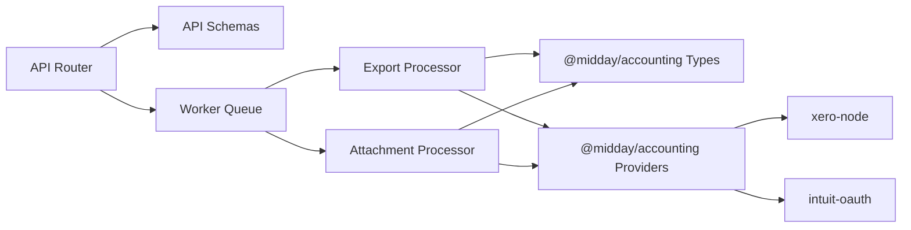

# Accounting Logic (@midday/accounting)

<cite>
**Referenced Files in This Document**
- [package.json](file://packages/accounting/package.json)
- [index.ts](file://packages/accounting/src/index.ts)
- [provider.ts](file://packages/accounting/src/provider.ts)
- [types.ts](file://packages/accounting/src/types.ts)
- [accounting.ts](file://midday/apps/api/src/schemas/accounting.ts)
- [accounting.ts](file://midday/apps/api/src/trpc/routers/accounting.ts)
- [index.ts](file://midday/apps/worker/src/processors/accounting/index.ts)
- [base.ts](file://midday/apps/worker/src/processors/accounting/base.ts)
- [export-transactions.ts](file://midday/apps/worker/src/processors/accounting/export-transactions.ts)
- [sync-attachments.ts](file://midday/apps/worker/src/processors/accounting/sync-attachments.ts)
- [accounting.config.ts](file://midday/apps/worker/src/queues/accounting.config.ts)
- [accounting.ts](file://midday/apps/worker/src/queues/accounting.ts)
- [accounting-auth.ts](file://midday/apps/worker/src/utils/accounting-auth.ts)
- [accounting.ts](file://midday/apps/worker/src/schemas/accounting.ts)
</cite>

## Table of Contents
1. [Introduction](#introduction)
2. [Project Structure](#project-structure)
3. [Core Components](#core-components)
4. [Architecture Overview](#architecture-overview)
5. [Detailed Component Analysis](#detailed-component-analysis)
6. [Dependency Analysis](#dependency-analysis)
7. [Performance Considerations](#performance-considerations)
8. [Troubleshooting Guide](#troubleshooting-guide)
9. [Conclusion](#conclusion)

## Introduction
This document describes the @midday/accounting package and its supporting worker processors that power financial export and attachment synchronization to external accounting systems. It covers the provider abstraction, transaction mapping, tax handling, error normalization, rate limiting, and integration points with Xero, QuickBooks, and Fortnox. It also explains how the system handles currency, tax calculations, and attachment lifecycle management, along with extensibility points for custom providers and internationalization support.

## Project Structure
The accounting domain spans three layers:
- Provider package (@midday/accounting): Defines provider interfaces, types, error handling, and provider implementations.
- API layer (apps/api): Exposes tRPC routes for manual export, sync status, provider accounts, and disconnection.
- Worker layer (apps/worker): Implements processors for exporting transactions and synchronizing attachments, with robust error handling, retries, and rate limiting.

**Diagram sources**
- [accounting.ts](file://midday/apps/api/src/trpc/routers/accounting.ts#L1-L178)
- [accounting.ts](file://midday/apps/api/src/schemas/accounting.ts#L1-L42)
- [index.ts](file://midday/apps/worker/src/processors/accounting/index.ts#L1-L20)
- [base.ts](file://midday/apps/worker/src/processors/accounting/base.ts#L1-L292)
- [export-transactions.ts](file://midday/apps/worker/src/processors/accounting/export-transactions.ts#L1-L584)
- [sync-attachments.ts](file://midday/apps/worker/src/processors/accounting/sync-attachments.ts#L1-L564)
- [accounting.config.ts](file://midday/apps/worker/src/queues/accounting.config.ts)
- [accounting.ts](file://midday/apps/worker/src/queues/accounting.ts)
- [accounting-auth.ts](file://midday/apps/worker/src/utils/accounting-auth.ts)
- [index.ts](file://packages/accounting/src/index.ts#L1-L122)
- [provider.ts](file://packages/accounting/src/provider.ts#L1-L440)
- [types.ts](file://packages/accounting/src/types.ts#L1-L642)

**Section sources**
- [package.json](file://packages/accounting/package.json#L1-L32)
- [index.ts](file://packages/accounting/src/index.ts#L1-L122)
- [provider.ts](file://packages/accounting/src/provider.ts#L1-L440)
- [types.ts](file://packages/accounting/src/types.ts#L1-L642)
- [accounting.ts](file://midday/apps/api/src/schemas/accounting.ts#L1-L42)
- [accounting.ts](file://midday/apps/api/src/trpc/routers/accounting.ts#L1-L178)
- [index.ts](file://midday/apps/worker/src/processors/accounting/index.ts#L1-L20)
- [base.ts](file://midday/apps/worker/src/processors/accounting/base.ts#L1-L292)
- [export-transactions.ts](file://midday/apps/worker/src/processors/accounting/export-transactions.ts#L1-L584)
- [sync-attachments.ts](file://midday/apps/worker/src/processors/accounting/sync-attachments.ts#L1-L564)
- [accounting.config.ts](file://midday/apps/worker/src/queues/accounting.config.ts)
- [accounting.ts](file://midday/apps/worker/src/queues/accounting.ts)
- [accounting-auth.ts](file://midday/apps/worker/src/utils/accounting-auth.ts)
- [accounting.ts](file://midday/apps/worker/src/schemas/accounting.ts)

## Core Components
- Provider abstraction: A common interface and base class define OAuth flows, account retrieval, transaction sync, and attachment operations. Subclasses implement provider-specific logic for Xero, QuickBooks, and Fortnox.
- Types and error handling: Strongly typed schemas define provider configs, transaction mapping, sync results, and standardized error codes/messages. A custom error class wraps provider errors for consistent frontend handling.
- Worker processors: Two primary processors handle manual export and attachment synchronization, including batching, retries, rate limiting, and idempotency.
- API integration: tRPC router exposes endpoints for initiating exports, checking sync status, retrieving provider accounts, and disconnecting providers.

Key responsibilities:
- Provider selection and initialization
- Transaction mapping with tax resolution
- Bank account selection and validation
- Attachment upload, deletion, and mapping
- Error normalization and retry strategies
- Queue orchestration and progress tracking

**Section sources**
- [provider.ts](file://packages/accounting/src/provider.ts#L1-L440)
- [types.ts](file://packages/accounting/src/types.ts#L1-L642)
- [index.ts](file://packages/accounting/src/index.ts#L1-L122)
- [base.ts](file://midday/apps/worker/src/processors/accounting/base.ts#L1-L292)
- [export-transactions.ts](file://midday/apps/worker/src/processors/accounting/export-transactions.ts#L1-L584)
- [sync-attachments.ts](file://midday/apps/worker/src/processors/accounting/sync-attachments.ts#L1-L564)
- [accounting.ts](file://midday/apps/api/src/trpc/routers/accounting.ts#L1-L178)

## Architecture Overview
The system follows a provider-agnostic design with explicit separation of concerns:
- API layer validates inputs, checks connections, and enqueues worker jobs.
- Worker layer initializes providers, resolves tokens, maps transactions, and performs exports/attachments with strict rate limiting and retries.
- Provider package encapsulates provider-specific SDKs and normalizes operations.

**Diagram sources**
- [accounting.ts](file://midday/apps/api/src/trpc/routers/accounting.ts#L27-L61)
- [export-transactions.ts](file://midday/apps/worker/src/processors/accounting/export-transactions.ts#L123-L509)
- [base.ts](file://midday/apps/worker/src/processors/accounting/base.ts#L115-L163)
- [provider.ts](file://packages/accounting/src/provider.ts#L74-L75)

## Detailed Component Analysis

### Provider Abstraction and Initialization
- Provider interface defines OAuth, account retrieval, transaction sync, and attachment operations.
- Base class implements error parsing, retry logic, token management, and rate-limit-aware execution.
- Factory creates provider instances based on environment-configured credentials and stored provider config.

**Diagram sources**
- [provider.ts](file://packages/accounting/src/provider.ts#L24-L138)
- [provider.ts](file://packages/accounting/src/provider.ts#L150-L439)

**Section sources**
- [provider.ts](file://packages/accounting/src/provider.ts#L1-L440)
- [index.ts](file://packages/accounting/src/index.ts#L76-L103)

### Transaction Mapping and Tax Resolution
- Worker base class transforms database transactions into provider-specific MappedTransaction objects.
- Tax values are resolved using priority: explicit tax amount, calculated from transaction tax rate, or fallback to category defaults.
- Attachments are filtered and mapped with metadata for upload.

**Diagram sources**
- [base.ts](file://midday/apps/worker/src/processors/accounting/base.ts#L180-L238)

**Section sources**
- [base.ts](file://midday/apps/worker/src/processors/accounting/base.ts#L180-L238)
- [types.ts](file://packages/accounting/src/types.ts#L453-L505)

### Export Transactions Processor
- Orchestrates manual exports: initializes provider, selects target bank account, fetches transactions, categorizes by sync status, batches exports, updates sync records, and triggers attachment jobs.
- Implements smart idempotency: new exports create vouchers and upload attachments; previously synced with changes sync attachments only; already complete transactions are skipped.
- Applies provider-specific rate limiting via job delays and batch sizes, with structured error derivation for frontend messaging.

**Diagram sources**
- [export-transactions.ts](file://midday/apps/worker/src/processors/accounting/export-transactions.ts#L123-L509)
- [base.ts](file://midday/apps/worker/src/processors/accounting/base.ts#L115-L163)

**Section sources**
- [export-transactions.ts](file://midday/apps/worker/src/processors/accounting/export-transactions.ts#L1-L584)
- [base.ts](file://midday/apps/worker/src/processors/accounting/base.ts#L1-L292)

### Sync Attachments Processor
- Manages attachment lifecycle: deletes removed attachments, filters already-synced attachments, uploads new ones with concurrency control, updates mapping, and adds history notes (Xero).
- Implements exponential backoff for rate limit and transient errors, MIME type resolution, and size validation per provider.

**Diagram sources**
- [sync-attachments.ts](file://midday/apps/worker/src/processors/accounting/sync-attachments.ts#L49-L358)

**Section sources**
- [sync-attachments.ts](file://midday/apps/worker/src/processors/accounting/sync-attachments.ts#L1-L564)

### API Integration and Business Rules
- tRPC router validates team context, checks provider connectivity, triggers export jobs, retrieves sync status, lists connections, fetches provider accounts, and supports disconnection.
- Business rules:
  - Manual export only (auto-sync removed).
  - Provider accounts must be connected and properly configured.
  - Sync status determines whether to export, sync attachments, or skip.

**Diagram sources**
- [accounting.ts](file://midday/apps/api/src/trpc/routers/accounting.ts#L90-L177)
- [accounting.ts](file://midday/apps/api/src/schemas/accounting.ts#L16-L41)

**Section sources**
- [accounting.ts](file://midday/apps/api/src/trpc/routers/accounting.ts#L1-L178)
- [accounting.ts](file://midday/apps/api/src/schemas/accounting.ts#L1-L42)

## Dependency Analysis
- Internal dependencies:
  - Worker processors depend on the provider package for provider selection and types.
  - Both API and worker layers depend on shared schemas and types.
- External dependencies:
  - Provider SDKs (xero-node, intuit-oauth) are integrated via provider implementations.
  - BullMQ for queue orchestration and job scheduling.
  - Supabase client for secure attachment downloads.

**Diagram sources**
- [accounting.ts](file://midday/apps/api/src/trpc/routers/accounting.ts#L1-L22)
- [export-transactions.ts](file://midday/apps/worker/src/processors/accounting/export-transactions.ts#L1-L11)
- [sync-attachments.ts](file://midday/apps/worker/src/processors/accounting/sync-attachments.ts#L1-L11)
- [index.ts](file://packages/accounting/src/index.ts#L19-L38)

**Section sources**
- [package.json](file://packages/accounting/package.json#L19-L25)
- [index.ts](file://packages/accounting/src/index.ts#L1-L122)

## Performance Considerations
- Batch processing: Exports are processed in fixed-size batches to balance throughput and memory usage.
- Rate limiting: Provider-specific rate limits are enforced via job-level delays and concurrent upload controls.
- Idempotency: Job IDs prevent duplicate exports; sync records track status and provider transaction IDs.
- Retries: Exponential backoff for rate limit and transient errors; maximum retry counts are configurable per provider.
- Attachment handling: Separate job per batch prevents overlapping uploads and reduces contention.

Recommendations:
- Monitor sync status and errors to optimize batch sizes per provider.
- Use provider-specific defaults judiciously; configure default bank accounts to reduce lookup overhead.
- Keep attachment sizes within provider limits to avoid upload failures.

[No sources needed since this section provides general guidance]

## Troubleshooting Guide
Common issues and resolutions:
- Authentication expired: Reconnect provider; tokens are refreshed automatically during initialization.
- Rate limit exceeded: Jobs are delayed; backend retries with exponential backoff; reduce batch sizes or wait.
- Invalid account/category code: Verify category report codes; provider-specific validation messages are normalized.
- Attachment unsupported type or too large: Check MIME type resolution and file size limits; adjust file types or compress.
- Financial year missing: Configure fiscal years in the accounting software; the system surfaces clear error codes.

Error handling:
- Standardized error codes and messages are derived from provider responses and surfaced to clients.
- Sync records capture provider transaction IDs, statuses, and error metadata for diagnostics.

**Section sources**
- [export-transactions.ts](file://midday/apps/worker/src/processors/accounting/export-transactions.ts#L17-L67)
- [sync-attachments.ts](file://midday/apps/worker/src/processors/accounting/sync-attachments.ts#L31-L562)
- [types.ts](file://packages/accounting/src/types.ts#L45-L116)
- [types.ts](file://packages/accounting/src/types.ts#L198-L223)

## Conclusion
The @midday/accounting package provides a robust, provider-agnostic framework for exporting financial transactions and managing attachments to Xero, QuickBooks, and Fortnox. Its design emphasizes reliability through standardized error handling, rate limiting, retries, and idempotent operations. The worker processors encapsulate complex workflows while maintaining clear separation of concerns, enabling extensibility for additional providers and internationalization support through consistent error messaging and configuration.