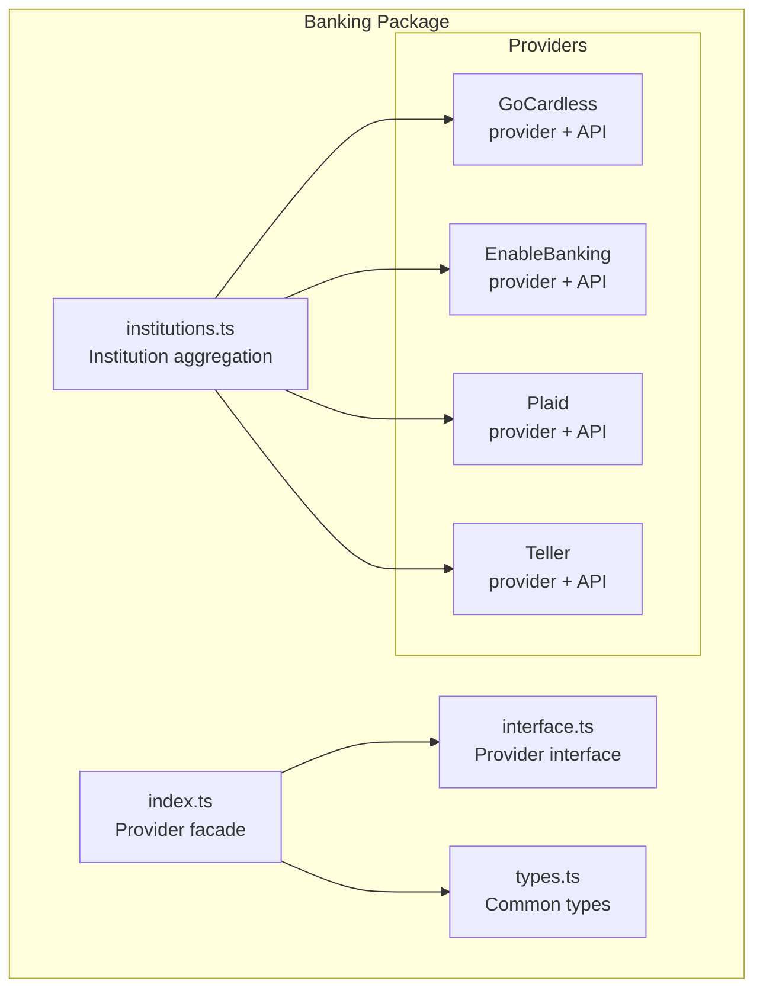
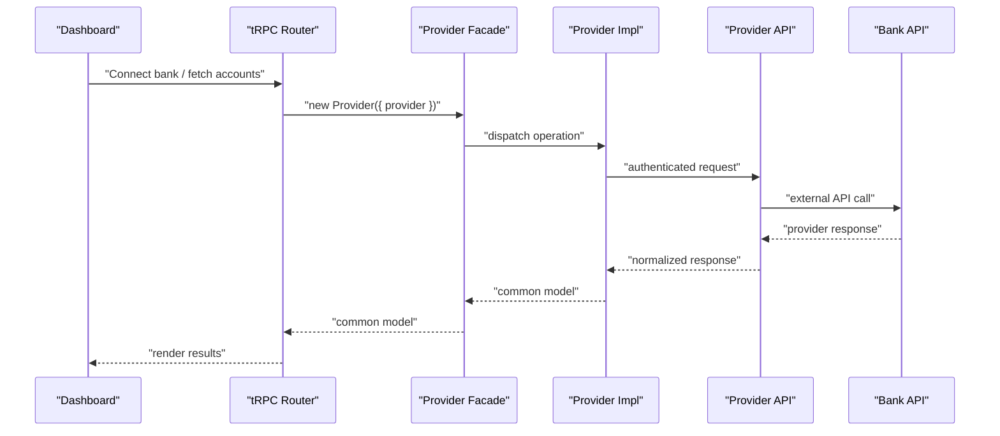
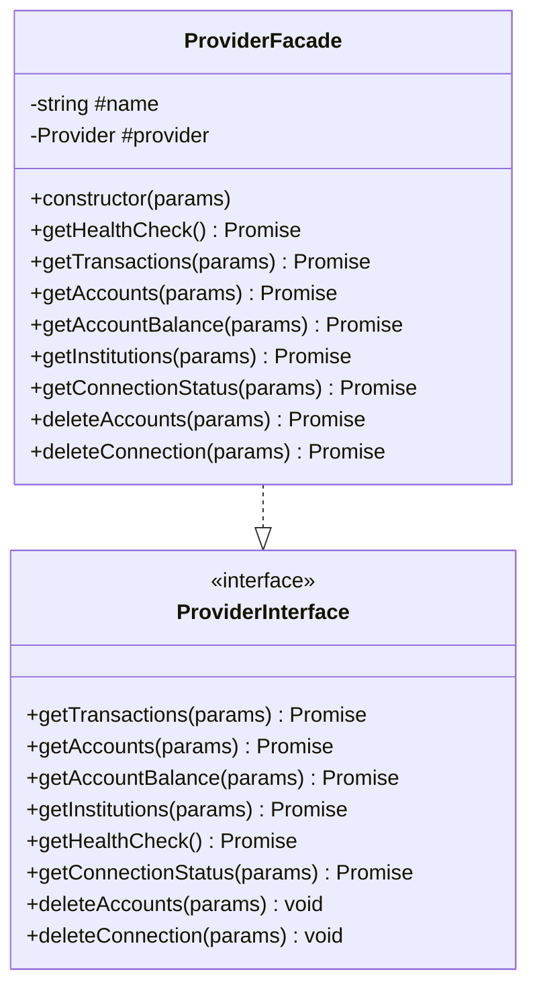
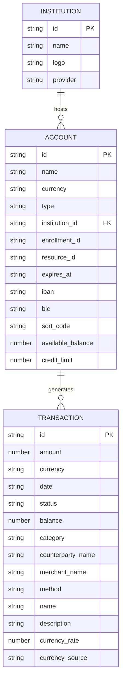
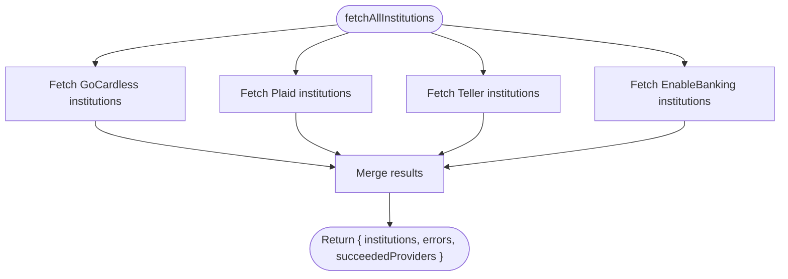
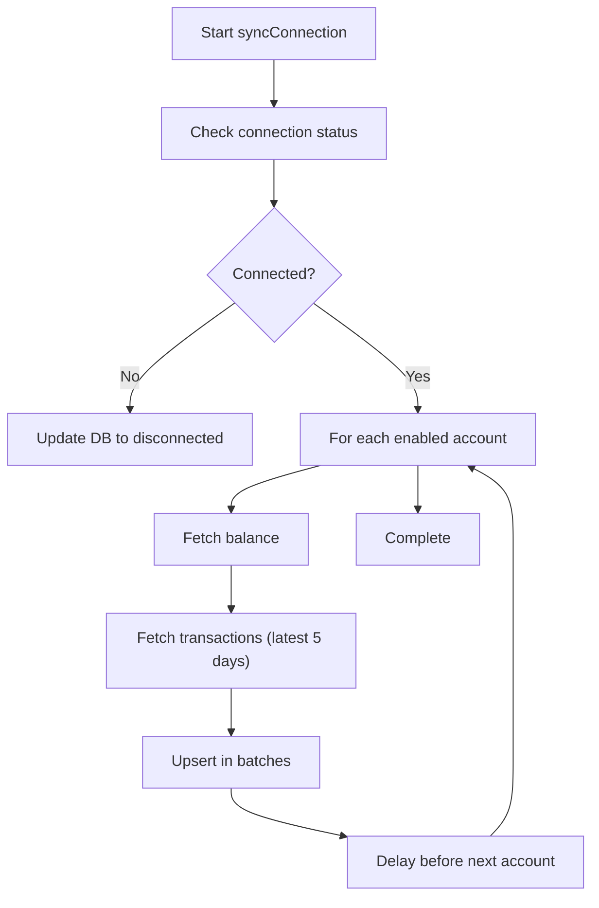
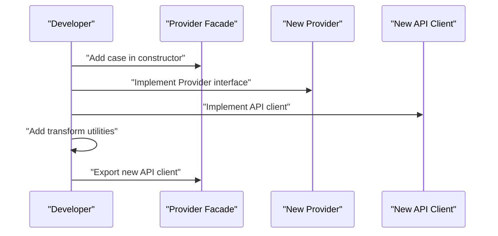
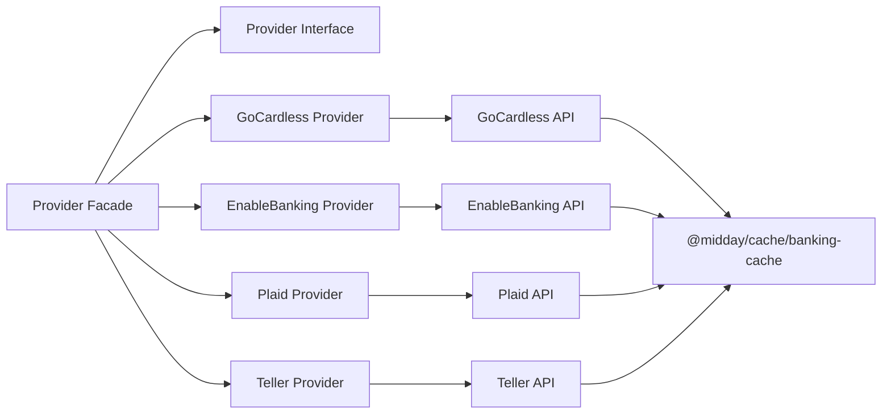

# Banking Integration (@midday/banking)

<cite>
**Referenced Files in This Document**
- [README.md](file://packages/banking/README.md)
- [index.ts](file://packages/banking/src/index.ts)
- [interface.ts](file://packages/banking/src/interface.ts)
- [types.ts](file://packages/banking/src/types.ts)
- [institutions.ts](file://packages/banking/src/institutions.ts)
- [gocardless-provider.ts](file://packages/banking/src/providers/gocardless/gocardless-provider.ts)
- [gocardless-api.ts](file://packages/banking/src/providers/gocardless/gocardless-api.ts)
- [enablebanking-provider.ts](file://packages/banking/src/providers/enablebanking/enablebanking-provider.ts)
- [enablebanking-api.ts](file://packages/banking/src/providers/enablebanking/enablebanking-api.ts)
- [plaid-provider.ts](file://packages/banking/src/providers/plaid/plaid-provider.ts)
- [plaid-api.ts](file://packages/banking/src/providers/plaid/plaid-api.ts)
- [teller-provider.ts](file://packages/banking/src/providers/teller/teller-provider.ts)
- [teller-api.ts](file://packages/banking/src/providers/teller/teller-api.ts)
- [banking.ts](file://midday/apps/api/src/schemas/banking.ts)
- [banking-router.ts](file://midday/apps/api/src/trpc/routers/banking.ts)
- [enablebanking-session-route.ts](file://midday/apps/dashboard/src/app/api/enablebanking/session/route.ts)
- [enablebanking-connect.tsx](file://midday/apps/dashboard/src/components/enablebanking-connect.tsx)
</cite>

## Table of Contents
1. [Introduction](#introduction)
2. [Project Structure](#project-structure)
3. [Core Components](#core-components)
4. [Architecture Overview](#architecture-overview)
5. [Detailed Component Analysis](#detailed-component-analysis)
6. [Dependency Analysis](#dependency-analysis)
7. [Performance Considerations](#performance-considerations)
8. [Troubleshooting Guide](#troubleshooting-guide)
9. [Conclusion](#conclusion)
10. [Appendices](#appendices)

## Introduction
This document describes the @midday/banking package, which integrates multiple banking providers to enable secure bank connections, synchronize transactions, and reconcile financial data. It covers the provider facade architecture, supported providers, authentication mechanisms, caching and rate-limit handling, synchronization flows, reconciliation logic, and extensibility for adding new providers. It also outlines transaction categorization and fraud detection patterns, security measures, and compliance considerations.

## Project Structure
The @midday/banking package is organized around a provider facade pattern with dedicated implementations for each provider. Shared types and utilities are centralized, and provider-specific APIs encapsulate HTTP clients and transformations.

**Diagram sources**
- [index.ts](file://packages/banking/src/index.ts#L1-L157)
- [interface.ts](file://packages/banking/src/interface.ts#L1-L34)
- [types.ts](file://packages/banking/src/types.ts#L1-L131)
- [institutions.ts](file://packages/banking/src/institutions.ts#L1-L196)
- [gocardless-provider.ts](file://packages/banking/src/providers/gocardless/gocardless-provider.ts#L1-L113)
- [enablebanking-provider.ts](file://packages/banking/src/providers/enablebanking/enablebanking-provider.ts#L1-L91)
- [plaid-provider.ts](file://packages/banking/src/providers/plaid/plaid-provider.ts#L1-L125)
- [teller-provider.ts](file://packages/banking/src/providers/teller/teller-provider.ts#L1-L120)

**Section sources**
- [README.md](file://packages/banking/README.md#L5-L488)
- [index.ts](file://packages/banking/src/index.ts#L1-L157)
- [institutions.ts](file://packages/banking/src/institutions.ts#L1-L196)

## Core Components
- Provider facade: A strategy-based dispatcher that routes operations to the correct provider implementation based on a provider identifier.
- Provider interface: Defines the contract for getAccounts, getAccountBalance, getTransactions, getInstitutions, getConnectionStatus, deleteAccounts, deleteConnection, and getHealthCheck.
- Provider implementations: Each provider implements the interface and delegates to a typed API client.
- API clients: Encapsulate HTTP calls, caching, rate-limit handling, and provider-specific authentication.
- Institutions aggregator: Collects and normalizes institution metadata from all providers.

Key responsibilities:
- Authentication and token management per provider.
- Data normalization to a common type model.
- Caching and rate-limit handling.
- Synchronization orchestration and error handling.

**Section sources**
- [interface.ts](file://packages/banking/src/interface.ts#L16-L33)
- [types.ts](file://packages/banking/src/types.ts#L3-L131)
- [index.ts](file://packages/banking/src/index.ts#L18-L136)
- [institutions.ts](file://packages/banking/src/institutions.ts#L163-L195)

## Architecture Overview
The system follows a provider facade pattern with per-provider API clients. The dashboard triggers provider flows, which call the facade. The facade dispatches to the appropriate provider, which uses its API client to interact with external banking APIs. Results are transformed into a common model and returned to the caller.

**Diagram sources**
- [index.ts](file://packages/banking/src/index.ts#L18-L136)
- [gocardless-provider.ts](file://packages/banking/src/providers/gocardless/gocardless-provider.ts#L20-L112)
- [enablebanking-provider.ts](file://packages/banking/src/providers/enablebanking/enablebanking-provider.ts#L23-L90)
- [plaid-provider.ts](file://packages/banking/src/providers/plaid/plaid-provider.ts#L20-L124)
- [teller-provider.ts](file://packages/banking/src/providers/teller/teller-provider.ts#L17-L119)

## Detailed Component Analysis

### Provider Facade (Strategy Pattern)
The facade class constructs the correct provider based on the provider parameter and forwards all operations to it. It also provides a health-check aggregation across providers.

**Diagram sources**
- [index.ts](file://packages/banking/src/index.ts#L18-L136)
- [interface.ts](file://packages/banking/src/interface.ts#L16-L33)

**Section sources**
- [index.ts](file://packages/banking/src/index.ts#L18-L136)
- [interface.ts](file://packages/banking/src/interface.ts#L16-L33)

### Supported Providers and Authentication
- GoCardless (EU/EEA): OAuth2 with secret_id/secret_key; tokens cached; institution-dependent transaction history; bank-level rate limits.
- Plaid (US/CA): Official SDK with client ID/secret headers; per-item access tokens; rate limits per endpoint/client; preserves account IDs across reconnects.
- Teller (US): mTLS client certificate plus basic auth; free balance derived from transaction running_balance; simplified connection status check.
- Enable Banking (EU): RSA-signed JWT (RS256) with cached client; 4,700+ ASPSPs; requires PSU headers; hybrid transaction strategy to avoid stale data.

**Section sources**
- [README.md](file://packages/banking/README.md#L46-L148)
- [gocardless-api.ts](file://packages/banking/src/providers/gocardless/gocardless-api.ts#L38-L124)
- [plaid-api.ts](file://packages/banking/src/providers/plaid/plaid-api.ts#L35-L57)
- [teller-api.ts](file://packages/banking/src/providers/teller/teller-api.ts#L24-L34)
- [enablebanking-api.ts](file://packages/banking/src/providers/enablebanking/enablebanking-api.ts#L25-L43)

### Data Model and Transformation
Common types define normalized models for institutions, accounts, balances, and transactions. Each provider’s API client transforms provider-specific responses into the common model.

**Diagram sources**
- [types.ts](file://packages/banking/src/types.ts#L26-L52)
- [types.ts](file://packages/banking/src/types.ts#L9-L24)
- [types.ts](file://packages/banking/src/types.ts#L103-L108)

**Section sources**
- [types.ts](file://packages/banking/src/types.ts#L9-L131)

### Institution Aggregation
The institutions aggregator fetches provider institution lists concurrently, normalizes logos and metadata, and returns a unified list with provider-specific attributes.

**Diagram sources**
- [institutions.ts](file://packages/banking/src/institutions.ts#L163-L195)

**Section sources**
- [institutions.ts](file://packages/banking/src/institutions.ts#L1-L196)

### Transaction Import Workflows
- Initial sync: Provider-specific strategies fetch full history or recent transactions depending on provider capabilities.
- Daily sync: Incremental fetch of the last 5 days; batching upserts; delayed per-account execution to respect rate limits.
- Reconnect: Remap account IDs using provider-specific identifiers and fuzzy matching; preserve Plaid IDs via update mode.

**Diagram sources**
- [README.md](file://packages/banking/README.md#L211-L224)

**Section sources**
- [README.md](file://packages/banking/README.md#L195-L238)

### Error Handling and Resilience
- Retry wrappers handle rate limits and transient failures with exponential backoff and jitter.
- Accounts track error retries; background sync skips accounts exceeding retry thresholds; manual sync bypasses thresholds.
- Redis cache failures degrade gracefully to direct API calls.

**Section sources**
- [README.md](file://packages/banking/README.md#L239-L265)

### Security Measures
- Token storage: OAuth tokens cached in Redis; JWT cached in memory with safety margins.
- mTLS: Required for Teller; client certificates supplied via environment variables.
- Headers: Enable Banking requires PSU headers for GET requests.
- Logging: Structured logging with masked sensitive fields.

**Section sources**
- [README.md](file://packages/banking/README.md#L48-L148)
- [teller-api.ts](file://packages/banking/src/providers/teller/teller-api.ts#L186-L203)
- [enablebanking-api.ts](file://packages/banking/src/providers/enablebanking/enablebanking-api.ts#L147-L156)

### Extensibility: Adding a New Provider
Follow the established pattern:
- Implement a provider class that adheres to the Provider interface.
- Create a typed API client with authentication, caching, and rate-limit handling.
- Add transformation utilities to normalize provider responses to the common model.
- Integrate the new provider in the facade constructor and export its API client.
- Add institution fetching and logo handling in the institutions aggregator.

**Diagram sources**
- [index.ts](file://packages/banking/src/index.ts#L27-L47)
- [interface.ts](file://packages/banking/src/interface.ts#L16-L33)

**Section sources**
- [README.md](file://packages/banking/README.md#L449-L482)
- [index.ts](file://packages/banking/src/index.ts#L1-L157)

### Compliance and Edge Cases
- GoCardless: Try-180 fallback to 90 days for access validity; bank-level rate limits; institution-specific history caps.
- Enable Banking: Hybrid strategy to avoid stale “longest” data; deduplication guidance at the database layer.
- Currency handling: ISO 4217 “XXX” resolution via transform and sync self-heal.
- Plaid: Cursor persistence and count tuning for pagination stability.

**Section sources**
- [README.md](file://packages/banking/README.md#L268-L430)

## Dependency Analysis
The package depends on a shared caching layer and provider-specific SDKs or HTTP clients. The facade depends on provider implementations, which depend on their respective API clients.

**Diagram sources**
- [index.ts](file://packages/banking/src/index.ts#L1-L157)
- [gocardless-provider.ts](file://packages/banking/src/providers/gocardless/gocardless-provider.ts#L1-L113)
- [enablebanking-provider.ts](file://packages/banking/src/providers/enablebanking/enablebanking-provider.ts#L1-L91)
- [plaid-provider.ts](file://packages/banking/src/providers/plaid/plaid-provider.ts#L1-L125)
- [teller-provider.ts](file://packages/banking/src/providers/teller/teller-provider.ts#L1-L120)
- [gocardless-api.ts](file://packages/banking/src/providers/gocardless/gocardless-api.ts#L1-L509)
- [enablebanking-api.ts](file://packages/banking/src/providers/enablebanking/enablebanking-api.ts#L1-L526)
- [plaid-api.ts](file://packages/banking/src/providers/plaid/plaid-api.ts#L1-L320)
- [teller-api.ts](file://packages/banking/src/providers/teller/teller-api.ts#L1-L246)

**Section sources**
- [index.ts](file://packages/banking/src/index.ts#L1-L157)
- [gocardless-api.ts](file://packages/banking/src/providers/gocardless/gocardless-api.ts#L1-L509)
- [enablebanking-api.ts](file://packages/banking/src/providers/enablebanking/enablebanking-api.ts#L1-L526)
- [plaid-api.ts](file://packages/banking/src/providers/plaid/plaid-api.ts#L1-L320)
- [teller-api.ts](file://packages/banking/src/providers/teller/teller-api.ts#L1-L246)

## Performance Considerations
- Caching: Provider data is cached with TTLs to minimize API calls and improve latency.
- Rate limiting: Built-in retry with exponential backoff and jitter; per-provider headers and thresholds.
- Concurrency: Parallel institution fetches; sequential per-account sync with delays to respect provider limits.
- Pagination: Plaid uses cursor-based pagination; Enable Banking uses continuation keys; Teller uses count-based pagination.

[No sources needed since this section provides general guidance]

## Troubleshooting Guide
Common issues and resolutions:
- Authentication failures: Verify provider credentials and environment variables; check token caching and expiry.
- Rate limit errors: Implement backoff; review provider-specific headers; adjust sync cadence.
- Connection status mismatches: Use provider-specific status checks; handle provider-specific disconnection semantics.
- Currency “XXX”: Confirm transform and sync self-heal logic; inspect balance and transaction currency fields.
- Reconnect ID remapping: Ensure account-reference and IBAN matching; verify fuzzy matching logic.

**Section sources**
- [README.md](file://packages/banking/README.md#L239-L404)

## Conclusion
The @midday/banking package provides a robust, extensible framework for integrating multiple banking providers. Its facade pattern, strong typing, caching, and resilient error handling enable reliable transaction synchronization and reconciliation. The documented flows, security measures, and compliance considerations support production-grade deployments.

[No sources needed since this section summarizes without analyzing specific files]

## Appendices

### API Surface and Router Integration
- The tRPC router exposes banking operations to the dashboard and backend services.
- Schema definitions and banking-related types are defined centrally for consistency.

**Section sources**
- [banking-router.ts](file://midday/apps/api/src/trpc/routers/banking.ts)
- [banking.ts](file://midday/apps/api/src/schemas/banking.ts)

### Enable Banking Dashboard Integration
- The dashboard route handles provider sessions and redirects.
- The dashboard component manages provider-specific connection flows.

**Section sources**
- [enablebanking-session-route.ts](file://midday/apps/dashboard/src/app/api/enablebanking/session/route.ts)
- [enablebanking-connect.tsx](file://midday/apps/dashboard/src/components/enablebanking-connect.tsx)