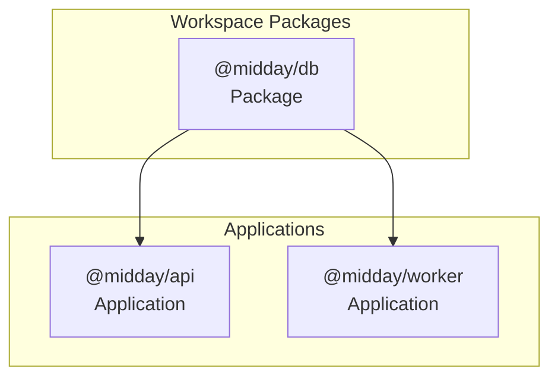
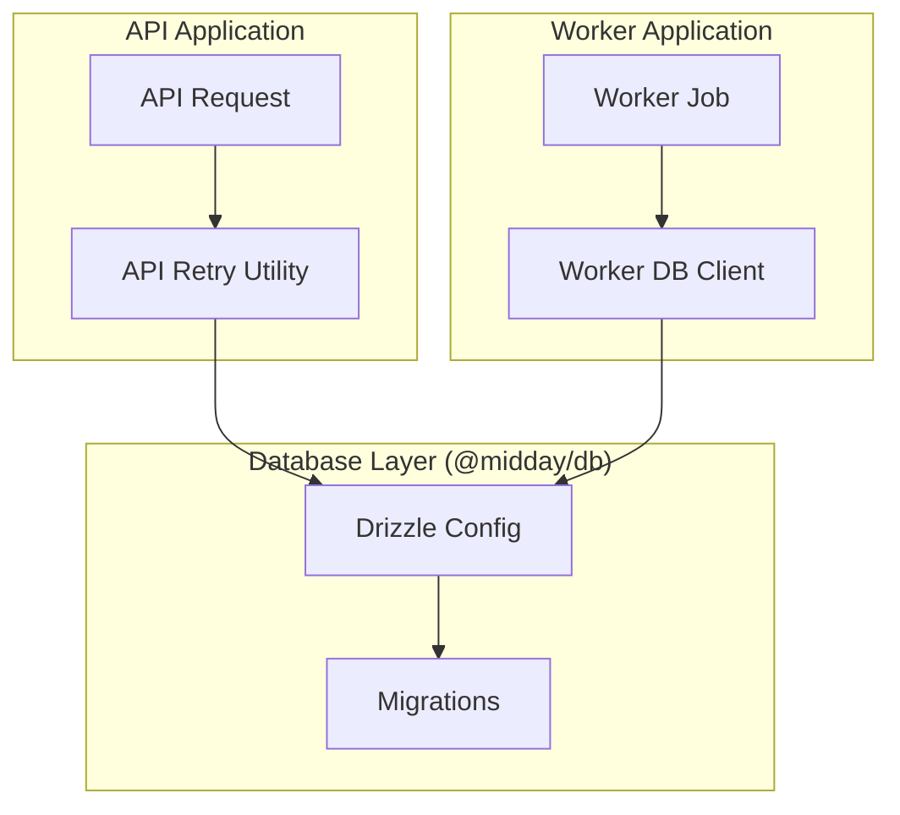
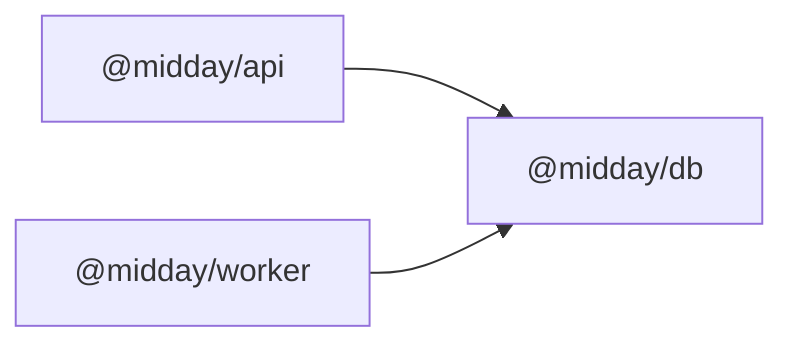

# Database Layer (@midday/db)

<cite>
**Referenced Files in This Document**
- [drizzle.config.ts](file://midday/packages/db/drizzle.config.ts)
- [db.ts](file://midday/apps/worker/src/utils/db.ts)
- [db-retry.ts](file://midday/apps/api/src/utils/db-retry.ts)
- [db-retry.ts](file://midday/apps/worker/src/utils/db-retry.ts)
- [package.json](file://midday/apps/api/package.json)
</cite>

## Table of Contents
1. [Introduction](#introduction)
2. [Project Structure](#project-structure)
3. [Core Components](#core-components)
4. [Architecture Overview](#architecture-overview)
5. [Detailed Component Analysis](#detailed-component-analysis)
6. [Dependency Analysis](#dependency-analysis)
7. [Performance Considerations](#performance-considerations)
8. [Troubleshooting Guide](#troubleshooting-guide)
9. [Conclusion](#conclusion)

## Introduction
This document describes the @midday/db package as the central database abstraction layer for Faworra. It covers Drizzle ORM configuration, database client initialization, connection pooling strategies, schema design patterns, type-safe operations, migration management, connection lifecycle, retry mechanisms, error handling, and integration with other packages in the monorepo. It also provides practical guidance for writing queries, managing transactions, and optimizing performance.

## Project Structure
The @midday/db package is defined as a workspace package and consumed by multiple applications in the monorepo. The package configuration and migrations are located under midday/packages/db, while application-specific database utilities and retry logic live alongside their respective apps.

**Section sources**
- [package.json](file://midday/apps/api/package.json#L33-L33)

## Core Components
- Drizzle configuration: Defines schema path, migration output, PostgreSQL dialect, and session pooler URL.
- Worker database client: Provides a singleton database instance with reconnection logging for job processing.
- Retry utilities: Shared retry logic for transient database failures across API and worker contexts.
- Migration management: Drizzle Kit configuration drives schema migrations stored under the package’s migrations directory.

Key responsibilities:
- Centralized database configuration and credentials via environment variables.
- Type-safe schema definitions and generated migrations.
- Robust connection lifecycle and error reporting for long-running workers.
- Consistent retry behavior for transient failures.

**Section sources**
- [drizzle.config.ts](file://midday/packages/db/drizzle.config.ts#L1-L11)
- [db.ts](file://midday/apps/worker/src/utils/db.ts#L1-L31)
- [db-retry.ts](file://midday/apps/api/src/utils/db-retry.ts#L1-L200)
- [db-retry.ts](file://midday/apps/worker/src/utils/db-retry.ts#L1-L200)

## Architecture Overview
The database layer integrates with applications through a typed client and a shared retry strategy. The worker module encapsulates a persistent connection pool optimized for concurrent job processing, while the API module relies on per-request or per-operation connections with retry logic.

**Diagram sources**
- [drizzle.config.ts](file://midday/packages/db/drizzle.config.ts#L1-L11)
- [db.ts](file://midday/apps/worker/src/utils/db.ts#L1-L31)
- [db-retry.ts](file://midday/apps/api/src/utils/db-retry.ts#L1-L200)
- [db-retry.ts](file://midday/apps/worker/src/utils/db-retry.ts#L1-L200)

## Detailed Component Analysis

### Drizzle ORM Configuration
- Schema path: Points to the centralized schema definition.
- Migration output: Generated migrations are written to the package’s migrations directory.
- Dialect: PostgreSQL configured for session pooler connectivity.
- Credentials: Database URL is sourced from an environment variable intended for connection pooling.

Operational implications:
- Ensures consistent schema generation and migration lifecycle across environments.
- Requires DATABASE_SESSION_POOLER to be set for production-like deployments.

**Section sources**
- [drizzle.config.ts](file://midday/packages/db/drizzle.config.ts#L1-L11)

### Worker Database Client
- Purpose: Provide a singleton database instance for worker jobs with robust initialization and error logging.
- Behavior: Lazily initializes a shared connection pool via a worker-specific client getter.
- Error handling: Logs initialization failures and rethrows to surface issues early.

Connection lifecycle:
- One-time initialization on first use.
- Persistent connection pool suitable for concurrent job processing.
- Immediate failure propagation with contextual logging.

**Section sources**
- [db.ts](file://midday/apps/worker/src/utils/db.ts#L1-L31)

### Retry Utilities
- Role: Encapsulate retry logic for transient database errors in both API and worker contexts.
- Usage: Intended to wrap database operations that may fail due to temporary network or pool exhaustion issues.
- Benefits: Improves resilience without masking permanent failures.

Integration pattern:
- Wrap sensitive operations with retry wrappers to increase success rates during bursts or maintenance windows.

**Section sources**
- [db-retry.ts](file://midday/apps/api/src/utils/db-retry.ts#L1-L200)
- [db-retry.ts](file://midday/apps/worker/src/utils/db-retry.ts#L1-L200)

### Migration Management
- Drizzle Kit configuration governs schema-to-migration generation and deployment.
- Migrations are stored under the package’s migrations directory and applied by the runtime environment.
- Best practice: Treat migrations as immutable artifacts and apply them during deployment.

**Section sources**
- [drizzle.config.ts](file://midday/packages/db/drizzle.config.ts#L1-L11)

### Transaction Management and Type-Safe Operations
- Type safety: Drizzle generates TypeScript types from schema definitions, enabling compile-time verification of queries and mutations.
- Transactions: Use Drizzle’s transaction APIs to ensure atomicity across related writes.
- Patterns: Prefer batch operations for performance and maintain referential integrity with foreign keys and constraints.

[No sources needed since this section provides general guidance]

### Query Examples and Best Practices
- Select with filtering: Use typed selectors to fetch rows with conditions and projections.
- Upserts: Employ conflict clauses to handle idempotent updates.
- Aggregations: Leverage grouped queries for summaries and analytics.
- Pagination: Apply offset/limit or cursor-based pagination for large datasets.

[No sources needed since this section provides general guidance]

## Dependency Analysis
The @midday/db package is consumed by multiple applications in the monorepo. The API application depends on it for database operations, while the worker application uses a specialized client tailored for concurrent job processing.

**Diagram sources**
- [package.json](file://midday/apps/api/package.json#L33-L33)

**Section sources**
- [package.json](file://midday/apps/api/package.json#L33-L33)

## Performance Considerations
- Connection pooling: Use the session pooler URL for improved connection reuse and reduced overhead.
- Batch operations: Combine inserts/updates/deletes to minimize round trips.
- Indexes: Ensure appropriate indexes for frequent filters and joins.
- Query profiling: Monitor slow queries and optimize with EXPLAIN plans.
- Retry backoff: Configure exponential backoff in retry utilities to avoid thundering herds.

[No sources needed since this section provides general guidance]

## Troubleshooting Guide
Common issues and resolutions:
- Connection failures: Verify DATABASE_SESSION_POOLER is set and reachable. Check worker initialization logs for errors.
- Transient failures: Wrap operations with retry utilities to mitigate temporary network glitches.
- Migration conflicts: Re-run migrations after resolving schema drift; ensure migrations are applied in order.

**Section sources**
- [db.ts](file://midday/apps/worker/src/utils/db.ts#L17-L28)
- [db-retry.ts](file://midday/apps/api/src/utils/db-retry.ts#L1-L200)
- [db-retry.ts](file://midday/apps/worker/src/utils/db-retry.ts#L1-L200)

## Conclusion
The @midday/db package provides a cohesive database abstraction layer powered by Drizzle ORM. It offers a standardized configuration, resilient connection handling for workers, and reusable retry logic for transient failures. Together with schema-driven migrations and type-safe operations, it enables reliable, maintainable database interactions across the monorepo’s applications.