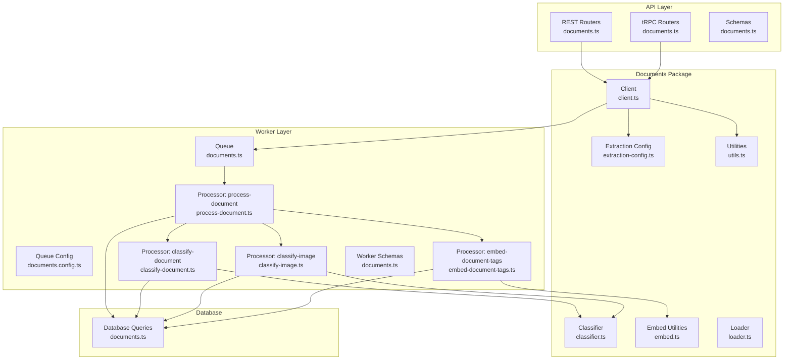
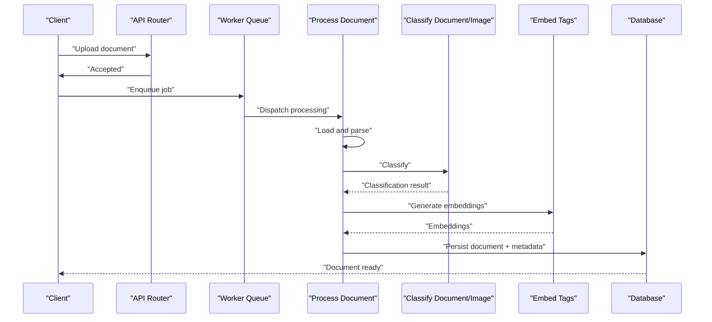
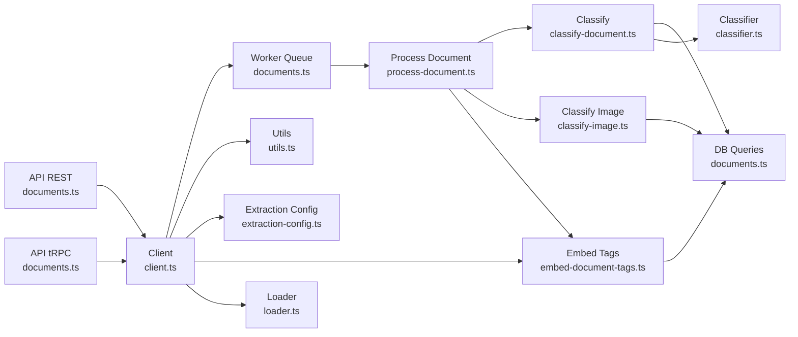

# Document Management (@midday/documents)

<cite>
**Referenced Files in This Document**
- [package.json](file://packages/documents/package.json)
- [classifier.ts](file://packages/documents/src/classifier/classifier.ts)
- [client.ts](file://packages/documents/src/client.ts)
- [extraction-config.ts](file://packages/documents/src/config/extraction-config.ts)
- [embed.ts](file://packages/documents/src/embed/embed.ts)
- [loader.ts](file://packages/documents/src/loader.ts)
- [utils.ts](file://packages/documents/src/utils.ts)
- [documents.ts](file://apps/api/src/rest/routers/documents.ts)
- [documents.ts](file://apps/api/src/trpc/routers/documents.ts)
- [documents.ts](file://apps/api/src/schemas/documents.ts)
- [documents.config.ts](file://apps/worker/src/queues/documents.config.ts)
- [documents.ts](file://apps/worker/src/queues/documents.ts)
- [process-document.ts](file://apps/worker/src/processors/documents/process-document.ts)
- [classify-document.ts](file://apps/worker/src/processors/documents/classify-document.ts)
- [classify-image.ts](file://apps/worker/src/processors/documents/classify-image.ts)
- [embed-document-tags.ts](file://apps/worker/src/processors/documents/embed-document-tags.ts)
- [documents.ts](file://apps/worker/src/schemas/documents.ts)
- [documents.ts](file://packages/db/src/queries/documents.ts)
- [document-processing.md](file://docs/document-processing.md)
</cite>

## Table of Contents
1. [Introduction](#introduction)
2. [Project Structure](#project-structure)
3. [Core Components](#core-components)
4. [Architecture Overview](#architecture-overview)
5. [Detailed Component Analysis](#detailed-component-analysis)
6. [Dependency Analysis](#dependency-analysis)
7. [Performance Considerations](#performance-considerations)
8. [Troubleshooting Guide](#troubleshooting-guide)
9. [Conclusion](#conclusion)
10. [Appendices](#appendices)

## Introduction
This document describes the @midday/documents package, which provides a complete document ingestion pipeline for upload, processing, classification, embedding, and storage. It covers supported file formats, processing workflows, storage integration, security and access controls, metadata extraction, search capabilities, and extensibility for new document types and external storage providers.

## Project Structure
The @midday/documents package is organized around a client interface, classifier, loader, extraction configuration, embedding utilities, and shared utilities. It integrates with the API layer (REST and tRPC routers) and the Worker layer (queues and processors) for asynchronous document processing.

**Diagram sources**
- [client.ts](file://packages/documents/src/client.ts#L1-L200)
- [classifier.ts](file://packages/documents/src/classifier/classifier.ts#L1-L200)
- [extraction-config.ts](file://packages/documents/src/config/extraction-config.ts#L1-L200)
- [embed.ts](file://packages/documents/src/embed/embed.ts#L1-L200)
- [loader.ts](file://packages/documents/src/loader.ts#L1-L200)
- [utils.ts](file://packages/documents/src/utils.ts#L1-L200)
- [documents.ts](file://apps/api/src/rest/routers/documents.ts#L1-L200)
- [documents.ts](file://apps/api/src/trpc/routers/documents.ts#L1-L200)
- [documents.ts](file://apps/api/src/schemas/documents.ts#L1-L200)
- [documents.config.ts](file://apps/worker/src/queues/documents.config.ts#L1-L200)
- [documents.ts](file://apps/worker/src/queues/documents.ts#L1-L200)
- [process-document.ts](file://apps/worker/src/processors/documents/process-document.ts#L1-L200)
- [classify-document.ts](file://apps/worker/src/processors/documents/classify-document.ts#L1-L200)
- [classify-image.ts](file://apps/worker/src/processors/documents/classify-image.ts#L1-L200)
- [embed-document-tags.ts](file://apps/worker/src/processors/documents/embed-document-tags.ts#L1-L200)
- [documents.ts](file://apps/worker/src/schemas/documents.ts#L1-L200)
- [documents.ts](file://packages/db/src/queries/documents.ts#L1-L200)

**Section sources**
- [package.json](file://packages/documents/package.json#L1-L100)
- [client.ts](file://packages/documents/src/client.ts#L1-L200)
- [classifier.ts](file://packages/documents/src/classifier/classifier.ts#L1-L200)
- [extraction-config.ts](file://packages/documents/src/config/extraction-config.ts#L1-L200)
- [embed.ts](file://packages/documents/src/embed/embed.ts#L1-L200)
- [loader.ts](file://packages/documents/src/loader.ts#L1-L200)
- [utils.ts](file://packages/documents/src/utils.ts#L1-L200)

## Core Components
- Client: Provides the primary interface for uploading, queuing, and retrieving document metadata and embeddings.
- Classifier: Implements AI-driven document classification logic.
- Loader: Handles document loading and initial parsing steps.
- Extraction Config: Centralizes extraction rules and configurations.
- Embed Utilities: Manages vector embeddings for tags and content.
- Utilities: Shared helpers for MIME type checks, language mapping, and limits.
- API Routers: Expose REST and tRPC endpoints for document operations.
- Worker Queue and Processors: Asynchronously process documents, classify them, and generate embeddings.
- Database Queries: Persist and query document records and related metadata.

**Section sources**
- [client.ts](file://packages/documents/src/client.ts#L1-L200)
- [classifier.ts](file://packages/documents/src/classifier/classifier.ts#L1-L200)
- [loader.ts](file://packages/documents/src/loader.ts#L1-L200)
- [extraction-config.ts](file://packages/documents/src/config/extraction-config.ts#L1-L200)
- [embed.ts](file://packages/documents/src/embed/embed.ts#L1-L200)
- [utils.ts](file://packages/documents/src/utils.ts#L1-L200)
- [documents.ts](file://apps/api/src/rest/routers/documents.ts#L1-L200)
- [documents.ts](file://apps/api/src/trpc/routers/documents.ts#L1-L200)
- [documents.config.ts](file://apps/worker/src/queues/documents.config.ts#L1-L200)
- [process-document.ts](file://apps/worker/src/processors/documents/process-document.ts#L1-L200)
- [documents.ts](file://packages/db/src/queries/documents.ts#L1-L200)

## Architecture Overview
The document management system follows a pipeline:
- Upload via API (REST/tRPC) triggers the client to enqueue processing.
- Worker queue picks up jobs and runs processors for loading, classification, and embedding.
- Results are stored in the database and made searchable.

**Diagram sources**
- [documents.ts](file://apps/api/src/rest/routers/documents.ts#L1-L200)
- [documents.ts](file://apps/api/src/trpc/routers/documents.ts#L1-L200)
- [documents.ts](file://apps/worker/src/queues/documents.ts#L1-L200)
- [process-document.ts](file://apps/worker/src/processors/documents/process-document.ts#L1-L200)
- [classify-document.ts](file://apps/worker/src/processors/documents/classify-document.ts#L1-L200)
- [classify-image.ts](file://apps/worker/src/processors/documents/classify-image.ts#L1-L200)
- [embed-document-tags.ts](file://apps/worker/src/processors/documents/embed-document-tags.ts#L1-L200)
- [documents.ts](file://packages/db/src/queries/documents.ts#L1-L200)

## Detailed Component Analysis

### Client
The client encapsulates upload, queueing, and retrieval operations. It interacts with the API routers and the worker queue to orchestrate document processing.

Key responsibilities:
- Validate and prepare uploads
- Enqueue processing jobs
- Retrieve document metadata and embeddings

Integration points:
- REST and tRPC routers consume client methods
- Worker processors depend on client-provided loaders and utilities

**Section sources**
- [client.ts](file://packages/documents/src/client.ts#L1-L200)
- [documents.ts](file://apps/api/src/rest/routers/documents.ts#L1-L200)
- [documents.ts](file://apps/api/src/trpc/routers/documents.ts#L1-L200)

### Classifier
The classifier module implements AI-driven document classification. It supports text and image-based classification and maps language codes for PostgreSQL configuration.

Key responsibilities:
- Classify documents into categories
- Support language-specific configurations
- Integrate with embedding generation

**Section sources**
- [classifier.ts](file://packages/documents/src/classifier/classifier.ts#L1-L200)
- [classify-document.ts](file://apps/worker/src/processors/documents/classify-document.ts#L1-L200)
- [classify-image.ts](file://apps/worker/src/processors/documents/classify-image.ts#L1-L200)

### Loader
The loader handles initial document loading and parsing. It prepares documents for downstream classification and embedding.

Key responsibilities:
- Load raw document content
- Parse initial metadata
- Prepare for classification and embedding

**Section sources**
- [loader.ts](file://packages/documents/src/loader.ts#L1-L200)
- [process-document.ts](file://apps/worker/src/processors/documents/process-document.ts#L1-L200)

### Extraction Configuration
The extraction configuration centralizes rules for metadata extraction and processing behavior. It defines supported formats and extraction strategies.

Key responsibilities:
- Define extraction rules
- Configure processing behavior per format
- Provide shared configuration across processors

**Section sources**
- [extraction-config.ts](file://packages/documents/src/config/extraction-config.ts#L1-L200)

### Embedding Utilities
Embed utilities manage vector embeddings for tags and document content, enabling semantic search and tagging.

Key responsibilities:
- Generate embeddings for tags
- Integrate with classification results
- Support search and retrieval

**Section sources**
- [embed.ts](file://packages/documents/src/embed/embed.ts#L1-L200)
- [embed-document-tags.ts](file://apps/worker/src/processors/documents/embed-document-tags.ts#L1-L200)

### Utilities
Shared utilities provide MIME type checks, language code mapping, and word limits used across the pipeline.

Key responsibilities:
- MIME type validation for processing
- Language code mapping for PostgreSQL
- Word limits for classification

**Section sources**
- [utils.ts](file://packages/documents/src/utils.ts#L1-L200)
- [process-document.ts](file://apps/worker/src/processors/documents/process-document.ts#L1-L200)

### API Routers
The API exposes REST and tRPC endpoints for document operations, including upload, retrieval, and status checks. They integrate with the client and enforce validation.

Key responsibilities:
- REST endpoint for uploads and queries
- tRPC router for typed operations
- Validation and schema enforcement

**Section sources**
- [documents.ts](file://apps/api/src/rest/routers/documents.ts#L1-L200)
- [documents.ts](file://apps/api/src/trpc/routers/documents.ts#L1-L200)
- [documents.ts](file://apps/api/src/schemas/documents.ts#L1-L200)

### Worker Queue and Processors
The worker layer manages asynchronous processing jobs. It includes queue configuration, dispatch, and processors for document processing, classification, and embedding.

Key responsibilities:
- Queue configuration and dispatch
- Document processing pipeline
- Classification and embedding
- Persistence of results

**Section sources**
- [documents.config.ts](file://apps/worker/src/queues/documents.config.ts#L1-L200)
- [documents.ts](file://apps/worker/src/queues/documents.ts#L1-L200)
- [process-document.ts](file://apps/worker/src/processors/documents/process-document.ts#L1-L200)
- [classify-document.ts](file://apps/worker/src/processors/documents/classify-document.ts#L1-L200)
- [classify-image.ts](file://apps/worker/src/processors/documents/classify-image.ts#L1-L200)
- [embed-document-tags.ts](file://apps/worker/src/processors/documents/embed-document-tags.ts#L1-L200)
- [documents.ts](file://apps/worker/src/schemas/documents.ts#L1-L200)

### Database Integration
Database queries handle persistence and retrieval of document records, classifications, embeddings, and related metadata.

Key responsibilities:
- Insert and update document records
- Query classifications and embeddings
- Manage tag assignments and metadata

**Section sources**
- [documents.ts](file://packages/db/src/queries/documents.ts#L1-L200)

## Dependency Analysis
The @midday/documents package integrates tightly with API and Worker layers, while also depending on shared utilities and schemas.

**Diagram sources**
- [documents.ts](file://apps/api/src/rest/routers/documents.ts#L1-L200)
- [documents.ts](file://apps/api/src/trpc/routers/documents.ts#L1-L200)
- [client.ts](file://packages/documents/src/client.ts#L1-L200)
- [documents.ts](file://apps/worker/src/queues/documents.ts#L1-L200)
- [process-document.ts](file://apps/worker/src/processors/documents/process-document.ts#L1-L200)
- [classify-document.ts](file://apps/worker/src/processors/documents/classify-document.ts#L1-L200)
- [classify-image.ts](file://apps/worker/src/processors/documents/classify-image.ts#L1-L200)
- [embed-document-tags.ts](file://apps/worker/src/processors/documents/embed-document-tags.ts#L1-L200)
- [documents.ts](file://packages/db/src/queries/documents.ts#L1-L200)
- [utils.ts](file://packages/documents/src/utils.ts#L1-L200)
- [extraction-config.ts](file://packages/documents/src/config/extraction-config.ts#L1-L200)
- [embed.ts](file://packages/documents/src/embed/embed.ts#L1-L200)
- [loader.ts](file://packages/documents/src/loader.ts#L1-L200)
- [classifier.ts](file://packages/documents/src/classifier/classifier.ts#L1-L200)

**Section sources**
- [client.ts](file://packages/documents/src/client.ts#L1-L200)
- [utils.ts](file://packages/documents/src/utils.ts#L1-L200)
- [documents.ts](file://apps/api/src/rest/routers/documents.ts#L1-L200)
- [documents.ts](file://apps/api/src/trpc/routers/documents.ts#L1-L200)
- [documents.ts](file://apps/worker/src/queues/documents.ts#L1-L200)
- [process-document.ts](file://apps/worker/src/processors/documents/process-document.ts#L1-L200)

## Performance Considerations
- Asynchronous processing: Offload heavy tasks to the worker queue to keep API responsive.
- Batch operations: Group similar document types for efficient classification and embedding.
- Caching: Reuse embeddings and classifications where appropriate to reduce recomputation.
- Resource limits: Apply word limits and timeouts to prevent resource exhaustion during classification.
- Storage throughput: Use optimized storage providers and consider compression for large documents.

[No sources needed since this section provides general guidance]

## Troubleshooting Guide
Common issues and resolutions:
- Unsupported MIME types: Verify MIME type checks and ensure formats are supported for processing.
- Classification failures: Review classifier configuration and language mapping for PostgreSQL.
- Embedding errors: Confirm embedding generation and database insertion steps.
- Queue backlogs: Monitor queue configuration and processor capacity.

**Section sources**
- [utils.ts](file://packages/documents/src/utils.ts#L1-L200)
- [classifier.ts](file://packages/documents/src/classifier/classifier.ts#L1-L200)
- [embed.ts](file://packages/documents/src/embed/embed.ts#L1-L200)
- [documents.config.ts](file://apps/worker/src/queues/documents.config.ts#L1-L200)

## Conclusion
The @midday/documents package provides a robust, extensible framework for document ingestion, processing, classification, and storage. Its modular design enables easy integration with APIs and workers, while utilities and configuration support diverse document types and storage providers.

[No sources needed since this section summarizes without analyzing specific files]

## Appendices

### Document Upload and Processing Workflow
- Upload via REST or tRPC endpoints.
- Client enqueues processing job.
- Worker loads and parses the document.
- Classification and embedding processors run.
- Results persisted to the database.

**Section sources**
- [documents.ts](file://apps/api/src/rest/routers/documents.ts#L1-L200)
- [documents.ts](file://apps/api/src/trpc/routers/documents.ts#L1-L200)
- [client.ts](file://packages/documents/src/client.ts#L1-L200)
- [process-document.ts](file://apps/worker/src/processors/documents/process-document.ts#L1-L200)

### File Format Support
- Supported formats are validated by MIME type checks.
- Extraction configuration defines processing behavior per format.

**Section sources**
- [utils.ts](file://packages/documents/src/utils.ts#L1-L200)
- [extraction-config.ts](file://packages/documents/src/config/extraction-config.ts#L1-L200)

### Security and Access Control
- Authentication and authorization enforced at API layer.
- Access to documents restricted by user/team permissions.
- Secure storage integration with provider-specific policies.

**Section sources**
- [documents.ts](file://apps/api/src/rest/routers/documents.ts#L1-L200)
- [documents.ts](file://apps/api/src/trpc/routers/documents.ts#L1-L200)

### Metadata Extraction and Search
- Metadata extracted via loader and extraction configuration.
- Embeddings enable semantic search and tag assignment.
- Database queries support retrieval and filtering.

**Section sources**
- [loader.ts](file://packages/documents/src/loader.ts#L1-L200)
- [extraction-config.ts](file://packages/documents/src/config/extraction-config.ts#L1-L200)
- [embed.ts](file://packages/documents/src/embed/embed.ts#L1-L200)
- [documents.ts](file://packages/db/src/queries/documents.ts#L1-L200)

### Extensibility and External Storage Providers
- Add new document types by extending extraction configuration and processors.
- Integrate external storage by implementing loader and storage adapters.
- Extend classifier and embedding utilities for new categories and languages.

**Section sources**
- [extraction-config.ts](file://packages/documents/src/config/extraction-config.ts#L1-L200)
- [classifier.ts](file://packages/documents/src/classifier/classifier.ts#L1-L200)
- [embed.ts](file://packages/documents/src/embed/embed.ts#L1-L200)
- [loader.ts](file://packages/documents/src/loader.ts#L1-L200)