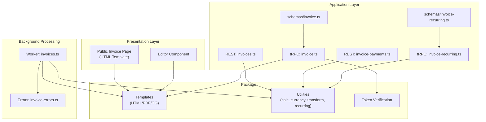
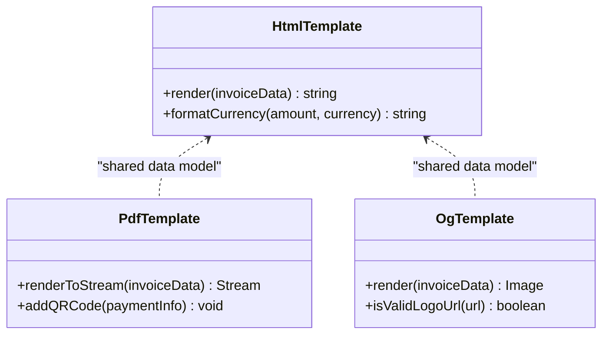
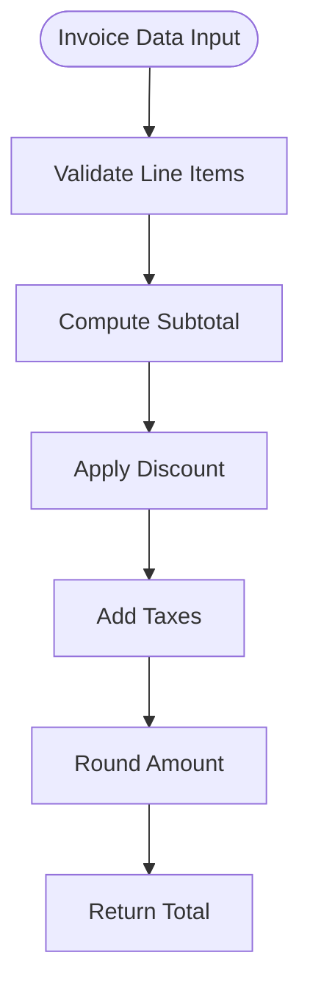
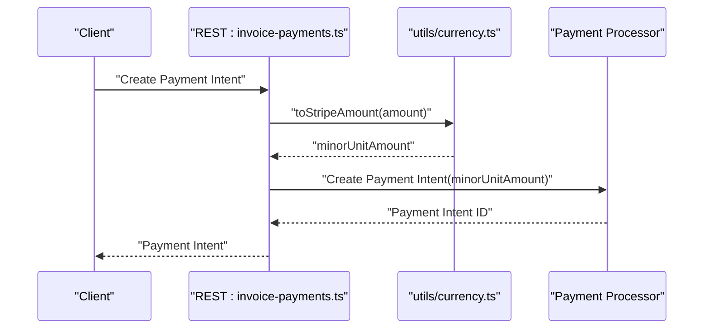
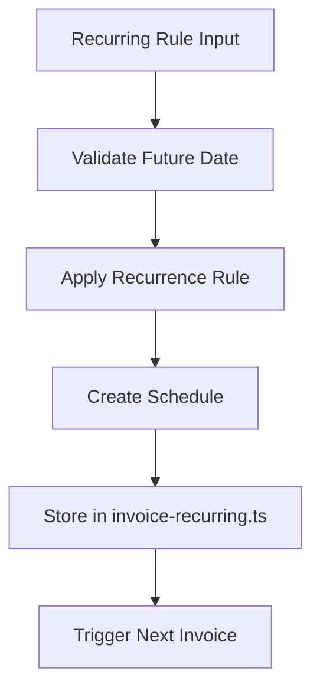
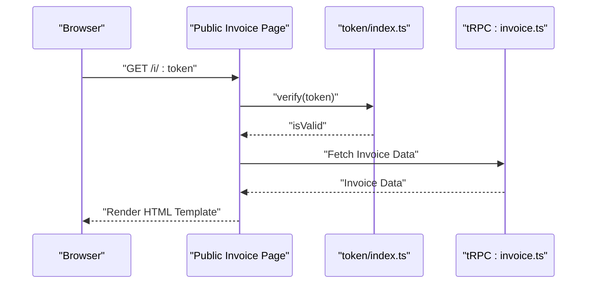
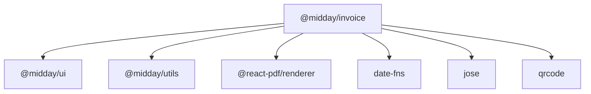

# Invoice Processing (@midday/invoice)

<cite>
**Referenced Files in This Document**
- [package.json](file://packages/invoice/package.json)
- [index.tsx](file://packages/invoice/src/index.tsx)
- [token/index.ts](file://packages/invoice/src/token/index.ts)
- [utils/calculate.ts](file://packages/invoice/src/utils/calculate.ts)
- [utils/transform.ts](file://packages/invoice/src/utils/transform.ts)
- [utils/currency.ts](file://packages/invoice/src/utils/currency.ts)
- [utils/recurring.ts](file://packages/invoice/src/utils/recurring.ts)
- [templates/html/index.tsx](file://packages/invoice/src/templates/html/index.tsx)
- [templates/pdf/index.tsx](file://packages/invoice/src/templates/pdf/index.tsx)
- [templates/og/index.tsx](file://packages/invoice/src/templates/og/index.tsx)
- [templates/html/format.tsx](file://packages/invoice/src/templates/html/format.tsx)
- [editor/index.tsx](file://packages/invoice/src/editor/index.tsx)
- [types.ts](file://packages/invoice/src/types.ts)
- [apps/api/src/rest/routers/invoices.ts](file://apps/api/src/rest/routers/invoices.ts)
- [apps/api/src/trpc/routers/invoice.ts](file://apps/api/src/trpc/routers/invoice.ts)
- [apps/api/src/rest/routers/invoice-payments.ts](file://apps/api/src/rest/routers/invoice-payments.ts)
- [apps/api/src/schemas/invoice.ts](file://apps/api/src/schemas/invoice.ts)
- [apps/api/src/schemas/invoice-recurring.ts](file://apps/api/src/schemas/invoice-recurring.ts)
- [apps/api/src/trpc/routers/invoice-recurring.ts](file://apps/api/src/trpc/routers/invoice-recurring.ts)
- [apps/dashboard/src/components/invoice/customer-details.tsx](file://apps/dashboard/src/components/invoice/customer-details.tsx)
- [apps/dashboard/src/components/invoice/due-date.tsx](file://apps/dashboard/src/components/invoice/due-date.tsx)
- [apps/dashboard/src/app/[locale]/(public)/i/[token]/page.tsx](file://apps/dashboard/src/app/[locale]/(public)/i/[token]/page.tsx)
- [apps/dashboard/src/app/[locale]/(public)/i/[token]/opengraph-image.tsx](file://apps/dashboard/src/app/[locale]/(public)/i/[token]/opengraph-image.tsx)
- [apps/worker/src/queues/invoices.ts](file://apps/worker/src/queues/invoices.ts)
- [apps/worker/src/queues/invoices.config.ts](file://apps/worker/src/queues/invoices.config.ts)
- [apps/worker/src/errors/invoice-errors.ts](file://apps/worker/src/errors/invoice-errors.ts)
- [docs/invoice-recurring.md](file://docs/invoice-recurring.md)
</cite>

## Table of Contents
1. [Introduction](#introduction)
2. [Project Structure](#project-structure)
3. [Core Components](#core-components)
4. [Architecture Overview](#architecture-overview)
5. [Detailed Component Analysis](#detailed-component-analysis)
6. [Dependency Analysis](#dependency-analysis)
7. [Performance Considerations](#performance-considerations)
8. [Troubleshooting Guide](#troubleshooting-guide)
9. [Conclusion](#conclusion)
10. [Appendices](#appendices)

## Introduction
The @midday/invoice package is a comprehensive invoice processing toolkit designed to manage invoice creation, generation, and processing workflows. It provides a template system for HTML, PDF, and OpenGraph outputs, robust calculation utilities, currency conversion helpers, recurring invoice scheduling, and secure token verification. The package integrates with the broader Midday ecosystem through the API application (REST and tRPC), Dashboard (public invoice pages and editor), and Worker (background processing queues).

Key capabilities include:
- Invoice template rendering for HTML, PDF, and social media previews
- Calculation utilities for totals, taxes, and line items
- Currency conversion helpers for Stripe-compatible amounts
- Recurring invoice scheduling and date utilities
- Secure token verification for public invoice access
- Extensible editor and content transformation utilities

## Project Structure
The package is organized into focused modules that expose specific functionality via named exports. The main module file acts as the central entry point, while submodules provide specialized utilities for templates, calculations, transformations, currency, recurring schedules, and token verification.

```mermaid
graph TB
subgraph "Package Modules"
IDX["index.tsx"]
TOKEN["token/index.ts"]
CALC["utils/calculate.ts"]
TRANSFORM["utils/transform.ts"]
CURRENCY["utils/currency.ts"]
RECURRING["utils/recurring.ts"]
HTML_TPL["templates/html/index.tsx"]
PDF_TPL["templates/pdf/index.tsx"]
OG_TPL["templates/og/index.tsx"]
HTML_FMT["templates/html/format.tsx"]
EDITOR["editor/index.tsx"]
TYPES["types.ts"]
end
subgraph "Integration Points"
API_REST["apps/api/src/rest/routers/invoices.ts"]
API_TRPC["apps/api/src/trpc/routers/invoice.ts"]
API_PAYMENTS["apps/api/src/rest/routers/invoice-payments.ts"]
DASHBOARD_PUBLIC["apps/dashboard/src/app/[locale]/(public)/i/[token]/page.tsx"]
WORKER_QUEUES["apps/worker/src/queues/invoices.ts"]
end
IDX --> TOKEN
IDX --> CALC
IDX --> TRANSFORM
IDX --> CURRENCY
IDX --> RECURRING
IDX --> HTML_TPL
IDX --> PDF_TPL
IDX --> OG_TPL
IDX --> HTML_FMT
IDX --> EDITOR
IDX --> TYPES
API_REST --> CALC
API_REST --> TRANSFORM
API_TRPC --> HTML_TPL
API_TRPC --> TOKEN
API_PAYMENTS --> CURRENCY
DASHBOARD_PUBLIC --> HTML_TPL
WORKER_QUEUES --> PDF_TPL
```

**Diagram sources**
- [package.json](file://packages/invoice/package.json#L12-L27)
- [index.tsx](file://packages/invoice/src/index.tsx)
- [utils/calculate.ts](file://packages/invoice/src/utils/calculate.ts)
- [utils/transform.ts](file://packages/invoice/src/utils/transform.ts)
- [utils/currency.ts](file://packages/invoice/src/utils/currency.ts)
- [utils/recurring.ts](file://packages/invoice/src/utils/recurring.ts)
- [templates/html/index.tsx](file://packages/invoice/src/templates/html/index.tsx)
- [templates/pdf/index.tsx](file://packages/invoice/src/templates/pdf/index.tsx)
- [templates/og/index.tsx](file://packages/invoice/src/templates/og/index.tsx)
- [templates/html/format.tsx](file://packages/invoice/src/templates/html/format.tsx)
- [editor/index.tsx](file://packages/invoice/src/editor/index.tsx)
- [types.ts](file://packages/invoice/src/types.ts)
- [apps/api/src/rest/routers/invoices.ts](file://apps/api/src/rest/routers/invoices.ts#L31-L32)
- [apps/api/src/trpc/routers/invoice.ts](file://apps/api/src/trpc/routers/invoice.ts#L46-L48)
- [apps/api/src/rest/routers/invoice-payments.ts](file://apps/api/src/rest/routers/invoice-payments.ts#L10-L11)
- [apps/dashboard/src/app/[locale]/(public)/i/[token]/page.tsx](file://apps/dashboard/src/app/[locale]/(public)/i/[token]/page.tsx#L1)
- [apps/worker/src/queues/invoices.ts](file://apps/worker/src/queues/invoices.ts)

**Section sources**
- [package.json](file://packages/invoice/package.json#L1-L40)

## Core Components
This section outlines the primary building blocks of the invoice processing system, focusing on template rendering, calculation utilities, currency helpers, recurring scheduling, token verification, and content transformation.

- Template System
  - HTML templates: Provides structured HTML rendering for invoice display and sharing.
  - PDF templates: Generates printable PDFs using React PDF renderer.
  - OpenGraph templates: Creates optimized preview images for social sharing.
  - HTML formatting utilities: Converts raw invoice data into styled HTML fragments.
- Calculation Utilities
  - Computes totals, taxes, and line item aggregations.
  - Supports configurable tax rates and discount logic.
- Currency Helpers
  - Converts amounts to Stripe-compatible minor units.
  - Handles currency formatting and rounding.
- Recurring Scheduling
  - Validates future dates and recurrence rules.
  - Integrates with recurring invoice schemas.
- Token Verification
  - Secures public invoice access via signed tokens.
- Content Transformation
  - Transforms customer data into standardized content structures.
- Editor Module
  - Provides an extensible editor interface for invoice composition.

**Section sources**
- [package.json](file://packages/invoice/package.json#L12-L27)
- [utils/calculate.ts](file://packages/invoice/src/utils/calculate.ts)
- [utils/currency.ts](file://packages/invoice/src/utils/currency.ts)
- [utils/recurring.ts](file://packages/invoice/src/utils/recurring.ts)
- [templates/html/index.tsx](file://packages/invoice/src/templates/html/index.tsx)
- [templates/pdf/index.tsx](file://packages/invoice/src/templates/pdf/index.tsx)
- [templates/og/index.tsx](file://packages/invoice/src/templates/og/index.tsx)
- [templates/html/format.tsx](file://packages/invoice/src/templates/html/format.tsx)
- [utils/transform.ts](file://packages/invoice/src/utils/transform.ts)
- [token/index.ts](file://packages/invoice/src/token/index.ts)
- [editor/index.tsx](file://packages/invoice/src/editor/index.tsx)

## Architecture Overview
The invoice processing architecture spans three layers:
- Presentation Layer: Public invoice pages and editor components.
- Application Layer: REST and tRPC routers orchestrating invoice creation, updates, payments, and recurring schedules.
- Background Processing: Worker queues generating PDFs and handling asynchronous tasks.

**Diagram sources**
- [apps/dashboard/src/app/[locale]/(public)/i/[token]/page.tsx](file://apps/dashboard/src/app/[locale]/(public)/i/[token]/page.tsx#L1)
- [apps/dashboard/src/components/invoice/customer-details.tsx](file://apps/dashboard/src/components/invoice/customer-details.tsx#L2)
- [apps/api/src/rest/routers/invoices.ts](file://apps/api/src/rest/routers/invoices.ts#L31-L32)
- [apps/api/src/trpc/routers/invoice.ts](file://apps/api/src/trpc/routers/invoice.ts#L46-L48)
- [apps/api/src/rest/routers/invoice-payments.ts](file://apps/api/src/rest/routers/invoice-payments.ts#L10-L11)
- [apps/api/src/schemas/invoice.ts](file://apps/api/src/schemas/invoice.ts)
- [apps/api/src/schemas/invoice-recurring.ts](file://apps/api/src/schemas/invoice-recurring.ts)
- [apps/api/src/trpc/routers/invoice-recurring.ts](file://apps/api/src/trpc/routers/invoice-recurring.ts#L23)
- [apps/worker/src/queues/invoices.ts](file://apps/worker/src/queues/invoices.ts)
- [apps/worker/src/errors/invoice-errors.ts](file://apps/worker/src/errors/invoice-errors.ts)
- [templates/html/index.tsx](file://packages/invoice/src/templates/html/index.tsx)
- [templates/pdf/index.tsx](file://packages/invoice/src/templates/pdf/index.tsx)
- [utils/calculate.ts](file://packages/invoice/src/utils/calculate.ts)
- [utils/currency.ts](file://packages/invoice/src/utils/currency.ts)
- [utils/transform.ts](file://packages/invoice/src/utils/transform.ts)
- [utils/recurring.ts](file://packages/invoice/src/utils/recurring.ts)
- [token/index.ts](file://packages/invoice/src/token/index.ts)

## Detailed Component Analysis

### Template System
The template system provides three distinct rendering targets:
- HTML Templates: Used for public invoice pages and internal previews.
- PDF Templates: Used for downloadable invoice PDFs.
- OpenGraph Templates: Used for social media previews.

**Diagram sources**
- [templates/html/index.tsx](file://packages/invoice/src/templates/html/index.tsx)
- [templates/pdf/index.tsx](file://packages/invoice/src/templates/pdf/index.tsx)
- [templates/og/index.tsx](file://packages/invoice/src/templates/og/index.tsx)

**Section sources**
- [templates/html/index.tsx](file://packages/invoice/src/templates/html/index.tsx)
- [templates/pdf/index.tsx](file://packages/invoice/src/templates/pdf/index.tsx)
- [templates/og/index.tsx](file://packages/invoice/src/templates/og/index.tsx)
- [apps/dashboard/src/app/[locale]/(public)/i/[token]/page.tsx](file://apps/dashboard/src/app/[locale]/(public)/i/[token]/page.tsx#L1)
- [apps/dashboard/src/app/[locale]/(public)/i/[token]/opengraph-image.tsx](file://apps/dashboard/src/app/[locale]/(public)/i/[token]/opengraph-image.tsx#L0)

### Calculation Utilities
The calculation utilities compute totals, taxes, and line item aggregations. They integrate with the API’s invoice creation and editing flows to ensure accurate financial computations.

**Diagram sources**
- [utils/calculate.ts](file://packages/invoice/src/utils/calculate.ts)
- [apps/api/src/rest/routers/invoices.ts](file://apps/api/src/rest/routers/invoices.ts#L31-L32)

**Section sources**
- [utils/calculate.ts](file://packages/invoice/src/utils/calculate.ts)
- [apps/api/src/rest/routers/invoices.ts](file://apps/api/src/rest/routers/invoices.ts#L31-L32)

### Currency Conversion
Currency helpers convert amounts to Stripe-compatible minor units and handle currency formatting. This ensures seamless integration with payment processors.

**Diagram sources**
- [apps/api/src/rest/routers/invoice-payments.ts](file://apps/api/src/rest/routers/invoice-payments.ts#L10-L11)
- [utils/currency.ts](file://packages/invoice/src/utils/currency.ts)

**Section sources**
- [utils/currency.ts](file://packages/invoice/src/utils/currency.ts)
- [apps/api/src/rest/routers/invoice-payments.ts](file://apps/api/src/rest/routers/invoice-payments.ts#L10-L11)

### Recurring Invoice Scheduling
Recurring invoice scheduling validates future dates and applies recurrence rules. It integrates with tRPC routers and schemas to manage recurring invoice lifecycles.

**Diagram sources**
- [utils/recurring.ts](file://packages/invoice/src/utils/recurring.ts)
- [apps/api/src/trpc/routers/invoice-recurring.ts](file://apps/api/src/trpc/routers/invoice-recurring.ts#L23)
- [apps/api/src/schemas/invoice-recurring.ts](file://apps/api/src/schemas/invoice-recurring.ts#L5)

**Section sources**
- [utils/recurring.ts](file://packages/invoice/src/utils/recurring.ts)
- [apps/api/src/trpc/routers/invoice-recurring.ts](file://apps/api/src/trpc/routers/invoice-recurring.ts#L23)
- [apps/api/src/schemas/invoice-recurring.ts](file://apps/api/src/schemas/invoice-recurring.ts#L5)
- [docs/invoice-recurring.md](file://docs/invoice-recurring.md)

### Token Verification
Token verification secures public invoice access by validating signed tokens. It is used in public invoice routes to ensure only authorized users can view invoices.

**Diagram sources**
- [apps/dashboard/src/app/[locale]/(public)/i/[token]/page.tsx](file://apps/dashboard/src/app/[locale]/(public)/i/[token]/page.tsx#L1)
- [token/index.ts](file://packages/invoice/src/token/index.ts)
- [apps/api/src/trpc/routers/invoice.ts](file://apps/api/src/trpc/routers/invoice.ts#L46-L48)

**Section sources**
- [token/index.ts](file://packages/invoice/src/token/index.ts)
- [apps/api/src/trpc/routers/invoice.ts](file://apps/api/src/trpc/routers/invoice.ts#L46-L48)
- [apps/dashboard/src/app/[locale]/(public)/i/[token]/page.tsx](file://apps/dashboard/src/app/[locale]/(public)/i/[token]/page.tsx#L1)

### Content Transformation
Content transformation utilities standardize customer data for use across templates and APIs. This ensures consistent rendering and processing.

**Section sources**
- [utils/transform.ts](file://packages/invoice/src/utils/transform.ts)
- [apps/dashboard/src/components/invoice/customer-details.tsx](file://apps/dashboard/src/components/invoice/customer-details.tsx#L2)
- [apps/api/src/rest/routers/invoices.ts](file://apps/api/src/rest/routers/invoices.ts#L31-L32)

### Editor Module
The editor module provides an extensible interface for composing invoices. It integrates with the template system to render real-time previews and supports customization of invoice layouts.

**Section sources**
- [editor/index.tsx](file://packages/invoice/src/editor/index.tsx)

## Dependency Analysis
The @midday/invoice package depends on UI and utility libraries, React PDF renderer, date-fns, JOSE for JWT operations, and QR code generation. These dependencies enable rich templating, date handling, cryptographic signing, and visual elements.

**Diagram sources**
- [package.json](file://packages/invoice/package.json#L28-L35)

**Section sources**
- [package.json](file://packages/invoice/package.json#L28-L35)

## Performance Considerations
- Template Rendering: Use streaming PDF generation for large invoices to reduce memory overhead.
- Calculation Caching: Cache computed totals for frequently accessed invoices to minimize recomputation.
- Currency Conversion: Precompute currency conversions during batch operations to avoid repeated conversions.
- Token Verification: Cache verified tokens for short periods to reduce cryptographic operations.
- Recurring Schedules: Batch schedule updates to limit database writes and improve throughput.

## Troubleshooting Guide
Common issues and resolutions:
- PDF Generation Failures: Verify React PDF renderer compatibility and ensure all required fonts and assets are included.
- Token Verification Errors: Confirm token signing secret and expiration settings match backend configurations.
- Currency Conversion Mismatches: Validate currency codes and minor unit conversions against payment processor requirements.
- Recurring Schedule Errors: Check date validation and recurrence rule parsing for correctness.
- Template Rendering Issues: Ensure template data structures align with expected schemas and handle missing fields gracefully.

**Section sources**
- [apps/worker/src/errors/invoice-errors.ts](file://apps/worker/src/errors/invoice-errors.ts)
- [utils/currency.ts](file://packages/invoice/src/utils/currency.ts)
- [utils/recurring.ts](file://packages/invoice/src/utils/recurring.ts)
- [token/index.ts](file://packages/invoice/src/token/index.ts)

## Conclusion
The @midday/invoice package provides a robust foundation for invoice creation, generation, and processing. Its modular design enables seamless integration with REST and tRPC APIs, public invoice pages, and background workers. By leveraging the template system, calculation utilities, currency helpers, recurring scheduling, token verification, and content transformation tools, developers can build scalable invoice workflows tailored to diverse business needs.

## Appendices

### API Definitions
- REST Invoices Router
  - Purpose: Manage invoice CRUD operations and transformations.
  - Key Functions: Creation, updates, totals computation, customer content transformation.
  - Integration: Uses calculation and transformation utilities.
- tRPC Invoice Router
  - Purpose: Provide typed invoice operations and public access verification.
  - Key Functions: Fetch invoice data, verify tokens, render HTML templates.
  - Integration: Uses HTML templates and token verification.
- REST Invoice Payments Router
  - Purpose: Handle payment intent creation and currency conversions.
  - Key Functions: Convert amounts to Stripe minor units, create payment intents.
  - Integration: Uses currency utilities.

**Section sources**
- [apps/api/src/rest/routers/invoices.ts](file://apps/api/src/rest/routers/invoices.ts#L31-L32)
- [apps/api/src/trpc/routers/invoice.ts](file://apps/api/src/trpc/routers/invoice.ts#L46-L48)
- [apps/api/src/rest/routers/invoice-payments.ts](file://apps/api/src/rest/routers/invoice-payments.ts#L10-L11)

### Background Processing
- Worker Queues
  - Purpose: Asynchronous PDF generation and invoice-related tasks.
  - Key Functions: Queue management, error handling, retry policies.
  - Integration: Uses PDF templates and calculation utilities.

**Section sources**
- [apps/worker/src/queues/invoices.ts](file://apps/worker/src/queues/invoices.ts)
- [apps/worker/src/queues/invoices.config.ts](file://apps/worker/src/queues/invoices.config.ts)
- [apps/worker/src/errors/invoice-errors.ts](file://apps/worker/src/errors/invoice-errors.ts)

### Internationalization Support
- Locale-Aware Rendering
  - Public invoice pages support locale routing for localized content.
  - HTML templates adapt to regional formatting and language preferences.
- Customer Details Localization
  - Customer data transformation respects locale-specific formatting.

**Section sources**
- [apps/dashboard/src/components/invoice/customer-details.tsx](file://apps/dashboard/src/components/invoice/customer-details.tsx#L2)
- [apps/dashboard/src/components/invoice/due-date.tsx](file://apps/dashboard/src/components/invoice/due-date.tsx#L1)