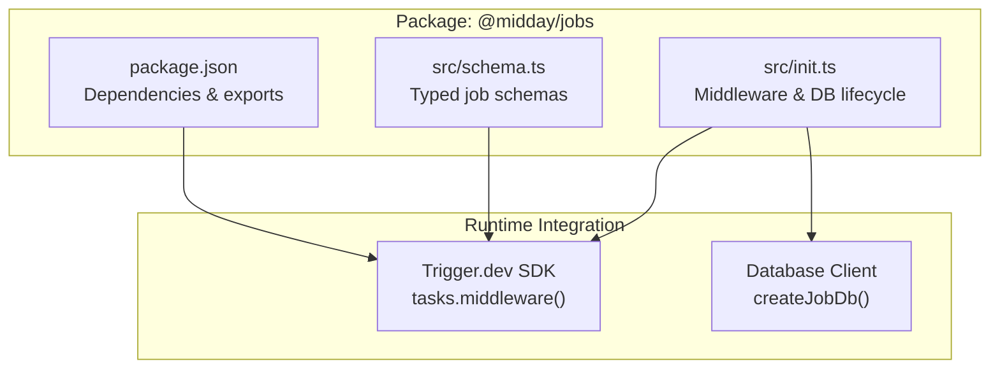
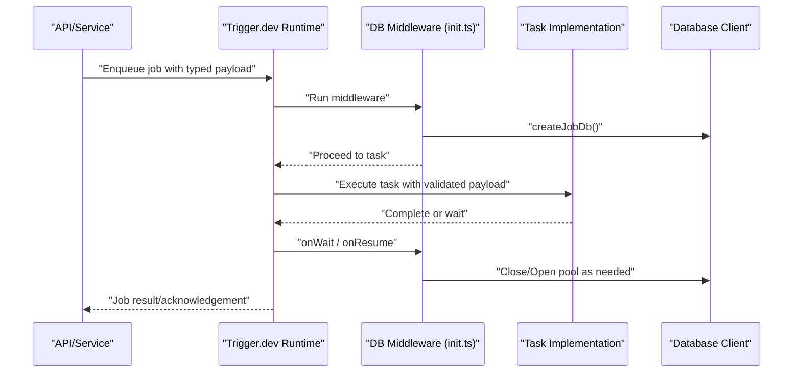
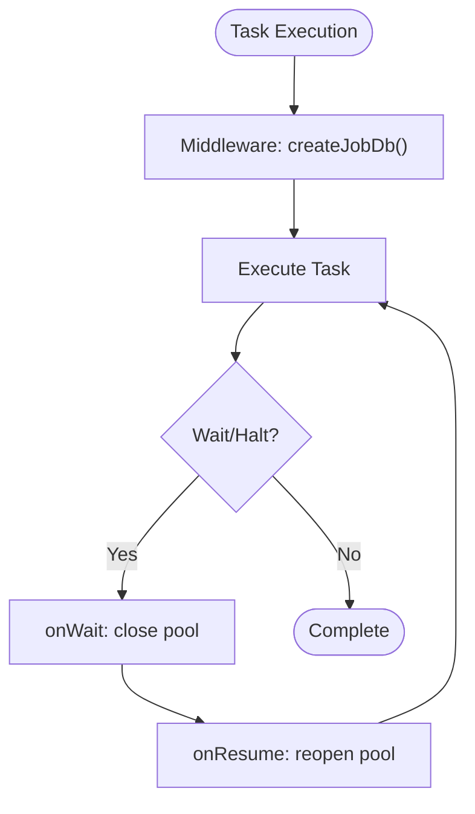
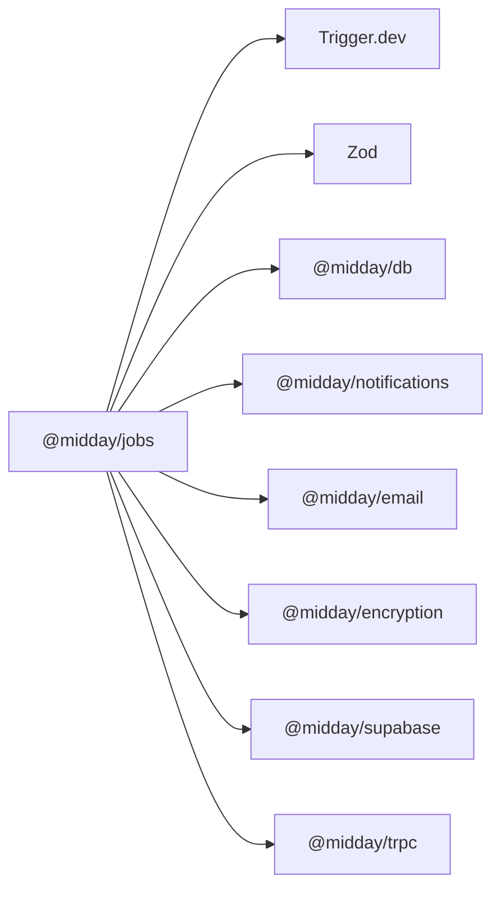

# Job Scheduling (@midday/jobs)

<cite>
**Referenced Files in This Document**
- [package.json](file://midday/packages/jobs/package.json)
- [init.ts](file://midday/packages/jobs/src/init.ts)
- [schema.ts](file://midday/packages/jobs/src/schema.ts)
- [README.md](file://midday/README.md)
</cite>

## Table of Contents
1. [Introduction](#introduction)
2. [Project Structure](#project-structure)
3. [Core Components](#core-components)
4. [Architecture Overview](#architecture-overview)
5. [Detailed Component Analysis](#detailed-component-analysis)
6. [Dependency Analysis](#dependency-analysis)
7. [Performance Considerations](#performance-considerations)
8. [Troubleshooting Guide](#troubleshooting-guide)
9. [Conclusion](#conclusion)

## Introduction
This document describes the @midday/jobs package responsible for background job processing and task scheduling. The package integrates with Trigger.dev to orchestrate asynchronous tasks, defines typed job schemas, and manages database connections per job execution. It supports a wide range of business operations such as invoice generation, document processing, bank synchronization, notifications, and exports.

Key characteristics:
- Built on Trigger.dev for job orchestration
- Typed payload schemas for all job types
- Database connection lifecycle managed via middleware
- Extensible task registry for custom job types
- Designed for distributed execution environments

## Project Structure
The @midday/jobs package is organized around three primary areas:
- Initialization and middleware for database connection management
- Typed schemas defining payloads for all supported job types
- Task implementations (implemented in the worker runtime, orchestrated by Trigger.dev)

**Diagram sources**
- [init.ts](file://midday/packages/jobs/src/init.ts#L1-L48)
- [schema.ts](file://midday/packages/jobs/src/schema.ts#L1-L316)
- [package.json](file://midday/packages/jobs/package.json#L1-L40)

**Section sources**
- [package.json](file://midday/packages/jobs/package.json#L1-L40)
- [README.md](file://midday/README.md#L64-L64)

## Core Components
- Database middleware and lifecycle hooks:
  - Initializes a dedicated database client per job run
  - Closes connections during wait periods to conserve resources
  - Re-establishes connections upon resume
- Typed job schemas:
  - Defines payloads for invoice operations, document processing, bank sync, notifications, exports, and more
  - Uses Zod for compile-time and runtime validation
- Exports:
  - Exposes schema module for use across the monorepo

**Section sources**
- [init.ts](file://midday/packages/jobs/src/init.ts#L1-L48)
- [schema.ts](file://midday/packages/jobs/src/schema.ts#L1-L316)
- [package.json](file://midday/packages/jobs/package.json#L13-L15)

## Architecture Overview
The job system follows a middleware-driven pattern:
- Trigger.dev runs tasks and invokes registered middleware
- The database middleware creates a job-specific database client
- Jobs execute with validated payloads and can suspend/resume as needed
- Notifications and other integrations consume job outputs

**Diagram sources**
- [init.ts](file://midday/packages/jobs/src/init.ts#L25-L47)
- [schema.ts](file://midday/packages/jobs/src/schema.ts#L20-L316)

## Detailed Component Analysis

### Database Middleware and Lifecycle
Responsibilities:
- Create a fresh database client per job run to optimize connection pooling
- Register middleware to run around every task execution
- Close database connections during wait states to free resources
- Reopen connections on resume to maintain continuity

**Diagram sources**
- [init.ts](file://midday/packages/jobs/src/init.ts#L25-L47)

**Section sources**
- [init.ts](file://midday/packages/jobs/src/init.ts#L1-L48)

### Typed Job Schemas
Scope:
- Invoice operations: reminder, generation, scheduling, sending, cancellation
- Document processing: uploads, classification, attachments
- Bank integrations: setup, sync, reconnect, deletion
- Notifications: transaction updates, inbox events, invoice lifecycle, exports
- Transactions: import, export, and attachment processing
- Team operations: invitations, base currency updates, team deletion

Validation:
- Each job payload is defined with Zod for strict typing and validation
- Discriminated unions for notification payloads enable type-safe dispatching

Examples of schema definitions:
- Invoice reminder and generation
- Document upload and processing
- Bank connection setup and sync
- Notification event payloads
- Transaction export and import
- Team and member operations

Note: The schema module consolidates all job payload definitions for centralized validation and consumption.

**Section sources**
- [schema.ts](file://midday/packages/jobs/src/schema.ts#L20-L316)

### Task Execution Patterns
Patterns observed:
- Payload-first design: tasks receive strongly typed payloads
- Idempotent operations encouraged through explicit identifiers (e.g., invoiceId, teamId)
- Wait/resume compatible: tasks can suspend and continue without losing state
- Notification-driven outcomes: many tasks emit notification payloads for downstream consumers

Extensibility:
- New job types are added by extending the schema module with new Zod objects
- Tasks are registered in the Trigger.dev runtime alongside the middleware

**Section sources**
- [schema.ts](file://midday/packages/jobs/src/schema.ts#L20-L316)
- [init.ts](file://midday/packages/jobs/src/init.ts#L25-L47)

### Retry Mechanisms and Error Handling
- Trigger.dev provides built-in retry and backoff strategies for failed tasks
- Database middleware ensures clean connection lifecycle during retries
- Validation errors surface as Zod schema failures early in the pipeline
- Task implementations should handle transient errors and leverage wait/resume semantics

Monitoring:
- Use Trigger.dev dashboards to observe job runs, retries, and durations
- Track database pool usage and connection lifecycle via middleware logs

**Section sources**
- [init.ts](file://midday/packages/jobs/src/init.ts#L25-L47)
- [schema.ts](file://midday/packages/jobs/src/schema.ts#L20-L316)

### Integration with Trigger.dev and Distributed Processing
- The package relies on Trigger.dev for orchestration and distribution
- Middleware and schemas are exported for use in the broader monorepo
- Distributed workers pull jobs from Trigger.dev and execute according to the defined schemas

**Section sources**
- [package.json](file://midday/packages/jobs/package.json#L32-L32)
- [README.md](file://midday/README.md#L64-L64)

## Dependency Analysis
External dependencies relevant to job processing:
- Trigger.dev: Orchestration and runtime for background jobs
- Zod: Schema validation for job payloads
- Workspace packages: Database client, notifications, email, encryption, supabase, tRPC

**Diagram sources**
- [package.json](file://midday/packages/jobs/package.json#L16-L33)

**Section sources**
- [package.json](file://midday/packages/jobs/package.json#L16-L33)

## Performance Considerations
- Connection pooling: The middleware creates a fresh database client per run to optimize pooling for Supabase
- Wait/resume: Long-running tasks should suspend when awaiting external resources to reduce compute cost
- Validation overhead: Centralized Zod schemas ensure minimal runtime validation errors, reducing retries
- Scaling: Distribute workers across Trigger.dev environments to parallelize job execution

## Troubleshooting Guide
Common issues and resolutions:
- Database not initialized: Ensure the middleware is registered; the middleware throws if the database client is missing
- Connection leaks: Verify onWait and onResume handlers are invoked; connections are closed on wait and reopened on resume
- Schema mismatches: Confirm payload shapes match Zod definitions; invalid payloads fail fast at enqueue time
- Retries: Inspect Trigger.dev logs for retry attempts and backoff behavior; adjust task logic to be resilient to transient failures

**Section sources**
- [init.ts](file://midday/packages/jobs/src/init.ts#L12-L23)
- [init.ts](file://midday/packages/jobs/src/init.ts#L35-L47)
- [schema.ts](file://midday/packages/jobs/src/schema.ts#L20-L316)

## Conclusion
The @midday/jobs package provides a robust foundation for background job processing using Trigger.dev. Its middleware-driven database lifecycle, comprehensive typed schemas, and extensible task model enable scalable, reliable asynchronous operations across invoicing, document processing, bank integrations, and notifications. By leveraging wait/resume semantics and centralized validation, teams can build resilient systems that scale horizontally across distributed workers.