# Shared Packages

<cite>
**Referenced Files in This Document**
- [package.json](file://midday/packages/db/package.json)
- [package.json](file://midday/packages/ui/package.json)
- [package.json](file://midday/packages/accounting/package.json)
- [package.json](file://midday/packages/banking/package.json)
- [package.json](file://midday/packages/invoice/package.json)
- [package.json](file://midday/packages/documents/package.json)
- [package.json](file://midday/packages/jobs/package.json)
- [package.json](file://midday/packages/utils/package.json)
- [package.json](file://midday/packages/cache/package.json)
- [package.json](file://midday/packages/supabase/package.json)
- [package.json](file://midday/packages/trpc/package.json)
- [package.json](file://midday/packages/email/package.json)
- [package.json](file://midday/packages/notifications/package.json)
- [package.json](file://midday/packages/encryption/package.json)
- [package.json](file://midday/packages/logger/package.json)
- [package.json](file://midday/packages/location/package.json)
- [package.json](file://midday/packages/plans/package.json)
- [package.json](file://midday/packages/health/package.json)
- [package.json](file://midday/packages/events/package.json)
- [package.json](file://midday/packages/import/package.json)
- [package.json](file://midday/packages/app-store/package.json)
- [package.json](file://midday/packages/desktop-client/package.json)
- [package.json](file://midday/packages/workbench/package.json)
- [package.json](file://midday/packages/categories/package.json)
- [package.json](file://midday/packages/customers/package.json)
- [package.json](file://midday/packages/inbox/package.json)
- [package.json](file://midday/packages/insights/package.json)
- [package.json](file://midday/packages/job-client/package.json)
- [package.json](file://midday/packages/tsconfig/package.json)
- [package.json](file://midday/packages/health/package.json)
- [package.json](file://midday/packages/health/package.json)
- [package.json](file://midday/packages/health/package.json)
- [package.json](file://midday/packages/health/package.json)
- [package.json](file://midday/packages/health/package.json)
- [package.json](file://midday/packages/health/package.json)
- [package.json](file://midday/packages/health/package.json)
- [package.json](file://midday/packages/health/package.json)
- [package.json](file://midday/packages/health/package.json)
- [package.json](file://midday/packages/health/package.json)
- [package.json](file://midday/packages/health/package.json)
- [package.json](file://midday/packages/health/package.json)
- [package.json](file://midday/packages/health/package.json)
- [package.json](file://midday/packages/health/package.json)
- [package.json](file://midday/packages/health/package.json)
- [package.json](file://midday/packages/health/package.json)
- [package.json](file://midday/packages/health/package.json)
- [package.json](file://midday/packages/health/package.json)
- [package.json](file://midday/packages/health/package.json)
- [package.json](file://midday/packages/health/package.json)
- [package.json](file://midday/packages/health/package.json)
- [package.json](file://midday/packages/health/package.json)
- [package.json](file://midday/packages/health/package.json)
- [package.json](file://midday/packages/health/package.json)
- [package.json](file://midday/packages/health/package.json)
- [package.json](file://midday/packages/health/package.json)
- [package.json](file://midday/packages/health/package.json)
- [package.json](file://midday/packages/health/package.json)
- [package.json](file://midday/packages/health/package.json)
- [package.json](file://midday/packages/health/package.json)
- [package.json](file://midday/packages/health/package.json)
- [package.json](file://midday/packages/health/package.json)
- [package.json](file://midday/packages/health/package.json)
- [package.json](file://midday/packages/health/package.json)
- [package.json](file://midday......)
</cite>

## Table of Contents
1. [Introduction](#introduction)
2. [Project Structure](#project-structure)
3. [Core Components](#core-components)
4. [Architecture Overview](#architecture-overview)
5. [Detailed Component Analysis](#detailed-component-analysis)
6. [Dependency Analysis](#dependency-analysis)
7. [Performance Considerations](#performance-considerations)
8. [Troubleshooting Guide](#troubleshooting-guide)
9. [Conclusion](#conclusion)
10. [Appendices](#appendices)

## Introduction
This document describes Faworra’s shared package ecosystem centered around the @midday namespace. It covers the modular design philosophy, reuse patterns across applications, and the relationships among 25+ reusable packages. The focus areas include the database layer (@midday/db), UI components (@midday/ui), accounting logic (@midday/accounting), banking integration (@midday/banking), invoice processing (@midday/invoice), document management (@midday/documents), job scheduling (@midday/jobs), and utility functions (@midday/utils). For each package, we outline architecture, exports, dependencies, usage patterns, and integration points. Contribution guidelines and versioning strategy are also included.

## Project Structure
The shared packages live under midday/packages and are consumed by multiple applications:
- Applications: api, dashboard, desktop, website, worker
- Packages: accounting, app-store, banking, cache, categories, customers, db, desktop-client, documents, email, encryption, events, health, import, inbox, insights, invoice, job-client, jobs, location, logger, notifications, plans, supabase, trpc, tsconfig, ui, utils, workbench

```mermaid
graph TB
subgraph "Applications"
API["api"]
DASH["dashboard"]
DESK["desktop"]
WEB["website"]
WORK["worker"]
end
subgraph "Shared Packages"
DB["@midday/db"]
UI["@midday/ui"]
ACC["@midday/accounting"]
BANK["@midday/banking"]
INV["@midday/invoice"]
DOC["@midday/documents"]
JOB["@midday/jobs"]
UTIL["@midday/utils"]
CACHE["@midday/cache"]
SUPA["@midday/supabase"]
TRPC["@midday/trpc"]
EMAIL["@midday/email"]
NOTIF["@midday/notifications"]
ENC["@midday/encryption"]
LOG["@midday/logger"]
LOC["@midday/location"]
PLAN["@midday/plans"]
HEAL["@midday/health"]
EVT["@midday/events"]
IMP["@midday/import"]
APPS["@midday/app-store"]
DCLIENT["@midday/desktop-client"]
WB["@midday/workbench"]
CAT["@midday/categories"]
CUST["@midday/customers"]
INBX["@midday/inbox"]
INS["@midday/insights"]
JCLIENT["@midday/job-client"]
TS["@midday/tsconfig"]
end
API --> DB
API --> SUPA
API --> TRPC
API --> EMAIL
API --> NOTIF
API --> LOG
DASH --> UI
DASH --> DB
DASH --> TRPC
DASH --> TRPC
DASH --> LOG
WORK --> JOB
WORK --> DB
WORK --> EMAIL
WORK --> NOTIF
WORK --> ENC
WEB --> UI
WEB --> LOG
DESK --> DCLIENT
DESK --> UI
DB --> BANK
DB --> CAT
DB --> ENC
DB --> INV
DB --> LOG
DB --> UTIL
UI --> PLAN
UI --> UTIL
INV --> UI
INV --> UTIL
DOC --> UTIL
JOB --> DB
JOB --> EMAIL
JOB --> ENC
JOB --> NOTIF
JOB --> SUPA
JOB --> TRPC
BANK --> CACHE
BANK --> LOC
BANK --> LOG
CACHE --> LOG
ACC --> ENC
ACC --> LOG
CAT --> ENC
CAT --> LOG
CUST --> ENC
CUST --> LOG
INBX --> ENC
INBX --> LOG
INS --> ENC
INS --> LOG
JCLIENT --> DB
JCLIENT --> LOG
SUPA --> LOG
TRPC --> LOG
EMAIL --> LOG
NOTIF --> LOG
ENC --> LOG
LOC --> LOG
PLAN --> LOG
HEAL --> LOG
Evt --> LOG
IMP --> LOG
APPS --> LOG
DCLIENT --> LOG
WB --> LOG
```

**Diagram sources**
- [package.json](file://midday/packages/db/package.json#L37-L53)
- [package.json](file://midday/packages/ui/package.json#L111-L170)
- [package.json](file://midday/packages/accounting/package.json#L19-L25)
- [package.json](file://midday/packages/banking/package.json#L19-L31)
- [package.json](file://midday/packages/invoice/package.json#L28-L35)
- [package.json](file://midday/packages/documents/package.json#L21-L34)
- [package.json](file://midday/packages/jobs/package.json#L16-L34)
- [package.json](file://midday/packages/utils/package.json#L16-L22)
- [package.json](file://midday/packages/cache/package.json#L5-L7)
- [package.json](file://midday/packages/supabase/package.json)
- [package.json](file://midday/packages/trpc/package.json)
- [package.json](file://midday/packages/email/package.json)
- [package.json](file://midday/packages/notifications/package.json)
- [package.json](file://midday/packages/encryption/package.json)
- [package.json](file://midday/packages/logger/package.json)
- [package.json](file://midday/packages/location/package.json)
- [package.json](file://midday/packages/plans/package.json)
- [package.json](file://midday/packages/health/package.json)
- [package.json](file://midday/packages/events/package.json)
- [package.json](file://midday/packages/import/package.json)
- [package.json](file://midday/packages/app-store/package.json)
- [package.json](file://midday/packages/desktop-client/package.json)
- [package.json](file://midday/packages/workbench/package.json)
- [package.json](file://midday/packages/categories/package.json)
- [package.json](file://midday/packages/customers/package.json)
- [package.json](file://midday/packages/inbox/package.json)
- [package.json](file://midday/packages/insights/package.json)
- [package.json](file://midday/packages/job-client/package.json)
- [package.json](file://midday/packages/tsconfig/package.json)

**Section sources**
- [package.json](file://midday/packages/db/package.json#L1-L59)
- [package.json](file://midday/packages/ui/package.json#L1-L179)
- [package.json](file://midday/packages/accounting/package.json#L1-L32)
- [package.json](file://midday/packages/banking/package.json#L1-L36)
- [package.json](file://midday/packages/invoice/package.json#L1-L40)
- [package.json](file://midday/packages/documents/package.json#L1-L39)
- [package.json](file://midday/packages/jobs/package.json#L1-L40)
- [package.json](file://midday/packages/utils/package.json#L1-L24)
- [package.json](file://midday/packages/cache/package.json#L1-L30)

## Core Components
This section summarizes the primary shared packages and their roles in the ecosystem.

- @midday/db: Database client, queries, SQL helpers, and utilities for transactions, invoices, and recurring logic. Exposes client, job client, worker client, schema, SQL builders, and domain-specific utils.
- @midday/ui: Reusable UI primitives and components built on Radix UI and Tailwind, plus editor, animations, and hooks.
- @midday/accounting: Integrations with Xero and QuickBooks via Intuit OAuth, with provider abstractions and utilities.
- @midday/banking: Plaid and GoCardless integrations, account/rate utilities, and location-aware caching.
- @midday/invoice: Invoice rendering (HTML/PDF/OG), editor, number formatting, currency helpers, recurring logic, and token utilities.
- @midday/documents: Document loaders, classifiers, embeddings, and OCR/processing utilities.
- @midday/jobs: Job orchestration using trigger.dev, CSV/XLSX/PDF/image processing, and cross-package integrations.
- @midday/utils: Environment helpers, formatting, sanitization, and tax utilities.

**Section sources**
- [package.json](file://midday/packages/db/package.json#L21-L36)
- [package.json](file://midday/packages/ui/package.json#L18-L110)
- [package.json](file://midday/packages/accounting/package.json#L8-L12)
- [package.json](file://midday/packages/banking/package.json#L13-L18)
- [package.json](file://midday/packages/invoice/package.json#L12-L27)
- [package.json](file://midday/packages/documents/package.json#L6-L12)
- [package.json](file://midday/packages/jobs/package.json#L13-L15)
- [package.json](file://midday/packages/utils/package.json#L16-L22)

## Architecture Overview
The shared packages form a layered architecture:
- Infrastructure: @midday/db, @midday/cache, @midday/logger, @midday/supabase, @midday/trpc
- Domain services: @midday/banking, @midday/accounting, @midday/invoice, @midday/documents, @midday/jobs
- Application surfaces: @midday/ui, @midday/utils, @midday/email, @midday/notifications, @midday/plans
- Cross-cutting concerns: @midday/encryption, @midday/location, @midday/health, @midday/events, @midday/import, @midday/app-store, @midday/desktop-client, @midday/workbench

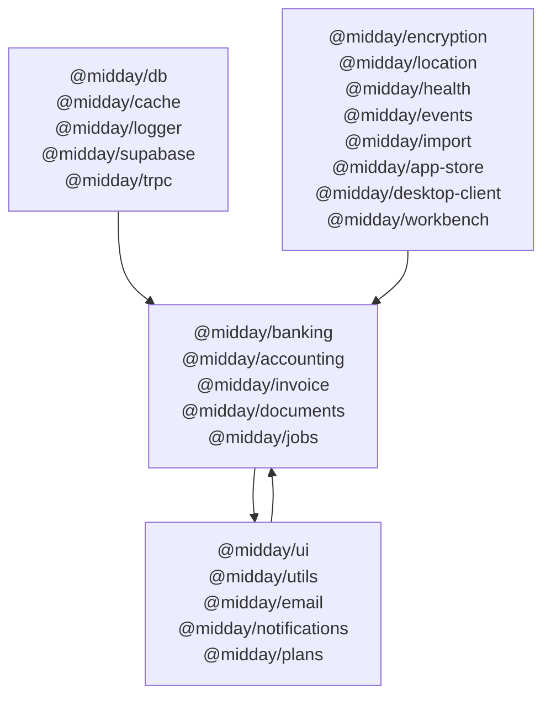

**Diagram sources**
- [package.json](file://midday/packages/db/package.json#L37-L53)
- [package.json](file://midday/packages/banking/package.json#L19-L31)
- [package.json](file://midday/packages/accounting/package.json#L19-L25)
- [package.json](file://midday/packages/invoice/package.json#L28-L35)
- [package.json](file://midday/packages/documents/package.json#L21-L34)
- [package.json](file://midday/packages/jobs/package.json#L16-L34)
- [package.json](file://midday/packages/ui/package.json#L111-L170)
- [package.json](file://midday/packages/utils/package.json#L16-L22)
- [package.json](file://midday/packages/email/package.json)
- [package.json](file://midday/packages/notifications/package.json)
- [package.json](file://midday/packages/encryption/package.json)
- [package.json](file://midday/packages/location/package.json)
- [package.json](file://midday/packages/health/package.json)
- [package.json](file://midday/packages/events/package.json)
- [package.json](file://midday/packages/import/package.json)
- [package.json](file://midday/packages/app-store/package.json)
- [package.json](file://midday/packages/desktop-client/package.json)
- [package.json](file://midday/packages/workbench/package.json)

## Detailed Component Analysis

### @midday/db
- Purpose: Database client, schema, queries, SQL builders, and domain utilities.
- Exports: client, job-client, worker-client, queries, errors, schema, sql, and utils for api-keys, search-query, health, currency, tax, blocklist, invoice-recurring.
- Dependencies: @midday/banking, @midday/categories, @midday/encryption, @midday/invoice, @midday/logger, @midday/utils, drizzle-orm, pg, zod, and others.
- Usage patterns:
  - Import client for database operations.
  - Use queries/index for generated CRUD helpers.
  - Use sql.ts for dynamic SQL composition.
  - Use utils for domain-specific helpers (e.g., currency conversion).
- Integration: Used by api, dashboard, worker, and invoice/document packages.

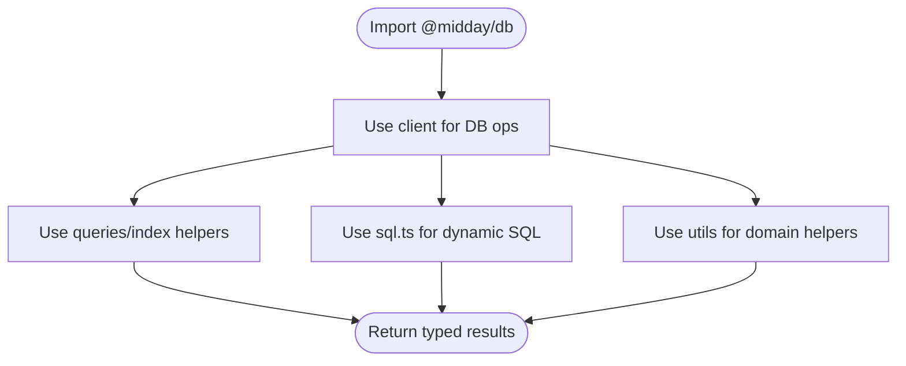

**Diagram sources**
- [package.json](file://midday/packages/db/package.json#L21-L36)
- [package.json](file://midday/packages/db/package.json#L37-L53)

**Section sources**
- [package.json](file://midday/packages/db/package.json#L1-L59)

### @midday/ui
- Purpose: UI primitives and components (Radix-based), editor, animations, hooks, and Tailwind utilities.
- Exports: individual components, hooks, utilities (cn, truncate), and configuration files (globals.css, tailwind/postcss configs).
- Dependencies: Radix UI, Tailwind, Lucide icons, editor libraries, and @midday/utils.
- Usage patterns:
  - Import specific components (e.g., button, dialog, form).
  - Use cn for conditional class merging.
  - Use hooks/index for shared UI behaviors.
- Integration: Used by dashboard, website, and desktop apps.

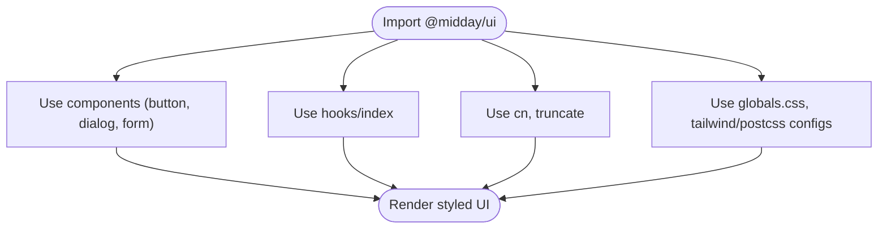

**Diagram sources**
- [package.json](file://midday/packages/ui/package.json#L18-L110)
- [package.json](file://midday/packages/ui/package.json#L111-L170)

**Section sources**
- [package.json](file://midday/packages/ui/package.json#L1-L179)

### @midday/accounting
- Purpose: Accounting integrations (Xero, QuickBooks) via Intuit OAuth.
- Exports: main module, providers/*, and utils.
- Dependencies: @midday/encryption, @midday/logger, intuit-oauth, xero-node, zod.
- Usage patterns:
  - Initialize provider clients using exported providers.
  - Use utils for shared accounting transformations.
- Integration: Used by api and worker for financial data synchronization.

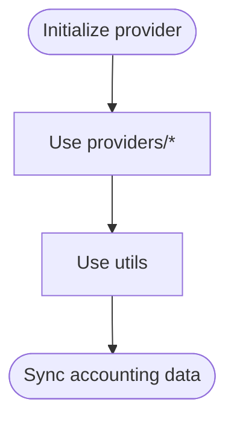

**Diagram sources**
- [package.json](file://midday/packages/accounting/package.json#L8-L12)
- [package.json](file://midday/packages/accounting/package.json#L19-L25)

**Section sources**
- [package.json](file://midday/packages/accounting/package.json#L1-L32)

### @midday/banking
- Purpose: Bank connections (Plaid, GoCardless), account/rate utilities, and caching.
- Exports: index, account, rates, and gocardless/utils.
- Dependencies: @midday/cache, @midday/location, @midday/logger, axios, plaid, xior, zod.
- Usage patterns:
  - Use account utilities for normalized account data.
  - Use rates for FX conversions.
  - Use gocardless/utils for provider-specific helpers.
- Integration: Used by api and db for transaction ingestion and reconciliation.

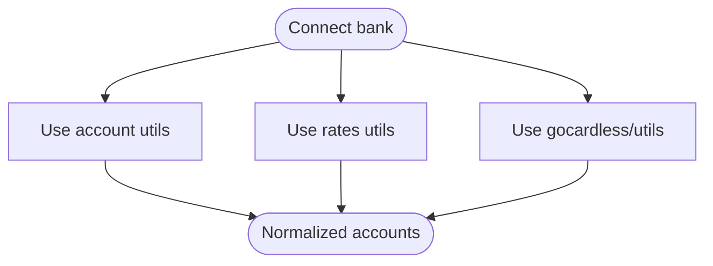

**Diagram sources**
- [package.json](file://midday/packages/banking/package.json#L13-L18)
- [package.json](file://midday/packages/banking/package.json#L19-L31)

**Section sources**
- [package.json](file://midday/packages/banking/package.json#L1-L36)

### @midday/invoice
- Purpose: Invoice rendering (HTML/PDF/OG), editor, number formatting, currency helpers, recurring logic, and token utilities.
- Exports: index, token, number, templates (html/pdf/og), editor, calculate, format-to-html, content, types, utils, currency, recurring.
- Dependencies: @midday/ui, @midday/utils, @react-pdf/renderer, qrcode, zod.
- Usage patterns:
  - Use templates to render invoices.
  - Use editor for WYSIWYG editing.
  - Use calculate and currency for totals and formatting.
- Integration: Used by api and dashboard for invoice workflows.

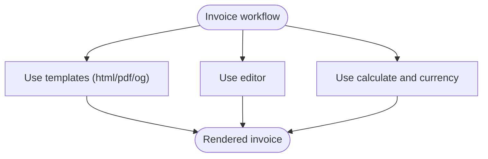

**Diagram sources**
- [package.json](file://midday/packages/invoice/package.json#L12-L27)
- [package.json](file://midday/packages/invoice/package.json#L28-L35)

**Section sources**
- [package.json](file://midday/packages/invoice/package.json#L1-L40)

### @midday/documents
- Purpose: Document loaders, classifiers, embeddings, and processing utilities.
- Exports: index, loader, classifier, embed, utils.
- Dependencies: AI SDKs, LangChain, mammoth, officeparser, unpdf, canvas, zod.
- Usage patterns:
  - Use loader to ingest documents.
  - Use classifier and embed for semantic processing.
- Integration: Used by api and worker for document automation.

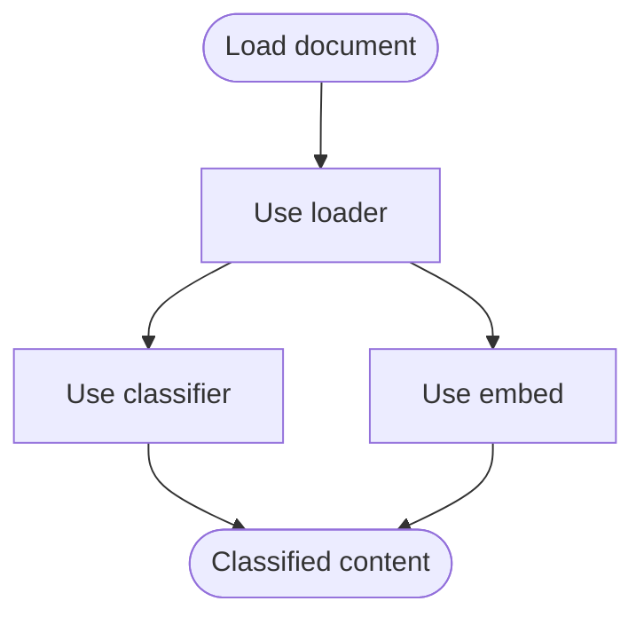

**Diagram sources**
- [package.json](file://midday/packages/documents/package.json#L6-L12)
- [package.json](file://midday/packages/documents/package.json#L21-L34)

**Section sources**
- [package.json](file://midday/packages/documents/package.json#L1-L39)

### @midday/jobs
- Purpose: Job orchestration using trigger.dev, CSV/XLSX/PDF/image processing, and cross-package integrations.
- Exports: schema.
- Dependencies: trigger.dev, @midday/db, @midday/email, @midday/encryption, @midday/notifications, @midday/supabase, @midday/trpc, zod, and processing libs.
- Usage patterns:
  - Define jobs using provided schema.
  - Use integrations for sending emails, notifications, and database updates.
- Integration: Used by worker for background tasks.

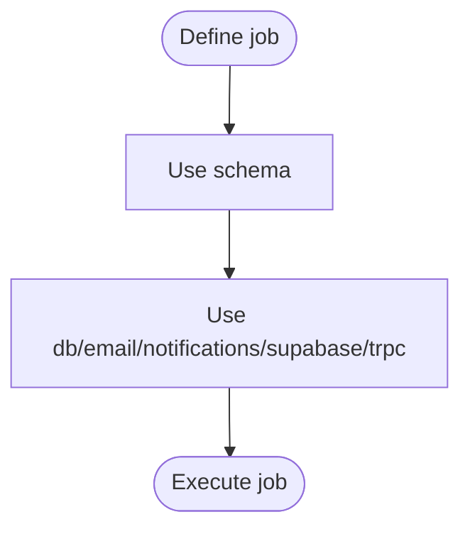

**Diagram sources**
- [package.json](file://midday/packages/jobs/package.json#L13-L15)
- [package.json](file://midday/packages/jobs/package.json#L16-L34)

**Section sources**
- [package.json](file://midday/packages/jobs/package.json#L1-L40)

### @midday/utils
- Purpose: Environment helpers, formatting, sanitization, and tax utilities.
- Exports: index, envs, format, sanitize-redirect, tax.
- Usage patterns:
  - Use envs for environment variable parsing.
  - Use format for consistent formatting.
  - Use sanitize-redirect to prevent open redirects.
- Integration: Used by all packages for shared utilities.

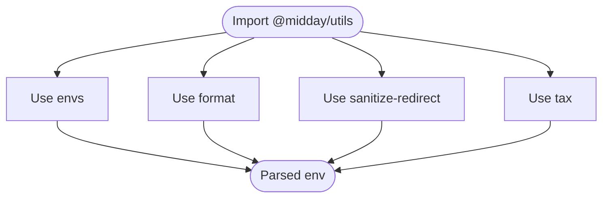

**Diagram sources**
- [package.json](file://midday/packages/utils/package.json#L16-L22)

**Section sources**
- [package.json](file://midday/packages/utils/package.json#L1-L24)

### Additional Packages Overview
- @midday/cache: Redis-based caches for API keys, users, teams, permissions, replication, chat, suggestions, widget preferences, and banking; includes health checks and Bun Redis adapter.
- @midday/supabase: Supabase client and utilities.
- @midday/trpc: tRPC server and middleware.
- @midday/email: Email delivery utilities.
- @midday/notifications: Notification delivery utilities.
- @midday/encryption: Encryption utilities.
- @midday/logger: Logging utilities.
- @midday/location: Location utilities.
- @midday/plans: Pricing plans utilities.
- @midday/health: Health check utilities.
- @midday/events: Event bus utilities.
- @midday/import: Import utilities.
- @midday/app-store: App store utilities.
- @midday/desktop-client: Desktop client utilities.
- @midday/workbench: Workbench utilities.
- @midday/categories: Categories utilities.
- @midday/customers: Customers utilities.
- @midday/inbox: Inbox utilities.
- @midday/insights: Insights utilities.
- @midday/job-client: Job client utilities.
- @midday/tsconfig: TypeScript configuration.

**Section sources**
- [package.json](file://midday/packages/cache/package.json#L1-L30)
- [package.json](file://midday/packages/supabase/package.json)
- [package.json](file://midday/packages/trpc/package.json)
- [package.json](file://midday/packages/email/package.json)
- [package.json](file://midday/packages/notifications/package.json)
- [package.json](file://midday/packages/encryption/package.json)
- [package.json](file://midday/packages/logger/package.json)
- [package.json](file://midday/packages/location/package.json)
- [package.json](file://midday/packages/plans/package.json)
- [package.json](file://midday/packages/health/package.json)
- [package.json](file://midday/packages/events/package.json)
- [package.json](file://midday/packages/import/package.json)
- [package.json](file://midday/packages/app-store/package.json)
- [package.json](file://midday/packages/desktop-client/package.json)
- [package.json](file://midday/packages/workbench/package.json)
- [package.json](file://midday/packages/categories/package.json)
- [package.json](file://midday/packages/customers/package.json)
- [package.json](file://midday/packages/inbox/package.json)
- [package.json](file://midday/packages/insights/package.json)
- [package.json](file://midday/packages/job-client/package.json)
- [package.json](file://midday/packages/tsconfig/package.json)

## Dependency Analysis
The packages exhibit a layered dependency model:
- Infrastructure depends on logging and caching.
- Domain packages depend on infrastructure and encryption.
- Application surfaces depend on domain packages and utilities.
- Cross-cutting packages are consumed widely.

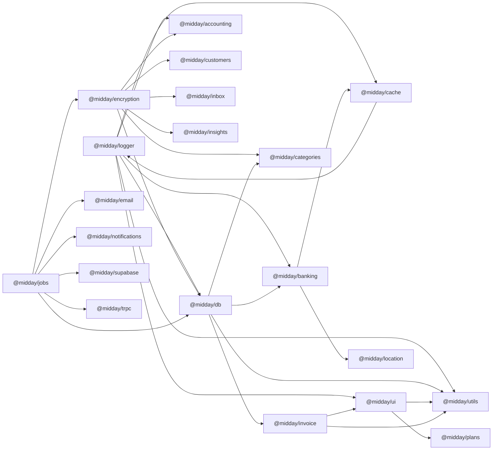

**Diagram sources**
- [package.json](file://midday/packages/db/package.json#L37-L53)
- [package.json](file://midday/packages/banking/package.json#L19-L31)
- [package.json](file://midday/packages/accounting/package.json#L19-L25)
- [package.json](file://midday/packages/invoice/package.json#L28-L35)
- [package.json](file://midday/packages/jobs/package.json#L16-L34)
- [package.json](file://midday/packages/ui/package.json#L111-L170)
- [package.json](file://midday/packages/utils/package.json#L16-L22)
- [package.json](file://midday/packages/cache/package.json#L5-L7)

**Section sources**
- [package.json](file://midday/packages/db/package.json#L37-L53)
- [package.json](file://midday/packages/banking/package.json#L19-L31)
- [package.json](file://midday/packages/accounting/package.json#L19-L25)
- [package.json](file://midday/packages/invoice/package.json#L28-L35)
- [package.json](file://midday/packages/jobs/package.json#L16-L34)
- [package.json](file://midday/packages/ui/package.json#L111-L170)
- [package.json](file://midday/packages/utils/package.json#L16-L22)
- [package.json](file://midday/packages/cache/package.json#L5-L7)

## Performance Considerations
- Prefer lazy-loading heavy UI components from @midday/ui to reduce initial bundle size.
- Use @midday/cache for frequently accessed data (users, teams, permissions) to minimize database roundtrips.
- Offload CPU-intensive tasks (PDF/image processing) to @midday/jobs with trigger.dev.
- Normalize and index database queries via @midday/db to improve performance.
- Use streaming and pagination for document processing in @midday/documents.

## Troubleshooting Guide
- Logging: Centralize logs via @midday/logger and ensure structured log fields for traceability.
- Caching: Verify cache health endpoints exposed by @midday/cache and monitor TTLs.
- Database: Use @midday/db errors and health utilities to detect connectivity and query timeouts.
- Banking: Validate provider credentials and rate limits for Plaid/GoCardless in @midday/banking.
- Jobs: Monitor trigger.dev integrations and retry policies in @midday/jobs.
- UI: Validate Tailwind and radix configurations via @midday/ui exports.

**Section sources**
- [package.json](file://midday/packages/logger/package.json)
- [package.json](file://midday/packages/cache/package.json#L13-L28)
- [package.json](file://midday/packages/db/package.json#L26-L36)
- [package.json](file://midday/packages/banking/package.json#L19-L31)
- [package.json](file://midday/packages/jobs/package.json#L16-L34)
- [package.json](file://midday/packages/ui/package.json#L18-L110)

## Conclusion
Faworra’s shared package ecosystem enables modular, maintainable, and scalable development across applications. By adhering to clear boundaries, consistent exports, and cross-cutting concerns, teams can rapidly compose features while preserving reliability and performance. The documented packages provide a foundation for building robust financial and document workflows.

## Appendices

### Versioning Strategy
- Internal packages are marked private and versioned per package (e.g., 0.0.1, 1.0.0).
- Workspace dependencies use workspace:* to align versions across the monorepo.
- Suggested approach: Use semantic versioning for public packages; internal packages can remain at 0.x.y until stabilization.

### Contribution Guidelines
- Keep packages focused and cohesive (single responsibility).
- Export clear entry points and type definitions.
- Add tests for critical logic and integrate with existing scripts (lint, typecheck, test).
- Document usage in README and provide examples in apps where applicable.
- Maintain backward compatibility for public APIs; deprecate with migration notes.

### Integration Patterns
- Use @midday/db for all database operations; avoid direct driver usage.
- Use @midday/ui for consistent UI across apps; customize via Tailwind overrides.
- Use @midday/jobs for asynchronous workflows; keep handlers small and composable.
- Use @midday/utils for environment and formatting; centralize sensitive logic in @midday/encryption and @midday/logger.