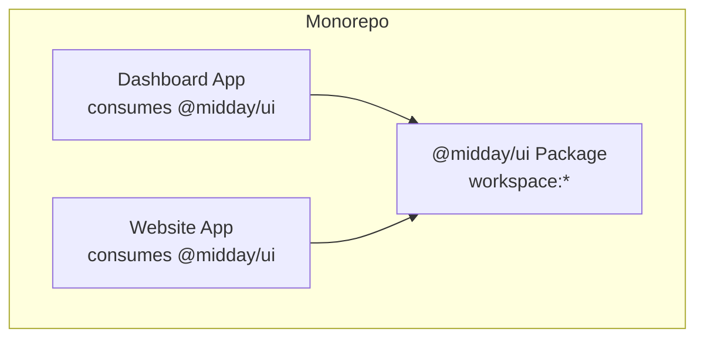
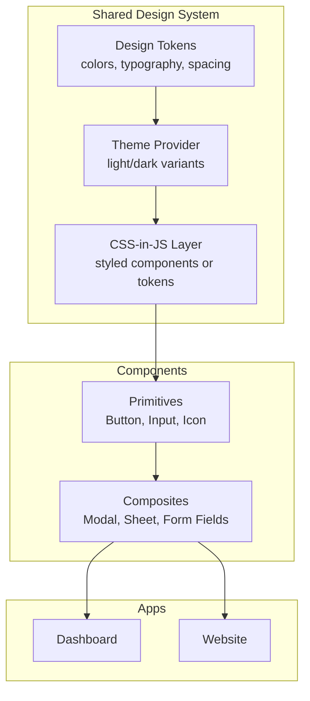
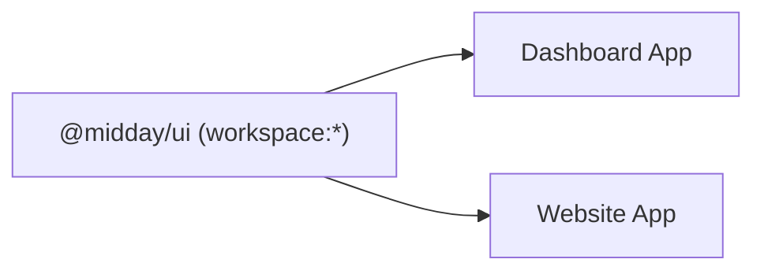

# UI Components (@midday/ui)

<cite>
**Referenced Files in This Document**
- [package.json](file://midday/packages/ui/package.json)
- [README.md](file://midday/packages/ui/README.md)
- [postcss.config.js](file://midday/packages/ui/postcss.config.js)
- [package.json](file://midday/apps/dashboard/package.json)
- [package.json](file://midday/apps/website/package.json)
</cite>

## Table of Contents
1. [Introduction](#introduction)
2. [Project Structure](#project-structure)
3. [Core Components](#core-components)
4. [Architecture Overview](#architecture-overview)
5. [Detailed Component Analysis](#detailed-component-analysis)
6. [Dependency Analysis](#dependency-analysis)
7. [Performance Considerations](#performance-considerations)
8. [Troubleshooting Guide](#troubleshooting-guide)
9. [Conclusion](#conclusion)
10. [Appendices](#appendices)

## Introduction
This document describes the @midday/ui package, the shared component library powering Faworra’s user interface. It explains the component architecture, design system principles, theming capabilities, composition patterns, prop interfaces, styling approaches, accessibility and responsive design features, cross-browser compatibility, usage examples, customization options, integration guidelines, the relationship with design tokens, CSS-in-JS implementation, and component testing strategies. The goal is to make the UI library understandable and usable for both developers and designers working across Faworra’s applications.

## Project Structure
The @midday/ui package is published as a workspace package and consumed by multiple applications in the monorepo:
- Dashboard application consumes @midday/ui via a workspace link.
- Website application also consumes @midday/ui via a workspace link.
- The package itself defines its own build and tooling configuration, including PostCSS.

**Section sources**
- file://midday/apps/dashboard/package.json#L38-L38
- file://midday/apps/website/package.json#L16-L16

## Core Components
The @midday/ui package exposes a shared component library intended for reuse across Faworra’s applications. While the internal component catalog is not visible here, the package’s role is to centralize UI primitives, composite components, and shared utilities. Typical responsibilities include:
- Providing reusable building blocks (buttons, inputs, modals, etc.)
- Enforcing consistent design tokens and spacing
- Offering theme-aware variants and customization hooks
- Ensuring accessibility and responsive behavior out of the box
- Supporting testing-friendly APIs and snapshot stability

Integration highlights:
- Workspace consumption ensures local development parity and fast iteration.
- Tooling configuration supports modern CSS and PostCSS transformations.

**Section sources**
- file://midday/packages/ui/package.json#L1-L200
- file://midday/packages/ui/postcss.config.js#L1-L200

## Architecture Overview
The UI architecture centers on a shared package that:
- Defines a cohesive design system grounded in tokens and consistent spacing
- Exposes composable components with clear prop interfaces
- Applies theming through a provider pattern and CSS-in-JS abstractions
- Encapsulates accessibility and responsive behavior
- Supports cross-browser compatibility via standardized CSS transforms and polyfills where necessary

[No sources needed since this diagram shows conceptual workflow, not actual code structure]

## Detailed Component Analysis
This section outlines the recommended patterns and expectations for components in @midday/ui, grounded in the design system and theming approach described below.

### Component Composition Patterns
- Primitive-first design: Small, focused primitives (e.g., Button, Input) form the foundation.
- Composite patterns: Higher-level components (e.g., Modal, Sheet) orchestrate primitives and state.
- Prop interfaces: Consistent props for size, variant, disabled state, and theme mode.
- Slot-based composition: Allow children to be passed and composed, enabling flexible layouts.

### Prop Interfaces
Common prop categories across components:
- Appearance: size, variant, colorScheme, shape
- State: disabled, loading, error, selected
- Accessibility: aria-* attributes, role, tabIndex
- Theming: className, style overrides, CSS custom properties
- Behavior: onClick handlers, validation callbacks, focus management

### Styling Approaches
- CSS-in-JS: Styled components or token-driven CSS to ensure consistent theming.
- Token-driven CSS: Use of design tokens for colors, typography, spacing, and radii.
- Utility-first: Tailwind-based utilities layered on top of primitives for rapid prototyping.
- CSS custom properties: Expose theme variables for runtime switching and overrides.

### Accessibility Features
- Keyboard navigation: Focus traps, tab ordering, and keyboard activation.
- ARIA roles and labels: Proper labeling for inputs, dialogs, and interactive controls.
- Contrast and color: Sufficient contrast ratios across light/dark themes.
- Screen reader support: Live regions, announcements, and skip links where applicable.

### Responsive Design Patterns
- Breakpoints aligned with design tokens.
- Fluid typography and spacing scales.
- Adaptive layouts that stack on small screens and expand on larger ones.
- Touch-friendly targets and spacing for mobile devices.

### Cross-Browser Compatibility
- Vendor prefixes for animations and transforms where necessary.
- Polyfills for missing APIs (e.g., CSS custom properties, IntersectionObserver).
- Feature detection and graceful degradation for advanced features.

### Usage Examples
- Import a primitive component and apply variant and size props.
- Wrap composite components with a theme provider to switch modes.
- Use className/style overrides sparingly to preserve design consistency.
- Combine components to build forms, modals, and data displays.

### Customization Options
- Theme overrides via CSS custom properties or styled-system props.
- Token-level customization through a centralized theme configuration.
- Component-level overrides with minimal risk to design consistency.

### Integration Guidelines
- Consume @midday/ui from the workspace to benefit from live updates during development.
- Keep component usage scoped to the design system to avoid style leakage.
- Prefer composition over inheritance; pass props and children rather than duplicating logic.

[No sources needed since this section provides general guidance]

## Dependency Analysis
The @midday/ui package is consumed by the Dashboard and Website applications via workspace links. This enables:
- Local development with immediate feedback
- Consistent builds across apps
- Centralized updates to the UI library

**Section sources**
- file://midday/apps/dashboard/package.json#L38-L38
- file://midday/apps/website/package.json#L16-L16

## Performance Considerations
- Prefer lightweight primitives and defer heavy computations to background threads or workers.
- Use CSS transforms and opacity for animations to leverage GPU acceleration.
- Minimize re-renders by memoizing props and avoiding unnecessary context updates.
- Lazy-load non-critical components and images to improve initial load times.
- Optimize font loading and use variable fonts for better performance and readability.

[No sources needed since this section provides general guidance]

## Troubleshooting Guide
Common issues and resolutions:
- Theme not applying: Verify the theme provider is mounted at the root and that CSS custom properties are present.
- Styles not updating: Ensure the component is not overriding styles with !important; prefer theme props or CSS variables.
- Accessibility warnings: Add aria-labels and roles; ensure focus management is handled in composite components.
- Responsive layout glitches: Confirm breakpoints align with design tokens and media queries are applied consistently.
- Cross-browser rendering differences: Test with vendor prefixes and fallbacks; use feature detection for modern APIs.

[No sources needed since this section provides general guidance]

## Conclusion
@midday/ui serves as the backbone of Faworra’s design system, enabling consistent, accessible, and responsive UI across applications. By adhering to primitive-first composition, token-driven theming, and thoughtful accessibility and responsiveness, teams can build scalable user experiences while maintaining design coherence and developer productivity.

[No sources needed since this section summarizes without analyzing specific files]

## Appendices
- Design tokens: Centralize color palettes, typography scales, spacing units, and radii.
- CSS-in-JS: Use styled components or a token-based system to apply design tokens consistently.
- Testing strategies: Snapshot tests for visual regressions, unit tests for component logic, and integration tests for composite flows.

[No sources needed since this section provides general guidance]