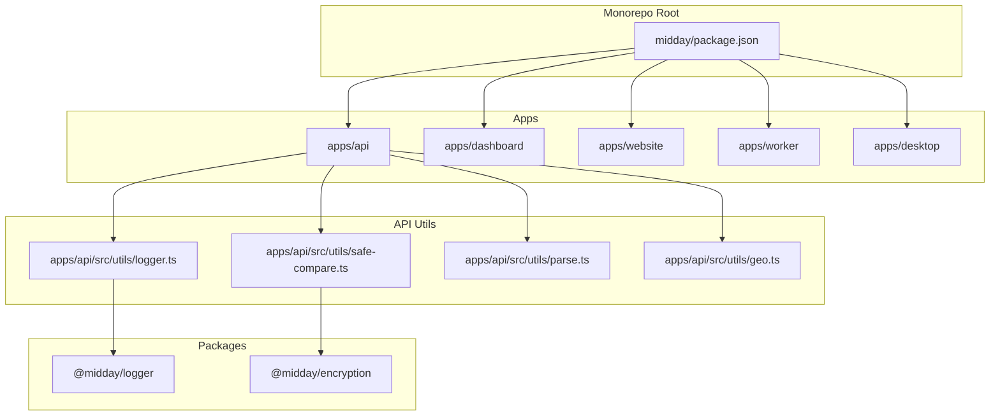
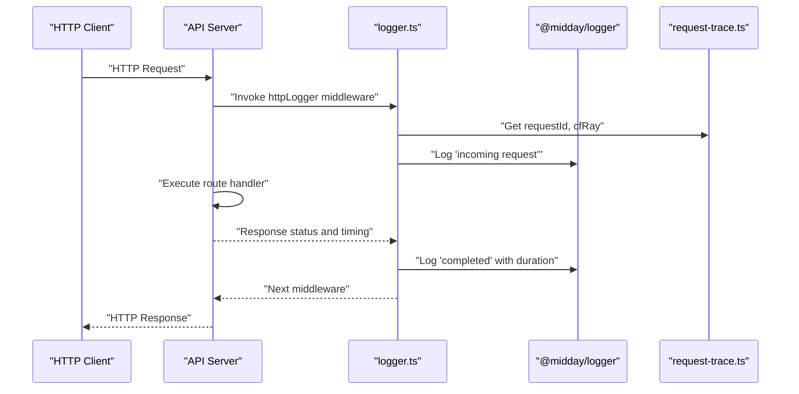
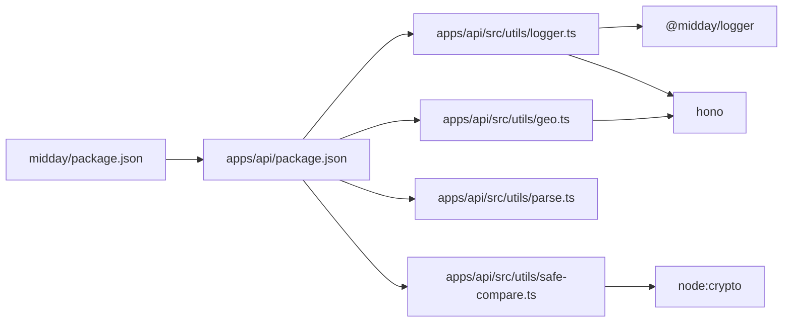

# Utility Functions (@midday/utils)

<cite>
**Referenced Files in This Document**
- [package.json](file://midday/package.json)
- [logger.ts](file://midday/apps/api/src/utils/logger.ts)
- [safe-compare.ts](file://midday/apps/api/src/utils/safe-compare.ts)
- [parse.ts](file://midday/apps/api/src/utils/parse.ts)
- [geo.ts](file://midday/apps/api/src/utils/geo.ts)
</cite>

## Table of Contents
1. [Introduction](#introduction)
2. [Project Structure](#project-structure)
3. [Core Components](#core-components)
4. [Architecture Overview](#architecture-overview)
5. [Detailed Component Analysis](#detailed-component-analysis)
6. [Dependency Analysis](#dependency-analysis)
7. [Performance Considerations](#performance-considerations)
8. [Troubleshooting Guide](#troubleshooting-guide)
9. [Conclusion](#conclusion)
10. [Appendices](#appendices)

## Introduction
This document describes the utility functions and helper modules used across the Faworra ecosystem under the @midday namespace. It focuses on validation utilities, formatting helpers, cryptographic-safe comparisons, request tracing, geolocation context extraction, and logging middleware. These utilities are shared across applications and packages to ensure consistent behavior, security, and observability.

## Project Structure
The @midday/utils package is primarily represented by a set of reusable modules located under the API application’s utils directory. The broader monorepo uses a workspace layout managed by a task runner, and the utilities are consumed by various apps and packages.

**Diagram sources**
- [package.json](file://midday/package.json#L1-L70)
- [logger.ts](file://midday/apps/api/src/utils/logger.ts#L1-L33)
- [safe-compare.ts](file://midday/apps/api/src/utils/safe-compare.ts#L1-L18)
- [parse.ts](file://midday/apps/api/src/utils/parse.ts#L1-L14)
- [geo.ts](file://midday/apps/api/src/utils/geo.ts#L1-L26)

**Section sources**
- [package.json](file://midday/package.json#L1-L70)

## Core Components
This section outlines the primary utility modules and their responsibilities.

- Logging middleware with request tracing
  - Provides HTTP request lifecycle logging with timing and correlation identifiers.
  - Integrates with a centralized logger package and request tracing utilities.

- Safe string comparison
  - Implements constant-time comparison to prevent timing attacks during secret verification.

- Input parsing helper
  - Normalizes mixed input types (undefined, null, empty string, object, JSON string) into a consistent representation.

- Geolocation context extractor
  - Reads client-provided and Cloudflare-provided headers to infer user location metadata.

**Section sources**
- [logger.ts](file://midday/apps/api/src/utils/logger.ts#L1-L33)
- [safe-compare.ts](file://midday/apps/api/src/utils/safe-compare.ts#L1-L18)
- [parse.ts](file://midday/apps/api/src/utils/parse.ts#L1-L14)
- [geo.ts](file://midday/apps/api/src/utils/geo.ts#L1-L26)

## Architecture Overview
The utilities integrate with the API application’s middleware stack and external packages to provide cross-cutting concerns such as logging, security, and data normalization.

**Diagram sources**
- [logger.ts](file://midday/apps/api/src/utils/logger.ts#L1-L33)

## Detailed Component Analysis

### Logging Middleware (httpLogger)
Purpose:
- Standardizes HTTP request logging with method, path, status code, and duration.
- Attaches request correlation identifiers for traceability.

Key behaviors:
- Captures start time using high-resolution timestamps.
- Extracts request path and correlation headers via request tracing utilities.
- Emits structured log entries before and after the downstream handler executes.

Security and correctness:
- Uses bigint arithmetic for precise durations.
- Logs only sanitized identifiers (no sensitive payload).

Integration pattern:
- Apply as middleware in Hono-based routes.
- Ensure the logger package is configured appropriately in the runtime environment.

Best practices:
- Keep log levels appropriate for production.
- Avoid logging sensitive data; rely on correlation IDs for debugging.

**Section sources**
- [logger.ts](file://midday/apps/api/src/utils/logger.ts#L1-L33)

### Safe String Comparison (safeCompare)
Purpose:
- Performs constant-time comparison of two strings to mitigate timing attacks.

Key behaviors:
- Converts inputs to buffers and compares lengths first to avoid invalid buffer comparisons.
- Uses a secure comparison primitive when lengths match.

Security considerations:
- Prevents leakage of secret length or byte-by-byte differences.
- Suitable for verifying tokens, signatures, and secrets.

Usage guidance:
- Prefer this over direct equality checks for secrets.
- Normalize inputs consistently before comparison.

**Section sources**
- [safe-compare.ts](file://midday/apps/api/src/utils/safe-compare.ts#L1-L18)

### Input Parsing Helper (parseInputValue)
Purpose:
- Normalizes diverse input types into a single, predictable shape for downstream processing.

Key behaviors:
- Returns null for explicit null inputs.
- Returns undefined for undefined or empty string inputs.
- Passes through object inputs unchanged.
- Parses JSON strings into objects.

Integration pattern:
- Use when accepting form data or API payloads that may arrive as strings or objects.
- Combine with validation libraries to enforce schemas.

Edge cases:
- Empty string is treated as undefined to preserve legacy falsy semantics.
- Non-object, non-empty string inputs are parsed as JSON.

**Section sources**
- [parse.ts](file://midday/apps/api/src/utils/parse.ts#L1-L14)

### Geolocation Context Extractor (getGeoContext)
Purpose:
- Builds a normalized geolocation context from request headers.

Key behaviors:
- Prioritizes client-sent headers when present.
- Falls back to Cloudflare-provided headers for geographic and network metadata.
- Returns null for missing fields.

Fields returned:
- Country code, city, region, continent, locale, timezone, and IP address.

Usage guidance:
- Use for analytics, localization, and compliance filtering.
- Validate presence of required headers in your deployment environment.

**Section sources**
- [geo.ts](file://midday/apps/api/src/utils/geo.ts#L1-L26)

## Dependency Analysis
The utilities depend on internal and external packages to fulfill their roles.

**Diagram sources**
- [package.json](file://midday/package.json#L1-L70)
- [logger.ts](file://midday/apps/api/src/utils/logger.ts#L1-L33)
- [safe-compare.ts](file://midday/apps/api/src/utils/safe-compare.ts#L1-L18)
- [parse.ts](file://midday/apps/api/src/utils/parse.ts#L1-L14)
- [geo.ts](file://midday/apps/api/src/utils/geo.ts#L1-L26)

**Section sources**
- [package.json](file://midday/package.json#L1-L70)

## Performance Considerations
- Logging overhead
  - Use high-resolution timers for accurate durations without impacting latency significantly.
  - Avoid excessive logging in hot paths; keep structured logs minimal and targeted.

- Safe comparison cost
  - Constant-time comparison adds negligible overhead compared to the security benefit.
  - Ensure inputs are pre-normalized to reduce repeated conversions.

- Input parsing
  - JSON parsing is O(n) in input size; avoid parsing very large payloads unnecessarily.
  - Cache parsed results when reused across handlers.

- Geolocation extraction
  - Header reads are O(1); ensure headers are populated by your edge/proxy layer to avoid fallback delays.

[No sources needed since this section provides general guidance]

## Troubleshooting Guide
Common issues and resolutions:

- Missing correlation identifiers
  - Symptom: Logs lack request IDs or trace identifiers.
  - Resolution: Verify request tracing middleware is invoked before logging and that headers are forwarded by your proxy or edge platform.

- Unexpected null vs undefined behavior
  - Symptom: Empty string inputs produce unexpected results.
  - Resolution: Review the parsing helper’s behavior and normalize inputs upstream.

- Timing attack vulnerabilities
  - Symptom: Secret comparisons are susceptible to timing attacks.
  - Resolution: Replace equality checks with the safe comparison utility.

- Missing geolocation data
  - Symptom: Geographic fields are null.
  - Resolution: Confirm that client headers are set or that Cloudflare headers are present in the runtime environment.

**Section sources**
- [logger.ts](file://midday/apps/api/src/utils/logger.ts#L1-L33)
- [safe-compare.ts](file://midday/apps/api/src/utils/safe-compare.ts#L1-L18)
- [parse.ts](file://midday/apps/api/src/utils/parse.ts#L1-L14)
- [geo.ts](file://midday/apps/api/src/utils/geo.ts#L1-L26)

## Conclusion
The @midday/utils package consolidates essential cross-cutting utilities for logging, security, data normalization, and geolocation. By adopting these modules, teams can maintain consistent behavior, improve security posture, and simplify integration across applications and packages.

[No sources needed since this section summarizes without analyzing specific files]

## Appendices

### Integration Patterns
- Logging middleware
  - Apply to route groups or globally in Hono applications.
  - Pair with a centralized logger package configured for your environment.

- Safe comparison
  - Use for validating API keys, HMAC signatures, and session tokens.
  - Ensure inputs are normalized (e.g., UTF-8 encoded bytes) before comparison.

- Input parsing
  - Wrap form and API payload ingestion to normalize types.
  - Combine with schema validation libraries for robustness.

- Geolocation extraction
  - Use in middleware to enrich request context for analytics and personalization.
  - Validate header presence in staging and production environments.

[No sources needed since this section provides general guidance]

### Contribution Guidelines for New Utilities
- Scope and reuse
  - Focus on cross-cutting concerns; avoid duplicating application-specific logic.
  - Ensure utilities are generic and configurable.

- Security-first design
  - Prefer constant-time operations for secrets and tokens.
  - Avoid logging sensitive data; use correlation IDs instead.

- Performance and reliability
  - Minimize allocations and overhead.
  - Add tests covering edge cases (empty inputs, malformed data, missing headers).

- Documentation and examples
  - Provide usage examples and integration patterns.
  - Document expected inputs, outputs, and side effects.

[No sources needed since this section provides general guidance]