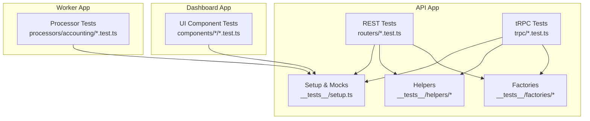
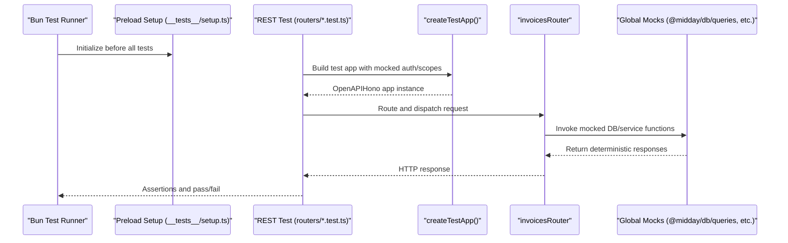
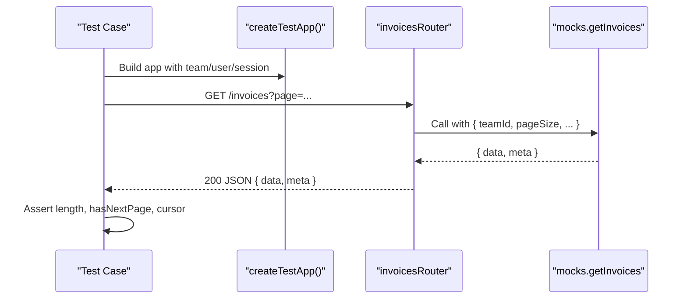
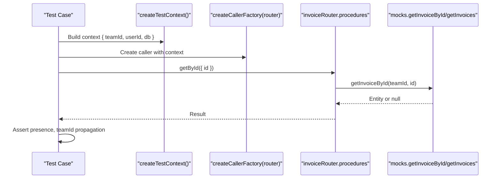
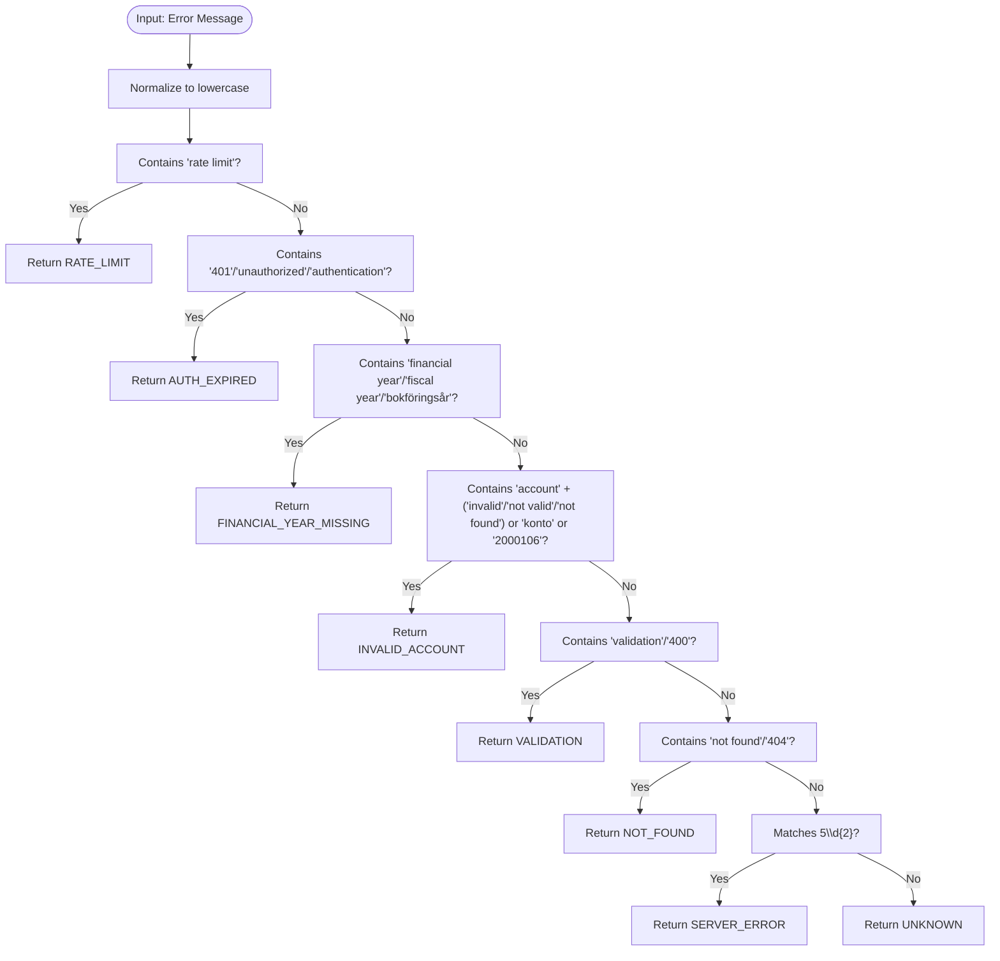
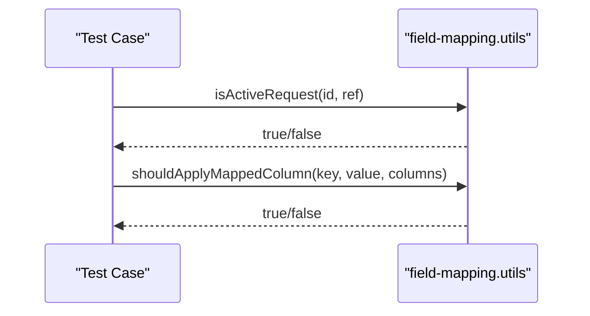
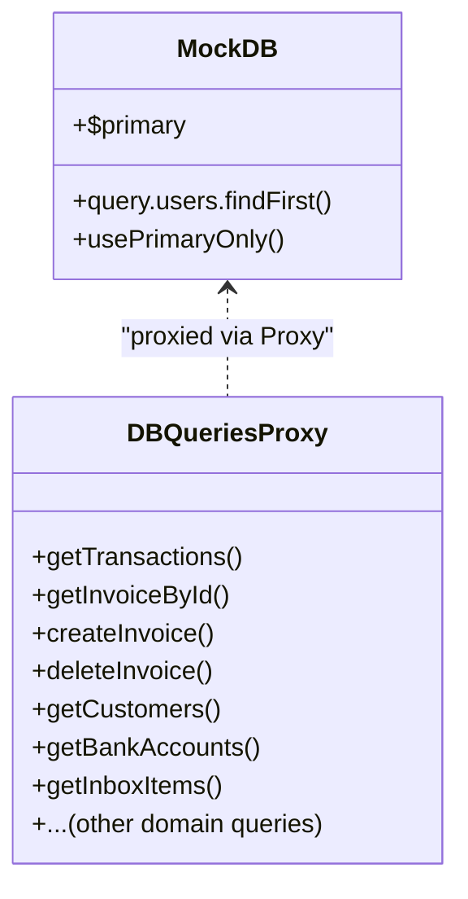
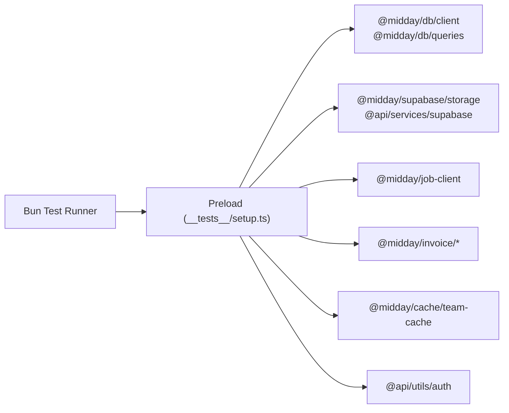

# Testing Strategy

<cite>
**Referenced Files in This Document**
- [bunfig.toml](file://midday/apps/api/bunfig.toml)
- [package.json](file://midday/apps/api/package.json)
- [setup.ts](file://midday/apps/api/src/__tests__/setup.ts)
- [test-app.ts](file://midday/apps/api/src/__tests__/helpers/test-app.ts)
- [test-context.ts](file://midday/apps/api/src/__tests__/helpers/test-context.ts)
- [index.ts](file://midday/apps/api/src/__tests__/factories/index.ts)
- [bank-account.ts](file://midday/apps/api/src/__tests__/factories/bank-account.ts)
- [customer.ts](file://midday/apps/api/src/__tests__/factories/customer.ts)
- [invoices.test.ts (REST)](file://midday/apps/api/src/__tests__/routers/invoices.test.ts)
- [invoices.test.ts (tRPC)](file://midday/apps/api/src/__tests__/trpc/invoices.test.ts)
- [export-transactions.test.ts](file://midday/apps/worker/src/processors/accounting/export-transactions.test.ts)
- [field-mapping.utils.test.ts](file://midday/apps/dashboard/src/components/modals/import-modal/field-mapping.utils.test.ts)
</cite>

## Table of Contents
1. [Introduction](#introduction)
2. [Project Structure](#project-structure)
3. [Core Components](#core-components)
4. [Architecture Overview](#architecture-overview)
5. [Detailed Component Analysis](#detailed-component-analysis)
6. [Dependency Analysis](#dependency-analysis)
7. [Performance Considerations](#performance-considerations)
8. [Troubleshooting Guide](#troubleshooting-guide)
9. [Conclusion](#conclusion)
10. [Appendices](#appendices)

## Introduction
This document defines Faworra’s quality assurance testing strategy. It covers the testing pyramid implemented with unit, integration, and end-to-end tests; the test setup using Bun; robust mock strategies for external services; and test data management via factories and helpers. It also outlines testing patterns for API endpoints, database operations, background jobs, and UI components, along with guidelines for effective tests, coverage expectations, continuous integration, performance and security testing, regression approaches, and practical examples of factories and helper utilities.

## Project Structure
The testing infrastructure is organized around Bun’s built-in test runner and a centralized setup that mocks external dependencies. Tests are grouped by domain and technology:
- REST API tests under the API app
- tRPC procedure tests under the API app
- Worker processor tests under the worker app
- UI component tests under the dashboard app

Key elements:
- Centralized test preload script initializes mocks and environment variables
- Helpers provide isolated test contexts for REST and tRPC
- Factories generate realistic test data for domain entities

**Diagram sources**
- [setup.ts](file://midday/apps/api/src/__tests__/setup.ts#L1-L379)
- [test-app.ts](file://midday/apps/api/src/__tests__/helpers/test-app.ts#L1-L48)
- [test-context.ts](file://midday/apps/api/src/__tests__/helpers/test-context.ts#L1-L36)
- [index.ts](file://midday/apps/api/src/__tests__/factories/index.ts#L1-L38)
- [invoices.test.ts (REST)](file://midday/apps/api/src/__tests__/routers/invoices.test.ts#L1-L171)
- [invoices.test.ts (tRPC)](file://midday/apps/api/src/__tests__/trpc/invoices.test.ts#L1-L202)
- [export-transactions.test.ts](file://midday/apps/worker/src/processors/accounting/export-transactions.test.ts#L1-L235)
- [field-mapping.utils.test.ts](file://midday/apps/dashboard/src/components/modals/import-modal/field-mapping.utils.test.ts#L1-L38)

**Section sources**
- [bunfig.toml](file://midday/apps/api/bunfig.toml#L1-L3)
- [package.json](file://midday/apps/api/package.json#L1-L78)

## Core Components
- Centralized test preload: Initializes global mocks and environment variables for all tests
- Mocked external dependencies: Database client, Supabase, job client, invoice calculation/utils, and more
- Test helpers:
  - REST app builder with mocked auth and scopes
  - tRPC context builder with team/user/session and mock DB
- Test factories: Domain-specific builders for consistent, overrideable test data

These components enable fast, deterministic tests that isolate business logic from external systems.

**Section sources**
- [setup.ts](file://midday/apps/api/src/__tests__/setup.ts#L1-L379)
- [test-app.ts](file://midday/apps/api/src/__tests__/helpers/test-app.ts#L1-L48)
- [test-context.ts](file://midday/apps/api/src/__tests__/helpers/test-context.ts#L1-L36)
- [index.ts](file://midday/apps/api/src/__tests__/factories/index.ts#L1-L38)

## Architecture Overview
The testing architecture relies on Bun’s test runner with a preload hook that applies global mocks. REST and tRPC tests use dedicated helpers to simulate authenticated requests and tRPC contexts. Factories produce realistic domain objects. Worker and UI tests operate independently but follow similar patterns.

**Diagram sources**
- [bunfig.toml](file://midday/apps/api/bunfig.toml#L1-L3)
- [setup.ts](file://midday/apps/api/src/__tests__/setup.ts#L1-L379)
- [test-app.ts](file://midday/apps/api/src/__tests__/helpers/test-app.ts#L1-L48)
- [invoices.test.ts (REST)](file://midday/apps/api/src/__tests__/routers/invoices.test.ts#L1-L171)

## Detailed Component Analysis

### REST API Testing Pattern
REST tests validate HTTP endpoints using an isolated Hono app with mocked auth and scopes. They assert status codes, response shapes, pagination metadata, and parameter propagation to underlying DB queries.

**Diagram sources**
- [invoices.test.ts (REST)](file://midday/apps/api/src/__tests__/routers/invoices.test.ts#L64-L132)
- [test-app.ts](file://midday/apps/api/src/__tests__/helpers/test-app.ts#L14-L47)
- [setup.ts](file://midday/apps/api/src/__tests__/setup.ts#L31-L132)

**Section sources**
- [invoices.test.ts (REST)](file://midday/apps/api/src/__tests__/routers/invoices.test.ts#L1-L171)
- [test-app.ts](file://midday/apps/api/src/__tests__/helpers/test-app.ts#L1-L48)
- [setup.ts](file://midday/apps/api/src/__tests__/setup.ts#L1-L379)

### tRPC API Testing Pattern
tRPC tests use a caller factory bound to a router and a test context that injects team/user/session and a mock DB. They validate list retrieval, single entity retrieval, deletions, summaries, and search behaviors while asserting DB query calls.

**Diagram sources**
- [invoices.test.ts (tRPC)](file://midday/apps/api/src/__tests__/trpc/invoices.test.ts#L77-L118)
- [test-context.ts](file://midday/apps/api/src/__tests__/helpers/test-context.ts#L15-L35)
- [setup.ts](file://midday/apps/api/src/__tests__/setup.ts#L31-L132)

**Section sources**
- [invoices.test.ts (tRPC)](file://midday/apps/api/src/__tests__/trpc/invoices.test.ts#L1-L202)
- [test-context.ts](file://midday/apps/api/src/__tests__/helpers/test-context.ts#L1-L36)
- [setup.ts](file://midday/apps/api/src/__tests__/setup.ts#L1-L379)

### Background Jobs and Worker Processor Testing
Worker tests focus on pure logic and error classification derived from provider-specific messages. They validate deterministic mappings from error strings to standardized error codes, ensuring consistent UI messaging and retry strategies.

**Diagram sources**
- [export-transactions.test.ts](file://midday/apps/worker/src/processors/accounting/export-transactions.test.ts#L11-L61)

**Section sources**
- [export-transactions.test.ts](file://midday/apps/worker/src/processors/accounting/export-transactions.test.ts#L1-L235)

### UI Component Testing Pattern
UI tests validate component logic such as field mapping decisions and request staleness checks. They use small, focused assertions to ensure correctness of user-facing features.

**Diagram sources**
- [field-mapping.utils.test.ts](file://midday/apps/dashboard/src/components/modals/import-modal/field-mapping.utils.test.ts#L1-L38)

**Section sources**
- [field-mapping.utils.test.ts](file://midday/apps/dashboard/src/components/modals/import-modal/field-mapping.utils.test.ts#L1-L38)

### Database Operation Testing Strategy
Database interactions are mocked at the module level so tests remain fast and deterministic. The mock DB exposes query functions for transactions, invoices, customers, bank accounts, inbox items, and more. Tests assert that:
- Procedures call the correct DB functions with expected parameters (teamId, filters, ids)
- Pagination metadata is propagated correctly
- Edge cases (empty lists, null results) are handled

**Diagram sources**
- [setup.ts](file://midday/apps/api/src/__tests__/setup.ts#L6-L25)
- [setup.ts](file://midday/apps/api/src/__tests__/setup.ts#L137-L264)

**Section sources**
- [setup.ts](file://midday/apps/api/src/__tests__/setup.ts#L1-L379)

### Test Data Management with Factories
Factories encapsulate realistic domain object construction and provide helpers to override fields for targeted scenarios. They ensure consistency across tests and reduce duplication.

Examples:
- Bank account factory: valid/minimal responses and inputs
- Customer factory: valid/minimal responses, inputs, and paginated lists
- Invoice factory: valid/minimal responses, paid/due variants, and summaries

**Section sources**
- [bank-account.ts](file://midday/apps/api/src/__tests__/factories/bank-account.ts#L1-L67)
- [customer.ts](file://midday/apps/api/src/__tests__/factories/customer.ts#L1-L98)
- [index.ts](file://midday/apps/api/src/__tests__/factories/index.ts#L1-L38)

## Dependency Analysis
The testing stack depends on Bun’s test runner and a preload hook to apply global mocks. External service mocks are injected for:
- Database client and query modules
- Supabase storage and client creation
- Job client and queue operations
- Invoice calculation and token verification
- Team cache and auth utilities

**Diagram sources**
- [bunfig.toml](file://midday/apps/api/bunfig.toml#L1-L3)
- [setup.ts](file://midday/apps/api/src/__tests__/setup.ts#L264-L379)

**Section sources**
- [bunfig.toml](file://midday/apps/api/bunfig.toml#L1-L3)
- [setup.ts](file://midday/apps/api/src/__tests__/setup.ts#L1-L379)

## Performance Considerations
- Prefer unit and integration tests over heavy e2e tests to keep feedback loops fast
- Keep mocks minimal and deterministic; avoid real network calls
- Use factories to generate only necessary data for each scenario
- Parallelize independent tests; rely on Bun’s native concurrency
- Avoid expensive setup in beforeEach; reuse mocks and shared helpers

## Troubleshooting Guide
Common issues and resolutions:
- Missing environment variables: Ensure preload sets SUPABASE_URL, DATABASE_* URLs, and MIDDAY_DASHBOARD_URL
- Unexpected DB calls: Verify mocks are reset per test and that the correct mock function is being asserted
- tRPC context mismatches: Confirm createTestContext supplies teamId and session; ensure router procedures receive the context
- REST route failures: Confirm createTestApp injects scopes and teamId; verify routes are mounted before requests

**Section sources**
- [setup.ts](file://midday/apps/api/src/__tests__/setup.ts#L363-L379)
- [test-context.ts](file://midday/apps/api/src/__tests__/helpers/test-context.ts#L15-L35)
- [test-app.ts](file://midday/apps/api/src/__tests__/helpers/test-app.ts#L14-L47)

## Conclusion
Faworra’s testing approach leverages Bun’s test runner with a centralized preload that mocks external dependencies, enabling fast, reliable unit and integration tests across REST, tRPC, worker processors, and UI components. Factories and helpers standardize test data and contexts, while explicit assertion patterns validate behavior and parameter propagation. This foundation supports continuous integration, performance, security, and regression testing practices.

## Appendices

### Guidelines for Writing Effective Tests
- Isolate behavior under test; mock external dependencies
- Use factories to construct realistic inputs and expected outputs
- Assert both success paths and error/edge cases
- Keep tests focused; one assertion per scenario where practical
- Reuse helpers (createTestApp, createTestContext) to minimize boilerplate

### Test Coverage Expectations
- Aim for >80% coverage in business logic and core modules
- Prioritize critical paths: authentication, authorization, data mutations, and integrations
- Track coverage per app (API, worker, dashboard) and adjust thresholds accordingly

### Continuous Integration Testing
- Run Bun tests on pull requests and main branch
- Use separate jobs for API, worker, and UI tests to parallelize execution
- Gate merges on passing tests and coverage thresholds

### Performance Testing
- Profile hot paths with Bun benchmarks for critical APIs and processors
- Measure latency of tRPC procedures and REST endpoints under load
- Monitor memory usage during long-running jobs

### Security Testing
- Validate authentication and authorization in REST and tRPC tests
- Assert that sensitive operations require proper scopes and team membership
- Sanitize inputs and assert error responses for malformed payloads

### Regression Testing
- Maintain a suite of representative tests for major features
- Add regression tests for bug fixes and edge cases
- Use snapshot-style tests sparingly; prefer deterministic assertions

### Examples of Factories and Helpers
- REST app builder: [createTestApp](file://midday/apps/api/src/__tests__/helpers/test-app.ts#L14-L47)
- tRPC context builder: [createTestContext](file://midday/apps/api/src/__tests__/helpers/test-context.ts#L15-L35)
- Bank account factory: [createValidBankAccountResponse](file://midday/apps/api/src/__tests__/factories/bank-account.ts#L29-L49)
- Customer factory: [createValidCustomerResponse](file://midday/apps/api/src/__tests__/factories/customer.ts#L35-L56)
- Invoice factory usage in tests: [invoices.test.ts (tRPC)](file://midday/apps/api/src/__tests__/trpc/invoices.test.ts#L23-L33)