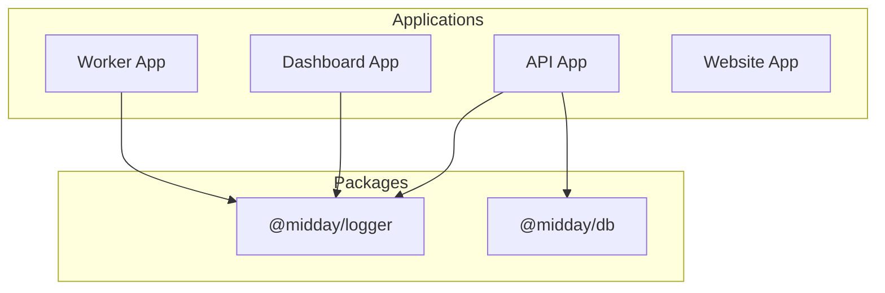
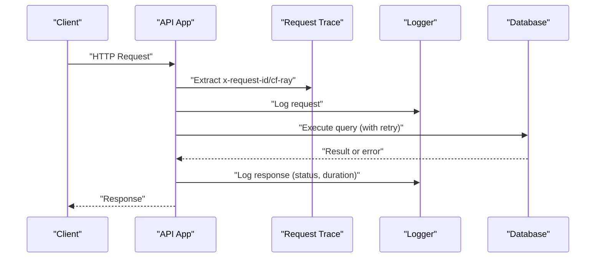
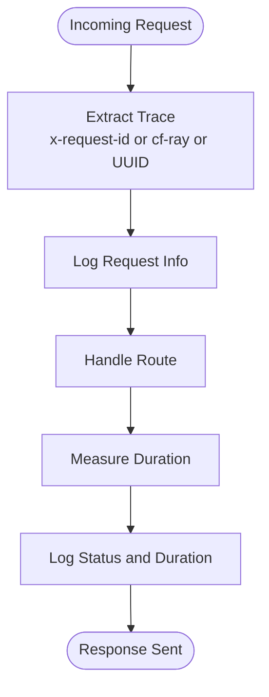
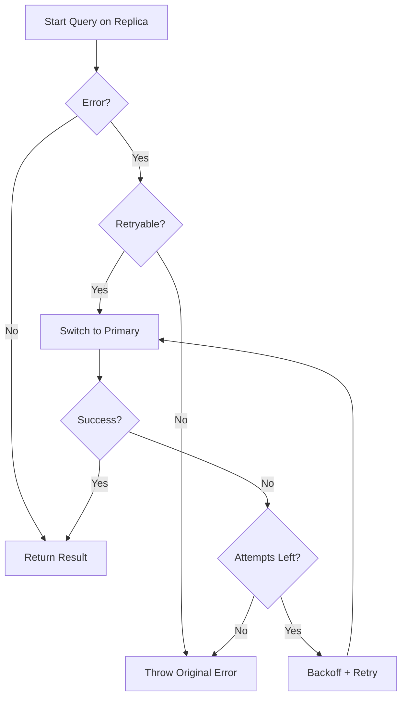
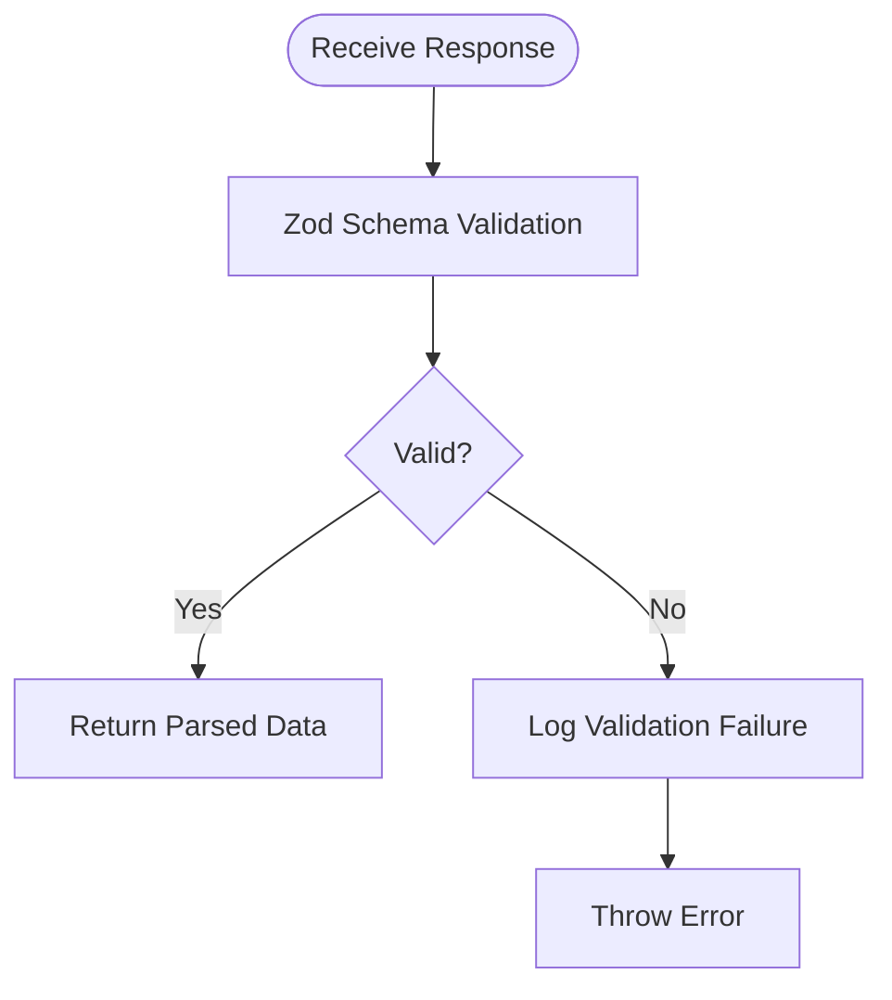
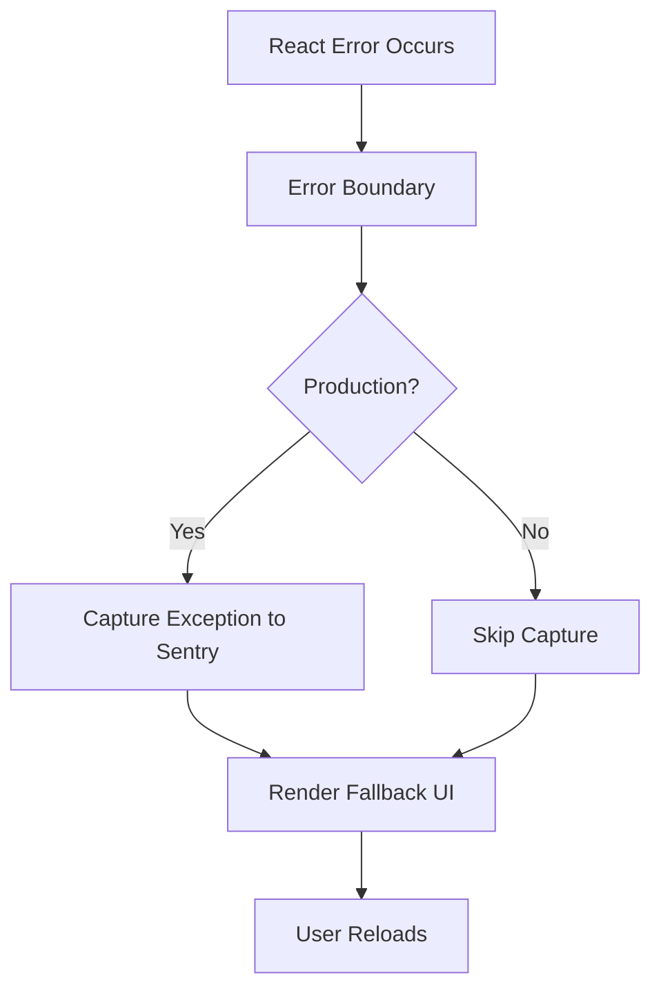
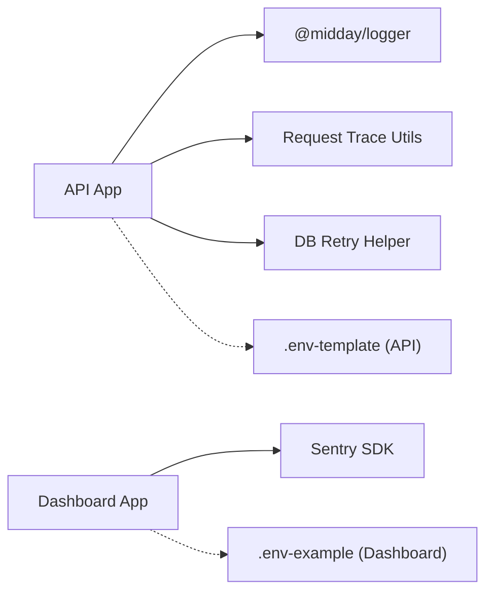

# Troubleshooting & FAQ

<cite>
**Referenced Files in This Document**
- [logger.ts](file://midday/packages/logger/src/index.ts)
- [httpLogger.ts](file://midday/apps/api/src/utils/logger.ts)
- [request-trace.ts](file://midday/apps/api/src/utils/request-trace.ts)
- [db-retry.ts](file://midday/apps/api/src/utils/db-retry.ts)
- [validate-response.ts](file://midday/apps/api/src/utils/validate-response.ts)
- [global-error.tsx](file://midday/apps/dashboard/src/app/global-error.tsx)
- [error-boundary.tsx](file://midday/apps/dashboard/src/components/error-boundary.tsx)
- [.env-template (API)](file://midday/apps/api/.env-template)
- [.env-example (Dashboard)](file://midday/apps/dashboard/.env-example)
- [README.md (Docs)](file://midday/docs/README.md)
- [README.md (Root)](file://midday/README.md)
</cite>

## Table of Contents
1. [Introduction](#introduction)
2. [Project Structure](#project-structure)
3. [Core Components](#core-components)
4. [Architecture Overview](#architecture-overview)
5. [Detailed Component Analysis](#detailed-component-analysis)
6. [Dependency Analysis](#dependency-analysis)
7. [Performance Considerations](#performance-considerations)
8. [Troubleshooting Guide](#troubleshooting-guide)
9. [Conclusion](#conclusion)
10. [Appendices](#appendices)

## Introduction
This document provides comprehensive troubleshooting guidance and FAQs for Faworra (Midday). It covers diagnostics and resolutions for API issues, database connectivity, background job failures, UI rendering problems, performance bottlenecks, memory leaks, resource exhaustion, external service integrations, authentication problems, and configuration errors. It also outlines logging strategies, error monitoring approaches, and escalation procedures, organized by problem category with step-by-step resolution guides and preventive measures.

## Project Structure
Faworra is a monorepo with multiple applications and packages:
- API application (Hono-based) with REST and tRPC routers, middleware, and utilities
- Dashboard application (Next.js) with client-side error boundaries and global error handling
- Worker application for background jobs
- Website application
- Shared packages including a logger and database utilities
- Documentation for key subsystems

**Diagram sources**
- [README.md (Root)](file://midday/README.md#L42-L75)

**Section sources**
- [README.md (Root)](file://midday/README.md#L42-L75)

## Core Components
Key components involved in troubleshooting:
- Logging and tracing: centralized logger, HTTP request logging, request trace extraction
- Database resilience: retry-on-primary helper with exponential backoff
- Response validation: schema-based response validation with structured logging
- Frontend error handling: global error boundary and page-level error handling
- Configuration templates: environment variable templates for API and Dashboard

**Section sources**
- [logger.ts](file://midday/packages/logger/src/index.ts#L1-L145)
- [httpLogger.ts](file://midday/apps/api/src/utils/logger.ts#L1-L33)
- [request-trace.ts](file://midday/apps/api/src/utils/request-trace.ts#L1-L17)
- [db-retry.ts](file://midday/apps/api/src/utils/db-retry.ts#L1-L128)
- [validate-response.ts](file://midday/apps/api/src/utils/validate-response.ts#L1-L20)
- [global-error.tsx](file://midday/apps/dashboard/src/app/global-error.tsx#L1-L55)
- [error-boundary.tsx](file://midday/apps/dashboard/src/components/error-boundary.tsx#L1-L63)
- [.env-template (API)](file://midday/apps/api/.env-template#L1-L149)
- [.env-example (Dashboard)](file://midday/apps/dashboard/.env-example#L1-L87)

## Architecture Overview
The system integrates multiple services and environments. The API logs requests and responses, traces requests via headers, validates responses, and retries database operations against the primary when needed. The Dashboard captures client-side errors and reports them to Sentry in production. Configuration is managed via environment templates.

**Diagram sources**
- [httpLogger.ts](file://midday/apps/api/src/utils/logger.ts#L5-L32)
- [request-trace.ts](file://midday/apps/api/src/utils/request-trace.ts#L10-L16)
- [db-retry.ts](file://midday/apps/api/src/utils/db-retry.ts#L17-L127)

## Detailed Component Analysis

### Logging and Tracing
- Centralized logger supports structured JSON logs with optional pretty-printing and runtime log level changes.
- HTTP request logger records method, path, status, and duration, attaching request identifiers.
- Request trace extraction prioritizes Cloudflare Ray ID, falls back to x-request-id, and generates a UUID if neither is present.

**Diagram sources**
- [httpLogger.ts](file://midday/apps/api/src/utils/logger.ts#L5-L32)
- [request-trace.ts](file://midday/apps/api/src/utils/request-trace.ts#L10-L16)

**Section sources**
- [logger.ts](file://midday/packages/logger/src/index.ts#L1-L145)
- [httpLogger.ts](file://midday/apps/api/src/utils/logger.ts#L1-L33)
- [request-trace.ts](file://midday/apps/api/src/utils/request-trace.ts#L1-L17)

### Database Connectivity and Retries
- Retry-on-primary helper executes queries on a replica first, falling back to the primary on retryable errors or when configured to retry on null results.
- Uses exponential backoff with jitter and configurable max retries and base delay.
- Recognizes retryable errors by error message patterns.

**Diagram sources**
- [db-retry.ts](file://midday/apps/api/src/utils/db-retry.ts#L17-L127)

**Section sources**
- [db-retry.ts](file://midday/apps/api/src/utils/db-retry.ts#L1-L128)

### Response Validation
- Validates API responses against Zod schemas and logs structured validation failures.
- Throws a standardized error when validation fails.

**Diagram sources**
- [validate-response.ts](file://midday/apps/api/src/utils/validate-response.ts#L7-L19)

**Section sources**
- [validate-response.ts](file://midday/apps/api/src/utils/validate-response.ts#L1-L20)

### Frontend Error Handling
- Global error page captures unhandled errors and sends them to Sentry in production, displaying a support email and reload button.
- Error boundary component captures React errors, forwards to Sentry in production, and renders a minimal fallback.

**Diagram sources**
- [global-error.tsx](file://midday/apps/dashboard/src/app/global-error.tsx#L9-L20)
- [error-boundary.tsx](file://midday/apps/dashboard/src/components/error-boundary.tsx#L24-L44)

**Section sources**
- [global-error.tsx](file://midday/apps/dashboard/src/app/global-error.tsx#L1-L55)
- [error-boundary.tsx](file://midday/apps/dashboard/src/components/error-boundary.tsx#L1-L63)

## Dependency Analysis
- API depends on the shared logger package for structured logging.
- API uses request tracing utilities and database retry helpers.
- Dashboard depends on Sentry for client-side error reporting.
- Configuration templates define environment variables for services and integrations.

**Diagram sources**
- [logger.ts](file://midday/packages/logger/src/index.ts#L1-L145)
- [httpLogger.ts](file://midday/apps/api/src/utils/logger.ts#L1-L33)
- [request-trace.ts](file://midday/apps/api/src/utils/request-trace.ts#L1-L17)
- [db-retry.ts](file://midday/apps/api/src/utils/db-retry.ts#L1-L128)
- [global-error.tsx](file://midday/apps/dashboard/src/app/global-error.tsx#L15-L19)
- [.env-template (API)](file://midday/apps/api/.env-template#L1-L149)
- [.env-example (Dashboard)](file://midday/apps/dashboard/.env-example#L1-L87)

**Section sources**
- [README.md (Root)](file://midday/README.md#L55-L75)
- [README.md (Docs)](file://midday/docs/README.md#L1-L18)

## Performance Considerations
- Enable structured logging and request tracing to identify slow endpoints and correlate errors with request IDs.
- Use the database retry helper to mitigate transient replication lag and connection timeouts.
- Tune log levels to reduce overhead in production (e.g., INFO or WARN) while maintaining visibility.
- Monitor database pool usage and connection patterns to avoid saturation.
- Profile frontend bundles and hydration to detect heavy components and excessive re-renders.

[No sources needed since this section provides general guidance]

## Troubleshooting Guide

### API Problems
Common symptoms:
- Slow endpoints
- Unexpected 5xx responses
- Response schema mismatches

Resolution steps:
1. Verify request tracing
   - Confirm presence of x-request-id or cf-ray headers.
   - Use the extracted request ID to correlate logs across services.
2. Inspect HTTP logs
   - Review method, path, status, and duration entries.
   - Look for repeated 5xx or long durations indicating backend issues.
3. Validate response schemas
   - If response validation fails, inspect the logged cause and adjust schema or fix data source.
4. Retry database operations
   - For transient errors, rely on retry-on-primary with exponential backoff.
   - Increase maxRetries or adjust baseDelay if acceptable for your SLAs.

Preventive measures:
- Keep retry configurations aligned with expected latency and error rates.
- Add targeted circuit breaker logic around external services.
- Instrument critical paths with timing and error counters.

**Section sources**
- [httpLogger.ts](file://midday/apps/api/src/utils/logger.ts#L5-L32)
- [request-trace.ts](file://midday/apps/api/src/utils/request-trace.ts#L10-L16)
- [validate-response.ts](file://midday/apps/api/src/utils/validate-response.ts#L7-L19)
- [db-retry.ts](file://midday/apps/api/src/utils/db-retry.ts#L17-L127)

### Database Connectivity Issues
Symptoms:
- Replication lag causing missing data reads
- Transient connection timeouts
- Frequent query cancellations

Resolution steps:
1. Enable retry-on-primary
   - Wrap read queries with the retry helper.
   - Configure maxRetries and baseDelay according to environment.
2. Identify retryable errors
   - The helper recognizes timeout/connection-related messages and retries accordingly.
3. Monitor replica vs primary usage
   - Ensure only failing queries are retried on primary to avoid overloading it.

Preventive measures:
- Use read replicas for read-heavy workloads.
- Implement connection pooling and keep-alive settings.
- Set up alerts for high retry rates and primary overload.

**Section sources**
- [db-retry.ts](file://midday/apps/api/src/utils/db-retry.ts#L17-L127)

### Background Job Failures
Symptoms:
- Jobs stuck in pending or failing repeatedly
- Worker logs show errors without clear context

Resolution steps:
1. Correlate job failures with request IDs/logs
   - Attach request IDs to job context where possible.
2. Inspect worker logs
   - Use structured logs to identify the failing operation and stack traces.
3. Validate job payload schemas
   - Ensure inputs conform to expected shapes before processing.
4. Retry policies
   - Implement exponential backoff and dead-letter handling for irrecoverable errors.

Preventive measures:
- Add idempotency checks to job handlers.
- Use bounded retries with max attempts and backoff caps.
- Monitor queue depths and consumer lag.

[No sources needed since this section provides general guidance]

### UI Rendering Problems
Symptoms:
- Blank pages or error screens
- React hydration mismatches
- Components failing to load

Resolution steps:
1. Check global error page
   - In production, exceptions are captured and surfaced via the global error page.
   - Use the error digest to correlate with backend logs.
2. Inspect error boundaries
   - Error boundaries capture React errors and forward them to Sentry in production.
   - Review component stacks captured in Sentry.
3. Validate environment variables
   - Ensure NEXT_PUBLIC_ variables are set for frontend integration keys.
4. Clear browser cache and reload
   - Force fresh assets to resolve stale cache issues.

Preventive measures:
- Add defensive rendering and loading states.
- Split large components and lazy-load heavy parts.
- Monitor Sentry for spikes in client-side errors.

**Section sources**
- [global-error.tsx](file://midday/apps/dashboard/src/app/global-error.tsx#L9-L20)
- [error-boundary.tsx](file://midday/apps/dashboard/src/components/error-boundary.tsx#L24-L44)
- [.env-example (Dashboard)](file://midday/apps/dashboard/.env-example#L1-L87)

### Performance Bottlenecks
Symptoms:
- Increased latency and timeouts
- Elevated CPU/memory usage
- Resource exhaustion warnings

Resolution steps:
1. Use request tracing to identify hotspots
   - Filter logs by request ID and duration to isolate problematic routes.
2. Profile backend and frontend
   - Measure bundle sizes and hydration times.
   - Identify heavy computations and optimize rendering.
3. Scale infrastructure
   - Increase concurrency limits and adjust pool sizes.
   - Consider regional replicas and caching layers.

Preventive measures:
- Instrument critical paths with timers and counters.
- Set up capacity planning and alerting thresholds.
- Regularly audit dependencies and remove unused code.

**Section sources**
- [httpLogger.ts](file://midday/apps/api/src/utils/logger.ts#L5-L32)
- [logger.ts](file://midday/packages/logger/src/index.ts#L11-L34)

### Memory Leaks and Resource Exhaustion
Symptoms:
- Growing RSS and heap usage
- GC pressure and OOM errors
- High FD/file descriptor counts

Resolution steps:
1. Monitor resource usage
   - Track RSS, heap, and file descriptors over time.
2. Audit long-lived closures and subscriptions
   - Ensure event listeners and timers are cleaned up.
3. Limit concurrent operations
   - Apply quotas and backpressure to prevent runaway tasks.

Preventive measures:
- Use profilers and heap snapshots regularly.
- Enforce connection and stream lifetimes.
- Implement circuit breakers for external calls.

[No sources needed since this section provides general guidance]

### Integration Issues with External Services
Common symptoms:
- OAuth failures during bank connections
- Webhook validation errors
- Payment provider discrepancies

Resolution steps:
1. Validate credentials and secrets
   - Confirm environment variables for providers (Plaid, GoCardless, Teller, Stripe, etc.) are set and correct.
2. Check webhook signatures and secrets
   - Ensure webhook endpoints validate signatures and secrets.
3. Inspect provider-specific logs and callbacks
   - Use provider dashboards to trace failed events and retries.

Preventive measures:
- Store secrets securely and rotate periodically.
- Implement robust retry and dead-letter handling.
- Test integrations in sandbox environments.

**Section sources**
- [.env-template (API)](file://midday/apps/api/.env-template#L20-L126)
- [.env-example (Dashboard)](file://midday/apps/dashboard/.env-example#L24-L87)

### Authentication Problems
Symptoms:
- 401/403 responses
- Session invalidation
- Supabase auth mismatches

Resolution steps:
1. Verify JWT secrets and signing keys
   - Ensure MIDDAY_ENCRYPTION_KEY and related secrets match across services.
2. Check Supabase configuration
   - Confirm SUPABASE_URL, SUPABASE_JWT_SECRET, and SUPABASE_SERVICE_KEY.
3. Validate redirect URIs and OAuth flows
   - Ensure callback URLs and state secrets are correct.

Preventive measures:
- Use consistent secrets across replicas and regions.
- Enforce HTTPS and secure cookies.
- Monitor auth rate limits and abuse detection signals.

**Section sources**
- [.env-template (API)](file://midday/apps/api/.env-template#L4-L8)
- [.env-example (Dashboard)](file://midday/apps/dashboard/.env-example#L1-L7)

### Configuration Errors
Symptoms:
- Application fails to start
- Missing environment variables
- Misconfigured origins or ports

Resolution steps:
1. Compare environment templates
   - Use .env-template (API) and .env-example (Dashboard) as authoritative references.
2. Validate required variables
   - Ensure all mandatory keys are present and not empty.
3. Test connectivity
   - Verify DATABASE_* URLs, REDIS_URL, and external service endpoints.

Preventive measures:
- Automate environment validation on startup.
- Use CI checks to enforce required variables.
- Document environment differences between dev/stage/prod.

**Section sources**
- [.env-template (API)](file://midday/apps/api/.env-template#L1-L149)
- [.env-example (Dashboard)](file://midday/apps/dashboard/.env-example#L1-L87)

## Logging Strategies
- Use the centralized logger for structured logs with consistent fields (level, message, time, context).
- Enable pretty printing in development via LOG_PRETTY and set LOG_LEVEL to control verbosity.
- Attach request IDs to all logs for cross-service correlation.
- Log validation failures with flattened error structures for quick diagnosis.

**Section sources**
- [logger.ts](file://midday/packages/logger/src/index.ts#L11-L34)
- [logger.ts](file://midday/packages/logger/src/index.ts#L139-L142)
- [httpLogger.ts](file://midday/apps/api/src/utils/logger.ts#L14-L30)
- [validate-response.ts](file://midday/apps/api/src/utils/validate-response.ts#L10-L15)

## Error Monitoring Approaches
- Sentry integration in the Dashboard captures client-side exceptions and React component stacks in production.
- Global error page surfaces support contact and error digests for user reporting.
- API logs include request IDs and durations to correlate with backend traces.

Escalation procedures:
- For critical incidents, escalate to on-call engineers with request IDs and Sentry links.
- Include environment, region, and recent changes in incident reports.
- Rotate secrets and re-deploy affected services after resolving configuration issues.

**Section sources**
- [global-error.tsx](file://midday/apps/dashboard/src/app/global-error.tsx#L15-L19)
- [error-boundary.tsx](file://midday/apps/dashboard/src/components/error-boundary.tsx#L29-L40)
- [httpLogger.ts](file://midday/apps/api/src/utils/logger.ts#L12-L17)

## Conclusion
This guide consolidates troubleshooting practices across Faworra’s API, Dashboard, Worker, and shared packages. By leveraging structured logging, request tracing, database retry mechanisms, and Sentry-based error monitoring, teams can quickly diagnose and resolve issues while implementing preventive measures to maintain reliability and performance.

[No sources needed since this section summarizes without analyzing specific files]

## Appendices

### Quick Reference: Environment Variables by Category
- Database and Supabase
  - DATABASE_* URLs, SUPABASE_URL, SUPABASE_JWT_SECRET, SUPABASE_SERVICE_KEY
- External Integrations
  - PLAID_*, GOCARDLESS_*, ENABLEBANKING_*, TELLER_*, STRIPE_*, POLAR_*
- Redis and Queues
  - REDIS_URL, REDIS_QUEUE_URL
- Logging and Debugging
  - LOG_LEVEL, LOG_PRETTY
- Frontend Keys
  - NEXT_PUBLIC_* variables for Supabase, providers, and analytics

**Section sources**
- [.env-template (API)](file://midday/apps/api/.env-template#L1-L149)
- [.env-example (Dashboard)](file://midday/apps/dashboard/.env-example#L1-L87)