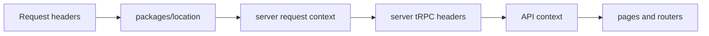
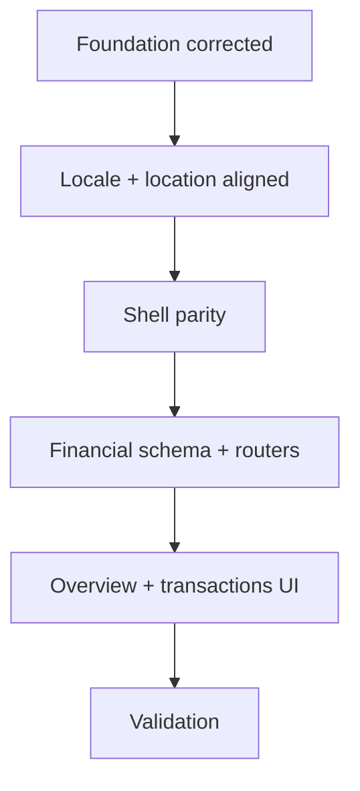

## Goal

Before building the first real product slice, fix the remaining foundation so Faworra is correctly positioned as an **OS for African SMEs**, structurally aligned with **Midday**, and ready for the **financial spine** without rework.

This plan does that in the right order:
1. correct the repo’s product framing and neutralize the hardcoded fashion pilot assumptions
2. add Midday-style **locale organization** and **location package support**
3. finish the Midday-shaped dashboard shell / request-context / user-preference groundwork
4. then build the **financial spine** on top of that aligned foundation

---

## Key research conclusions

### 1) Midday locale implementation
Midday uses:
- route organization under `apps/dashboard/src/app/[locale]/...`
- `next-international`
- middleware/proxy i18n rewriting via `createI18nMiddleware`
- `urlMappingStrategy: "rewrite"`
- locale client/server modules under `apps/dashboard/src/locales/`
- provider wiring in `app/[locale]/providers.tsx`

This means Midday is **locale-organized internally** while still keeping **clean URLs**.

### 2) Midday location support
Midday already has a dedicated `packages/location` package containing:
- countries
- country flags
- currencies
- timezones
- locale parsing helpers
- Cloudflare header extraction helpers (`country`, `timezone`, `locale`)

### 3) Midday request-context pattern
Midday forwards location-derived request headers into server-side tRPC:
- `x-user-timezone`
- `x-user-locale`
- `x-user-country`

That becomes part of the request context and supports formatting and later user preference logic.

### 4) Midday user preference model
Midday persists user-facing locale settings such as:
- locale
- timezone
- timezone auto-sync
- date format
- time format
- week start preference

Faworra currently has **none of this persisted yet**.

### 5) Product framing correction
The repo currently hardcodes the fashion pilot in:
- docs
- onboarding UX copy
- onboarding defaults
- tests/fixtures

That needs to be corrected before the financial spine lands.

### 6) Midday UI reuse rule
For required UI primitives, use Midday directly.
Confirmed existing Midday components include:
- `packages/ui/src/components/table.tsx`
- `packages/ui/src/components/badge.tsx`

So the plan uses **copy/adapt from Midday**, not shadcn generation.

### 7) Tenancy / RLS correction
Per Faworra’s own guidance, tenant isolation should remain:
- request-context enforced
- team-scoped
- **RLS-backed on business tables**

So business tables introduced for the financial spine should keep RLS.

---

## Recommended implementation order

### Phase A — Correct the foundation semantics first

#### A1. Remove fashion-only framing from docs and UX
Update all user-facing and project-facing framing so the repo consistently reflects:
- Faworra = OS for African SMEs
- fashion = pilot/default familiarity only
- industry-specific behavior belongs later in `industry-config`

#### A2. Stop writing `industry_key = "fashion"` by default
Recommended change:
- `team_settings.industry_key = null`
- `team_settings.industry_config_version = null`

until `packages/industry-config` exists.

This keeps the foundation honest and avoids encoding the pilot as system truth.

#### A3. Update tests and validation fixtures
All tests/fixtures/recorded validations that currently assume `fashion` should be updated to match the neutral foundation.

---

## Phase B — Add Midday locale structure before financial UI work

### B1. Introduce `[locale]` route organization
Reorganize dashboard routes to match Midday’s internal structure:
- `apps/dashboard/src/app/[locale]/layout.tsx`
- `apps/dashboard/src/app/[locale]/providers.tsx`
- `apps/dashboard/src/app/[locale]/(app)/...`
- `apps/dashboard/src/app/[locale]/login/...`
- `apps/dashboard/src/app/[locale]/onboarding/...`
- `apps/dashboard/src/app/[locale]/teams/...`

### B2. Match Midday URL behavior
Use the Midday rewrite model you selected:
- internal `[locale]` route structure
- **rewrite-based locale middleware**, not visible locale prefixes
- clean external URLs preserved

### B3. Add locale modules
Create Midday-shaped locale modules under dashboard:
- `apps/dashboard/src/locales/client.ts`
- `apps/dashboard/src/locales/server.ts`
- `apps/dashboard/src/locales/en.ts`

Initial locale set should stay minimal to match current Midday usage:
- `en`

This gets the structure right now without pretending full localization is already done.

### B4. Update proxy / return-to handling to be locale-aware
Refactor the dashboard proxy so it combines:
- Better Auth session gating
- locale rewriting
- clean `return_to` handling compatible with Midday’s structure

This includes login/onboarding/team redirects and any path reconstruction logic currently tied to the non-locale app tree.

---

## Phase C — Add Midday location package and request-context support

### C1. Create `packages/location`
Add a Faworra `packages/location` workspace modeled directly on Midday.

Scope:
- countries
- countries-intl
- currencies
- country-flags
- timezones
- locale parsing
- request/header helpers

### C2. Replace scattered location data with the package boundary
Current Faworra has country/currency data living inside `packages/api` and dashboard-specific code.
That should be moved behind the proper package seam so the app matches Midday’s package layout.

### C3. Add server request-location propagation
Adapt Midday’s request-context pattern so Faworra server-side tRPC forwards:
- `x-user-timezone`
- `x-user-locale`
- `x-user-country`

This should be used by future financial formatting and later settings pages.

_Legend: request country/timezone/locale is derived once and reused across the stack._

---

## Phase D — Add user preference groundwork needed by locale-aware Midday parity

### D1. Add app-level user preferences storage
Because Faworra separates auth schema from app/business schema, do **not** put locale/timezone settings into Better Auth’s user table.

Recommended approach:
- extend `schema/core.ts` with a dedicated app-level user preferences table or expand `user_context` with preference fields

Fields needed now:
- `locale`
- `timezone`
- `timezoneAutoSync`
- `dateFormat`
- `timeFormat`
- `weekStartsOnMonday`

### D2. Extend user APIs
Update the user-facing API layer so Faworra has Midday-shaped support for:
- `user.me` returning preference values
- `user.update` / equivalent mutation for changing preferences

This is needed so copied Midday locale/date/time UI can work later without another structural refactor.

### D3. Add only the minimal settings surfaces needed for coherence
Do not build all settings pages yet, but do enough so the foundation is coherent:
- user locale/timezone/date/time state exists
- dashboard request formatting can rely on it
- future copied Midday account/date-locale page has a real backing model

---

## Phase E — Finish Midday shell parity on the corrected structure

### E1. Remove the global root header
The root dashboard layout should stop rendering a global header across public and protected surfaces.

### E2. Build the authenticated shell in Midday shape
Copy/adapt Midday shell organization on the new `[locale]` route tree:
- sidebar
- main menu
- protected header
- app shell spacing/layout

Use Midday as source for:
- `components/sidebar.tsx`
- `components/main-menu.tsx`
- `components/header.tsx`

### E3. Copy required Midday UI primitives into `packages/ui`
At minimum:
- `table.tsx`
- `badge.tsx`

If additional Midday components used by overview/transactions depend on more shared UI primitives, copy those too from Midday instead of generating substitutes.

---

## Phase F — Build the financial spine on the aligned foundation

Once A–E are done, the financial spine becomes the correct immediate next product slice.

### F1. Add Midday-shaped financial package seams
Introduce the first real financial boundaries in Midday shape:
- `packages/categories`
- `packages/banking`
- `packages/accounting`

These should exist so financial logic does not accumulate inside `packages/api`.

### F2. Add financial schema in `packages/db`
Add the first business tables needed for Midday financial parity, team-scoped and RLS-backed.

In scope:
- accounts
- transactions
- categories
- bank connections / institutions seams if required by copied Midday flow

### F3. Add DB queries in Midday shape
Use Midday’s query organization under `packages/db/src/queries/` for:
- overview summary
- transactions
- bank accounts
- bank connections
- institutions as needed

### F4. Add API/tRPC routers in Midday shape
Adapt these Midday router shapes into Faworra:
- overview
- transactions
- bank-accounts
- bank-connections
- institutions

Use the existing Faworra auth/team-aware context rather than page-local auth checks.

### F5. Add server prefetch / hydration pattern to dashboard
Copy/adapt Midday’s dashboard tRPC server utilities so Faworra supports:
- `queryOptions()` server prefetch
- `prefetch(...)`
- `batchPrefetch(...)`
- `HydrateClient`

This is necessary before the real overview and transactions pages are copied in.

### F6. Replace placeholder `/dashboard` and add transactions route
On the corrected locale-based structure, replace the placeholder dashboard with:
- Midday-shaped overview surface
- Midday-shaped transactions surface

Use Midday’s server-prefetch/hydration pattern directly.

_Legend: locale/location alignment comes before the copied Midday financial surfaces so those surfaces land on the right structure once._

---

## Concrete file/package impact

### Foundation correction
- `README.md`
- `docs/plans/faworra-revised-next-steps-2026-03-11.md`
- `.agents/skills/faworra/references/phase-1.md`
- `apps/dashboard/src/components/onboarding-form.tsx`
- `packages/api/src/onboarding.ts`
- `packages/api/src/lib/team.ts`
- related tests and `.factory` fixtures/recordings

### Locale / location alignment
- `apps/dashboard/src/app/[locale]/...` (new route tree)
- `apps/dashboard/src/locales/client.ts`
- `apps/dashboard/src/locales/server.ts`
- `apps/dashboard/src/locales/en.ts`
- `apps/dashboard/src/proxy.ts`
- `packages/location/*` (new workspace)
- dashboard server tRPC request-context utilities

### User preference groundwork
- `packages/db/src/schema/core.ts`
- `packages/api/src/routers/user.ts`
- any new `packages/api/src/lib/user*` helpers if needed

### Shell parity + Midday UI reuse
- `apps/dashboard/src/components/sidebar.tsx`
- `apps/dashboard/src/components/main-menu.tsx`
- `apps/dashboard/src/components/header.tsx`
- `packages/ui/src/components/table.tsx`
- `packages/ui/src/components/badge.tsx`

### Financial spine
- `packages/categories/*`
- `packages/banking/*`
- `packages/accounting/*`
- `packages/db/src/schema/*financial*`
- `packages/db/src/queries/*`
- `packages/api/src/routers/overview.ts`
- `packages/api/src/routers/transactions.ts`
- `packages/api/src/routers/bank-accounts.ts`
- `packages/api/src/routers/bank-connections.ts`
- `packages/api/src/routers/institutions.ts`
- dashboard overview / transactions pages and supporting components under the new `[locale]` app tree

---

## Why this is the right next move

If we build the financial spine **before** locale/location/shell alignment, we will copy Midday UI and data-flow into the wrong route tree and wrong app structure, then refactor it again.

If we do this plan first:
- Faworra stops misrepresenting itself as fashion-only
- the app tree matches Midday more closely
- locale and request-location become first-class like Midday
- copied Midday overview/transactions surfaces land once, on the correct structure
- the financial spine becomes a clean first product slice rather than a temporary scaffold

---

## Recommended implementation sequence

1. foundation semantic correction
2. locale route structure + rewrite middleware
3. `packages/location` + request header propagation
4. user preference persistence/API groundwork
5. Midday shell parity + Midday UI primitives
6. financial schema / queries / routers / pages
7. full validation

---

## Validation after implementation

Run exactly the validators already requested for the financial-spine mission:
- `bun test --max-concurrency=6 apps/dashboard/src apps/api/src packages/api/src packages/auth/src packages/db/src packages/env/src`
- `bun run check-types`
- `bun x tsc -p apps/dashboard/tsconfig.json --noEmit`
- `bun x tsc -p packages/api/tsconfig.json --noEmit`
- `bun x tsc -p packages/auth/tsconfig.json --noEmit`
- `bun x tsc -p packages/db/tsconfig.json --noEmit`
- `bun x tsc -p packages/env/tsconfig.json --noEmit`
- `bun x ultracite check apps/dashboard/src apps/api/src packages/api/src packages/auth/src packages/db/src packages/env/src`

If you approve this, I’ll implement it in exactly that order so the financial spine lands on the right Midday-shaped foundation.