# Faworra ERDs: Database, Services, and UI Data

This document contains comprehensive Mermaid diagrams for all database tables, core service models (tRPC routers ↔ entities), and key UI view‑models.

Note: Team scoping is universal; all queries and relations are implicitly filtered by `team_id` where present.

---

## Cross‑Domain Overview (PK/FK only)

```mermaid
erDiagram
  TEAMS ||--o{ USERS_ON_TEAM : has
  TEAMS ||--o{ TEAM_MEMBERSHIPS : has
  TEAMS ||--o{ CLIENTS : has
  TEAMS ||--o{ ORDERS : has
  TEAMS ||--o{ INVOICES : has
  TEAMS ||--o{ MEASUREMENTS : has
  TEAMS ||--o{ PRODUCTS : has
  TEAMS ||--o{ INVENTORY_LOCATIONS : has
  TEAMS ||--o{ PRODUCT_VARIANTS : has
  TEAMS ||--o{ PRODUCT_MEDIA : has
  TEAMS ||--o{ PRODUCT_CATEGORIES : has
  TEAMS ||--o{ COMMUNICATION_ACCOUNTS : has
  TEAMS ||--o{ COMMUNICATION_THREADS : has
  TEAMS ||--o{ COMMUNICATION_MESSAGES : has
  TEAMS ||--o{ FINANCIAL_ACCOUNTS : has
  TEAMS ||--o{ TRANSACTIONS : has
  TEAMS ||--o{ TRANSACTION_CATEGORIES : has
  TEAMS ||--o{ TRANSACTION_TAGS : has
  TEAMS ||--o{ TAGS : has
  TEAMS ||--o{ TRANSACTION_ATTACHMENTS : has
  TEAMS ||--o{ BANK_STATEMENTS : has
  TEAMS ||--o{ ACTIVITIES : has
  TEAMS ||--o{ NOTIFICATION_SETTINGS : has
  TEAMS ||--o{ DOCUMENTS : has

  USERS ||--o{ TEAM_MEMBERSHIPS : has
  USERS ||--o{ USERS_ON_TEAM : has

  CLIENTS ||--o{ ORDERS : places
  CLIENTS ||--o{ MEASUREMENTS : has
  CLIENTS ||--o{ COMMUNICATION_THREADS : links
  CLIENTS ||--o{ DOCUMENTS : links
  CLIENTS ||--o{ TRANSACTIONS : links

  ORDERS ||--o{ ORDER_ITEMS : contains
  ORDERS ||--o{ INVOICES : bills
  INVOICES ||--o{ INVOICE_ITEMS : lists

  PRODUCTS ||--o{ PRODUCT_VARIANTS : has
  PRODUCT_VARIANTS ||--o{ PRODUCT_INVENTORY : at
  INVENTORY_LOCATIONS ||--o{ PRODUCT_INVENTORY : stores
  PRODUCTS ||--o{ PRODUCT_MEDIA : has
  PRODUCT_CATEGORIES ||--o{ PRODUCT_CATEGORY_MAPPINGS : maps
  TRANSACTION_CATEGORIES ||--o{ PRODUCT_CATEGORY_MAPPINGS : maps

  COMMUNICATION_ACCOUNTS ||--o{ COMMUNICATION_THREADS : owns
  COMMUNICATION_THREADS ||--o{ COMMUNICATION_MESSAGES : has
  COMMUNICATION_MESSAGES ||--o{ MESSAGE_ATTACHMENTS : has
  COMMUNICATION_MESSAGES ||--o{ MESSAGE_DELIVERY : has

  FINANCIAL_ACCOUNTS ||--o{ TRANSACTIONS : posts
  TRANSACTIONS ||--o{ TRANSACTION_TAGS : has
  TRANSACTIONS ||--o{ TRANSACTION_ATTACHMENTS : has
  TRANSACTIONS ||--o{ TRANSACTION_ALLOCATIONS : allocates
  INVOICES ||--o{ TRANSACTION_ALLOCATIONS : allocated_by
  TRANSACTION_CATEGORIES ||--o{ TRANSACTIONS : classifies

  BANK_STATEMENTS ||--o{ BANK_STATEMENT_LINES : has
  BANK_STATEMENT_LINES ||--o{ BANK_STATEMENT_ALLOCATIONS : allocates
  TRANSACTIONS ||--o{ BANK_STATEMENT_ALLOCATIONS : allocated_by
```



---

## Core & Identity (Detailed)

```mermaid
erDiagram
  TEAMS {
    uuid id PK
    text name
    text base_currency
    text country
    text timezone
    text quiet_hours
    text locale
    timestamptz created_at
    timestamptz updated_at
  }

  USERS {
    uuid id PK
    varchar email
    text full_name
    uuid current_team_id FK -> TEAMS.id
    timestamptz created_at
  }

  TEAM_MEMBERSHIPS {
    uuid team_id FK -> TEAMS.id
    uuid user_id FK -> USERS.id
    varchar role
    timestamptz created_at
    PK(team_id,user_id)
  }

  USERS_ON_TEAM {
    uuid id PK
    uuid user_id FK -> USERS.id
    uuid team_id FK -> TEAMS.id
    varchar role
    timestamptz created_at
  }

  TEAMS ||--o{ TEAM_MEMBERSHIPS : has
  USERS ||--o{ TEAM_MEMBERSHIPS : has
  TEAMS ||--o{ USERS_ON_TEAM : has
  USERS ||--o{ USERS_ON_TEAM : has
```

---

## Sales, Clients, Documents, Scheduling (Detailed)

```mermaid
erDiagram
  CLIENTS {
    uuid id PK
    uuid team_id FK -> TEAMS.id
    text name
    varchar phone
    varchar whatsapp
    varchar email
    text address
    text country
    varchar country_code
    text company
    text occupation
    text referral_source
    jsonb tags
    text notes
    timestamptz created_at
    timestamptz updated_at
    timestamptz deleted_at
    tsvector search_tsv
  }

  ORDERS {
    uuid id PK
    uuid team_id FK -> TEAMS.id
    uuid client_id FK -> CLIENTS.id
    varchar order_number
    varchar status
    numeric total_price
    numeric deposit_amount
    numeric balance_amount
    text notes
    timestamptz due_date
    text idempotency_key
    text created_by_type
    uuid created_by_id
    text source
    text conversation_id
    timestamptz created_at
    timestamptz updated_at
    timestamptz completed_at
    timestamptz cancelled_at
    timestamptz deleted_at
    tsvector search_tsv
  }

  ORDER_ITEMS {
    uuid id PK
    uuid order_id FK -> ORDERS.id
    text name
    integer quantity
    numeric unit_price
    numeric total
    timestamptz created_at
  }

  INVOICES {
    uuid id PK
    uuid team_id FK -> TEAMS.id
    uuid order_id FK -> ORDERS.id
    varchar invoice_number
    numeric subtotal
    numeric tax
    numeric discount
    numeric amount
    varchar currency
    numeric exchange_rate
    numeric paid_amount
    numeric vat_rate
    numeric vat_amount
    invoice_status status
    timestamptz due_date
    timestamptz sent_at
    timestamptz paid_at
    text invoice_url
    text notes
    text idempotency_key
    text created_by_type
    uuid created_by_id
    text source
    text conversation_id
    timestamptz created_at
    timestamptz updated_at
    timestamptz deleted_at
  }

  INVOICE_ITEMS {
    uuid id PK
    uuid invoice_id FK -> INVOICES.id
    uuid order_item_id FK -> ORDER_ITEMS.id
    text name
    integer quantity
    numeric unit_price
    numeric total
    timestamptz created_at
  }

  MEASUREMENTS {
    uuid id PK
    uuid team_id FK -> TEAMS.id
    uuid client_id FK -> CLIENTS.id
    varchar record_name
    varchar garment_type
    jsonb measurements
    integer version
    uuid measurement_group_id
    uuid previous_version_id FK -> MEASUREMENTS.id
    boolean is_active
    text[] tags
    text notes
    timestamptz taken_at
    timestamptz created_at
    timestamptz updated_at
    timestamptz deleted_at
  }

  APPOINTMENTS {
    uuid id PK
    uuid team_id FK -> TEAMS.id
    uuid client_id FK -> CLIENTS.id
    uuid staff_user_id FK -> USERS.id
    timestamptz start_at
    timestamptz end_at
    timestamptz reminder_at
    appointment_status status
    text location
    text notes
    timestamptz created_at
  }

  DOCUMENTS {
    uuid id PK
    uuid team_id FK -> TEAMS.id
    text name
    text[] path_tokens
    text mime_type
    integer size
    text[] tags
    varchar processing_status
    jsonb metadata
    uuid order_id FK -> ORDERS.id
    uuid invoice_id FK -> INVOICES.id
    uuid client_id FK -> CLIENTS.id
    uuid uploaded_by FK -> USERS.id
    timestamptz created_at
    timestamptz updated_at
    timestamptz deleted_at
    tsvector search_tsv
  }

  TEAM_DAILY_ORDERS_SUMMARY {
    uuid team_id FK -> TEAMS.id
    date day
    integer created_count
    integer created_count_excl_cancelled
    numeric created_value_sum_excl_cancelled
    integer completed_count
    numeric completed_value_sum
    timestamptz updated_at
    PK(team_id,day)
  }

  TEAMS ||--o{ CLIENTS : has
  CLIENTS ||--o{ ORDERS : places
  ORDERS ||--o{ ORDER_ITEMS : contains
  ORDERS ||--o{ INVOICES : bills
  INVOICES ||--o{ INVOICE_ITEMS : lists
  CLIENTS ||--o{ MEASUREMENTS : has
  TEAMS ||--o{ APPOINTMENTS : has
  TEAMS ||--o{ DOCUMENTS : has
  ORDERS ||--o{ DOCUMENTS : links
  INVOICES ||--o{ DOCUMENTS : links
  CLIENTS ||--o{ DOCUMENTS : links
```

---

## Products & Inventory (Detailed)

```mermaid
erDiagram
  PRODUCTS {
    uuid id PK
    uuid team_id FK -> TEAMS.id
    text name
    varchar slug
    product_type type
    product_status status
    text description
    varchar category_slug
    jsonb tags
    jsonb attributes
    timestamptz created_at
    timestamptz updated_at
    timestamptz deleted_at
    tsvector search_tsv
  }

  PRODUCT_VARIANTS {
    uuid id PK
    uuid team_id FK -> TEAMS.id
    uuid product_id FK -> PRODUCTS.id
    text name
    varchar sku
    varchar barcode
    varchar unit_of_measure
    numeric pack_size
    numeric price
    varchar currency
    numeric cost
    product_status status
    fulfillment_type fulfillment_type
    boolean stock_managed
    integer lead_time_days
    date availability_date
    varchar backorder_policy
    integer capacity_per_period
    timestamptz created_at
    timestamptz updated_at
  }

  INVENTORY_LOCATIONS {
    uuid id PK
    uuid team_id FK -> TEAMS.id
    text name
    varchar code
    boolean is_default
    text address
    timestamptz created_at
    timestamptz updated_at
  }

  PRODUCT_INVENTORY {
    uuid team_id FK -> TEAMS.id
    uuid variant_id FK -> PRODUCT_VARIANTS.id
    uuid location_id FK -> INVENTORY_LOCATIONS.id
    integer on_hand
    integer allocated
    integer safety_stock
    timestamptz updated_at
    PK(variant_id,location_id)
  }

  PRODUCT_MEDIA {
    uuid id PK
    uuid team_id FK -> TEAMS.id
    uuid product_id FK -> PRODUCTS.id
    uuid variant_id FK -> PRODUCT_VARIANTS.id
    text path
    text alt
    boolean is_primary
    integer position
    integer width
    integer height
    integer size_bytes
    varchar mime_type
    timestamptz created_at
  }

  PRODUCT_CATEGORIES {
    uuid id PK
    uuid team_id FK -> TEAMS.id
    text name
    text slug
    text color
    text description
    uuid parent_id FK -> PRODUCT_CATEGORIES.id
    boolean system
    timestamptz created_at
    timestamptz updated_at
  }

  PRODUCT_CATEGORY_MAPPINGS {
    uuid id PK
    uuid team_id FK -> TEAMS.id
    uuid product_category_id FK -> PRODUCT_CATEGORIES.id
    uuid transaction_category_id FK -> TRANSACTION_CATEGORIES.id
    timestamptz created_at
  }

  TEAMS ||--o{ PRODUCTS : has
  PRODUCTS ||--o{ PRODUCT_VARIANTS : has
  PRODUCT_VARIANTS ||--o{ PRODUCT_INVENTORY : at
  INVENTORY_LOCATIONS ||--o{ PRODUCT_INVENTORY : stores
  PRODUCTS ||--o{ PRODUCT_MEDIA : has
  TEAMS ||--o{ PRODUCT_CATEGORIES : has
  PRODUCT_CATEGORIES ||--o{ PRODUCT_CATEGORIES : parent
  PRODUCT_CATEGORIES ||--o{ PRODUCT_CATEGORY_MAPPINGS : maps
  TRANSACTION_CATEGORIES ||--o{ PRODUCT_CATEGORY_MAPPINGS : maps
```

---

## Communications & Leads (Detailed)

```mermaid
erDiagram
  COMMUNICATION_ACCOUNTS {
    uuid id PK
    uuid team_id FK -> TEAMS.id
    varchar provider
    text external_id
    text display_name
    varchar status
    text credentials_encrypted
    timestamptz created_at
    timestamptz updated_at
  }

  COMMUNICATION_THREADS {
    uuid id PK
    uuid team_id FK -> TEAMS.id
    uuid account_id FK -> COMMUNICATION_ACCOUNTS.id
    uuid customer_id FK -> CLIENTS.id
    uuid whatsapp_contact_id FK -> WHATSAPP_CONTACTS.id
    uuid instagram_contact_id FK -> INSTAGRAM_CONTACTS.id
    varchar channel
    text external_contact_id
    varchar status
    uuid assigned_user_id FK -> USERS.id
    timestamptz last_message_at
    timestamptz created_at
    timestamptz updated_at
  }

  COMMUNICATION_MESSAGES {
    uuid id PK
    uuid team_id FK -> TEAMS.id
    uuid thread_id FK -> COMMUNICATION_THREADS.id
    text provider_message_id
    varchar direction
    varchar type
    text content
    jsonb meta
    timestamptz sent_at
    timestamptz delivered_at
    timestamptz read_at
    text error
    boolean is_status
    comm_message_status status
    text client_message_id
    timestamptz created_at
  }

  MESSAGE_ATTACHMENTS {
    uuid id PK
    uuid message_id FK -> COMMUNICATION_MESSAGES.id
    text storage_path
    text content_type
    numeric size
    text checksum
    timestamptz created_at
  }

  MESSAGE_DELIVERY {
    uuid id PK
    uuid message_id FK -> COMMUNICATION_MESSAGES.id
    varchar status
    text provider_error_code
    integer retries
    timestamptz created_at
  }

  WHATSAPP_CONTACTS {
    uuid id PK
    uuid team_id FK -> TEAMS.id
    text wa_id
    text phone
    text display_name
    text profile_pic_url
    jsonb metadata
    timestamptz created_at
    timestamptz updated_at
  }

  INSTAGRAM_CONTACTS {
    uuid id PK
    uuid team_id FK -> TEAMS.id
    text username
    text external_id
    text display_name
    text profile_pic_url
    jsonb metadata
    timestamptz created_at
    timestamptz updated_at
  }

  COMMUNICATION_OUTBOX {
    uuid id PK
    timestamptz created_at
    uuid team_id FK -> TEAMS.id
    uuid account_id FK -> COMMUNICATION_ACCOUNTS.id
    text recipient
    text content
    text status
    text error
    text client_message_id
    text media_path
    text media_type
    text media_filename
    text caption
  }

  COMMUNICATION_TEMPLATES {
    uuid id PK
    uuid team_id FK -> TEAMS.id
    text provider
    text name
    text category
    text locale
    text body
    jsonb variables
    text status
    text external_id
    timestamptz created_at
  }

  LEADS {
    uuid id PK
    uuid team_id FK -> TEAMS.id
    uuid thread_id FK -> COMMUNICATION_THREADS.id
    uuid customer_id FK -> CLIENTS.id
    uuid owner_user_id FK -> USERS.id
    text prospect_name
    varchar prospect_phone
    text prospect_handle
    uuid whatsapp_contact_id FK -> WHATSAPP_CONTACTS.id
    uuid instagram_contact_id FK -> INSTAGRAM_CONTACTS.id
    varchar source
    varchar status
    integer score
    varchar qualification
    integer message_count
    timestamptz last_interaction_at
    text notes
    jsonb metadata
    timestamptz created_at
    timestamptz updated_at
  }

  COMMUNICATION_ACCOUNTS ||--o{ COMMUNICATION_THREADS : owns
  CLIENTS ||--o{ COMMUNICATION_THREADS : links
  COMMUNICATION_THREADS ||--o{ COMMUNICATION_MESSAGES : has
  COMMUNICATION_MESSAGES ||--o{ MESSAGE_ATTACHMENTS : has
  COMMUNICATION_MESSAGES ||--o{ MESSAGE_DELIVERY : has
  TEAMS ||--o{ COMMUNICATION_OUTBOX : has
  TEAMS ||--o{ COMMUNICATION_TEMPLATES : has
  TEAMS ||--o{ WHATSAPP_CONTACTS : has
  TEAMS ||--o{ INSTAGRAM_CONTACTS : has
  TEAMS ||--o{ LEADS : has
```

---

## Finance & Tags (Detailed)

```mermaid
erDiagram
  FINANCIAL_ACCOUNTS {
    uuid id PK
    uuid team_id FK -> TEAMS.id
    varchar type
    text name
    varchar currency
    varchar provider
    text external_id
    varchar status
    numeric opening_balance
    text sync_cursor
    timestamptz created_at
    timestamptz updated_at
  }

  TRANSACTIONS {
    uuid id PK
    uuid team_id FK -> TEAMS.id
    date date
    text name
    text description
    text internal_id
    numeric amount
    varchar currency
    numeric balance
    numeric base_amount
    varchar base_currency
    transaction_type type
    varchar category
    text category_slug
    varchar payment_method
    transaction_status status
    uuid client_id FK -> CLIENTS.id
    uuid order_id FK -> ORDERS.id
    uuid invoice_id FK -> INVOICES.id
    uuid assigned_id FK -> USERS.id
    uuid account_id FK -> FINANCIAL_ACCOUNTS.id
    varchar transaction_number
    text counterparty_name
    text merchant_name
    varchar payment_reference
    text notes
    boolean manual
    boolean recurring
    transaction_frequency frequency
    boolean enrichment_completed
    boolean exclude_from_analytics
    timestamptz transaction_date
    timestamptz due_date
    timestamptz created_at
    timestamptz updated_at
    timestamptz deleted_at
  }

  TRANSACTION_ALLOCATIONS {
    uuid id PK
    uuid transaction_id FK -> TRANSACTIONS.id
    uuid invoice_id FK -> INVOICES.id
    numeric amount
    timestamptz created_at
  }

  TRANSACTION_CATEGORIES {
    uuid id PK
    uuid team_id FK -> TEAMS.id
    text name
    text slug
    text color
    text description
    uuid parent_id FK -> TRANSACTION_CATEGORIES.id
    numeric tax_rate
    text tax_type
    text tax_reporting_code
    boolean excluded
    boolean system
    timestamptz created_at
    timestamptz updated_at
  }

  TAGS {
    uuid id PK
    uuid team_id FK -> TEAMS.id
    text name
    text color
    timestamptz created_at
  }

  TRANSACTION_TAGS {
    uuid id PK
    uuid team_id FK -> TEAMS.id
    uuid transaction_id FK -> TRANSACTIONS.id
    uuid tag_id FK -> TAGS.id
    timestamptz created_at
  }

  TRANSACTION_ATTACHMENTS {
    uuid id PK
    uuid team_id FK -> TEAMS.id
    uuid transaction_id FK -> TRANSACTIONS.id
    text name
    text[] path
    text type
    text mime_type
    numeric size
    text checksum
    uuid uploaded_by FK -> USERS.id
    timestamptz created_at
  }

  TEAMS ||--o{ FINANCIAL_ACCOUNTS : has
  FINANCIAL_ACCOUNTS ||--o{ TRANSACTIONS : posts
  TEAMS ||--o{ TRANSACTION_CATEGORIES : has
  TRANSACTION_CATEGORIES ||--o{ TRANSACTION_CATEGORIES : parent
  TRANSACTION_CATEGORIES ||--o{ TRANSACTIONS : classifies
  TEAMS ||--o{ TAGS : has
  TAGS ||--o{ TRANSACTION_TAGS : used_in
  TRANSACTIONS ||--o{ TRANSACTION_TAGS : has
  TRANSACTIONS ||--o{ TRANSACTION_ATTACHMENTS : has
  INVOICES ||--o{ TRANSACTION_ALLOCATIONS : allocated_by
  TRANSACTIONS ||--o{ TRANSACTION_ALLOCATIONS : allocates
```

---

## Bank Statements (Detailed)

```mermaid
erDiagram
  BANK_STATEMENTS {
    uuid id PK
    uuid team_id FK -> TEAMS.id
    text source
    text account_label
    varchar currency
    numeric opening_balance
    numeric closing_balance
    timestamptz period_start
    timestamptz period_end
    timestamptz created_at
  }

  BANK_STATEMENT_LINES {
    uuid id PK
    uuid statement_id FK -> BANK_STATEMENTS.id
    timestamptz occurred_at
    text description
    numeric amount
    numeric balance
    text external_ref
    timestamptz created_at
  }

  BANK_STATEMENT_ALLOCATIONS {
    uuid id PK
    uuid line_id FK -> BANK_STATEMENT_LINES.id
    uuid transaction_id FK -> TRANSACTIONS.id
    numeric amount
    timestamptz created_at
  }

  TEAMS ||--o{ BANK_STATEMENTS : has
  BANK_STATEMENTS ||--o{ BANK_STATEMENT_LINES : has
  BANK_STATEMENT_LINES ||--o{ BANK_STATEMENT_ALLOCATIONS : allocates
  TRANSACTIONS ||--o{ BANK_STATEMENT_ALLOCATIONS : allocated_by
```

---

## Activities & Notification Settings (Detailed)

```mermaid
erDiagram
  ACTIVITIES {
    uuid id PK
    uuid team_id FK -> TEAMS.id
    uuid user_id FK -> USERS.id
    text type
    jsonb metadata
    timestamptz created_at
  }

  NOTIFICATION_SETTINGS {
    uuid id PK
    uuid user_id FK -> USERS.id
    uuid team_id FK -> TEAMS.id
    text notification_type
    text channel
    boolean enabled
    timestamptz created_at
    timestamptz updated_at
  }

  TEAMS ||--o{ ACTIVITIES : has
  USERS ||--o{ ACTIVITIES : actor
  TEAMS ||--o{ NOTIFICATION_SETTINGS : has
  USERS ||--o{ NOTIFICATION_SETTINGS : prefs
```

---

## Service Models (tRPC Routers → Entities)

```mermaid
classDiagram
  class transactionsRouter {
    +create(payment|entry)
    +enrichedList(filters)
    +byId(id)
    +accounts()/accountsCreate()
    +categories()/categoriesCreate()
    +attachmentsAdd()/attachmentsRemove()
    +allocate()/deleteAllocation()
    +list()/stats()/spending()/recentLite()
    +aiParse(query)
  }
  class productsRouter
  class productCategoriesRouter
  class ordersRouter
  class invoicesRouter
  class clientsRouter
  class measurementsRouter
  class communicationsRouter
  class financialAccountsRouter
  class documentsRouter
  class tagsRouter
  class transactionCategoriesRouter
  class transactionTagsRouter

  class Transaction
  class TransactionAttachment
  class TransactionTag
  class TransactionAllocation
  class FinancialAccount
  class TransactionCategory
  class Tag
  class Invoice
  class Client
  class Order
  class OrderItem
  class Product
  class ProductVariant
  class ProductMedia
  class InventoryLocation
  class ProductInventory
  class Document
  class CommunicationAccount
  class CommunicationThread
  class CommunicationMessage

  transactionsRouter --> Transaction
  transactionsRouter --> FinancialAccount : accounts*
  transactionsRouter --> TransactionCategory : categories*
  transactionsRouter --> TransactionAttachment : add/remove
  transactionsRouter --> TransactionTag : link
  transactionsRouter --> TransactionAllocation : allocate
  Transaction --> Invoice : invoiceId
  Transaction --> Client : clientId
  Transaction --> Order : orderId

  productsRouter --> Product
  productsRouter --> ProductVariant
  productsRouter --> ProductMedia
  productCategoriesRouter --> ProductCategory

  ordersRouter --> Order
  ordersRouter --> OrderItem
  invoicesRouter --> Invoice
  clientsRouter --> Client
  measurementsRouter --> Client
  measurementsRouter --> Measurement

  communicationsRouter --> CommunicationAccount
  communicationsRouter --> CommunicationThread
  communicationsRouter --> CommunicationMessage

  financialAccountsRouter --> FinancialAccount
  documentsRouter --> Document
  tagsRouter --> Tag
  transactionCategoriesRouter --> TransactionCategory
  transactionTagsRouter --> TransactionTag
```



---

## UI Data (View‑Models)

```mermaid
classDiagram
  class TransactionEnriched {
    transaction: { id, date, description, type, status, amount, currency, categorySlug, paymentMethod, transactionNumber, excludeFromAnalytics }
    client?: { id, name }
    category?: { id, name, slug }
    assignedUser?: { id, fullName, email }
    tags: Array<{ id, name, color }>
    nextCursor?: { date?: string, id: string }
  }

  class ProductDetailsVM {
    product: { id, name, type, status, description, categorySlug, createdAt, updatedAt }
    variants: Array<{ id, sku, name, price, currency, stockQuantity? }>
    media: Array<{ id, path, alt, isPrimary, width?, height?, sizeBytes?, mimeType? }>
  }

  class ClientsListVM {
    items: Array<{ id, name, whatsapp, phone?, email?, tags: string[] }>
    nextCursor?: string
  }

  class InboxThreadVM {
    thread: { id, channel, status, assignedUserId?, lastMessageAt }
    account: { id, provider, externalId, displayName }
    customer?: { id, name }
    messages: Array<{ id, direction, type, content?, sentAt?, status? }>
  }
```

---

## Notes
- Enums: `transaction_status`, `transaction_type`, `transaction_frequency`, `comm_message_status`, `invoice_status`, `appointment_status`, `product_status`, `product_type`, `fulfillment_type` are referenced where applicable.
- All relationships shown assume RLS with `team_id` scoping in queries.
